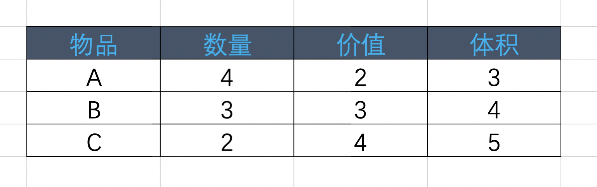
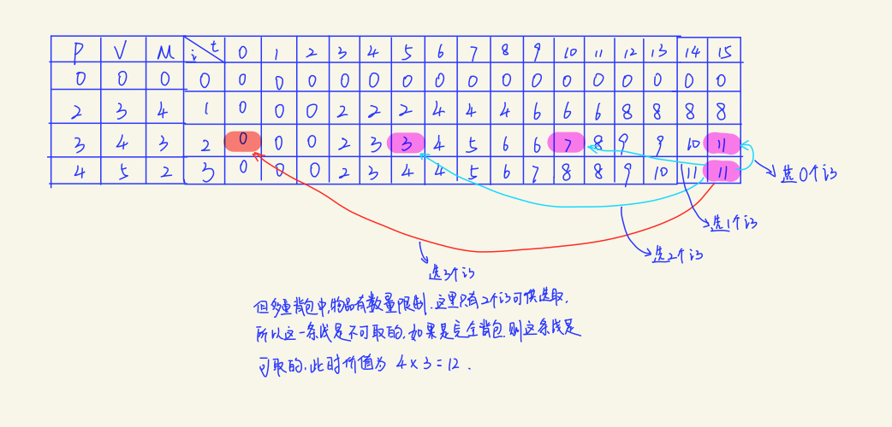

## 多重 背包问题

### 多重背包

> 有N种物品和一个容量为T的背包，第i种物品最多有M[i]件可用，价值为P[i]，体积为V[i]，求解：选哪些物品放入背包，可以使得这些物品的价值最大，并且体积总和不超过背包容量。

> 对比一下完全背包，其实只是多了一个限制条件，完全背包问题中，物品可以选择任意多件，只要你装得下，装多少件都行。但多重背包就不一样了，每种物品都有指定的数量限制，所以不是你想装，就能一直装的。举个栗子，有A、B、C三种物品，相应的数量、价格和占用空间如下图：



### 解决

#### 分治


> 递推公式：  
> ks(i,t) = max{ks(i-1, t - V[i] * k) + P[i] * k}; （0 <= k <= M[i] && 0 <= k * V[i] <= t）

> 完全背包递推公式：  
> ks(i,t) = max{ks(i-1, t - V[i] * k) + P[i] * k}; （ 0 <= k * V[i] <= t）  
> 可见两者之间只差了一个限制条件


```java
public int solution(int [] m, int[] w, int[] v, int c) {
  return cal(m, w, v, w.length, c);
}

public int cal(int[] m int[] w, int[] v, int i, int j) {
  if (i < 0 || j <= 0) {
    return 0;
  }
  int result = 0;
  if (w[i] > j) {
    result = cal(w, v, i - 1, j);
  } else if (i < 0) {
    result = v[i] * Math.floor(j / w[i]);
  } else {
    for (int k = 0; k <= m[i] && k * w[i] < j; k++) {
      int tmp = cal(w, v, i - 1, j - k * w[i]) + k * v[i];
      result = Math.max(result, tmp);
    }
  }
  return result;
}
```

#### 动态规划

##### **递归**

```java
public int solution(int[] m, int[] w, int[] v, int c) {
  int[][] result = new int[][];
  return cal(m, w, v, result, w.length, c);
}

public int cal(int[] m, int[] w, int[] v, int[][] result, int i, int j) {
  if (result[i][j] != null) {
    return result[i][j];
  }
  if (i < 0 || j <= 0) {
    return 0;
  } else {
    if (w[i] > j) {
      result[i][j] = cal(w, v, result, i - 1, j);
    } else {
      for (int k = 0; k <= m[i] && k * w[i] <= j; k++) {
        int tmp = cal(w, v, result, i, j - k * w[i]);
        result[i][j] = Math.max(result[i][j], tmp);
      }
    }
  }
}
```

##### **迭代**

```java
public int solution(int[] m, int[] w, int[] v, int c) {
  // 初始化为 r = 0 / r[i][0] = 0
  int[][] result = new int[][];
  for (int i = 1; i < w.length; i++) {
    for (int j = 0; j <= c; j++) {
      for (int k = 0; k <= m[i] && k * w[i] <= j; k++) {
        result[i][j] = Math.max(result[i][j], result[i - 1][j - k * w[i]] + k * v[i]);
      }
    }
  }
  return result[w.length][c];
}
```

##### **空间优化**
```java
public int solution(int w[], int v[], int c) {
  // 初始化为 r = 0 / r[0] = 0
  int[] result = new int[];
  for (int i = 0; i < w.length; i++) {
    if (m[i] * w[i] >= c) {
        for (int j = w[i]; j <= c; j++) {
            result[j] = Math.max(result[j], result[j - w[i]] + v[i]);
        }
    } else {
        for (int j = c; j >= w[i]; j--) {
            for (int k = 1; k <= m[i] && k * w[i] <= j) {
                result[j] = Math.max(result[j], result[j - w[i] * k] + v[i] * k);
            }
        }
    }
  }
  return result[c];
}
```

> 这里有一个较大的不同点，在第二层循环中，需要分两种情况考虑，如果 M[m] * V[m] >= T ，那么第m个物品就可以当做完全背包问题来考虑，而如果 M[m] * V[m] < T，则每次选择时，需要从 newResults[n-V[m]*k] + P[m] * k（0 <= k <= M[m]）中找到最大值。



> 多重背包问题同样也可以转化成01背包问题来求解，因为第i件物品最多选 M[i] 件，于是可以把第i种物品转化为M[i]件体积和价值相同的物品，然后再来求解这个01背包问题。

---

> 原文作者：[弗兰克的猫](https://home.cnblogs.com/u/mfrank/)  
  原文链接：https://www.cnblogs.com/mfrank/p/10533701.html