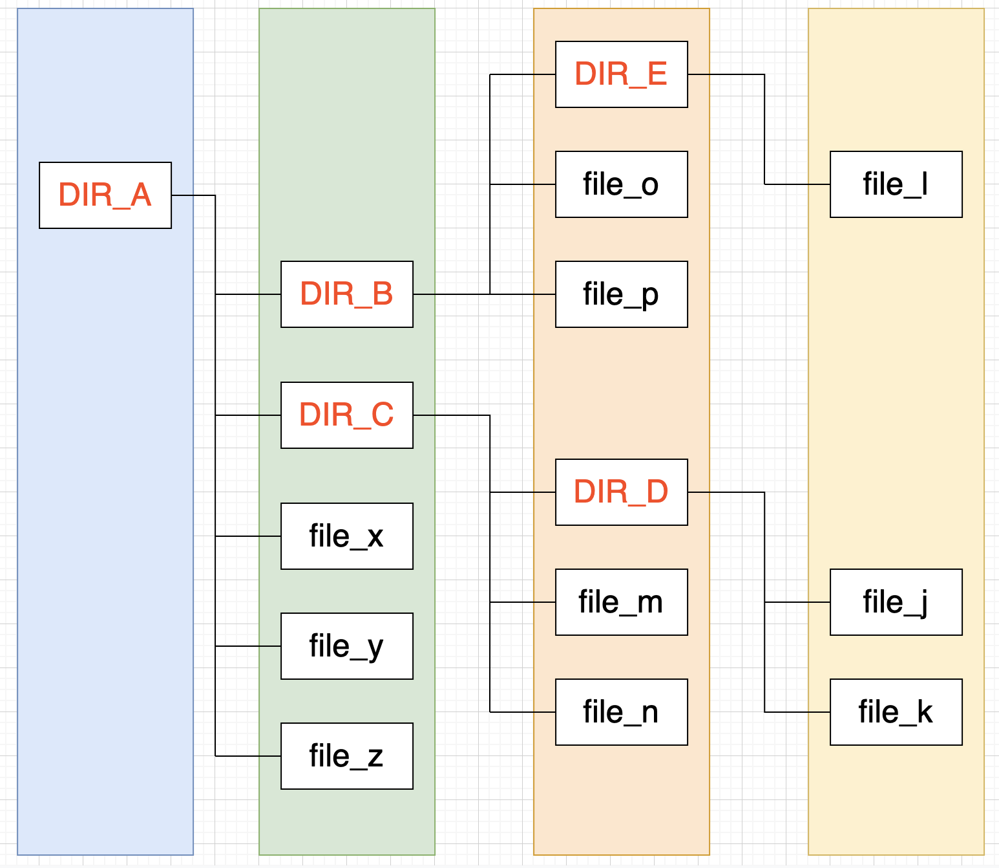
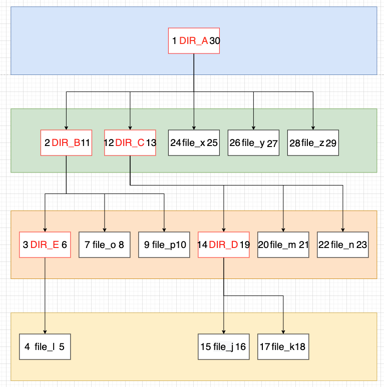
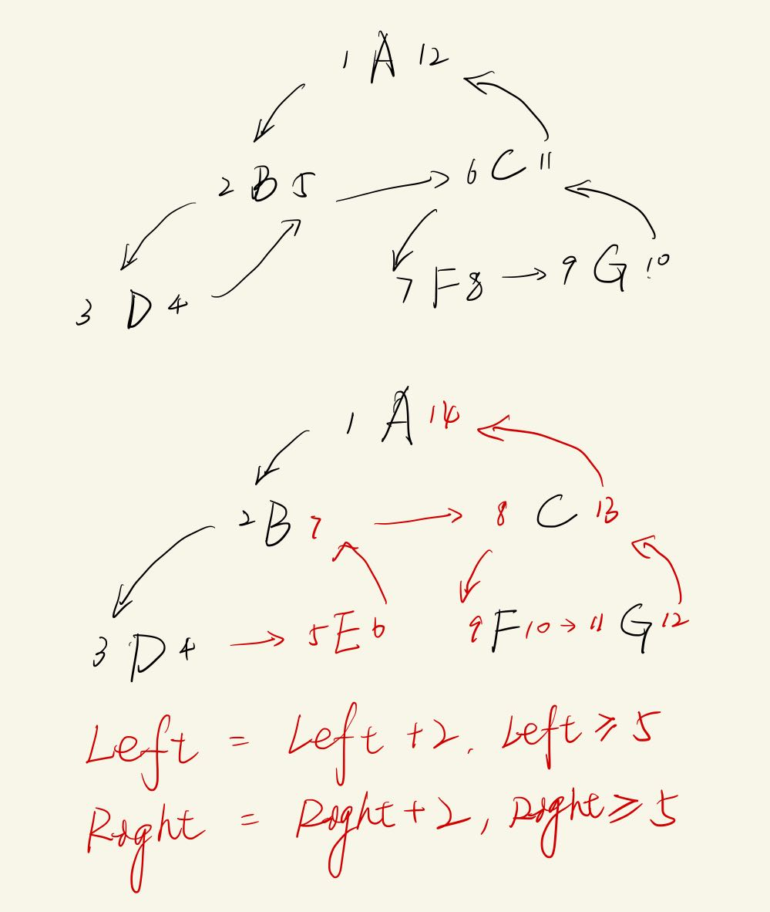
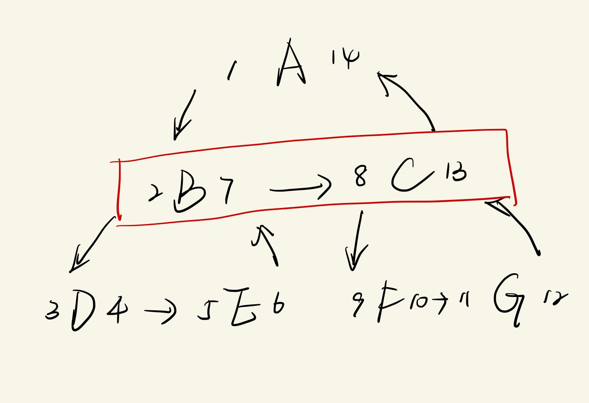
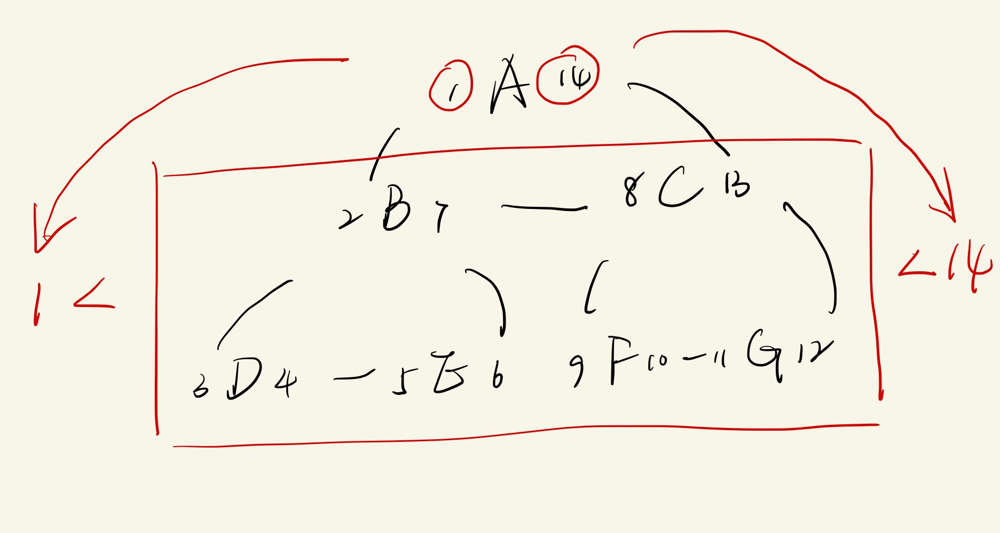
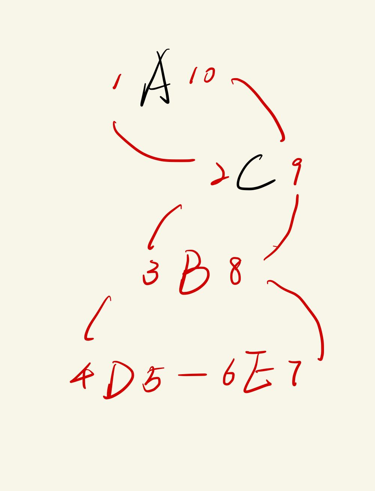

## 如何在数据库中存储层次结构

### 常见场景

1. 公司：公司 - 部门 - 子部门 
2. 人员：领导 - 员工 
3. 文件：根目录 - 文件夹 - 文件
4. 关系：group - child

### 实例



### 转成树型


### 回头看

之前提到的几种方案（Adjacency_List, Path_Enumerations, Closure_Table）都能够一定程度地满足需求，但是各自具有不可避免的弊端。  
Adjacency_List: 层级查询 -> ∞  
Path_Enumerations: 深度限制  
Closure_Table: 空间消耗大，层级删改 -> ∞    

<!-- 总而言之，这些方式无法直接在层次结构上进行所有期望操作。或切换到图数据库，或通过一些关系型数据库的解决方案来实现：  
- SQL hierarchical query facility
- 层级操作扩展关系型语言，比如 nested relational algebra
- 使用transitive closure扩展关系型语言，比如SQL的CONNECT语句；这可以在parent-child relation 使用但是执行起来比较低效。
- 层级结构查询可以在支持循环且包裹关系的操作的语言中实现。比如 PL/SQL, T-SQL or a general-purpose programming language

但是如果这些方案并没有在关系型数据库中提供，就得采用其他方式：   -->

### Nested Sets  

根据树的深度遍历对节点编号，记录首、末次访问到该节点的数字。通过比较数字或的层级结构关系。  
<!-- 进行更新操作很复杂，但是可以通过不使用整数而是用有理数来改进更新速度。 -->




|id    |name  |left     |right     |
|------|------|---------|----------|
|1     |DIR_A |1        |30        |
|2     |DIR_B |2        |11        |
|3     |DIR_C |12       |13        |
|4     |file_x|24       |25        |
|5     |file_y|26       |27        |
|6     |file_z|28       |29        |
|7     |DIR_E |3        |6         |
|8     |file_o|7        |8         |
|9     |file_p|9        |10        |
|10    |DIR_D |14       |19        |
|11    |file_m|20       |21        |
|12    |file_n|22       |23        |
|13    |file_l|4        |5         |
|14    |file_j|15       |16        |
|15    |file_k|17       |18        |

### 各种情况的处理代价

#### 增

> 代价：-> O(n)，更新会影响到其他子树  
> 输入：name. parent_id
> 执行：
```sql
parent = $(select * from table where id = $id);

insert into table(name, left, right) values($name, $parent.right, $parent.right + 1);

update table set left = left + 2 where left >= $parent.right;
update table set right = right + 2 where right >= $parent.right;
```

#### 删

> 代价：-> O(n)，先删除节点以及子树，并对其他子树进行修改  
> 输入：id  
> 执行：  
```sql
current = $(select * from table where id = $id);

delete from table where left >= $current.left and right <= $current.right;

d = current.right - current.right + 1;
update table set left = left - $d where left > $current.right;
update table set right = right - $d where right > $current.right;
```

#### 改
> 代价：-> O(1)  
> id, other info  
> 执行：  
```sql
update table set info where id = $id;
```

#### 查
##### 查自己
> 代价：-> O(1)  
> 输入：id  
> 执行：
```sql
select * from table where id = $id
```
##### 查下一级

> 代价：-> O(n)  
> 输入：id    
> 执行：

```sql
select distinct Child.Node, Child.Left, Child.Right
from table as child, table as parent
where parent.left < child.left and parent.right > child.right  -- associate Child Nodes with ancestors
group by child.node, child.left, child.right
having max(parent.left) = $parent.left  -- Subset for those with the given Parent Node as the nearest ancestor

这类查询可以通过增加一列来简化。例如，增加depth列记录当前节点深度，或者parent_id列记录父节点（和Adjacency List混用）,但增加了维护成本
```
##### 查所有子集

> 代价：-> O(n)  
> 输入：path  
> 执行：
```sql
select * 
from table 
where left > $parent.left 
and right < $parent.right 
order by left asc;
```
#### 移动


> 代价：-> O(n)  
> 输入：id, new_parent_id
> 执行：

```sql

## 先执行 DEL，再执行 ADD

current = $(
    select * 
    from table 
    where id = $id
);

## 查询父节点
old_parent = $(
    select * from table 
    where left < $current.left 
    and right > $current.right
    order by left desc
    limit 1
);

-- 查询移动节点以及子节点的总数
node_count = $(
    select count(*) 
    from table
    where left >= $current.left 
    and right <= $current.right
);


update table 
set left = left - node_count*2, 
where left > $current.right;

update table 
set right = right - node_count*2
where right > $current.right;

## 更新子节点
update table 
set left = left + ($new_parent.right - $current.left), 
    right = right + ($new_parent.right - $current.left)
where left >= $current.left 
and right <= $current.right

$current.left = $new_parent.right;
$current.right = $new_parent.right + 1;
update table 
set left = left + node_count*2,
where left > $current.right;

update table 
set right = right + node_count*2
where right > $current.right;
```

### 总结
**可以和邻接表同时使用**    
**优点** : 消除递归操作,实现无限分组    
**缺点** : 增 删 改影响范围大    
**适用** : 强要求无限层级深度    

### 比较
|T    |增    |删    |改    |查自己  |查下一级 |查所有子集|移动   |适用   |
|-----|------|------|-----|-------|--------|--------|------|-------|
|Adjacency List|O(1)|∞|O(1)|O(1)|O(n)|O(n)|O(1)|不涉及“所有子集”操作，严格按照层级一层层地查询|
|Closure Table|O(n)|O(n)|O(1)|O(1)|O(n)|O(n)|O(n)|有固定的层级深度，并且层级不多|
|Path|O(1)|O(n)|O(n)|O(1)|O(n)|O(n)|O(n)|对层级深度有一定限制，并且需求对所有子集进行操作|
|Netsted Sets|O(n)|O(n)|O(1)|O(1)|O(n)|O(n)|O(n)|强要求无限层级深度|