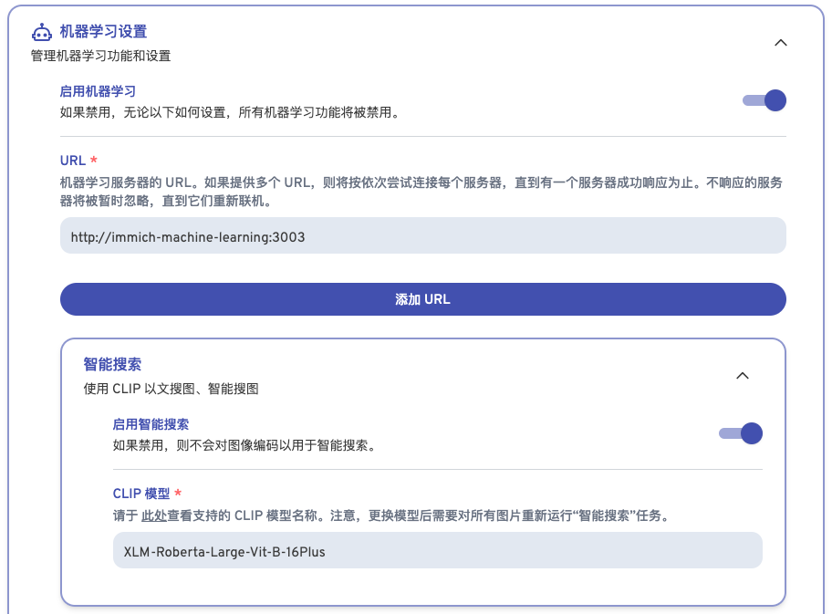

# Immich

```jsx
#
# WARNING: To install Immich, follow our guide: https://immich.app/docs/install/docker-compose
#
# Make sure to use the docker-compose.yml of the current release:
#
# https://github.com/immich-app/immich/releases/latest/download/docker-compose.yml
#
# The compose file on main may not be compatible with the latest release.

name: immich

services:
  immich-server:
    container_name: immich_server
    image: ghcr.io/immich-app/immich-server:v1.135.3
    # extends:
    #   file: hwaccel.transcoding.yml
    #   service: cpu # set to one of [nvenc, quicksync, rkmpp, vaapi, vaapi-wsl] for accelerated transcoding
    volumes:
      # Do not edit the next line. If you want to change the media storage location on your system, edit the value of UPLOAD_LOCATION in the .env file
      - /share/Container/container-station-data/application/immich/server/library:/usr/src/app/upload
      - /share/CACHEDEV1_DATA/Weasley/Pictures:/external/Weasley/Pictures:ro
      - /etc/localtime:/etc/localtime:ro
    environment:
      - TZ=Asia/Shanghai
      - DB_USERNAME=postgres
      - DB_PASSWORD=postgres
      - DB_DATABASE_NAME=immich
    ports:
      - '2283:2283'
    depends_on:
      - redis
      - database
    networks:
      - immich
    restart: always
    healthcheck:
      disable: false

  immich-machine-learning:
    container_name: immich_machine_learning
    # For hardware acceleration, add one of -[armnn, cuda, rocm, openvino, rknn] to the image tag.
    # Example tag: ${IMMICH_VERSION:-release}-cuda
    image: ghcr.io/immich-app/immich-machine-learning:v1.135.3
    # extends: # uncomment this section for hardware acceleration - see https://immich.app/docs/features/ml-hardware-acceleration
    #   file: hwaccel.ml.yml
    #   service: cpu # set to one of [armnn, cuda, rocm, openvino, openvino-wsl, rknn] for accelerated inference - use the `-wsl` version for WSL2 where applicable
    volumes:
      - /share/Container/container-station-data/application/immich/machine_learning/model_cache:/cache
    restart: always
    networks:
      - immich
    healthcheck:
      disable: false

  redis:
    container_name: immich_redis
    image: docker.io/valkey/valkey:8-bookworm
    networks:
      - immich
    healthcheck:
      test: redis-cli ping || exit 1
    restart: always

  database:
    container_name: immich_postgres
    image: ghcr.io/immich-app/postgres:14-vectorchord0.4.3-pgvectors0.2.0
    environment:
      POSTGRES_PASSWORD: postgres
      POSTGRES_USER: postgres
      POSTGRES_DB: immich
      POSTGRES_INITDB_ARGS: '--data-checksums'
      # Uncomment the DB_STORAGE_TYPE: 'HDD' var if your database isn't stored on SSDs
      # DB_STORAGE_TYPE: 'HDD'
    networks:
      - immich
    volumes:
      # Do not edit the next line. If you want to change the database storage location on your system, edit the value of DB_DATA_LOCATION in the .env file
      - /share/Container/container-station-data/application/immich/Postgres/data:/var/lib/postgresql/data
    restart: always

volumes:
  model-cache:

networks:
 immich:
```

## 1. 模型下载

NAS上由于网络问题，无法从hf上加载对应的模型，需要先下载到本地，再手动上传到NAS。

```jsx
# 下载模型

https://huggingface.co/immich-app

## buffalo_l 用于人脸识别
huggingface-cli download immich-app/buffalo_l --local-dir immich-app-buffalo_l

## XLM-Roberta-Large-Vit-B-16Plus用于智能搜索
huggingface-cli download immich-app/XLM-Roberta-Large-Vit-B-16Plus --local-dir immich-app-XLM-Roberta-Large-Vit-B-16Plus
```

NAS上模型目录结构

```jsx
.
|____model_cache
| |____clip
| | |____XLM-Roberta-Large-Vit-B-16Plus
| | | |____textual
| | | |____visual
| | | |____.cache
| |____facial-recognition
| | |____buffalo_l
| | | |____recognition
| | | |____.cache
| | | |____detection
```

## 2. immich 配置

