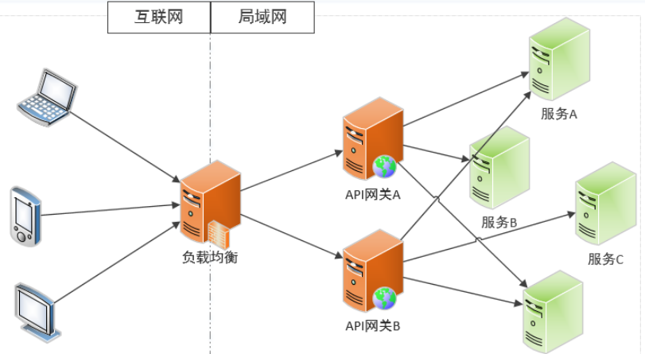
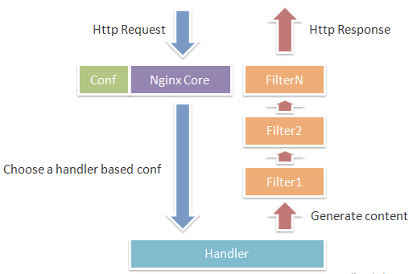
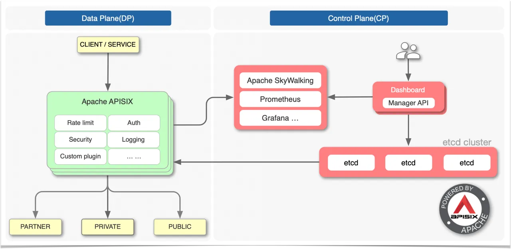
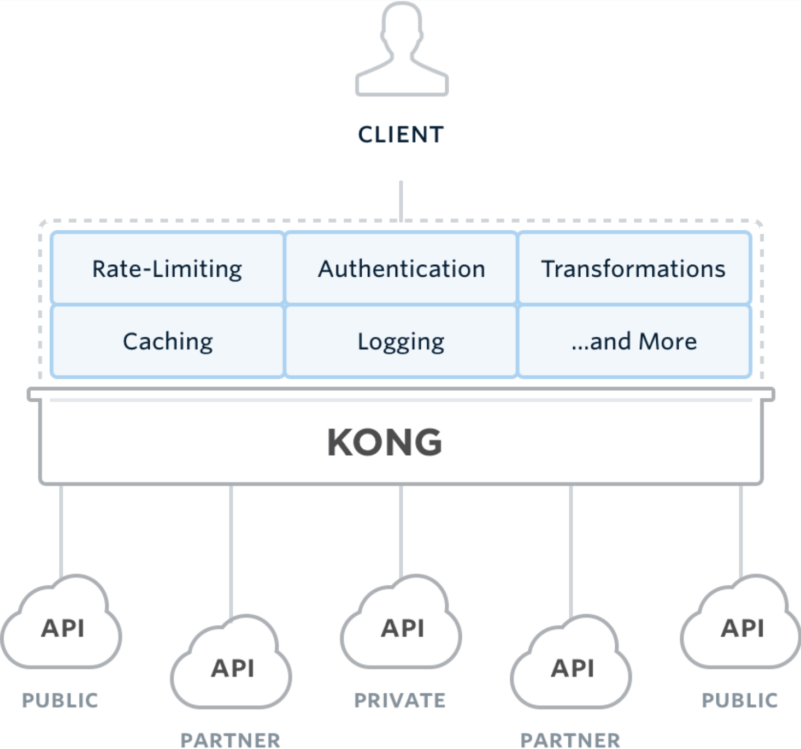
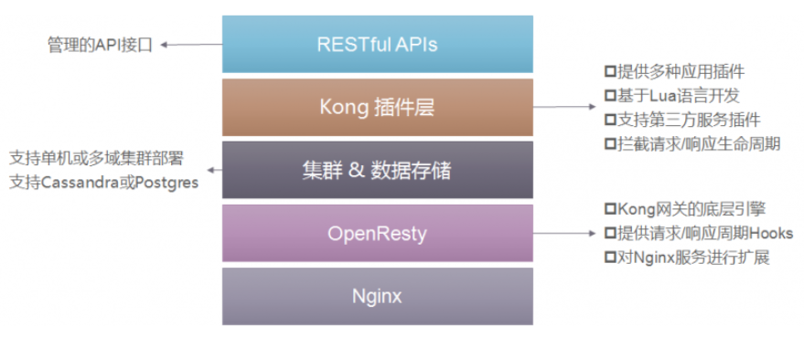
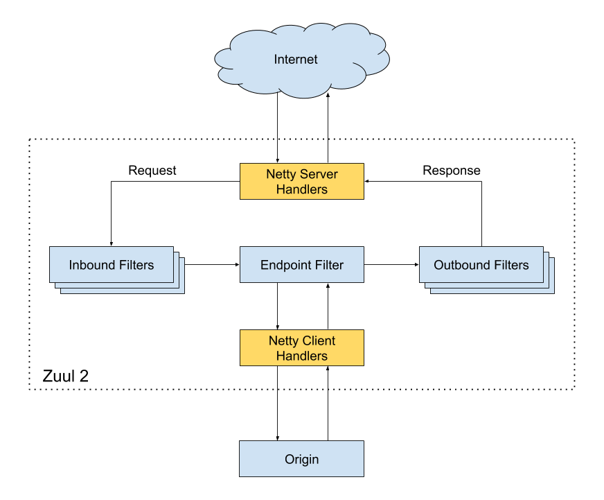
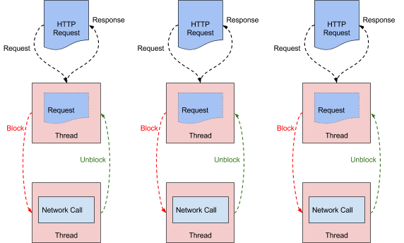
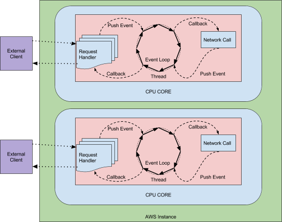
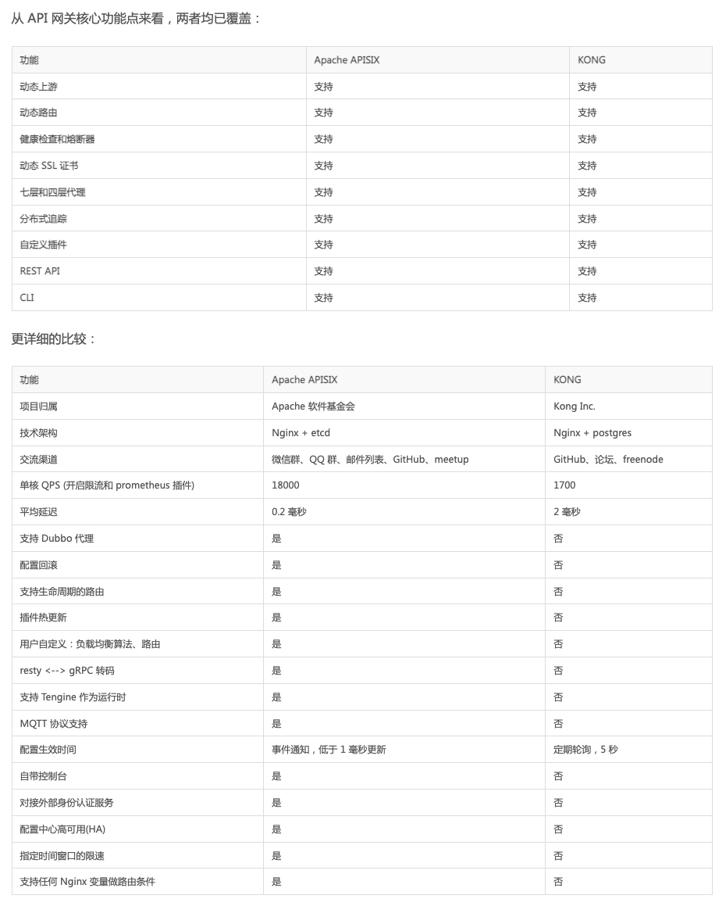

## What & Why
- Single entry point for all clients (面向客户端的单一入口)  
- Common in microservice architectures （微服务需要业务聚合）  
- Client insulation from services （客户端和服务隔离）  
- protocol （协议转换）
- Security（安全）  
- surgical routing（路由）  
- Load Shedding （负载均衡）  
- Rate Limit（限流）  
- Cache（缓存）  
- Fuse（熔断）  
- Retry（重试）  
- Auth（认证、鉴权）  
- Log（日志收集）  
- Monitor（监控）  
- Tracing Analysis（链路追踪）

     
    

     

## Aspects to be considered
- Develepment（Programming Language）  
- Community activity
- Performance
- Stability
- Update 

## SOME GATEWAY(By programming language)
- Nginx+Lua：Open Resty、Kong、Orange、Abtesting Gateway等；  
- Java：Zuul/Zuul 2、Spring Cloud Gateway、Kaazing KWG、gravitee、Dromara soul等；  
- Go：Janus、fagongzi、Grpc-Gateway；  
- .NET：Ocelot；  
- Node.js：Express Gateway、MicroGateway。  

使用范围、成熟度、活跃度等，主流有：Kong、Zuul/Zuul 2、Spring Cloud Gateway、apisix

### Nginx 
Nginx 更偏向于作为流量网关。成熟，性能好，稳定。
但致命弱点是，不便于自定义开发（有一部分是开发语言的原因），需要 +Lua (例如下面的 OpenResty / Kong / Apisix)。



```
Nginx 在启动后，会有一个 Master 进程和多个 Worker 进程，Master 进程和 Worker 进程之间是通过进程间通信进行交互的，如图所示。Worker 工作进程的阻塞点是在像 select()、epoll_wait() 等这样的 I/O 多路复用函数调用处，以等待发生数据可读 / 写事件。Nginx 采用了异步非阻塞的方式来处理请求，也就是说，Nginx 是可以同时处理成千上万个请求的。
```

### OpenResty（Nginx + Lua）
OpenResty nginx + Lua动态扩展。目前已经有基于Open Resty产生的gateway，例如 Kong，APISIX等。

```
还可以将 Lua 嵌入到 Nginx 中，从而可以使用 Lua 来编写脚本，这样就可以使用 Lua 编写应用脚本，部署到 Nginx 中运行，即 Nginx 变成了一个 Web 容器；这样开发人员就可以使用 Lua 语言开发高性能Web应用了。在开发的时候使用 OpenResty 来搭建开发环境，OpenResty 将 Nginx 核心、LuaJIT、许多有用的 Lua 库和 Nginx 第三方模块打包在一起；这样只需要安装 OpenResty，不需要了解 Nginx 核心和写复杂的 C/C++ 模块就可以，只需要使用 Lua 语言进行 Web 应用开发了。
```

### APISIX（Nginx + etcd）
- Develepment（Programming Language）: N
- Community activity: Y
- Performance: Y
- Stability: ？
- Update: Y



APISIX的性能更好，功能也更加丰富。
但APISIX很年轻，或许需要更多的“检验”，开发语言的差别也会增加问题排查、处理的代价。  
(可以尝试)  

### Kong（Nginx + postgres）
- Develepment（Programming Language）: Y
- Community activity: Y
- Performance: N (compared with apisix)
- Stability: Y
- Update: Y

Kong和APISIX相比较而言，从性能、功能丰富度方面 都处于下风（毕竟APISIX更新）。而且开发语言的劣势同样具有。

  

  
   

### Zuul (Java)
Zuul-动态路由、监控、弹性和安全。基于Servlet，属于上一代产品，同步I/O、多线程。性能不好，针对于Zuul的替代方案已经有 Zuul2 以及 Spring Gateway 两类。因此Zuul不予考虑。


> PreDecorationFilter  
> SendForwardFilter  
> RibbonRoutingFilter  
> SimpleHostRoutingFilter  
> SendResponseFilter  
> SendErrorFilter  
#### PROBLEMS?  
> Large coupled filters 
> Filter model/API is clunky

### Zuul2 (Java)
- Develepment（Programming Language）: N
- Community activity: Y
- Performance: Y
- Stability: ？
- Update: Y

服务发现、负载均衡、连接池、状态分类、重试、请求凭证、HTTP/2、TLS、代理协议、GZip、WebSocket  
基于 Netty，Zuul 2.x最大的改进就是基于Netty Server实现了异步I/O来接入请求，同时基于Netty Client实现了到后端业务服务API的请求。这样就可以实现更高的性能、更低的延迟。此外也调整了Filter类型，将原来的三个核心Filter显式命名为Inbound Filter、Endpoint Filter和Outbound Filter，如图7-8所示。  


> Major rewrite  
> Not backwards compatible with Zuul 1  
> Non-blocking/Netty  
> Not released yet   
> HTTP/2 and Websockets in the future  
> Reinvents many things from Spring  

### Spring Cloud Gateway (Java)
- Develepment（Programming Language）: Y
- Community activity: Y
- Performance: Y
- Stability: Y
- Update: Y

Java 8、Spring 5.0、Spring Boot 2.0、Reactor -> Spring family
#### Spring Cloud紧密配合  
目前使用了nacos作为配置中心，可以和 gateway 搭配。

> Java 8/Spring 5/Boot 2
> WebFlux/Reactor
> HTTP/2 and Websockets
> Finchley Release Train

Spring Cloud Gateway里明确地区分了Router和Filter，内置了非常多的开箱即用功能，并且都可以通过Spring Boot配置或手工编码链式调用来使用。  
内置了10种Router，直接配置就可以随心所欲地根据Header、Path、Host或Query来做路由。  

##### 核心特性：  
- 通过请求参数匹配路由；  
- 通过断言和过滤器实现路由；
- 与Hystrix熔断集成；
- 与Spring Cloud DiscoveryClient集成；
- 非常方便地实现断言和过滤器；
- 请求限流；
- 路径重写。

## Compare

### **Zuul vs Zuul2 (Difference between sync and async): Zuul2 Win!**
- **Zuul(block) disadvantages**
- *Zuul 1* was built on the Servlet framework 
- Blocking and mltithreaded, means they process requests by using one thread per connection.
- I/O oprations are done by choosing a worker threade from athread pool to execute the I/O, and the request thread is blocked until the worker thread completes, and the worker thread notifies the request thread when its work is complete.
```
This works well with modern multi-core AWS instances handling 100’s of concurrent connections each. But when things go wrong, like backend latency increases or device retries due to errors, the count of active connections and threads increases. When this happens, nodes get into trouble and can go into a death spiral where backed up threads spike server loads and overwhelm the cluster. To offset these risks, we built in throttling mechanisms and libraries (e.g., Hystrix) to help keep our blocking systems stable during these events.
```


- **Zuul2(async) advantages**
- *Zuul2* async.  
- One thread per CPU core handling all requests and responses. The lifecycle of the request and response is handled through events and callbacks. 
```
Because there is not a thread for each request, the cost of connections is cheap. This is the cost of a file descriptor, and the addition of a listener. Whereas the cost of a connection in the blocking model is a thread and with heavy memory and system overhead. There are some efficiency gains because data stays on the same CPU, making better use of CPU level caches and requiring fewer context switches. The fallout of backend latency and “retry storms” (customers and devices retrying requests when problems occur) is also less stressful on the system because connections and increased events in the queue are far less expensive than piling up threads.
```


- **Zuul2(async) disadvantages & Zuul(block) advantages**
```
The advantages of async systems sound glorious, but the above benefits come at a cost to operations. Blocking systems are easy to grok and debug. A thread is always doing a single operation so the thread’s stack is an accurate snapshot of the progress of a request or spawned task; and a thread dump can be read to follow a request spanning multiple threads by following locks. An exception thrown just pops up the stack. A “catch-all” exception handler can cleanup everything that isn’t explicitly caught.

Async, by contrast, is callback based and driven by an event loop. The event loop’s stack trace is meaningless when trying to follow a request. It is difficult to follow a request as events and callbacks are processed, and the tools to help with debugging this are sorely lacking in this area. Edge cases, unhandled exceptions, and incorrectly handled state changes create dangling resources resulting in ByteBuf leaks, file descriptor leaks, lost responses, etc. These types of issues have proven to be quite difficult to debug because it is difficult to know which event wasn’t handled properly or cleaned up appropriately.
```

### **Kong vs APISIX**


### **Spring Cloud Gateway vs Zuul2 vs OpenResty vs Kong**
|网关|限流|鉴权|监控|易用性|可维护性|成熟度|
|---|---|----|----|-----|-------|-----|
|Spring Cloud Gateway|IP、用户、集群限流，提供相应接口扩展|普通鉴权、OAuth2.0|Gateway Metrics Filter|简单|Spring全家桶成员、扩展性强、易配置、易维护|成熟|
|Zuul2|配置文件，配置集群、单服务器限流、Filter扩展|Filter实现|Filter实现|-|-|-|
|OpenResty|Lua|Lua|需要开发|简单易用，但需要Lua开发|可维护性差|成熟|
|Kong|根据时间、用户限流。可在源码基础上开发http://coding.idealworld.group/2021/05/26/reflections-of-middle-platform-api-gateway-selection/|普通鉴权、OAuth2.0、Key Auth、HMAC|上报datadog，记录请求数量、数据量、应答数据量、接收发送时间间隔、状态码数量、Kong内耗时|简单易用，API转发通过管理接口配置。需要Lua开发|维护需要Lua|成熟|

## Finally
### Kong
1. nginx + lua，开发不友好
2. 仅支持PostgreSQL，增加运维成本，单点数据库  
3. 在不修改源码的情况下，无法自定义Nginx配置文件，重启后重新初始化所有变更的Nginx配置文件  

### Apisix
1. nginx + lua，开发不友好
2. 待检验

### Zuul
1. 性能差，已有替代品

### Zuul2
1. 性能好，但 Sprintg Cloud 没有兼容计划，与目前使用的技术栈结合的不是很好
2. 还不太稳定
### Spring Cloud Gateway
1. 性能比较好（not best）
## 结论
综合比较下来，Spring Cloud Gateway 性能好，也比较成熟稳定，并且是Spring全家桶成员，和当前项目是用的技术栈更匹配。)
## Ref
> ref: [The author of spring cloud gateway's PPT](https://spencergibb.netlify.app/preso/detroit-cf-api-gateway-2017-03/#/)   
> ref: [What is api gateway](https://microservices.io/patterns/apigateway.html)   
> ref: [Netflix blog: Zuul2](https://netflixtechblog.com/zuul-2-the-netflix-journey-to-asynchronous-non-blocking-systems-45947377fb5c)  
> ref: [Netflix blog: Optimizing the Netflix API](https://netflixtechblog.com/optimizing-the-netflix-api-5c9ac715cf19)  
> ref: [Microservice Architecture](https://microservices.io/patterns/microservices.html)   
> ref: [百亿流量微服务网关的设计与实现](http://blog.itpub.net/31562044/viewspace-2651041/)   
> ref: [中台反思：云原生下API网关的选择](http://coding.idealworld.group/2021/05/26/reflections-of-middle-platform-api-gateway-selection/)  
> ref: [API 网关 Apache APISIX 和 Kong 的选型对比](https://www.yihuo.tech/news/api-gateways-apache-apisix-and-kong-selection-comparison/)  
> ref: [API网关架构与技术选型](https://blog.csdn.net/star1210644725/article/details/113399714)  
> ref: [API网关介绍及选型(kong)](https://www.daimajiaoliu.com/daima/47973c73d100400)  
> ref: [API网关选型调研](https://wakzz.cn/2021/03/06/%E6%9E%B6%E6%9E%84/API%E7%BD%91%E5%85%B3%E9%80%89%E5%9E%8B%E8%B0%83%E7%A0%94/)  
> ref: [微服务下的网关如何选择(提到了soul)](https://www.cnblogs.com/wtzbk/p/14009219.html)  
> ref: [API 网关性能比较：NGINX vs. ZUUL vs. Spring Cloud Gateway vs. Linkerd](https://www.infoq.cn/article/comparing-api-gateway-performances/)  
> ref: [API 网关选型及包含 BFF 的架构设计](https://juejin.cn/post/6882952033712734216)  
> ref: [5、微服务网关](https://www.jianshu.com/p/a2f292221b5c)  
> ref: [如何评价 spring cloud gateway? 对比 zuul2.0 主要的优势是什么?](https://www.zhihu.com/question/280850489)  
> ref: [如何选择和设计微服务网关](https://www.jianshu.com/p/ebe4636a13aa)  
> ref: [有了 NGINX 和 Kong，为什么还需要 Apache APISIX](https://www.apiseven.com/zh/blog/why-we-need-Apache-APISIX)  
> ref: [浅谈 k8s ingress controller 选型](https://zhuanlan.zhihu.com/p/109458069)  
