## 一、现状

### 1.  流程

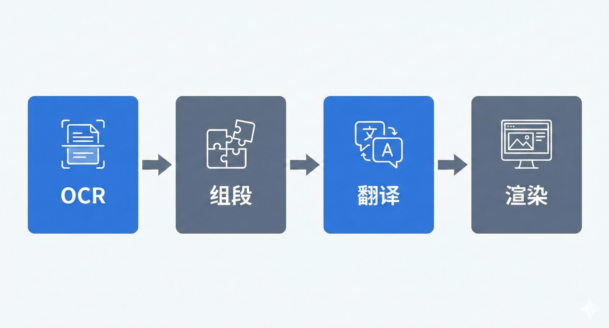

#### 1.1 OCR

> 调用 OCR 服务

可以获取如下信息：

- region：块
  - bounding_box：文字位置
  - lines：行
    - bounding_box：文字位置
    - content：行内容
- orentation：图片整体方向
- angle：图片整体角度

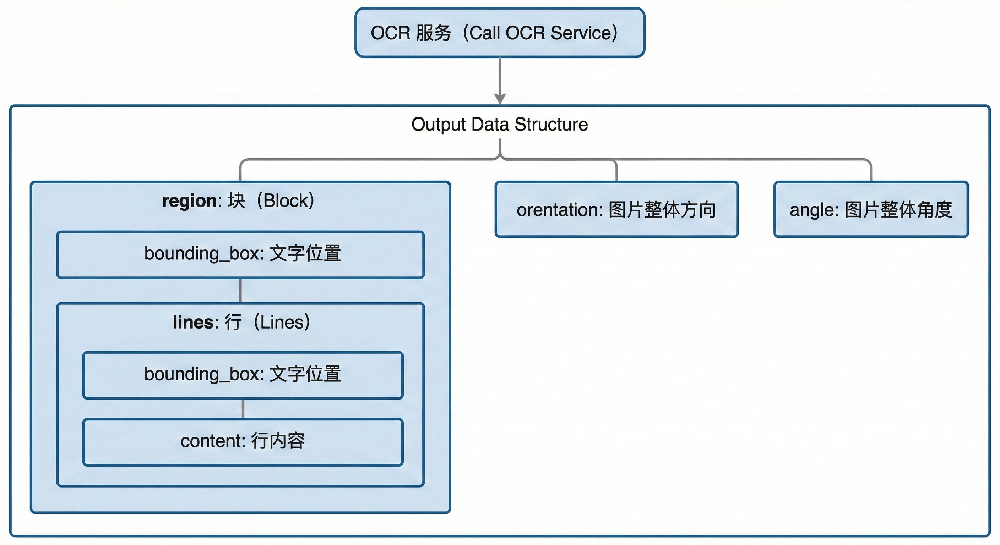

#### 1.2 组段

> Java 工程实现，相当于 OCR 结果进行后处理

基于 **文本内容** 以及 **bounding_box**，应用多种策略，对 OCR region 进行拆分

- 场景区分：菜单
- 序号开头：检测 1. 2) a. (一) 等序号模式、
- 同行大间隔：同一行但横向间隔 > 宽度 ×1.5
- 纯数字行：当前行是纯数字（如价格）
- 单字母行：当前行只有一个字母
- 语言不同：前后行语言不同（非文章场景）
- Patch 配置：根据 OvermindConfig.NEED_SPLIT_MAP 配置匹配
- 大横向间隔：当前行起点与上一行终点间隔 > 上一行宽度 ×1.5

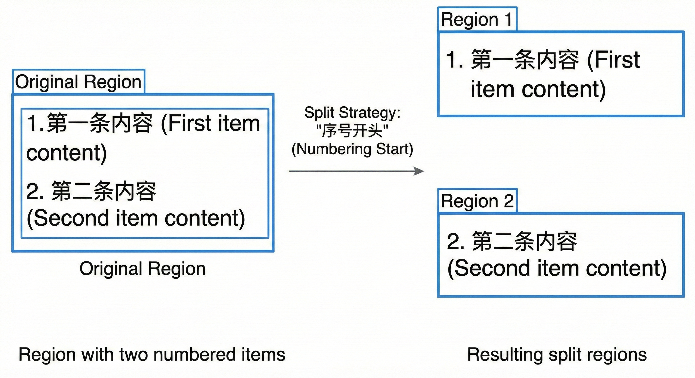

结果：

> 现在的 region 已经重组过了

- region：块
  - bounding_box：文字位置
  - content：块内容 <----------------- 新增字段
  - lines：行
    - bounding_box：文字位置
    - content：行内容
- orentation：图片整体方向
- angle：图片整体角度

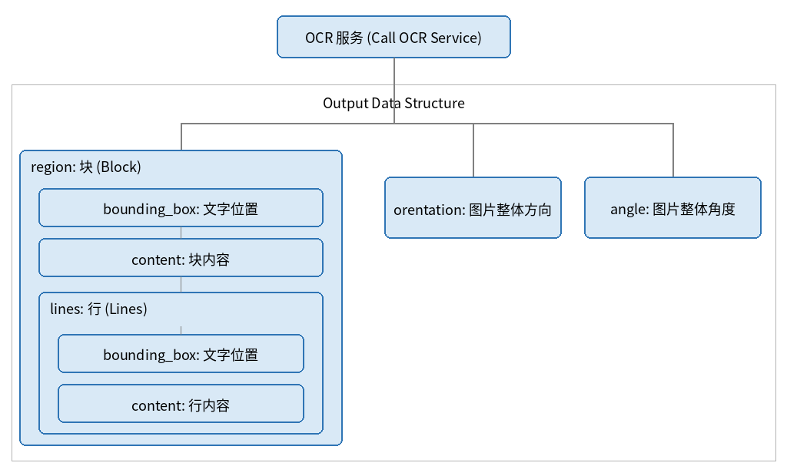

#### 1.3 翻译

- region：块
  - bounding_box：文字位置
  - content：块内容
  - translation_content：翻译后的块内容 <-------------- 新增字段
  - lines：行
    - bounding_box：文字位置
    - content：行内容
- orentation：图片整体方向
- angle：图片整体角度

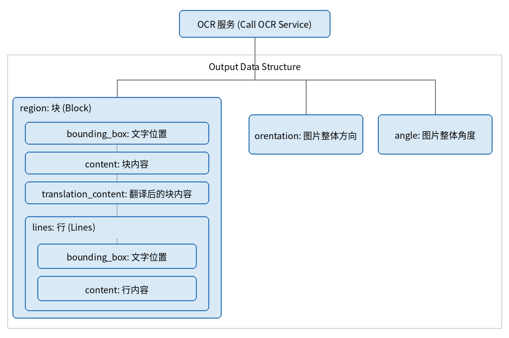

#### 1.4 渲染

##### 1.4.1 擦除

- 输入
  - 原图 cv::Mat
  - ocr_trans result json
- 输出
  - 擦除文字后的图片 cv::Mat
- 依赖
  - OpenCv
  - TensorFlow Lite
- 策略
  - 根据复杂度（颜色、单词数）
    - 高斯模糊
    - OpenCV Inpaint
    - 模型

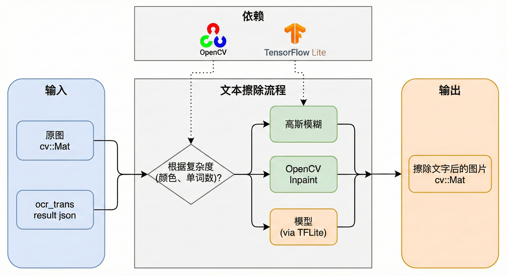

##### 1.4.2 提取样式

- 输入
  - 原图 cv::Mat
  - ocr_trans result json
- 输出
  - font_size：字体大小
  - font_color：字体颜色
  - bgcolor：背景颜色
  - strength：字体粗细
  - orientation：文字方向
  - font_height：字体高度
- 依赖
  - OpenCv
  - TensorFlow Serving
  - TensorFlow Lite
- 策略
  - 图像块提取
  - 字体大小计算
    - 从分割掩码轮廓高度取 99 分位数
    - 小写字母字符集 aceimnorsuvwxz,.'"~^\*-+ 放大 1.5 倍
    - 边界限制：原始高度的 12%-68%
  - 语言调整
    - 中译英：字号 × 1.0
    - 英译中：字号 × 1.2
    - 其他：字号 × 1.0
  - 颜色对比度
    - 计算亮度
    - 对比度阈值: 4.0
    - 对比度不足时拉大前景/背景色差

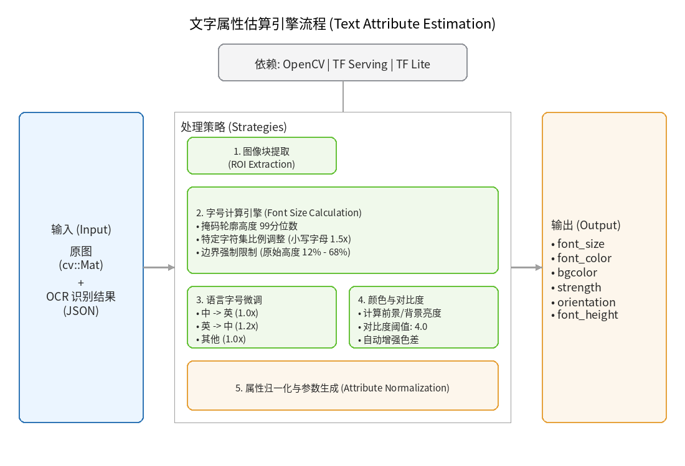

##### 1.4.3 绘制文字

根据不同的语种，分别使用 freetype / skia 库进行渲染

- 输入
  - 原图 cv::Mat
  - ocr_trans result json
- 输出
  - 渲染后的图片 cv::Mat
- 依赖
  - freetype
  - skia
  - OpenCV
- 策略
  - 初始化
    - 获取段落边界框、OCR 块信息
    - 设置最小字号限制
    - 判断竖排/横排
  - 字号自适应搜索
    - 二分。下界 font_size=5，上界 font_size=style.font_size
  - 字形渲染 str2image
  - 对齐
    - 左 / 中 / 右 对齐
    - 额外说明一下：目前的对齐，是 region 对齐，每行文本还是左起开始渲染
  - 其他后处理

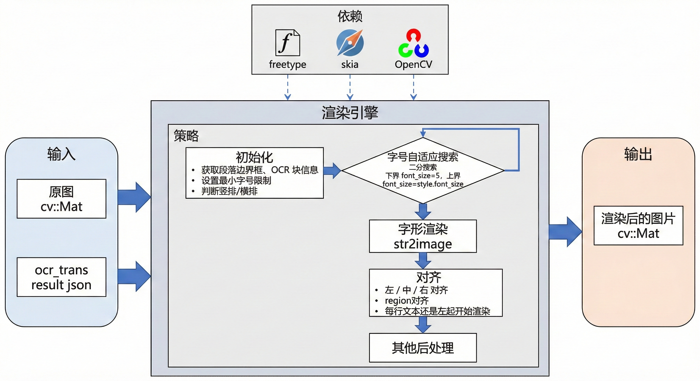

#### 2. case 对比

|                          原图                           |                          有道                           |                           腾讯                            |
| :-----------------------------------------------------: | :-----------------------------------------------------: | :-------------------------------------------------------: |
|  | 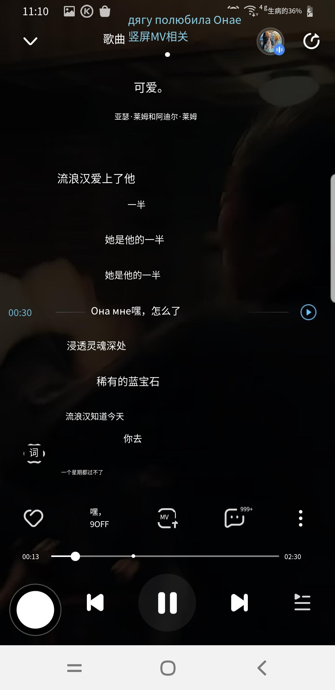 |  |
| 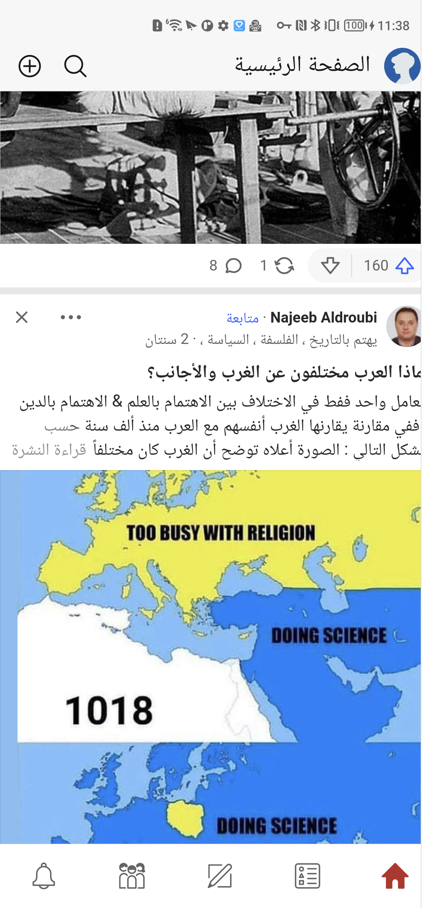 | 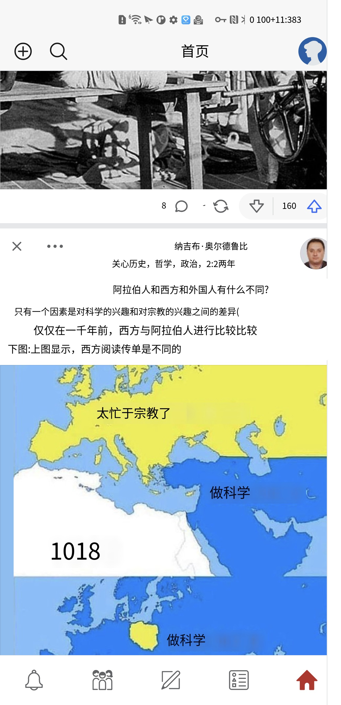 | 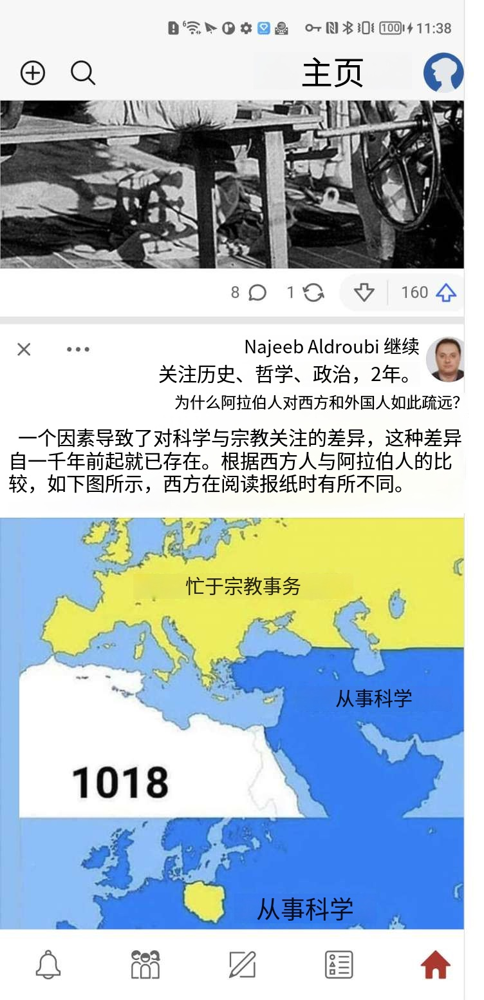 |
|  | 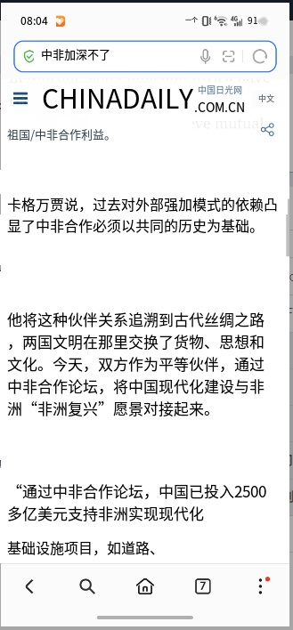 | 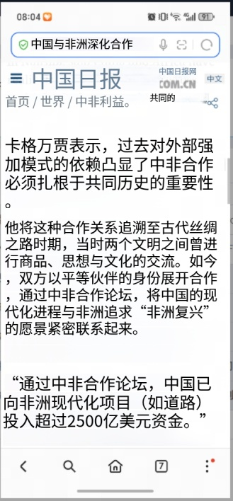 |
|  |  |  |

## 二、优化点

### 1. 对齐 & 字号

左 / 中 / 右 对齐，目前是基于 region 的 bounding_box 优化了一版。

#### 核心流程

```
┌─────────────────────────────────────────────────────────────────┐
│                    process_hierarchical_align                    │
├─────────────────────────────────────────────────────────────────┤
│  Step 1: 预处理 (preprocess_region)                              │
│      ↓                                                          │
│  Step 2: 聚类 (group_regions)                                    │
│      ↓                                                          │
│  Step 3: 计算 Group 对齐指标 (compute_group_metrics)              │
│      ↓                                                          │
│  Step 4: 层级决策 (apply_hierarchical_decision)                  │
└─────────────────────────────────────────────────────────────────┘
```

#### Step 1: 预处理 (`preprocess_region`)

##### 目的

提取行指标（LineMetrics），剔除可能影响对齐判断的干扰行。

##### 策略

| 策略         | 条件                      | 操作                   | 原因                         |
| ------------ | ------------------------- | ---------------------- | ---------------------------- |
| **首行剔除** | 行数 ≥ 3                  | 标记首行 `valid=False` | 首行可能是标题，影响对齐分析 |
| **末行剔除** | 末行宽度 < 平均宽度 × 0.7 | 标记末行 `valid=False` | 末行可能不完整               |

##### 输出

```python
LineMetrics:
    x_min, x_max, x_center  # X轴边界和中心
    y_min, y_max            # Y轴边界
    width, height           # 宽高
    valid                   # 是否有效（用于对齐计算）
```

#### Step 2: 聚类 (`group_regions`)

##### 目的

将相邻且对齐方式相似的 region 合并为 group，便于后续统一分析。

##### 三条件聚类判断

决定一个 region 是否加入当前 group 需**同时满足**以下三个条件：

##### 条件 A：垂直间距

```text
v_gap = region.y_min - group.max_y
条件满足: v_gap < 平均行高 × 2.0
```

##### 条件 B：对齐相似度

```text
left_diff   = |region.x_min - group.x_min|
right_diff  = |region.x_max - group.x_max|
center_diff = |region.x_center - group.x_center|

min_diff = min(left_diff, right_diff, center_diff)
条件满足: min_diff < 平均行宽 × 0.066
```

##### 条件 C：水平重叠

```text
overlap_width = 重叠区域宽度
overlap_ratio = overlap_width / min(prev_region_width, region_width)

条件满足: overlap_ratio ≥ 0.3
```

##### 决策流程

```text
if 条件A ∧ 条件B ∧ 条件C:
    加入当前 Group
else:
    创建新 Group
```

#### Step 3: 计算 Group 对齐指标 (`compute_group_metrics`)

##### 目的

为每个 group 计算整体对齐方式。

##### 算法

1. **计算三个标准差**（针对所有有效行）：

   - **σ_L**：左边缘 (x_min) 的标准差
   - **σ_C**：中心点 (x_center) 的标准差
   - **σ_R**：右边缘 (x_max) 的标准差

2. **对齐判定**：

```text
动态阈值 = 平均行宽 × 0.066（魔法值）

if min(σ_L, σ_C, σ_R) < 动态阈值:
    if 最小是 σ_L → alignment = "left"
    if 最小是 σ_C → alignment = "center"
    if 最小是 σ_R → alignment = "right"
else:
    alignment = "left"  # 默认
```

### 原理

标准差越小，表示该边（或中心）对齐越整齐。

#### Step 4: 层级决策 (`apply_hierarchical_decision`)

##### 目的

为每个 region 确定最终对齐方式，按优先级依次检查。

##### 六级优先级

| 优先级 | 策略         | 条件                          | 对齐结果         |
| ------ | ------------ | ----------------------------- | ---------------- |
| **1**  | 内部特征     | 有效行数 ≥ 2 且 min(σ) < 阈值 | σ 最小的方向     |
| **2**  | Group 上下文 | Group 包含 > 1 个 region      | Group 的对齐方式 |
| **3**  | 边缘位置     | 左边距 < 画布宽度 × 0.10      | left（防溢出）   |
|        |              | 右边距 < 画布宽度 × 0.10      | right（防溢出）  |
|        |              | 两侧都小                      | left             |
| **4**  | 短文本居中   | 加权字符数 ≤ 10 或 单词数 ≤ 2 | center           |
| **5**  | 画布位置     | 中心偏移 < 画布宽度 × 0.05    | center           |
| **6**  | 默认         | 无法通过任何规则判定          | left             |

#### 有优化，有劣化

|                          原图                           |                 对齐                  |                        有道线上                         |                                 更新后                                  |
| :-----------------------------------------------------: | :-----------------------------------: | :-----------------------------------------------------: | :---------------------------------------------------------------------: |
|  | 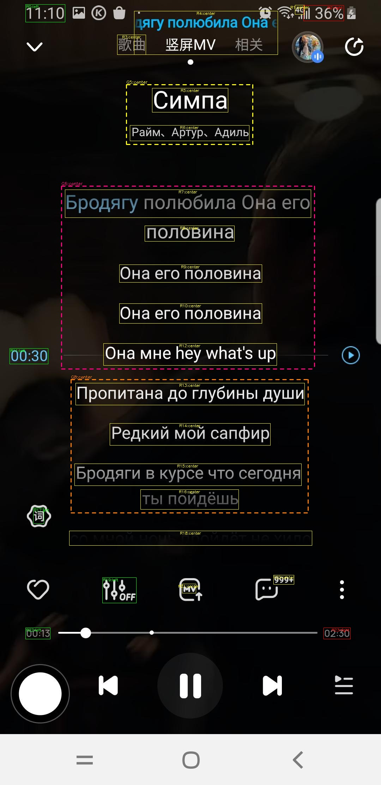 |  | 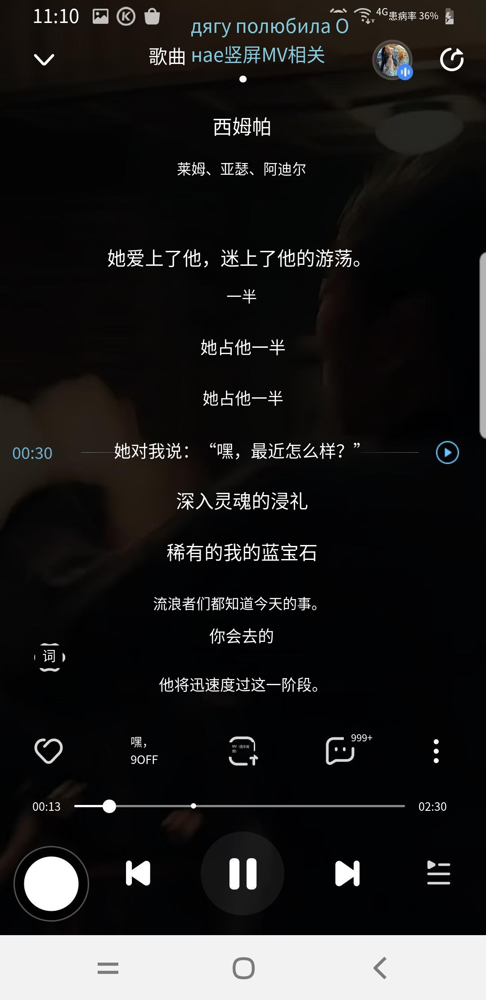 |
|  | 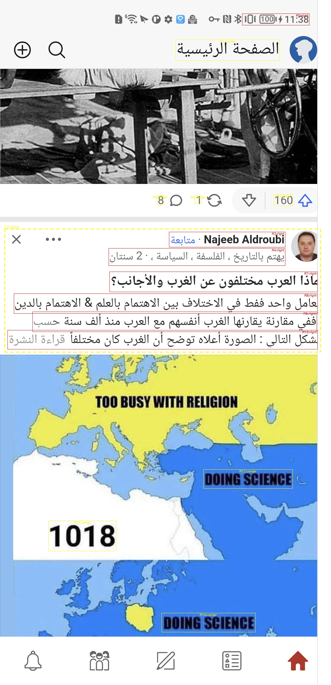 |  | 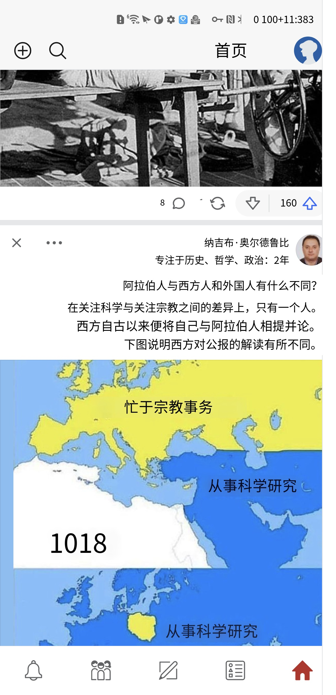 |
|  | 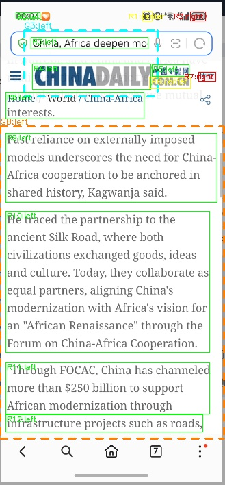 |  | 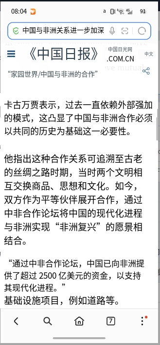 |
|  |  |  |  |
|  |  |  |  |
|  |  |  |  |
| 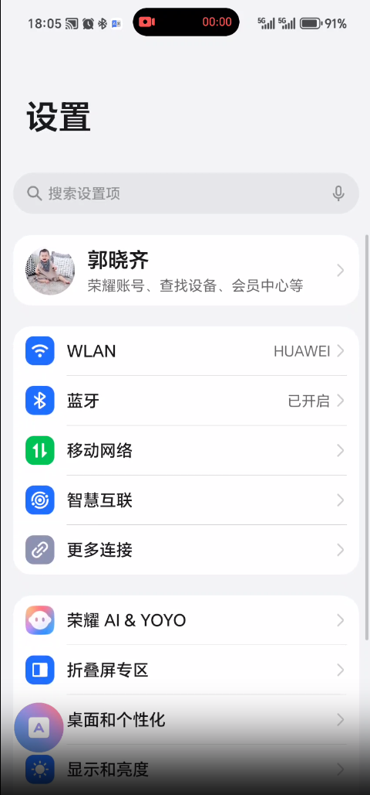 | 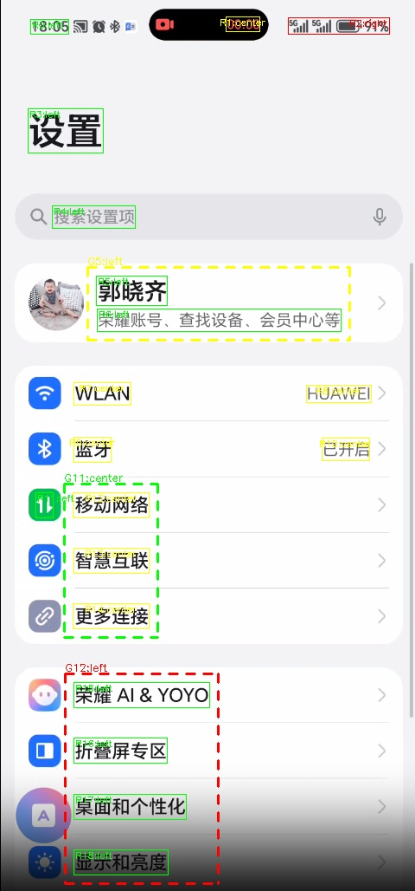 |  |  |

## 未来优化

### 1. 对齐

- 现状：基于 bounding_box
- 期望：基于视觉 / VLM

|                          原图                           |                 对齐                  |
| :-----------------------------------------------------: | :-----------------------------------: |
|  |  |
|  |  |

### 2. 方向 & 角度

- 现状：整图 级别
- 期望：region 级别


### 3. 检测 & 边界

- 现状：不判定文本扩散边界
- 期望：限定文本扩散边界


### 4. 样式

需要更精准的判断，更丰富的信息

- 颜色
- 字体
- 字号
- 描边
  - 颜色
  - 粗细


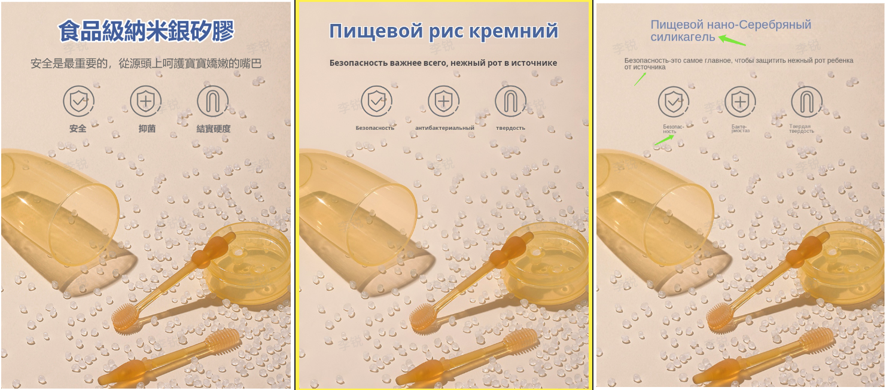