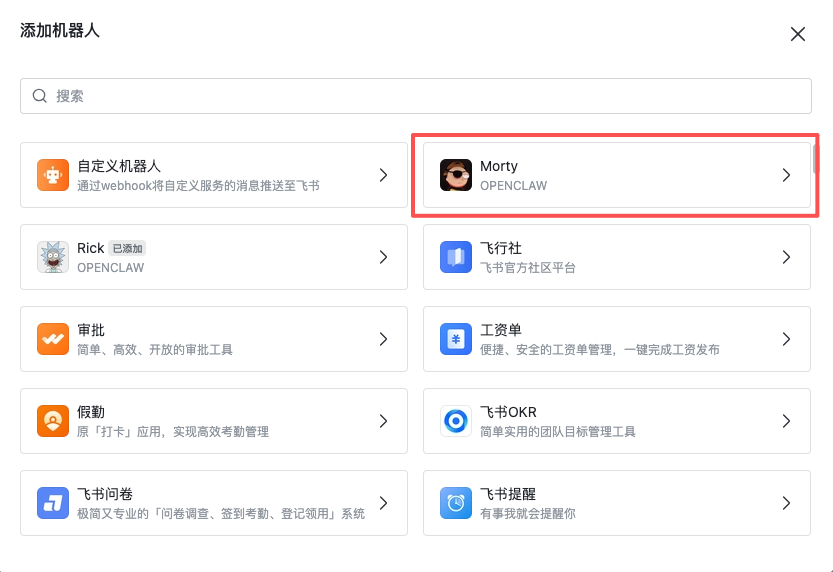

## 1. 环境

> pnpm: https://pnpm.io/zh/installation

```
curl -fsSL https://get.pnpm.io/install.sh | sh -
```

> node / npm

```
curl -fsSL https://rpm.nodesource.com/setup_24.x | bash -

dnf install -y nodejs
```

> cmake

- Rocky Linux
```
dnf groupinstall "Development Tools" -y
dnf install cmake -y
dnf install git python3 make gcc gcc-c++ chromium -y
```
- Ubuntu 24.04
```
apt update && apt install -y build-essential cmake git python3 curl wget python-is-python3 chromium-browser
```

## 2. 安装

> 可选：更改到国内源
```
npm config set registry https://mirrors.cloud.tencent.com/npm/
```

```
npm install -g openclaw@latest
```

## 3. 启动

> 准备工作：飞书 - 见附录

```
openclaw onboard
```

```
◇  I understand this is personal-by-default and shared/multi-user use requires lock-down. Continue?
│  Yes
│
◇  Onboarding mode
│  QuickStart
│
◇  Model/auth provider
│  OpenAI
│
◇  Model/auth provider
│  Custom Provider
│
◇  API Base URL
│  https://xxxxx/v1
│
◇  How do you want to provide this API key?
│  Paste API key now
│
◇  API Key (leave blank if not required)
│  xxxxx
│
◇  Endpoint compatibility
│  OpenAI-compatible
│
◇  Model ID
│  gpt-5.4
│
◇  Verification successful.
│
◇  Endpoint ID
│  xxxxx
│
◇  Model alias (optional)
│  gpt-5.4
│
◇  Select channel (QuickStart)
│  Feishu/Lark (飞书)
│
◇  How do you want to provide this App Secret?
│  Enter App Secret
│
◇  Enter Feishu App Secret
│  xxxxx
│
◇  Enter Feishu App ID
│  xxxxx
│
◇  Configure skills now? (recommended)
│  Yes
│
◇  Install missing skill dependencies
│  🔐 1password, 📰 blogwatcher, 🫐 blucli, 📸 camsnap, 🧩 clawhub, 🎛️ eightctl, ♊️ gemini, 🧲 gifgrep, 🐙 github,
│  🎮 gog, 📍 goplaces, 📧 himalaya, 📦 mcporter, 🍌 nano-banana-pro, 📄 nano-pdf, 💎 obsidian, 🎙️ openai-whisper,
│  💡 openhue, 🧿 oracle, 🛵 ordercli, 🗣️ sag, 🌊 songsee, 🔊 sonoscli, 🧾 summarize, 🎞️ video-frames, 📱 wacli, 𝕏
│  xurl
│
◇  Show Homebrew install command?
│  Yes
│
◇  Preferred node manager for skill installs
│  npm
│
◇  Enable hooks?
│  🚀 boot-md, 📎 bootstrap-extra-files, 📝 command-logger, 💾 session-memory
│
◇  Install gateway service now?
│  Yes
│
◇  Gateway service runtime
│  Node (recommended)
```

```
openclaw gateway restart
```

## 4. 配置

### 4.1 增加权限

```
  "tools": {
    "profile": "full",
    "web": {
	  "search": {
	    "enabled": true
	  },
	  "fetch": {
	    "enabled": true
	  }
    }
  },
```

### 4.2 安装插件

#### 4.2.1 飞书

> [OpenClaw飞书官方插件使用指南（公开版）](https://bytedance.larkoffice.com/docx/MFK7dDFLFoVlOGxWCv5cTXKmnMh)

## 附录

### A. 飞书

> [飞书开放平台](https://open.feishu.cn/)
> [OpenClaw飞书官方插件使用指南（公开版）](https://bytedance.larkoffice.com/docx/MFK7dDFLFoVlOGxWCv5cTXKmnMh)

配置完成后，使用机器人





### B. 配置 JSON 示例

> 备注一下，OpenClaw 的 service 配置文件在用户目录下
> ~/.config/systemd/user/openclaw-gateway.service

```
{
  "meta": {
    "lastTouchedVersion": "2026.3.7",
    "lastTouchedAt": "2026-03-09T08:07:56.511Z"
  },
  "wizard": {
    "lastRunAt": "2026-03-09T04:37:35.941Z",
    "lastRunVersion": "2026.3.7",
    "lastRunCommand": "doctor",
    "lastRunMode": "local"
  },
  "models": {
    "mode": "merge",
    "providers": {
      "x-provider": {
        "baseUrl": "",
        "apiKey": "",
        "api": "openai-completions",
        "models": [
          {
            "id": "gpt-5.4",
            "name": "gpt-5.4 (Custom Provider)",
            "reasoning": false,
            "input": [
              "text"
            ],
            "cost": {
              "input": 0,
              "output": 0,
              "cacheRead": 0,
              "cacheWrite": 0
            },
            "contextWindow": 200000,
            "maxTokens": 8192
          }
        ]
      }
    }
  },
  "agents": {
    "defaults": {
      "model": {
        "primary": "x-provider/gpt-5.4"
      },
      "models": {
        "x-provider/gpt-5.4": {}
      },
      "compaction": {
        "mode": "safeguard"
      },
      "maxConcurrent": 4,
      "subagents": {
        "maxConcurrent": 8
      }
    },
    "list": [
      {
        "id": "akko",
        "name": "akko",
        "workspace": "/root/.openclaw/workspace/akko",
        "agentDir": "/root/.openclaw/agents/akko/agent",
        "model": "gyz-weasley-cn/gpt-5.4"
      },
      {
        "id": "rick",
        "name": "rick",
        "workspace": "/root/.openclaw/workspace/rick",
        "agentDir": "/root/.openclaw/agents/rick/agent",
        "model": "gyz-weasley-cn/gpt-5.4"
      },
      {
        "id": "morty",
        "name": "morty",
        "workspace": "/root/.openclaw/workspace/morty",
        "agentDir": "/root/.openclaw/agents/morty/agent",
        "identity": {
          "name": "Morty",
          "emoji": "🧠"
        }
      },
      {
        "id": "fengmishu",
        "name": "fengmishu",
        "workspace": "/root/.openclaw/workspace/fengmishu",
        "agentDir": "/root/.openclaw/agents/fengmishu/agent"
      }
    ]
  },
  "tools": {
    "profile": "full",
    "web": {
      "search": {
        "enabled": true
      },
      "fetch": {
        "enabled": true
      }
    }
  },
  "bindings": [
    {
      "agentId": "akko",
      "match": {
        "channel": "feishu",
        "accountId": "akko"
      }
    },
    {
      "agentId": "rick",
      "match": {
        "channel": "feishu",
        "accountId": "rick"
      }
    },
    {
      "agentId": "morty",
      "match": {
        "channel": "feishu",
        "accountId": "morty"
      }
    },
    {
      "agentId": "fengmishu",
      "match": {
        "channel": "feishu",
        "accountId": "fengmishu"
      }
    }
  ],
  "messages": {
    "ackReactionScope": "group-mentions"
  },
  "commands": {
    "native": "auto",
    "nativeSkills": "auto",
    "restart": true,
    "ownerDisplay": "raw"
  },
  "session": {
    "dmScope": "per-channel-peer"
  },
  "hooks": {
    "internal": {
      "enabled": true,
      "entries": {
        "boot-md": {
          "enabled": true
        },
        "bootstrap-extra-files": {
          "enabled": true
        },
        "command-logger": {
          "enabled": true
        },
        "session-memory": {
          "enabled": true
        }
      }
    }
  },
  "channels": {
    "feishu": {
      "connectionMode": "websocket",
      "accounts": {
        "akko": {
          "appId": "",
          "appSecret": "",
          "domain": "feishu",
          "enabled": true
        },
        "rick": {
          "appId": "",
          "appSecret": "",
          "domain": "feishu",
          "enabled": true
        },
        "morty": {
          "appId": "",
          "appSecret": "",
          "domain": "feishu",
          "enabled": true
        },
	"fengmishu": {
          "appId": "",
          "appSecret": "",
          "domain": "feishu",
          "enabled": true
        },
        "default": {
          "groupPolicy": "open"
        }
      },
      "streaming": true,
      "footer": {
        "elapsed": true,
        "status": true
      },
      "threadSession": true,
      "appId": "",
      "appSecret": "",
      "dmPolicy": "pairing",
      "groupPolicy": "open"
    }
  },
  "gateway": {
    "port": 18789,
    "mode": "local",
    "bind": "loopback",
    "controlUi": {
      "allowedOrigins": [
        "xxx"
      ]
    },
    "auth": {
      "mode": "token",
      "token": ""
    },
    "trustedProxies": [
      "127.0.0.1"
    ],
    "tailscale": {
      "mode": "off",
      "resetOnExit": false
    },
    "nodes": {
      "denyCommands": [
        "camera.snap",
        "camera.clip",
        "screen.record",
        "contacts.add",
        "calendar.add",
        "reminders.add",
        "sms.send"
      ]
    }
  },
  "plugins": {
    "allow": [
      "feishu-openclaw-plugin"
    ],
    "entries": {
      "feishu": {
        "enabled": false
      },
      "feishu-openclaw-plugin": {
        "enabled": true
      }
    },
    "installs": {
      "feishu-openclaw-plugin": {
        "source": "npm",
        "spec": "@larksuiteoapi/feishu-openclaw-plugin",
        "installPath": "/root/.openclaw/extensions/feishu-openclaw-plugin",
        "version": "2026.3.8",
        "resolvedName": "@larksuiteoapi/feishu-openclaw-plugin",
        "resolvedVersion": "2026.3.8",
        "resolvedSpec": "@larksuiteoapi/feishu-openclaw-plugin@2026.3.8",
        "integrity": "sha512-77PzCEESdPgqL9jgoV8I3difKOuC/iRiECYLUT+2rLRD1Oy+CHtTXuYwHwztHvbY2sWitev/5rN/TseDHo2FVg==",
        "shasum": "d4acc5a0433aaf77b0d87a028fa627b38efdb4cd",
        "resolvedAt": "2026-03-09T07:50:49.261Z",
        "installedAt": "2026-03-09T07:51:02.415Z"
      }
    }
  }
}
```
