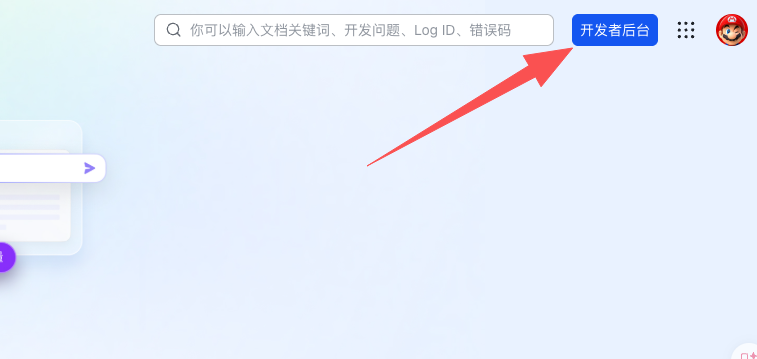
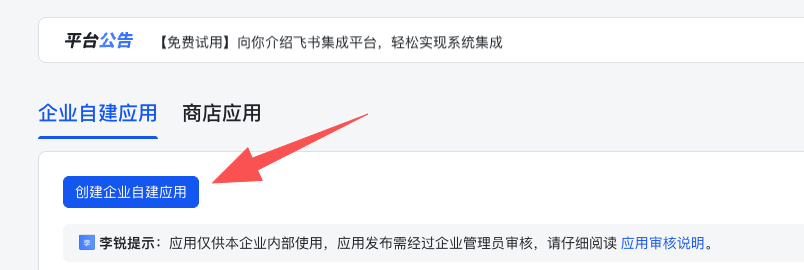
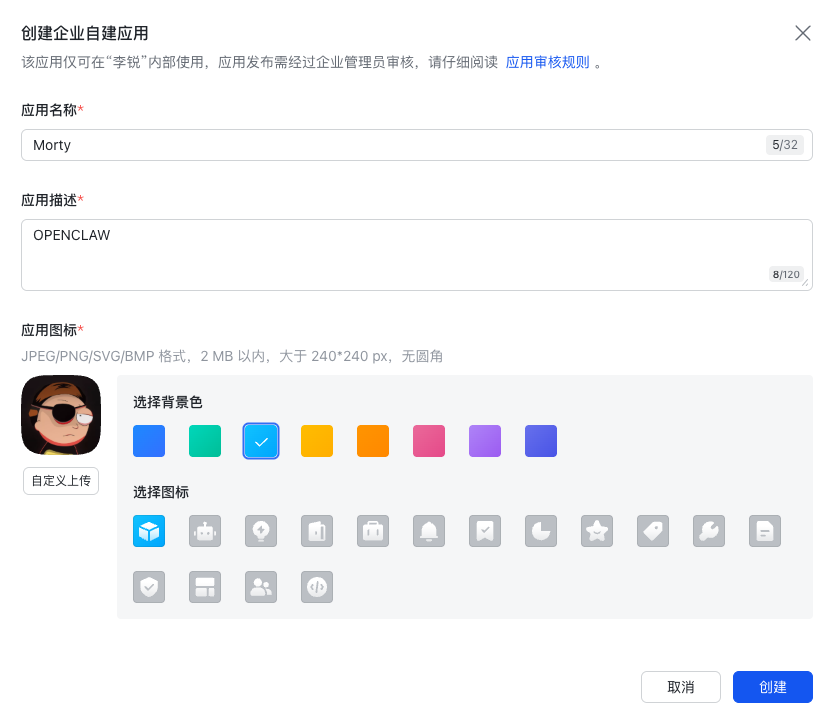
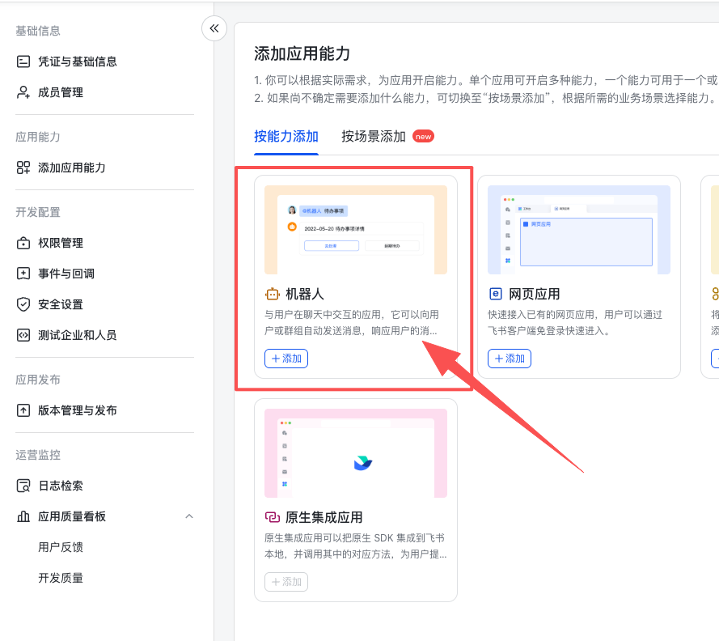
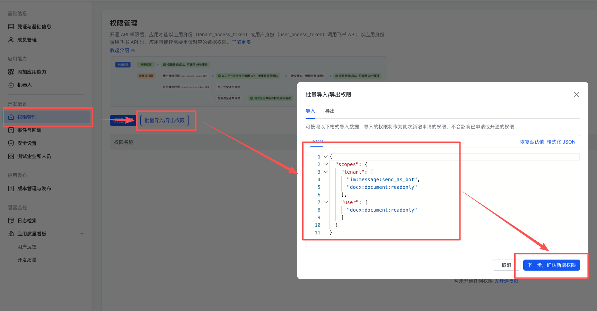
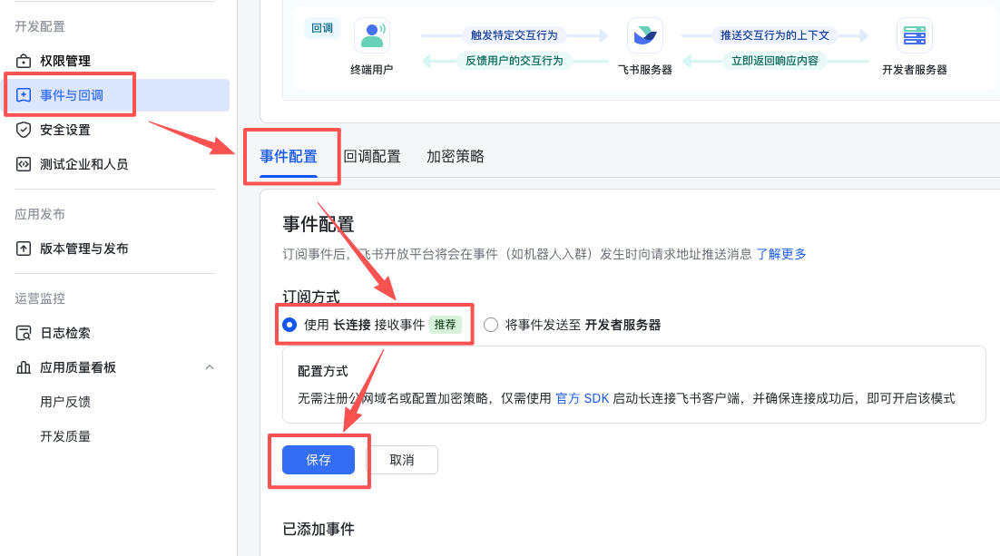
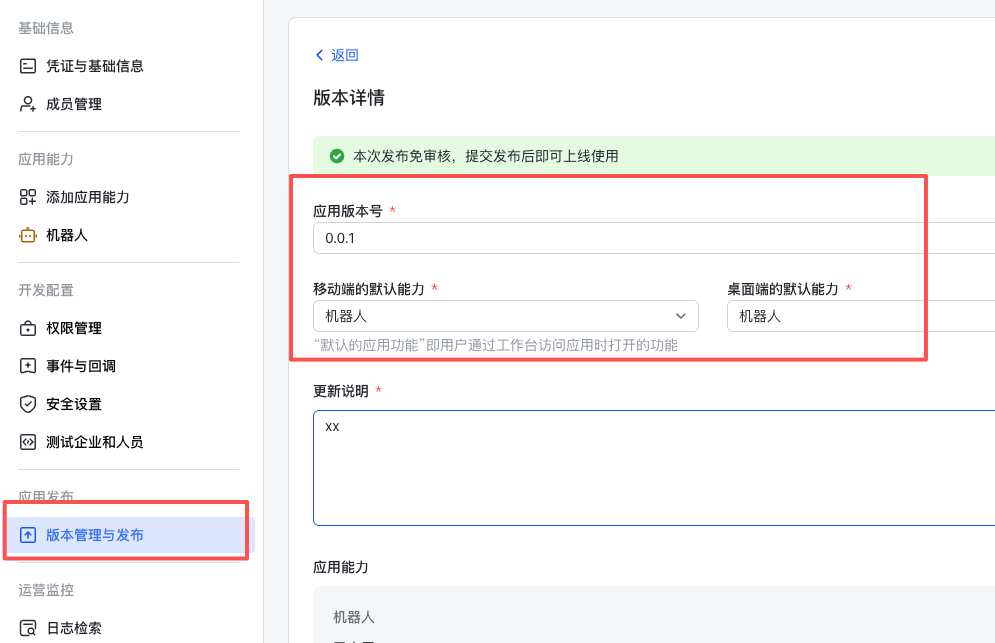
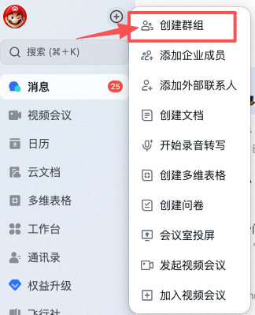
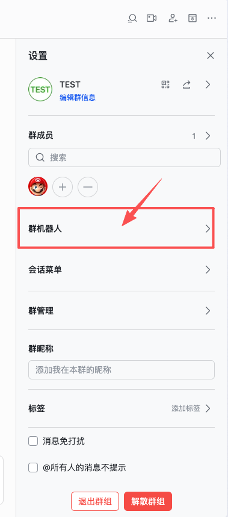

## 1. 环境

> nvm: https://github.com/nvm-sh/nvm?tab=readme-ov-file#install--update-script

```
curl -o- https://raw.githubusercontent.com/nvm-sh/nvm/v0.40.4/install.sh | bash
```

> pnpm: https://pnpm.io/zh/installation

```
curl -fsSL https://get.pnpm.io/install.sh | sh -
```

> node / npm

```
nvm install --lts
```

> cmake

- Rocky Linux
```
dnf groupinstall "Development Tools" -y
dnf install cmake -y
dnf install git python3 make gcc gcc-c++ -y
```
- Ubuntu 24.04
```
apt update && apt install -y build-essential cmake git python3 curl wget
```

## 2. 安装

```
npm config set registry https://mirrors.cloud.tencent.com/npm/

npm install -g openclaw@latest
```

## 3. 启动

> 准备工作：飞书 - 见附录

```
openclaw onboard
```

```
◇  I understand this is personal-by-default and shared/multi-user use requires lock-down. Continue?
│  Yes
│
◇  Onboarding mode
│  QuickStart
│
◇  Model/auth provider
│  OpenAI
│
◇  Model/auth provider
│  Custom Provider
│
◇  API Base URL
│  https://xxxxx/v1
│
◇  How do you want to provide this API key?
│  Paste API key now
│
◇  API Key (leave blank if not required)
│  xxxxx
│
◇  Endpoint compatibility
│  OpenAI-compatible
│
◇  Model ID
│  gpt-5.4
│
◇  Verification successful.
│
◇  Endpoint ID
│  xxxxx
│
◇  Model alias (optional)
│  gpt-5.4
│
◇  Select channel (QuickStart)
│  Feishu/Lark (飞书)
│
◇  How do you want to provide this App Secret?
│  Enter App Secret
│
◇  Enter Feishu App Secret
│  xxxxx
│
◇  Enter Feishu App ID
│  xxxxx
│
◇  Configure skills now? (recommended)
│  Yes
│
◇  Install missing skill dependencies
│  🔐 1password, 📰 blogwatcher, 🫐 blucli, 📸 camsnap, 🧩 clawhub, 🎛️ eightctl, ♊️ gemini, 🧲 gifgrep, 🐙 github,
│  🎮 gog, 📍 goplaces, 📧 himalaya, 📦 mcporter, 🍌 nano-banana-pro, 📄 nano-pdf, 💎 obsidian, 🎙️ openai-whisper,
│  💡 openhue, 🧿 oracle, 🛵 ordercli, 🗣️ sag, 🌊 songsee, 🔊 sonoscli, 🧾 summarize, 🎞️ video-frames, 📱 wacli, 𝕏
│  xurl
│
◇  Show Homebrew install command?
│  Yes
│
◇  Preferred node manager for skill installs
│  npm
│
◇  Enable hooks?
│  🚀 boot-md, 📎 bootstrap-extra-files, 📝 command-logger, 💾 session-memory
│
◇  Install gateway service now?
│  Yes
│
◇  Gateway service runtime
│  Node (recommended)
```

```
openclaw gateway restart
```

## 4. 配置

### 4.1 增加权限

```
  "tools": {
    "profile": "full",
    "web": {
	  "search": {
	    "enabled": true
	  },
	  "fetch": {
	    "enabled": true
	  }
    }
  },
```

### 4.2 

## 附录

### A. 飞书

> [飞书开放平台](https://open.feishu.cn/)











添加这些权限：
```
{
  "scopes": {
    "tenant": [
      "aily:file:read",
      "aily:file:write",
      "application:application.app_message_stats.overview:readonly",
      "application:application:self_manage",
      "application:bot.menu:write",
      "base:app:copy",
      "base:app:create",
      "base:app:read",
      "base:app:update",
      "base:collaborator:create",
      "base:collaborator:delete",
      "base:collaborator:read",
      "base:dashboard:copy",
      "base:dashboard:read",
      "base:field:create",
      "base:field:delete",
      "base:field:read",
      "base:field:update",
      "base:form:read",
      "base:form:update",
      "base:record:create",
      "base:record:delete",
      "base:record:read",
      "base:record:retrieve",
      "base:record:update",
      "base:role:create",
      "base:role:delete",
      "base:role:read",
      "base:role:update",
      "base:table:create",
      "base:table:delete",
      "base:table:read",
      "base:table:update",
      "base:view:read",
      "base:view:write_only",
      "base:workflow:read",
      "base:workflow:write",
      "bitable:app",
      "bitable:app:readonly",
      "calendar:room:readonly",
      "cardkit:card:write",
      "contact:contact.base:readonly",
      "contact:user.assign_info:read",
      "contact:user.base:readonly",
      "contact:user.department:readonly",
      "contact:user.dotted_line_leader_info.read",
      "contact:user.email:readonly",
      "contact:user.employee:readonly",
      "contact:user.employee_id:readonly",
      "contact:user.employee_number:read",
      "contact:user.gender:readonly",
      "contact:user.id:readonly",
      "contact:user.job_family:readonly",
      "contact:user.job_level:readonly",
      "contact:user.phone:readonly",
      "contact:user.subscription_ids:write",
      "contact:user.user_geo",
      "corehr:file:download",
      "docs:doc",
      "docs:doc:readonly",
      "docs:document.comment:create",
      "docs:document.comment:read",
      "docs:document.comment:update",
      "docs:document.comment:write_only",
      "docs:document.content:read",
      "docs:document.media:download",
      "docs:document.media:upload",
      "docs:document.subscription",
      "docs:document.subscription:read",
      "docs:document:copy",
      "docs:document:export",
      "docs:document:import",
      "event:ip_list",
      "im:app_feed_card:write",
      "im:biz_entity_tag_relation:read",
      "im:biz_entity_tag_relation:write",
      "im:chat",
      "im:chat.access_event.bot_p2p_chat:read",
      "im:chat.announcement:read",
      "im:chat.announcement:write_only",
      "im:chat.chat_pins:read",
      "im:chat.chat_pins:write_only",
      "im:chat.collab_plugins:read",
      "im:chat.collab_plugins:write_only",
      "im:chat.managers:write_only",
      "im:chat.members:bot_access",
      "im:chat.members:read",
      "im:chat.members:write_only",
      "im:chat.menu_tree:read",
      "im:chat.menu_tree:write_only",
      "im:chat.moderation:read",
      "im:chat.tabs:read",
      "im:chat.tabs:write_only",
      "im:chat.top_notice:write_only",
      "im:chat.widgets:read",
      "im:chat.widgets:write_only",
      "im:chat:create",
      "im:chat:delete",
      "im:chat:moderation:write_only",
      "im:chat:operate_as_owner",
      "im:chat:read",
      "im:chat:readonly",
      "im:chat:update",
      "im:datasync.feed_card.time_sensitive:write",
      "im:message",
      "im:message.group_at_msg:readonly",
      "im:message.group_msg",
      "im:message.p2p_msg:readonly",
      "im:message.pins:read",
      "im:message.pins:write_only",
      "im:message.reactions:read",
      "im:message.reactions:write_only",
      "im:message.urgent",
      "im:message.urgent.status:write",
      "im:message.urgent:phone",
      "im:message.urgent:sms",
      "im:message:readonly",
      "im:message:recall",
      "im:message:send_as_bot",
      "im:message:send_multi_depts",
      "im:message:send_multi_users",
      "im:message:send_sys_msg",
      "im:message:update",
      "im:resource",
      "im:tag:read",
      "im:tag:write",
      "im:url_preview.update",
      "im:user_agent:read",
      "vc:meeting.all_meeting:readonly",
      "vc:meeting:readonly"
    ],
    "user": [
      "aily:file:read",
      "aily:file:write",
      "base:app:copy",
      "base:app:create",
      "base:app:read",
      "base:app:update",
      "bitable:app",
      "bitable:app:readonly",
      "contact:user.assign_info:read",
      "contact:user.base:readonly",
      "contact:user.department:readonly",
      "contact:user.department_path:readonly",
      "contact:user.dotted_line_leader_info.read",
      "contact:user.email:readonly",
      "contact:user.employee:readonly",
      "contact:user.employee_id:readonly",
      "contact:user.employee_number:read",
      "contact:user.gender:readonly",
      "contact:user.id:readonly",
      "contact:user.job_family:readonly",
      "contact:user.job_level:readonly",
      "contact:user.phone:readonly",
      "contact:user.subscription_ids:write",
      "contact:user.user_geo",
      "contact:user:search",
      "docs:doc",
      "docs:doc:readonly",
      "docs:document.comment:create",
      "docs:document.comment:read",
      "docs:document.comment:update",
      "docs:document.comment:write_only",
      "docs:document.content:read",
      "docs:document.media:download",
      "docs:document.media:upload",
      "docs:document.subscription",
      "docs:document.subscription:read",
      "docs:document:copy",
      "docs:document:export",
      "docs:document:import",
      "im:chat",
      "im:chat.access_event.bot_p2p_chat:read",
      "im:chat.announcement:read",
      "im:chat.announcement:write_only",
      "im:chat.chat_pins:read",
      "im:chat.chat_pins:write_only",
      "im:chat.collab_plugins:read",
      "im:chat.collab_plugins:write_only",
      "im:chat.managers:write_only",
      "im:chat.members:read",
      "im:chat.members:write_only",
      "im:chat.moderation:read",
      "im:chat.tabs:read",
      "im:chat.tabs:write_only",
      "im:chat.top_notice:write_only",
      "im:chat:delete",
      "im:chat:moderation:write_only",
      "im:chat:read",
      "im:chat:readonly",
      "im:chat:update",
      "im:message",
      "im:message.pins:read",
      "im:message.pins:write_only",
      "im:message.reactions:read",
      "im:message.reactions:write_only",
      "im:message.urgent.status:write",
      "im:message:readonly",
      "im:message:recall",
      "im:message:update"
    ]
  }
}
```










