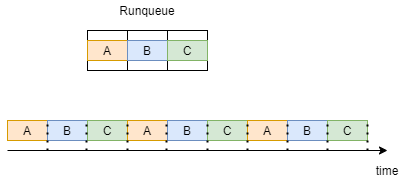
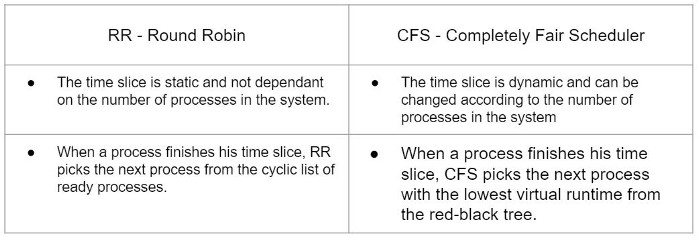

## 调度 Scheduling
调度是进行资源分配的一种行为。在单线程、多线程之间进行调度任务。

## 目标 Target
- 最大吞吐量(单位时间内完成的任务量)
- 最小的等待时间(进程准备就绪到开始执行经过的时间)
- 最小的响应时间(进程准备就绪到执行完成经过的时间)
- 最大的公平性(为每个进程公平地分配资源)

## Linux 中的两种进程类型
- 实时进程
- 常规进程
### 实时进程  

实时进程需要服从个响应时间的限制，而不去考虑系统负载。换句话说，实时进程是紧急的，任何情况下都不能延迟。  
举个例子来说，Linux中的负载均衡进程，负责跨CPU内核分配进程。

### 常规进程

传统进程没有严格的响应时间的限制，如果系统忙碌，响应会出现延迟。   
比如浏览器的进程，忙碌时加载页面会出现延迟。  

> 每种进程都有不同的调度算法，只要有准备运行的实时进程，它们就会运行并使常规进程等待。

## 实时调度

实时调度有两种调度策略，SCHED_RR 和 SCHED_FIFO。  
该策略会影响进程将获得多少运行时间以及运行队列的运行方式。  
准备运行的进程存储在一个名为 runqueue 的队列中。调度程序正在根据策略从该运行队列中选择要运行的进程。  

### SCHED_FIFO
在此策略中，调度程序将根据到达时间（FIFO = 先进先出）选择一个进程。  
具有 SCHED_FIFO 调度策略的进程可以在以下几种情况下“放弃”CPU：  
1. 进程正在等待，例如等待 IO 操作。 当进程回到“就绪”状态时，它将回到运行队列的末尾。  
2. 进程通过系统调用 sched_yield 让出 CPU。 该过程将立即返回到运行队列的末尾。   

### SCHED_RR
RR = Round Robin   
在此调度策略中，运行队列中的每个进程都获得一个时间片（单位量）并以循环方式轮流执行（基于优先级）。    
为了让我们对循环有更好的理解，让我们考虑一个例子，我们的运行队列中有 3 个进程 A B C，它们都具有 SCHED_RR 的策略。  
如下图所示，每个进程都得到一个时间片并轮流执行。当所有进程运行 1 次时，它们会重复相同的执行顺序。  

### 实时调度总结 
实时进程可以在两种不同的策略 SCHED_FIFO 和 SCHED_RR 中实现调度。该策略会影响运行队列的工作方式以及每个进程执行的时间。  

## 常规调度
> CFS — Completely Fair Scheduler 是 Linux 2.6.23 版本以来常规进程的调度算法。  
CFS 主要关注一个指标——它希望尽可能公平，这意味着他让每个进程都获得 CPU 的平均时间片。  
请注意，具有更高优先级的进程可能仍会获得更大的时间片。 为了让我们了解 CFS 的工作原理，我们必须熟悉一个新术语——虚拟运行时（vruntime）。  

### Virtual Runtime
进程的虚拟运行时间是实际执行所花费的时间，不包括任何形式的等待。  
CFS 力求尽可能公平。 为此，CFS 将以准备运行的最短虚拟时间安排进程。  
CFS 维护保持最大和最小虚拟运行时间的变量，原因我们很快就会明白。  

### CFS — 完全公平的调度器

在讨论算法是如何工作的之前，让我们先了解一下这个算法使用的是什么数据结构。  
CFS 使用红黑树，它是一种平衡的二叉搜索树——这意味着插入、删除和查找在 O(logN) 中执行，其中 N 是进程数。  
这棵树中的关键是进程的**虚拟**运行时。  
新进程或从等待中恢复到就绪状态的进程插入到树中，键为 vruntime=min_vruntime。这对于防止树中旧进程的饥饿非常重要。  

继续介绍算法，首先，算法为自己设置了一个时间限制 —— sched_latency。    
在这个时间限制内，它将尝试执行所有准备好的进程 —— N。   
这意味着每个进程将获得时间限制除以进程数的时间片 —— Qᵢ = sched_latency/N。   
当一个进程完成其时间片 (Qᵢ) 时，算法会选择树中虚拟运行时间最少的进程来执行下一个。   

让我们解决一个我迄今为止描述算法的方式可能存在问题的情况。   
假设算法选择了 48ms（毫秒）的时间限制，我们有 6 个进程——在这种情况下，每个进程都有 8ms 的时间轮流执行。  
    
但是当系统中的进程过载时会发生什么？ 假设时间限制仍然是 48 毫秒，但现在我们有 32 个进程，现在每个进程有 1.5 毫秒的执行时间——这将导致我们的系统严重减速。  

#### Why? What’s the difference?
上下文切换。    
上下文切换是一个存储进程或线程状态的过程，以便它可以在以后恢复并恢复执行。  

每次进程完成其执行时间并安排新进程时，都会发生上下文切换，这也需要时间。    

假设上下文切换花费了我们 1 毫秒，在第一个示例中，每个进程有 6 毫秒，我们可以允许这样做，我们在上下文切换上浪费了 1 毫秒，在实际执行进程上浪费了 5 毫秒。但是在第二个例子中，我们只有 0.5ms 来执行这个过程——我们浪费了大部分时间片来进行上下文切换，这就是它根本无法工作的原因。

为了克服这种情况，我们引入了一个新变量，它将确定允许的时间片有多小——min_granularity。   

假设 min_granularity=6ms 并回到我们的示例。 我们的时间限制是 48，我们有 32 个进程。 
根据我们之前的计算，每个进程都会得到 1.5ms，但现在根本不允许，因为 min_granularity 指定了每个进程应该得到的最小时间片。 
在这种情况下，当 Qᵢ < min_granularity 我们将 min_granularity 作为我们的 Qᵢ 并根据它更改时间限制。   
在我们的示例中，Qᵢ 将等于 6ms，因为 1.5ms < 6ms，这意味着新的时间限制将是 Qᵢ ⋅ N = 6ms ⋅ 32 = 192ms。      

## diff between cfs and rr
在这一点上，可能不清楚 CFS 和 RR 之间的区别是什么，因为它们都定义了一些时间片并使进程以某种顺序执行。   
为了总结和更好地理解这些算法之间的差异，这里有一个简短的表格

## Ref
> [Process Scheduling In Linux](https://medium.com/geekculture/process-scheduling-in-linux-592028a5d545)