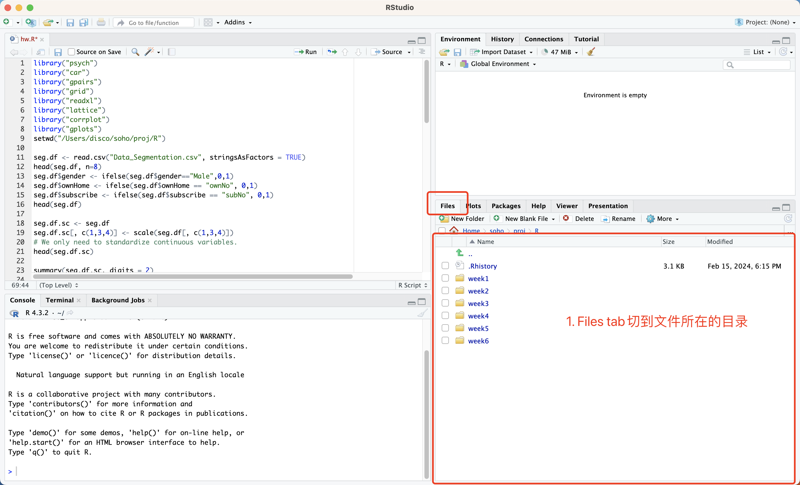
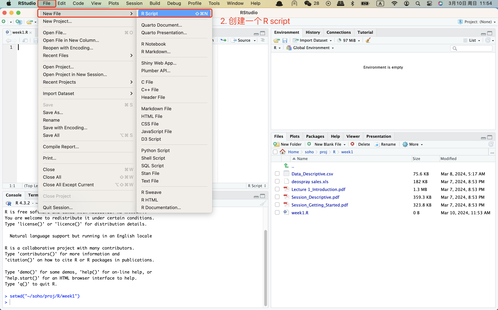
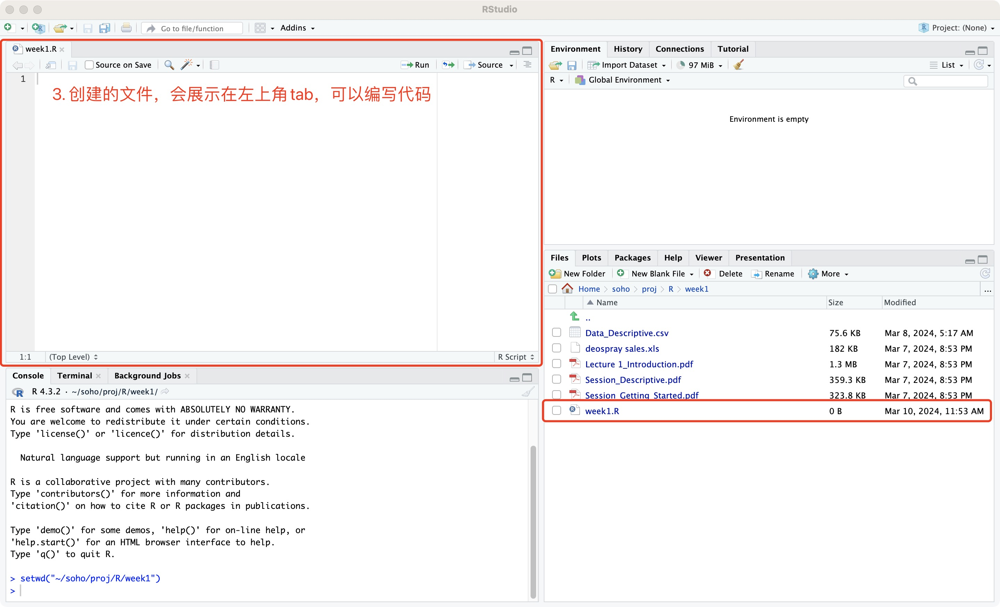
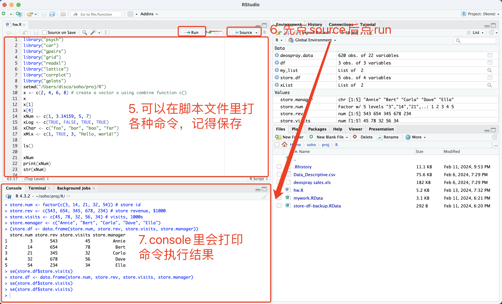
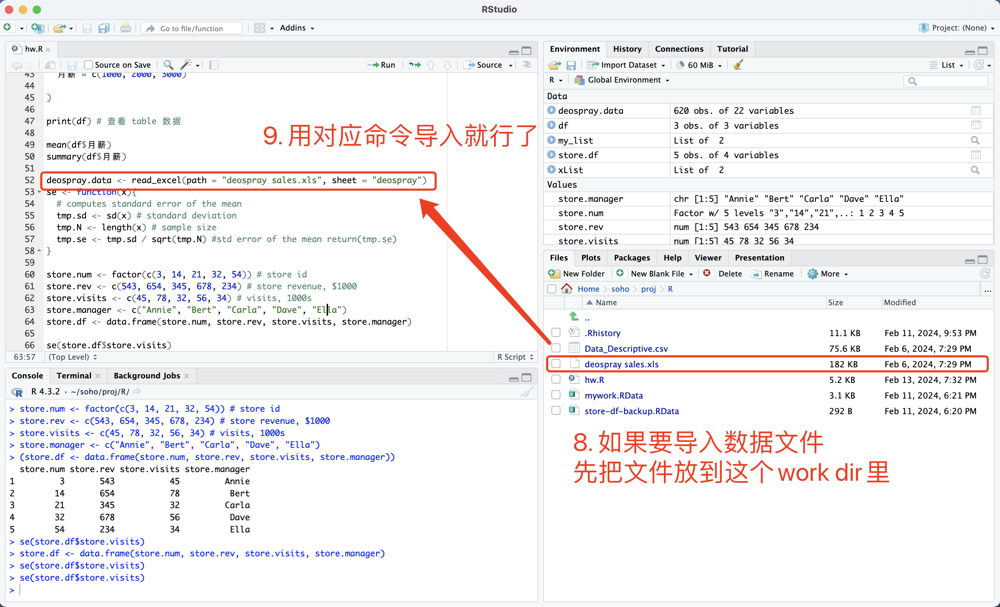
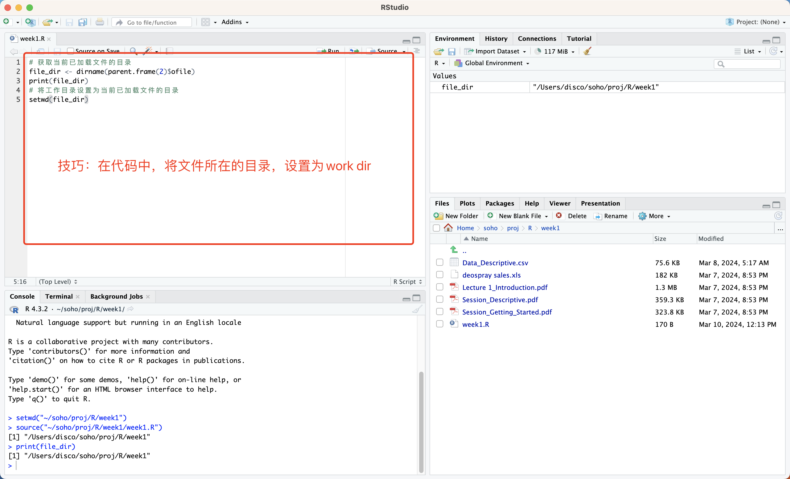

> 使用的版本：  
> R: 4.3.2 (2023-10-31)
> R studio: 2023.12.1+402 (2023.12.1+402)

# 一、建一个R script

### 1. 切换右下角的files tab


### 2. 新建R script



# 二、编写&运行代码

### 1. 编写与运行


### 2. 导入与写出到文件
> 如果使用相对路径，应该需要把文件放到work dir


# 三、技巧
### 1. 在脚本中，将work dir设置为文件所在目录 
```
# 获取当前已加载文件的目录
file_dir <- dirname(parent.frame(2)$ofile)
print(file_dir)
# 将工作目录设置为当前已加载文件的目录
setwd(file_dir)
```

