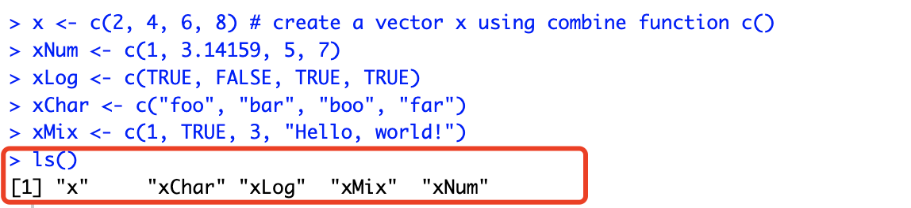
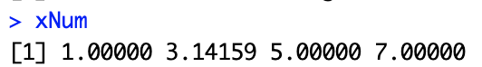
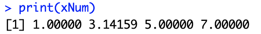
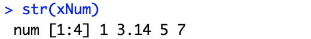
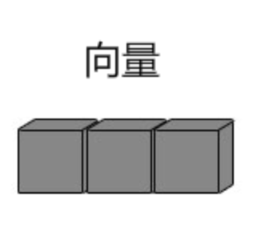
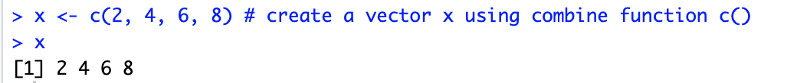
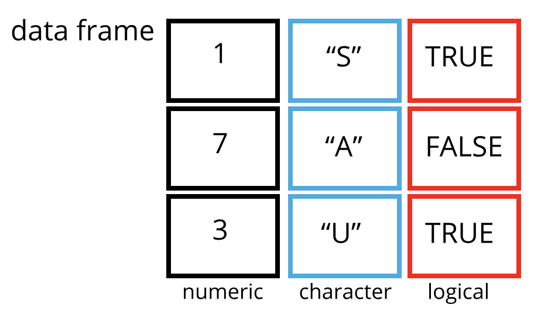

# 一、主要概念

## 1. 变量（variables）
#### 1.1 创造一个变量
```
# 使用等号 = 号赋值
> var1 = c(0,1,2,3)          
> print(var1)
[1] 0 1 2 3

# 使用左箭头 <- 赋值
> var2 <- c("learn","R")  
> print(var2)
[1] "learn" "R"
   
# 使用右箭头 -> 赋值
> c(TRUE,1) -> var3
> print(var3)
[1] 1 1          
```
#### 1.2 打印一下定义过的所有变量
```
# 打印现在已经定义了的变量
# 使用 ls() 命令, ls 其实就是 list 的缩写
```


#### 1.3 打印变量里的值
```
# 可以直接输入变量
xNum
```


```
# 也可以用print()
print(xNum)
```


```
# 或者用str()
[展示时可能会发生变化哦，比如小数点位数默认保留两位]
str(xNum)
```


## 2. 向量（vector）
#### 2.1 啥是向量 
一组<font color="#dd0000">**相同类型**</font>的元素的列表，比如都是数字，或者都是字符串  
是<font color="#dd0000">**一维**</font>的  

  
#### 2.2 创造一个向量  
```
# 使用c()命令
x <- c(2, 4, 6, 8) # create a vector x using combine function c()
```


#### 2.3 下标（index）   
既然是列表，那么其中的每个元素自然是要有序号的，但是和常见的其他编程语言不同，<font color="#dd0000">**元素序号是从1开始的！**</font><br />
```
> x <- c(2, 4, 6, 8) # create a vector x using combine function c()
> x
[1] 2 4 6 8
> x[1]
[1] 2
> x[4]
[1] 8
```
#### 2.4 NA（暂时不知道具体有啥用）
```
# 使用c()命令，可以用NA作为一个占位符，其实际值为空
x <- c(2, 4, NA, NA) 
```

## 3. 列表（list）
#### 3.1 和向量有什么不同？   
向量：一组<font color="#dd0000">**一维**</font>的<font color="#dd0000">**相同类型**</font>的元素的列表，比如都是数字，或者都是字符串  
数组：一组元素，可以包含<font color="#dd0000">**不同类型**</font>的元素，比如数字、字符串以及矩阵的混合。除了一维外，也可以是<font color="#dd0000">**多维**</font>的数组    
[感觉不如向量用得广泛]

```
# 列表变量赋值
> my_list <- list(matrix(c(1, 2, 3, 4), nrow = 2), c(5, 6, 7))

# 打印列表
> my_list # 数组里的第一个元素是矩阵
[[1]]
     [,1] [,2]
[1,]    1    3
[2,]    2    4

[[2]] # 数组里的第二个元素是向量
[1] 5 6 7

# 打印列表str()
> str(my_list)
List of 2
 $ : num [1:2, 1:2] 1 2 3 4
 $ : num [1:3] 5 6 7
```
#### 3.2 数组的命名   
```
# 1.1 直接创建一个列表
xList <- list(xNum, xChar) # method 1: create, then name 
# 1.2 给列表元素命名
names(xList) <- c("itemnum", "itemchar")

# 2. 创建列表的同时，直接给元素命名
xList <- list(itemnum=xNum, itemchar=xChar)
```
随后可以使用元素下标，或者命名后的name获取对应的元素
```
# 数组[下标]
> xList[[1]]
[1] 1.00000 3.14159 5.00000 7.00000
```

```
# 数组$名称
> xList$itemnum # method 2: $name reference
[1] 1.00000 3.14159 5.00000 7.00000
```

```
# 数组[[名称]]
> xList[["itemnum"]] # method 3: quoted name
[1] 1.00000 3.14159 5.00000 7.00000
```

## 4. 数据框 （Data frame）   
- 也有叫数据帧、数据表格的，感觉框表达的更形象

- 实际上可以理解为excel里存储的表格结构
```
# 创建一个data frame
df = data.frame(
    姓名 = c("张三", "李四", "王五"),
    工号 = c("001","002","003"),
    月薪 = c(1000, 2000, 3000)
    
)

print(df) # 查看 table 数据
  姓名 工号 月薪
1 张三  001 1000
2 李四  002 2000
3 王五  003 3000
```
- 而后可以通过多种操作，读取frame中的所需数据
```
# 平均工资(R语言支持中文)
> mean(df$月薪)
[1] 2000

# 也可以直接summary看整体数据
> summary(df$月薪)
   Min. 1st Qu.  Median    Mean 3rd Qu.    Max. 
   1000    1500    2000    2000    2500    3000
```

## 5. 依赖库（package）  
一些函数操作，是可以直接使用，不需要引入外部依赖库的，比如mean/min/max等基本计算。而另一些比较复杂的操作，需要引入外部package，使用package中对应的方法实现：
```
# 安装readxl库
install.packages(“readxl”)

# 引用readxl库
library("readxl")

# 借助readxl库读取excel数据，文件名为deospray sales.xls，sheet名为deospray
deospray.data <- read_excel(path = "deospray sales.xls", sheet = "deospray")
```

## 6. 函数（function）   
可以自定义一些func便于重复使用
```
se <- function(x){
    # computes standard error of the mean
    tmp.sd <- sd(x) # standard deviation
    tmp.N <- length(x) # sample size
    tmp.se <- tmp.sd / sqrt(tmp.N) #std error of the mean return(tmp.se)
}

se(store.df$store.visits)
```

# 二、数据读取 From excel/csv

## excel
```
library(readxl)
deospray.data <- read_excel(path = "deospray sales.xls", sheet = "deospray")
```

## csv
```
read.csv("Data_Descriptive.csv")
store.df <- read.csv("Data_descriptive.csv") 
# 将storeNum构建为R因子
store.df$storeNum <- factor(store.df$storeNum)
```

# 三、数据处理的汪洋大海～
