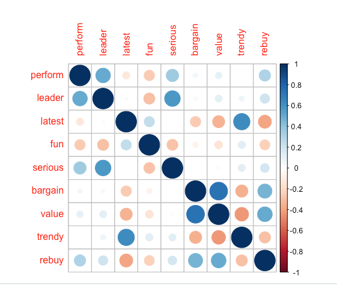
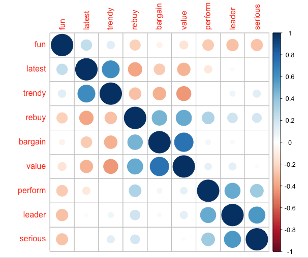
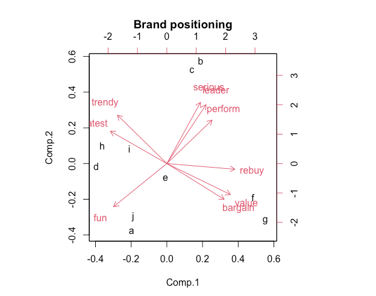
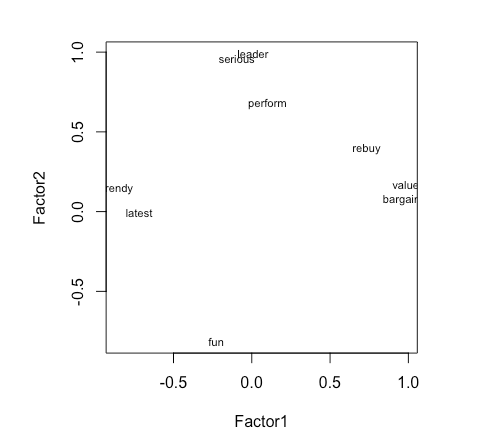
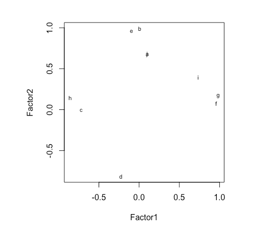

> R: 4.3.2 (2023-10-31)
> R studio: 2023.12.1+402 (2023.12.1+402)

## Brand rating data

```
> brand.ratings <- read.csv("Data_Factor_Analysis.csv", stringsAsFactors = TRUE) 

> head(brand.ratings)
  perform leader latest fun serious bargain value trendy rebuy brand
1       2      4      8   8       2       9     7      4     6     a
2       1      1      4   7       1       1     1      2     2     a
3       2      3      5   9       2       9     5      1     6     a
4       1      6     10   8       3       4     5      2     1     a
5       1      1      5   8       1       9     9      1     1     a
6       2      8      9   5       3       8     7      1     2     a

> summary(brand.ratings)
    perform           leader           latest            fun            serious          bargain           value            trendy          rebuy            brand    
 Min.   : 1.000   Min.   : 1.000   Min.   : 1.000   Min.   : 1.000   Min.   : 1.000   Min.   : 1.000   Min.   : 1.000   Min.   : 1.00   Min.   : 1.000   a      :100  
 1st Qu.: 1.000   1st Qu.: 2.000   1st Qu.: 4.000   1st Qu.: 4.000   1st Qu.: 2.000   1st Qu.: 2.000   1st Qu.: 2.000   1st Qu.: 3.00   1st Qu.: 1.000   b      :100  
 Median : 4.000   Median : 4.000   Median : 7.000   Median : 6.000   Median : 4.000   Median : 4.000   Median : 4.000   Median : 5.00   Median : 3.000   c      :100  
 Mean   : 4.488   Mean   : 4.417   Mean   : 6.195   Mean   : 6.068   Mean   : 4.323   Mean   : 4.259   Mean   : 4.337   Mean   : 5.22   Mean   : 3.727   d      :100  
 3rd Qu.: 7.000   3rd Qu.: 6.000   3rd Qu.: 9.000   3rd Qu.: 8.000   3rd Qu.: 6.000   3rd Qu.: 6.000   3rd Qu.: 6.000   3rd Qu.: 7.00   3rd Qu.: 5.000   e      :100  
 Max.   :10.000   Max.   :10.000   Max.   :10.000   Max.   :10.000   Max.   :10.000   Max.   :10.000   Max.   :10.000   Max.   :10.00   Max.   :10.000   f      :100  
                                                                                                                                                         (Other):400

> str(brand.ratings)
'data.frame':	1000 obs. of  10 variables:
 $ perform: int  2 1 2 1 1 2 1 2 2 3 ...
 $ leader : int  4 1 3 6 1 8 1 1 1 1 ...
 $ latest : int  8 4 5 10 5 9 5 7 8 9 ...
 $ fun    : int  8 7 9 8 8 5 7 5 10 8 ...
 $ serious: int  2 1 2 3 1 3 1 2 1 1 ...
 $ bargain: int  9 1 9 4 9 8 5 8 7 3 ...
 $ value  : int  7 1 5 5 9 7 1 7 7 3 ...
 $ trendy : int  4 2 1 2 1 1 1 7 5 4 ...
 $ rebuy  : int  6 2 6 1 1 2 1 1 1 1 ...
 $ brand  : Factor w/ 10 levels "a","b","c","d",..: 1 1 1 1 1 1 1 1 1 1 ...
```

|Perceptual adjective (column name)|Example survey text|
|---------------------------------|------------------|
|perform|Brand has a strong performance|
|leader|Brand is a leader in the field|
|latest|Brand has the latest products|
|fun|Brand is fun|
|serious|Brand is serious|
|bargain|Brand products are a bargain|
|value|Brand has a good value|
|trendy|Brand is trendy|
|rebuy|I would buy from Brand again|

### Rescaling the data

#### 标准化

```
> brand.sc <- brand.ratings

> brand.sc[,1:9] <- scale (brand.ratings[,1:9])

> #we select all rows and the first 9 columns as the 10th column is a factor variable. 
> summary(brand.sc)
    perform            leader            latest             fun              serious           bargain             value             trendy             rebuy             brand    
 Min.   :-1.0888   Min.   :-1.3100   Min.   :-1.6878   Min.   :-1.84677   Min.   :-1.1961   Min.   :-1.22196   Min.   :-1.3912   Min.   :-1.53897   Min.   :-1.0717   a      :100  
 1st Qu.:-1.0888   1st Qu.:-0.9266   1st Qu.:-0.7131   1st Qu.:-0.75358   1st Qu.:-0.8362   1st Qu.:-0.84701   1st Qu.:-0.9743   1st Qu.:-0.80960   1st Qu.:-1.0717   b      :100  
 Median :-0.1523   Median :-0.1599   Median : 0.2615   Median :-0.02478   Median :-0.1163   Median :-0.09711   Median :-0.1405   Median :-0.08023   Median :-0.2857   c      :100  
 Mean   : 0.0000   Mean   : 0.0000   Mean   : 0.0000   Mean   : 0.00000   Mean   : 0.0000   Mean   : 0.00000   Mean   : 0.0000   Mean   : 0.00000   Mean   : 0.0000   d      :100  
 3rd Qu.: 0.7842   3rd Qu.: 0.6069   3rd Qu.: 0.9113   3rd Qu.: 0.70402   3rd Qu.: 0.6036   3rd Qu.: 0.65279   3rd Qu.: 0.6933   3rd Qu.: 0.64914   3rd Qu.: 0.5003   e      :100  
 Max.   : 1.7206   Max.   : 2.1404   Max.   : 1.2362   Max.   : 1.43281   Max.   : 2.0434   Max.   : 2.15258   Max.   : 2.3610   Max.   : 1.74319   Max.   : 2.4652   f      :100  
                                                                                                                                                                      (Other):400
```
We can see the standardized variable has a mean of 0.00.

### Correlation
Correlations among variables show some variables are highly related to each other and potentially could be combined.
```
> cor(brand.sc[,1:9])
             perform      leader       latest        fun      serious     bargain       value       trendy      rebuy
perform  1.000000000  0.50020206 -0.122445813 -0.2563323  0.359172206  0.05712937  0.10194610  0.008733494  0.3066588
leader   0.500202058  1.00000000  0.026890447 -0.2903576  0.571215126  0.03309405  0.11831017  0.066512436  0.2087004
latest  -0.122445813  0.02689045  1.000000000  0.2451545  0.009951527 -0.25441902 -0.34271372  0.627627667 -0.3971802
fun     -0.256332316 -0.29035764  0.245154457  1.0000000 -0.281097443 -0.06655280 -0.14521849  0.127973639 -0.2371607
serious  0.359172206  0.57121513  0.009951527 -0.2810974  1.000000000 -0.00265559  0.02375656  0.121009377  0.1807027
bargain  0.057129372  0.03309405 -0.254419016 -0.0665528 -0.002655590  1.00000000  0.73962672 -0.350533746  0.4673811
value    0.101946104  0.11831017 -0.342713717 -0.1452185  0.023756556  0.73962672  1.00000000 -0.434534536  0.5059617
trendy   0.008733494  0.06651244  0.627627667  0.1279736  0.121009377 -0.35053375 -0.43453454  1.000000000 -0.2982462
rebuy    0.306658801  0.20870036 -0.397180225 -0.2371607  0.180702720  0.46738109  0.50596166 -0.298246195  1.0000000
```
```
corrplot(cor(brand.sc[,1:9]))
```


<div style="background-color:#f0f0f0; padding:10px;">

> corrplot()

corrplot 是 R 语言中用于可视化相关系数矩阵的函数。它提供了丰富的功能，可以创建各种类型的相关系数图，以帮助理解和分析变量之间的相关性。

```
corrplot(
  M,                  # 相关系数矩阵
  method = "circle",  # 相关系数图的类型，可以是 "circle", "square", "ellipse", "number", "shade", "color", "pie" 等
  type = "full",      # 相关系数类型，可以是 "full", "upper", "lower"，默认是 "full"
  tl.col = "black",   # 文本标签的颜色
  tl.srt = 45,        # 文本标签的旋转角度
  diag = FALSE,       # 是否显示对角线元素
  addgrid.col = "gray", # 是否添加网格线，网格线的颜色
  order = "original", # 相关系数的排序方式，可以是 "original", "alphabet", "hclust", "FPC", "color" 等
  addrect = 2,        # 添加矩形边框的类型和颜色，0表示不添加，1表示默认颜色，2表示自定义颜色
  rect.col = "black", # 矩形边框的颜色
  bg = "white",       # 相关系数图的背景颜色
  mar = c(0,0,2,0),   # 图的边缘空白
  cl.lim = c(-1, 1),  # 相关系数的颜色范围
  cl.pos = "n",       # 相关系数的颜色条位置
  addCoef.col = "black", # 系数的颜色
总结一下，当您希望跨多个维度比较几个品牌时，将注意力集中在解释数据变异的前两个或三个主成分上可能会有所帮助。您可以使用屏幕图选择要关注的主成分数量，该图显示了每个主成分解释数据中的多少变化。感知地图将品牌绘制在前两个主成分上，揭示了观察结果与潜在维度（即成分）的关系。

PCA可以使用品牌调查评分（如我们在此处所做的）进行，也可以使用价格和物理测量等客观数据，或者二者的组合进行。无论在哪种情况下，当您面对品牌或产品的多维数据时，PCA可视化都是了解市场差异的有用工具。  addCoefasPercent = TRUE, # 是否以百分比形式显示系数
  outline = TRUE,     # 是否显示相关系数的外框
  number.cex = 0.8,  # 数字标签的大小
  ...)
```

corrplot 函数的主要参数包括：

- M：一个数值型的矩阵，其中存储了相关系数。
- method：指定要绘制的相关系数图的类型，可以是 "circle"、"square"、"ellipse"、"number"、"shade"、"color"、"pie" 等。
- 其中，x是包含原始数据的数据框或矩阵，...是其他参数，用于控制主成分分析的过程，例如是否进行变量标准化等。

princomp() 函数返回一个主成分分析结果的对象，该对象包含了主成分分析的各种信息，包括主成分分数、主成分载荷、方差解释比例等。可以使用summary()函数对主成分分析结果进行摘要统计，或者直接访问返回的对象的成分来获取相关信息。type：相关系数类型，可以是 "full"、"upper"、"lower"，默认是 "full"，表示绘制全部相关系数。
- tl.col：文本标签的颜色。
- tl.srt：文本标签的旋转角度。
- diag：是否显示对角线元素。
- order：相关系数的排序方式，可以是 "original"、"alphabet"、"hclust"、"FPC"、"color" 等。
- cl.lim：相关系数的颜色范围。
- addCoefasPercent：是否以百分比形式显示系数。

</div>

```
## use the optional argument (order = “hclust”) to order variables for better visualization
corrplot(cor(brand.sc[,1:9]), order = "hclust")
```



The result shows that some of the ratings are highly related to each other so that they could be represented by common factors.

### Mean rating by brand

#### aggregate()

```
> brand.mean <- aggregate(. ~ brand, data=brand.sc, mean) 

> brand.mean
   brand     perform     leader     latest        fun     serious     bargain       value      trendy       rebuy
1      a -0.88591874 -0.5279035  0.4109732  0.6566458 -0.91894067  0.21409609  0.18469264 -0.52514473 -0.59616642
2      b  0.93087022  1.0707584  0.7261069 -0.9722147  1.18314061  0.04161938  0.15133957  0.74030819  0.23697320
3      c  0.64992347  1.1627677 -0.1023372 -0.8446753  1.22273461 -0.60704302 -0.44067747  0.02552787 -0.13243776
4      d -0.67989112 -0.5930767  0.3524948  0.1865719 -0.69217505 -0.88075605 -0.93263529  0.73666135 -0.49398892
5      e -0.56439079  0.1928362  0.4564564  0.2958914  0.04211361  0.55155051  0.41816415  0.13857986  0.03654811
6      f -0.05868665  0.2695106 -1.2621589 -0.2179102  0.58923066  0.87400696  1.02268859 -0.81324496  1.35699580
7      g  0.91838369 -0.1675336 -1.2849005 -0.5167168 -0.53379906  0.89650392  1.25616009 -1.27639344  1.36092571
8      h -0.01498383 -0.2978802  0.5019396  0.7149495 -0.14145855 -0.73827529 -0.78254646  0.86430070 -0.60402622
9      i  0.33463879 -0.3208825  0.3557436  0.4124989 -0.14865746 -0.25459062 -0.80339213  0.59078782 -0.20317603
10     j -0.62994504 -0.7885965 -0.1543180  0.2849595 -0.60218870 -0.09711188 -0.07379367 -0.48138267 -0.96164748

> rownames(brand.mean) <- brand.mean[, 1]

> # Use brand for the row name
> brand.mean <- brand.mean [, -1]

> # Remove the brand name column by not selecting the first column # Negative index is used to exclude the variable
> brand.mean
      perform     leader     latest        fun     serious     bargain       value      trendy       rebuy
a -0.88591874 -0.5279035  0.4109732  0.6566458 -0.91894067  0.21409609  0.18469264 -0.52514473 -0.59616642
b  0.93087022  1.0707584  0.7261069 -0.9722147  1.18314061  0.04161938  0.15133957  0.74030819  0.23697320
c  0.64992347  1.1627677 -0.1023372 -0.8446753  1.22273461 -0.60704302 -0.44067747  0.02552787 -0.13243776
d -0.67989112 -0.5930767  0.3524948  0.1865719 -0.69217505 -0.88075605 -0.93263529  0.73666135 -0.49398892
e -0.56439079  0.1928362  0.4564564  0.2958914  0.04211361  0.55155051  0.41816415  0.13857986  0.03654811
f -0.05868665  0.2695106 -1.2621589 -0.2179102  0.58923066  0.87400696  1.02268859 -0.81324496  1.35699580
g  0.91838369 -0.1675336 -1.2849005 -0.5167168 -0.53379906  0.89650392  1.25616009 -1.27639344  1.36092571
h -0.01498383 -0.2978802  0.5019396  0.7149495 -0.14145855 -0.73827529 -0.78254646  0.86430070 -0.60402622
i  0.33463879 -0.3208825  0.3557436  0.4124989 -0.14865746 -0.25459062 -0.80339213  0.59078782 -0.20317603
j -0.62994504 -0.7885965 -0.1543180  0.2849595 -0.60218870 -0.09711188 -0.07379367 -0.48138267 -0.96164748

```

Then we can visualize this matrix by using a heat map :

```
heatmap.2(as.matrix(brand.mean),main = "Brand attributes", trace = "none", key = FALSE, dend = "none") #turn off some options
```

颜色越浅表示值越高，颜色越深表示值越低。我们可以看到，品牌的感知明显不同，一些品牌在performance、leader方面得分很高(品牌b和c)，而另一些品牌在value和rebuy方面得分很高(品牌f和g)。    
从相关图和热图图中，我们可以猜测形容词和品牌的分组和关系。例如，bargin/value/rebuy的各栏的颜色模式有相似之处。接下来我们将正式阐述这种见解。

## 2 Principal component analysis (PCA) using princomp()

princomp()函数产生未旋转的主成分分析。  

您可以使用原始的个人评分数据brand.sc或聚合的平均评分数据brand.mean。个体受访者评分的图表可能会过于密集，可能无法清楚地告诉我们有关品牌位置的信息！更好的解决方案是使用按品牌聚合的评分执行PCA。  

### PCA

```
> brand.pc<- princomp(brand.mean, cor = TRUE)

> #We added "cor =TRUE" to use correlation-based one. 
> summary(brand.pc)
Importance of components:
                         Comp.1    Comp.2     Comp.3     Comp.4    Comp.5     Comp.6      Comp.7      Comp.8       Comp.9
Standard deviation     2.134521 1.7349473 0.76898915 0.61498280 0.5098261 0.36661576 0.215062433 0.145882355 0.0486674686
Proportion of Variance 0.506242 0.3344491 0.06570492 0.04202265 0.0288803 0.01493412 0.005139094 0.002364629 0.0002631692
Cumulative Proportion  0.506242 0.8406911 0.90639603 0.94841868 0.9772990 0.99223311 0.997372202 0.999736831 1.0000000000
```

<div style="background-color:#f0f0f0; padding:10px;">

> princomp()

princomp() 函数是R语言中用于进行主成分分析（PCA）的函数之一。它可以用于对数据进行降维，找出数据中的主要方向或主成分，从而简化数据并提取关键特征。  

其中，x是包含原始数据的数据框或矩阵，...是其他参数，用于控制主成分分析的过程，例如是否进行变量标准化等。  

princomp() 函数返回一个主成分分析结果的对象，该对象包含了主成分分析的各种信息，包括主成分分数、主成分载荷、方差解释比例等。可以使用summary()函数对主成分分析结果进行摘要统计，或者直接访问返回的对象的成分来获取相关信息。  

</div>

```
plot(brand.pc,type="l") # scree plot
```


发生在图线出现拐点的地方，在上图中，拐点出现在第三个组件处。这表明前两个组件解释了观察到的品牌评分中大部分的变异。

```
> loadings(brand.pc) # pc loadings

Loadings:
        Comp.1 Comp.2 Comp.3 Comp.4 Comp.5 Comp.6 Comp.7 Comp.8 Comp.9
perform  0.285  0.337  0.481  0.470  0.396  0.435                     
leader   0.247  0.457 -0.317 -0.191         0.119 -0.610         0.451
latest  -0.356  0.251 -0.496  0.275  0.461        -0.196 -0.119 -0.466
fun     -0.336 -0.335 -0.152  0.324 -0.388  0.636 -0.246  0.179       
serious  0.212  0.475 -0.244 -0.212 -0.394  0.334  0.439        -0.407
bargain  0.361 -0.278 -0.459  0.291  0.112  0.127  0.319 -0.513  0.321
value    0.401 -0.241 -0.336         0.206                0.778       
trendy  -0.311  0.375         0.484 -0.273 -0.339  0.322  0.243  0.410
rebuy    0.430                0.442 -0.438 -0.368 -0.352 -0.142 -0.372

               Comp.1 Comp.2 Comp.3 Comp.4 Comp.5 Comp.6 Comp.7 Comp.8 Comp.9
SS loadings     1.000  1.000  1.000  1.000  1.000  1.000  1.000  1.000  1.000
Proportion Var  0.111  0.111  0.111  0.111  0.111  0.111  0.111  0.111  0.111
Cumulative Var  0.111  0.222  0.333  0.444  0.556  0.667  0.778  0.889  1.000
```

<div style="background-color:#f0f0f0; padding:10px;">

> loadings()

通常用于提取主成分分析（PCA）结果中的主成分载荷。主成分载荷是描述主成分与原始变量之间相关性的系数，它告诉我们每个主成分与每个原始变量之间的关系强度和方向。  

```
loadings(object)
```

其中，object是进行主成分分析后返回的结果对象，通常是使用princomp()或prcomp()函数进行主成分分析后得到的对象。  

loadings()函数会返回一个矩阵，其中的行表示原始变量，列表示主成分。矩阵中的元素是主成分载荷，表示每个主成分与对应原始变量之间的相关系数。  

</div>

### Visualising PCA (perceptual map)

biplot()是关于前两个PCA成分的数据点的二维图。它展示了评分形容词之间的关联。对平均评分的PCA解的biplot提供了可解释的感知图，显示了品牌相对于前两个主成分的位置。  

```
biplot(brand.pc, main = "Brand positioning")
```



The result shows the adjective map in four regions:  
• category leadership: “serious”, “leader”, and “perform”  
• category value: “rebuy”, “value”, and “bargain”  
• category trendiness: “trendy” and “latest”  
• category fun: “fun”  

What does the map tell us? First, we interpret the adjective clusters and relationships and see four areas with well-differentiated sets of adjectives and brands that are positioned in proximity. Brands f and g are high on “value”, while brands a and j are relatively high on fun, which is opposite in direction from leadership adjectives (“leader” and “serious”).   

<div style="background-color:#f0f0f0; padding:10px;">

假设您是品牌e的品牌经理，地图告诉您什么？  

您的品牌位于中心，因此在任何维度上似乎都没有很好的差异化。这可能是好事，也可能是坏事，这取决于您的战略目标。  

关于您的品牌e的位置，您应该怎么做？  

再次强调，这取决于战略目标。如果您希望增加差异化，一种可能性是采取行动将您的品牌朝地图上的某个方向移动。  

</div>

- 假设您希望朝品牌c的方向移动

您可以查看数据中与c的具体差异：

```
> brand.mean["c",] - brand.mean["e",]
   perform    leader     latest       fun  serious   bargain      value    trendy      rebuy
c 1.214314 0.9699315 -0.5587936 -1.140567 1.180621 -1.158594 -0.8588416 -0.113052 -0.1689859
```

这表明在“value”和“fun”方面，e相对于c更强，     
而在“perform”和“serious”方面则比c弱。   
这些可能是e需要努力改进的产品或信息方面。   

- 另一个选择是瞄准一个没有品牌定位的差异化空间

在图中，右下角和右上角之间有一个很大的间隙。这个区域可以被描述为“value leader”区域或类似的区域。我们如何找出如何定位在那里呢？  
让我们假设这个间隙大致反映了那四个品牌（g、f、c和b）的平均值。我们可以使用colMeans()在品牌的行上找到平均值，然后将e与该平均值相比较：

```
> colMeans(brand.mean[c("b","c","f","g"),]) - brand.mean["e",]
   perform    leader     latest        fun   serious    bargain      value     trendy     rebuy
e 1.174513 0.3910396 -0.9372789 -0.9337707 0.5732131 -0.2502787 0.07921355 -0.4695304 0.6690661
```

这表明品牌e可以通过增加对性能的重视，同时减少对“最新”和“乐趣”的重视来瞄准这个间隙。

## Factor analysis using factanal() *

factanal()函数执行最大似然因子分析。

<div style="background-color:#f0f0f0; padding:10px;">

> factanal()

factanal()函数是R语言中用于执行因子分析（Factor Analysis）的函数之一。因子分析是一种多变量统计方法，用于探索多个变量之间的内在结构和关联关系，它试图通过发现潜在的不可观测的因子来解释变量之间的相关性。

基本语法如下：

```
factanal(x, factors, data, ...)
```

其中：

- x 是包含原始数据的数据框或矩阵。
- factors 是要提取的因子数量，可以是一个整数或一个因子提取方法，如"ML"表示最大似然估计法。
- data 是包含原始数据的数据框，如果在x中指定了变量名，可以不使用该参数。
- ... 是其他参数，用于指定因子分析的一些选项，例如旋转方法、提取方法等。

factanal()函数返回一个包含因子分析结果的对象，其中包括提取的因子、因子载荷、特征值等信息。可以使用print()或summary()函数来查看因子分析结果的摘要信息。

> 最大似然因子分析（Maximum Likelihood Factor Analysis）

是因子分析（Factor Analysis）的一种参数估计方法。在最大似然因子分析中，通过最大化观察数据的似然函数来估计因子载荷、因子方差和误差方差等参数，以获得对数据结构的最佳解释。  

最大似然因子分析假设观察数据服从多变量正态分布，并试图找出能够最大程度地解释数据变异的潜在因子。具体来说，它假设每个观察数据是由一个线性组合的因子和误差项组成，并尝试找出最合适的因子载荷，使得模型对观察数据的拟合最优。   

在最大似然因子分析中，通常会使用EM算法（期望最大化算法）来估计模型参数，其中EM算法的目标是在每次迭代中最大化观察数据的似然函数，通过交替地进行E步骤（Expectation Step）和M步骤（Maximization Step）来达到这个目标。  

最大似然因子分析是一种常用的因子分析方法，它通常用于探索多个变量之间的潜在结构，并识别出能够解释观察数据变异的重要因子。   

</div>

### Determine the factor number

首先要确定要估计的因子数量。有各种方法可以做到这一点，其中两种传统方法是使用screen plot，以及保留特征值（用于解释方差比例的指标）大于1.0的因子。特征值为1.0对应于可能归因于单个自变量的方差量；捕获比此类项更少方差的因子可能被认为相对不重要。   

screen plot和eigenvalues可以通过使用nFactors中的nScree()函数从分析中正式获得。   

```
> nScree(brand.mean)
  noc naf nparallel nkaiser
1   2   2         2       2

> eigen(cor(brand.mean))
eigen() decomposition
$values
[1] 4.556177847 3.010042148 0.591344314 0.378203844 0.259922697 0.134407115 0.046251850 0.021281662 0.002368523

$vectors
            [,1]        [,2]        [,3]        [,4]        [,5]        [,6]        [,7]         [,8]         [,9]
 [1,] -0.2852486 -0.33729698  0.48121446  0.46995620  0.39623804  0.43471514 -0.02784431  0.074243080  0.012984626
 [2,] -0.2473668 -0.45654557 -0.31711577 -0.19084693 -0.06130157  0.11868317  0.60997229  0.021119910  0.450594077
 [3,]  0.3562989 -0.25056983 -0.49589600  0.27477470  0.46061874 -0.08173299  0.19587019 -0.119316063 -0.466262266
 [4,]  0.3355152  0.33455495 -0.15167546  0.32394053 -0.38757837  0.63609709  0.24602385  0.179248006 -0.008094488
 [5,] -0.2121240 -0.47463096 -0.24371327 -0.21229430 -0.39428137  0.33437227 -0.43881277  0.005157446 -0.406716076
 [6,] -0.3613409  0.27776101 -0.45940272  0.29120398  0.11248446  0.12716342 -0.31905166 -0.512721569  0.320827507
 [7,] -0.4010778  0.24062869 -0.33576144  0.05052374  0.20581208 -0.08329187 -0.08325891  0.778125659 -0.065102236
 [8,]  0.3114405 -0.37521575 -0.08724910  0.48392969 -0.27261916 -0.33925412 -0.32150758  0.243224760  0.410460300
 [9,] -0.4295359  0.04438337  0.09031492  0.44234693 -0.43824713 -0.36828116  0.35159046 -0.141872872 -0.371841553

nScree()应用了几种方法来从屏幕测试中估计因子的数量。
```

<div style="background-color:#f0f0f0; padding:10px;">

> nScree()

用于绘制Scree Plot（屏幕图），以帮助确定因子分析中的因子数量。

基本语法是：

```
nScree(fit)
```

其中，fit是一个包含因子分析结果的对象，通常是使用nFactors包中的fa()函数进行因子分析后得到的结果。  

此函数将会绘制一个Scree Plot，图中横轴表示因子数量，纵轴表示特征值（eigenvalue），并且可以根据特征值的变化趋势来帮助确定合适的因子数量。通常，我们会观察Scree Plot中特征值开始急剧下降的位置，这个位置之前的因子数量通常被认为是适当的因子数量。   

在您的情况下，您使用nScree(brand.mean)，其中brand.mean是您的数据，将会绘制一个Scree Plot来帮助您确定适当的因子数量。您可以根据Scree Plot的结果来选择合适的因子数量，以便在因子分析中获得最佳的解释力和简化度。   

> eigen()

eigen() 函数是R语言中用于计算矩阵特征值（eigenvalues）和特征向量（eigenvectors）的函数。在因子分析中，它通常用于计算相关矩阵的特征值和特征向量，以便进行主成分分析或因子分析。  

```
eigen(x)
```
其中，x是一个方阵，可以是一个相关矩阵或协方差矩阵。   

eigen()函数返回一个列表，其中包含了两个元素：  

- $values：一个向量，包含了矩阵的特征值。
- $vectors：一个矩阵，每一列是矩阵的一个特征向量。  

这些特征值和特征向量可以用于进行主成分分析（PCA）或因子分析（FA），以及其他需要计算矩阵特征值和特征向量的分析方法。

</div>

最终模型的选择取决于它是否有用。最佳实践是检查几个因子解决方案，包括scree和eigenvalues结果建议的解决方案。

```
> brand.fa <- factanal(brand.mean, factors = 2, rotation = "varimax", scores = "regression")

因子分析可以进行旋转，以具有解释相同方差比例的新载荷。factanal()中的默认设置是找到各因子之间的零相关性（使用varimax旋转）。
```

### Factor loadings

因子载荷是从载荷值中获得的。

```
> brand.fl<- brand.fa$loadings[, 1:2]
```

可以简单地使用因子载荷将变量绘制在两个因子上。例如：

```
> plot(brand.fl,type="n") # set up plot 

> text(brand.fl,labels=names(brand.mean),cex=.7)
```



### Factor scores

从factanal()请求因子得分是通过添加"scores = ..."参数实现的。然后，我们可以从生成的对象中提取它们以形成一个新的数据框。

```
brand.fs <- brand.fa$scores
```

我们可以简单地使用因子得分将品牌绘制在两个因子上。例如：

```
> plot(brand.fl,type="n") # set up plot 

> text(brand.fl,labels=rownames(brand.mean),cex=.7)
```



## Recap

总结一下，当希望跨多个维度比较几个品牌时，将注意力集中在解释数据变异的前两个或三个主成分上可能会有所帮助。您可以使用屏幕图选择要关注的主成分数量，该图显示了每个主成分解释数据中的多少变化。感知地图将品牌绘制在前两个主成分上，揭示了观察结果与潜在维度（即成分）的关系。  

PCA可以使用品牌调查评分（如我们在此处所做的）进行，也可以使用价格和物理测量等客观数据，或者二者的组合进行。无论在哪种情况下，当您面对品牌或产品的多维数据时，PCA可视化都是了解市场差异的有用工具。

## Code

```
library("corrplot")
library("gplots")
library("nFactors")

brand.ratings <- read.csv("Data_Factor_Analysis.csv", stringsAsFactors = TRUE) 
head(brand.ratings)

summary(brand.ratings)

str(brand.ratings)

brand.sc <- brand.ratings
brand.sc[,1:9] <- scale (brand.ratings[,1:9])
#we select all rows and the first 9 columns as the 10th column is a factor variable. 
summary(brand.sc)

cor(brand.sc[,1:9])

corrplot(cor(brand.sc[,1:9]))

corrplot(cor(brand.sc[,1:9]), order = "hclust")

brand.mean <- aggregate(. ~ brand, data=brand.sc, mean) 

brand.mean

rownames(brand.mean) <- brand.mean[, 1]
## Use brand for the row name
brand.mean <- brand.mean [, -1]
## Remove the brand name column by not selecting the first column # Negative index is used to exclude the variable
brand.mean

heatmap.2(as.matrix(brand.mean),main = "Brand attributes", trace = "none", key = FALSE, dend = "none") #turn off some options

brand.pc<- princomp(brand.mean, cor = TRUE)
#We added "cor =TRUE" to use correlation-based one. 
summary(brand.pc)

plot(brand.pc,type="l") # scree plot

loadings(brand.pc) # pc loadings

biplot(brand.pc, main = "Brand positioning")

brand.mean["c",] - brand.mean["e",]

colMeans(brand.mean[c("b","c","f","g"),]) - brand.mean["e",]

nScree(brand.mean)

eigen(cor(brand.mean))

brand.fa <- factanal(brand.mean, factors = 2, rotation = "varimax", scores = "regression")

brand.fl<- brand.fa$loadings[, 1:2]

plot(brand.fl,type="n") # set up plot 

text(brand.fl,labels=names(brand.mean),cex=.7)

plot(brand.fl,type="n") # set up plot 
text(brand.fl,labels=rownames(brand.mean),cex=.7)
```
