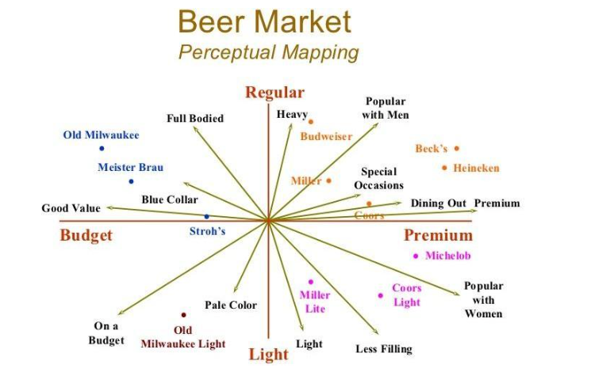

# Prepare

1. 收集数据：通过调查问卷收集目标消费者群体对选定品牌在关键属性上的评价。
2. 选择属性：确定哪些属性对目标消费者群体来说最重要。

# Perceptual mapping

感知映射，可视化现实消费者观点

## Factor Analysis

1. 数据简化，降维到少量factor，使用因子分析来减少属性的数量，只保留最能解释数据变异的因子。
2. 压缩成简短的相似特征，构建感知图。
3. 解释因子：根据属性的因子载荷（即属性与因子之间的相关性），解释每个因子代表的潜在概念。

## Create perceptual map

1. 选择因子：根据因子分析的结果，选择两个或三个最主要的因子来创建感知图。
2. 计算因子得分：为每个品牌计算每个因子的得分，这些得分将用于在感知图上定位品牌。
3. 绘制感知图：在一个二维平面上，以选定的因子为坐标轴，绘制每个品牌的点。

> Pearson相关系数（Pearson Correlation Coefficient）

是用来衡量两个变量之间线性相关程度的统计指标。其计算公式如下：

$$
r = \frac{\sum((x_i - \bar{x}) \cdot (y_i - \bar{y}))}{\sqrt{\sum(x_i - \bar{x})^2} \cdot \sqrt{\sum(y_i - \bar{y})^2}}
$$

相关系数的值范围从 -1 到 1，其中 -1 表示完全负相关，1 表示完全正相关，0 表示没有线性相关性。

# Explain

1. 分析品牌位置：观察品牌在感知图上的相对位置，了解它们在消费者心目中的优势和劣势。
2. 制定策略：基于感知图的结果，制定品牌定位策略，以改善品牌形象或区分竞争对手。

