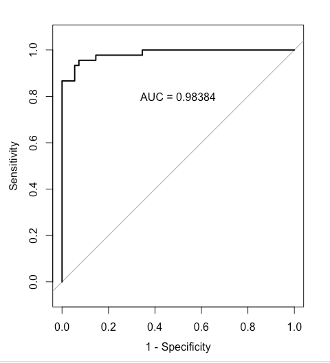

> R: 4.3.2 (2023-10-31)
> R studio: 2023.12.1+402 (2023.12.1+402)

Choice modeling 是一种市场研究方法，用于理解消费者在购买决策中做出选择的过程。这种方法使用数学模型来分析消费者如何根据不同的产品或服务特征做出选择，并量化这些选择的概率。通常，研究者会设计实验或调查来收集关于消费者对不同产品或服务的偏好和选择的数据，然后使用选择模型来解释这些数据。  

选择模型可以是基于参数的，比如概率模型（如逻辑回归）、偏好模型（如偏好函数）或效用模型（如福利函数）等；也可以是非参数的，比如决策树、随机森林等机器学习方法。这些模型能够帮助企业了解消费者对产品或服务的偏好，从而指导产品定价、市场定位、广告策略等决策。  

Marketers often observe yes/no outcomes:  
• Did a customer purchase a product?  
• Did a customer take a test drive?  
• Did a customer sign up for a credit card, renew her subscription, or respond to a promotion?  
All of these kinds of outcomes are binary because they have only two possible overserved states: yes or no. A logistic model is used to fit such outcomes.  

**这些类型的结果都是二元的，它们只有两种可能的状态：是或否。 logistic模型被用来拟合这样的结果。**

# 1. Basics of logistic regression

The core feature of a logistic model is that it relates the probability of an outcome to an exponential function of a predictor variable.  
By modelling the probability of an outcome, a logistic model accomplishes two things:  
• First, it more directly models what we are interested in, which is a probability or proportion, such as the likelihood of a given customer to purchase a product or the expected proportion of a segment who will respond to a promotion.  
• Second, it limits the model to the appropriate range for a proportion, which is [0, 1]. A basic linear model, as generated with lm(), does not have such a limit. The equation for the logistic function is:     
  
$$
p(y) = \frac{e^{v_x}}{e^{v_x} + 1} 
$$
  
Logistic模型的核心特征是它将结果的概率与预测变量的指数函数相关联。   
通过对结果的概率建模，logistic模型实现了两个目标。   
• 首先，它更直接地对我们感兴趣的内容进行建模，即概率或比例，例如给定客户购买产品的可能性或将对促销活动做出回应的细分预期比例。  
• 其次，它将模型限制在比例的适当范围内，即[0,1]。基本的线性模型，如lm()生成的模型，没有这样的限制。  

In this equation, the outcome of interest is y, and we compute its likelihood p(y) as a function of vx. We typically estimate vx as a function of the features (x) of a product, such as price. vx can take any real value, so we are able to treat it as a continuous function in a linear model. In that case, vx is composed of one or more coefficients of the model and indicates the importance of the corresponding features of the product.   

在这个方程中，我们感兴趣的结果是y，我们计算其概率p(y)作为vx的函数。我们通常将vx估计为产品特征（x）的函数，例如价格。vx可以取任何实数值，因此我们可以将其视为线性模型中的连续函数。在这种情况下，vx由模型的一个或多个系数组成，并指示产品相应特征的重要性。  

The formula gives a value between [0, 1]. The likelihood of y is less than 50% when vx is negative, is 50% when vx = 0 and is above 50% when vx is positive. We compute this first by hand and then switch to the equivalent plogis() function:  

这个公式给出了一个在[0, 1]之间的值。当vx为负时，y的概率小于50％，当vx = 0时，概率为50％，当vx为正时，概率大于50％。我们首先手工计算这个值，然后切换到等效的plogis()函数：  

```
> exp(0) / exp(0)+1 # computing logistic by hand, or using plogis()
•[1] 2

# plogis参数其实就是p(y)

> plogis(-Inf) #infinitely low = likelihood 0
[1] 0

> plogis(2) #moderate probability = 88% chance of outcome
[1] 0.8807971

> plogis(-0.2) # weak likelihood
[1] 0.450166
```

<div style="background-color:#f0f0f0; padding:10px;">

> plogis():

`plogis()` 函数是 R 语言中用于计算逻辑函数（logistic function）的函数。  

逻辑函数的定义如下所示：  

$$
\text{logistic}(x) = \frac{1}{1 + e^{-x}}
$$

其中，\(x\) 是逻辑函数的输入值。`plogis()` 函数接受一个参数 \(x\)，表示逻辑函数的输入值，然后返回逻辑函数的值。这个函数通常用于逻辑回归模型中，将线性预测值转换为0到1之间的概率值。  

在 R 中，你可以使用 `plogis()` 函数来计算逻辑函数的值。例如：  

```
# 计算逻辑函数值
x <- 2
probability <- plogis(x)
print(probability)
```

</div>

Such a model is known as a logit model, which determines the value of vx from the logarithm of the relative probability of occurence of y:  

$$
v_x = \log \left( \frac{p(y)}{1 - p(y)} \right)
$$

```
> log(0.88 / (1-0.88)) # moderate high likelihood
[1] 1.99243

> qlogis(0.88) # equivalent to hand computation
[1] 1.99243
```

<div style="background-color:#f0f0f0; padding:10px;">

> qlogis()

`qlogis()` 函数是 R 语言中用于计算逻辑函数的反函数的函数。  

逻辑函数的反函数通常称为逆逻辑函数，其定义如下所示：  

$$
\text{logit}(p) = \log\left(\frac{p}{1 - p}\right)
$$

其中，\( p \) 是逻辑函数的输出值，即概率值。  

`qlogis()` 函数接受一个参数 \( p \)，表示逻辑函数的输出值（即概率值），然后返回逆逻辑函数的值。这个函数通常用于从逻辑函数的概率值中反推出线性预测值。  

在 R 中，你可以使用 `qlogis()` 函数来计算逆逻辑函数的值。例如：  

```R
# 计算逆逻辑函数值
p <- 0.7
linear_pred <- qlogis(p)
print(linear_pred)
```

</div>

# 2. Generalised linear model (GLM)

A logistic regression model in R is fitted as a generalised linear model (GLM) using a process similar to linear regression with lm(), but with the difference that a GLM can handle dependent variables that are not normally distributed. Thus, GLM can be used to model data counts (such as the number of purchases), time intervals (such as time spent on a website), or binary variables (e.g., did/didn’t purchase). The common feature of all GLM models is that they relate normally distributed predictors to a non-normal outcome using a function known as a link. This means that they are able to fit models for many different distributions using a single, consistent framework.  

在R中，逻辑回归模型是作为广义线性模型（GLM）进行拟合的，使用的过程类似于使用lm()进行线性回归，但不同之处在于GLM可以处理不符合正态分布的因变量。因此，GLM可用于对数据计数（例如购买次数）、时间间隔（例如在网站上的停留时间）或二元变量（例如是否购买）建模。所有GLM模型的共同特点是它们将正态分布的预测变量与一个非正态的结果相关联，使用的函数称为链接函数。这意味着它们能够使用单一、一致的框架拟合许多不同分布的模型。  

<div style="background-color:#f0f0f0; padding:10px;">

广义线性模型（Generalized Linear Model，GLM）是一种广泛应用于统计分析中的模型，它将线性模型扩展到了更广泛的数据类型和分布。GLM可以处理不同类型的响应变量，包括二项分布、泊松分布、正态分布等，并且可以处理不同的链接函数，如恒等函数、对数函数、逻辑斯蒂函数等。  

GLM的基本形式如下：  

1. 线性部分：   

$$
\eta = \beta_0 + \beta_1 x_1 + \beta_2 x_2 + \ldots + \beta_p x_p 
$$

   这部分与多元线性回归模型相似，其中 $ \eta $ 是线性预测值，$ \beta_0 $ , $ \beta_1 $ , $ \ldots $, $ \beta_p $ 是系数，$ x_1 $ , $ x_2 $ , $ \ldots $, $ x_p $ 是预测变量。

2. 链接函数：  

$$ g(\mu) = \eta $$

   这里的 $ g(\cdot) $ 是链接函数，它定义了预测变量 $ \eta $ 与响应变量 $ \mu $ 之间的关系。链接函数通常根据响应变量的类型选择，如对数链接函数用于处理泊松分布的响应变量，逻辑斯蒂链接函数用于处理二项分布的响应变量等。

3. 分布族：  

$$ Y \sim \text{Dist}(\mu) $$

   这里的 $ \text{Dist}(\mu) $ 表示响应变量 Y 的分布族，$ \mu $ 是响应变量的均值。

GLM的优势在于它的灵活性和适用性，可以适应不同类型和分布的数据，同时保持了对参数的解释性。它在许多领域都得到了广泛应用，包括生物统计学、医学、社会科学等。

</div>

# 3. RFM (recency, frequency, monetary)

RFM is a method used for analyzing customer value. RFM stands for the three dimensions: Recency: How recently did the customer purchase? Frequency: How often do they purchase? Monetary Value: How much do they spend?  

RFM是用于分析客户价值的一种方法。RFM代表三个维度：Recency（最近购买时间）：客户最近一次购买是在多久之前？Frequency（购买频率）：他们购买的频率如何？Monetary Value（购买金额）：他们的消费金额是多少？  

## 3.1 The Logit Model
The logit model restricts the output values to lie in [0, 1] intervals.  
Specifically, it expresses the probability of purchase by customer i as a function of coefficients β0:3 and variables in the following manner:  

逻辑斯蒂模型将输出值限制在[0, 1]的区间内。
具体而言，它将客户i的购买概率表达为系数β0:3和以下变量的函数：  

$$
P(Purchase_i) = \frac{exp(\beta_0 + \beta_1 \text{Recency}_i + \beta_2 \text{Frequency}_i + \beta_3 \text{Monetary}_i)}{exp(\beta_0 + \beta_1 \text{Recency}_i + \beta_2 \text{Frequency}_i + \beta_3 \text{Monetary}_i) + 1}
$$

<div style="background-color:#f0f0f0; padding:10px;">

这个公式是一个逻辑回归模型中用于计算购买概率的方程。在这个方程中：

- $ P(Purchase_i) $ 表示第 i 个个体购买的概率。
- $ \beta_0 $, $ \beta_1 $, $ \beta_2 $, $ \beta_3 $ 是模型的参数，分别表示截距和与每个预测变量（Recency、Frequency、Monetary）相关的系数。
- $ \text{Recency}_i $, $ \text{Frequency}_i $, $ \text{Monetary}_i $ 是第 i 个个体的预测变量值，分别表示最近一次购买距离、购买频率和购买金额。

公式的分子部分表示了一个线性组合$ (\beta_0 + \beta_1 \text{Recency}_i + \beta_2 \text{Frequency}_i + \beta_3 \text{Monetary}_i) $ 的指数形式，即指数函数 $ \text{exp}(\ldots) $ ，代表了购买的可能性。

分母部分是分子部分加上1，这是由于逻辑回归模型的形式，保证了概率值在0和1之间。整个方程实际上是逻辑回归模型的逻辑函数（logistic function），它将线性预测值转换为0到1之间的概率值，这表示个体购买的概率。

</div>

Intuitively, the utility of choosing to buy is:  

$$ V_{bi} = \beta_0 + \beta_1 \text{Recency}_i + \beta_2 \text{Frequency}_i + \beta_3 \text{Monetary}_i $$

<div style="background-color:#f0f0f0; padding:10px;">

这个公式表示了一个线性模型，用于预测个体 i 的 $ V $ 值。在这个公式中：

- $ V_{bi} $ 表示个体 $ i $ 的 $ V $ 值。
- $ \beta_0, \beta_1, \beta_2, \beta_3 $ 是模型的参数，分别表示截距和与每个预测变量（Recency、Frequency、Monetary）相关的系数。
- $ \text{Recency}_i, \text{Frequency}_i, \text{Monetary}_i $ 第 $ i $ 个个体的预测变量值，分别表示最近一次购买距离、购买频率和购买金额。

这个模型的目的是通过个体的购买行为的相关特征（Recency、Frequency、Monetary）来预测他们的 $ V $ 值。这个 $ V $ 值可能表示个体的潜在价值或其他相关的指标。  

whereas utility of choosing not to buy is normalized to zero $ V_ni = 0 $, so $ exp(V_n) = exp(0) = 1 $ in the fraction above.  
With the given formulation, we can estimate values $ \beta_0:3 $ that fit the data best. We use glm() of family=“binomial”.  

选择不购买的效用被归一化为零，即 Vni = 0，因此在上述分数中 exp(Vn) = exp(0) = 1。  
通过给定的公式，我们可以估计最适合数据的 β0:3 值。我们使用 glm() 中的 family="binomial"。  

</div>

```
> RFMdata <- read.csv(file = "RFMData.csv",row.names=1) 

> head(RFMdata,5)
  Recency Frequency Monetary Purchase
1     120         7    41.66        0
2      90         9    46.71        0
3     120         6   103.99        1
4     270        17    37.13        1
5      60         5    88.92        0

> model <- glm(Purchase~Recency+Frequency+Monetary, data=RFMdata, family = "binomial") 

> output <- cbind(coef(summary(model))[, 1:4],exp(coef(model)))

> colnames(output) <- c("beta","SE","z val.","Pr(>|z|)",'exp(beta)') 

> kable(output,caption = "Logistic regression estimates")


Table: Logistic regression estimates

|            |        beta|        SE|    z val.| Pr(>&#124;z&#124;)| exp(beta)|
|:-----------|-----------:|---------:|---------:|------------------:|---------:|
|(Intercept) | -30.2976692| 8.5522913| -3.542638|          0.0003961|  0.000000|
|Recency     |   0.1114175| 0.0309797|  3.596464|          0.0003226|  1.117862|
|Frequency   |   0.5941268| 0.2429393|  2.445577|          0.0144620|  1.811448|
|Monetary    |   0.1677054| 0.0465645|  3.601572|          0.0003163|  1.182588|
```

> glm()
<div style="background-color:#f0f0f0; padding:10px;">
glm() 函数是 R 语言中的一个重要函数，用于拟合广义线性模型（Generalized Linear Models）。广义线性模型是线性模型的扩展，允许因变量服从不同的分布，而不仅仅是正态分布。这使得广义线性模型适用于更广泛的数据类型，包括二项分布（二元逻辑回归）、泊松分布（计数数据）、多项分布（多类别分类）等。
</div>

> cbind()
<div style="background-color:#f0f0f0; padding:10px;">
cbind() 函数是 R 语言中的一个基础函数，用于按列合并多个对象（通常是向量、矩阵或数据框）。cbind 是 "column bind" 的缩写，表示按列合并。
</div>

> kable()
<div style="background-color:#f0f0f0; padding:10px;">
kable() 函数是 R 语言中 knitr 和 rmarkdown 包中的一个函数，用于生成美观的表格输出。它能够将 R 中的数据框、矩阵或表格转换为 Markdown 或 LaTeX 格式的表格，从而方便地将其插入到 R Markdown 文档或 HTML 页面中。
</div>

We also run the likelihood ratio test with H0 : β1 = β2 = β3 = 0 – to make sure our full logit model offers a significantly better fit than the model with just an intercept. We find that χ2 = 107.14 and P(> |Chi|) ≈ 0, so we reject H0.  

我们还进行了似然比检验，假设 H0：β1 = β2 = β3 = 0，以确保我们的完整 logit 模型提供了显着更好的拟合效果，而不仅仅是一个截距模型。我们发现 χ2 = 107.14，P(> |Chi|) ≈ 0，因此我们拒绝 H0。  

<div style="background-color:#f0f0f0; padding:10px;">

这句话表明了对全模型（含有Recency、Frequency、Monetary预测变量）和只有截距项的模型之间进行了似然比检验。在似然比检验中，原假设 $ H_0 $ 是模型中所有预测变量的系数都为零，即 $ \beta_1 = \beta_2 = \beta_3 = 0 $，即只有截距项。备择假设 $ H_1 $ 是至少有一个预测变量的系数不为零，即全模型。  

通过似然比检验，可以确定是否全模型相对于只有截距项的模型提供了更好的拟合。在这种情况下，通过计算得到的卡方统计量 $ \chi^2 $ 为107.14，对应的P值非常接近于0，通常小于显著性水平（例如0.05）。由于P值小于显著性水平，我们拒绝原假设 $ H_0 $，即认为全模型的拟合效果显著地优于只有截距项的模型。  

</div>

```
> # likelihood ratio test
> reduced.model <- glm(Purchase ~ 1, data=RFMdata, family = "binomial") 

> kable(xtable(anova(reduced.model, model, test = "Chisq")),caption = "Likelihood ratio test")


Table: Likelihood ratio test

| Resid. Df| Resid. Dev| Df| Deviance| Pr(>Chi)|
|---------:|----------:|--:|--------:|--------:|
|        99|  137.62776| NA|       NA|       NA|
|        96|   30.48715|  3| 107.1406|        0|
```

## 3.2 Predicting probabilities

Now we calculate $ P(Purchase_i) $ for each individual in the data set.  

现在我们计算数据集中每个个体的购买概率$ P(Purchase_i) $。  

```
> # calculate logit probabilities
> RFMdata$Base.Probability <- predict(model, RFMdata, type="response") 

> kable(head(RFMdata,5),row.names = TRUE)


|   | Recency| Frequency| Monetary| Purchase| Base.Probability|
|:--|-------:|---------:|--------:|--------:|----------------:|
|1  |     120|         7|    41.66|        0|        0.0030728|
|2  |      90|         9|    46.71|        0|        0.0008332|
|3  |     120|         6|   103.99|        1|        0.9833225|
|4  |     270|        17|    37.13|        1|        0.9999999|
|5  |      60|         5|    88.92|        0|        0.0032378|
```

> predict()
<div style="background-color:#f0f0f0; padding:10px;">
predict() 函数是 R 语言中的一个常用函数，用于对已拟合的模型进行预测。它可以对新的观测数据应用已经拟合好的模型，从而生成预测值。
</div>

## 3.3 Predicting behaviour

We also calculate an indicator variable for whether individuals will purchase or not based on their predicted probabilities  

我们还根据他们的预测概率计算出个体是否会购买的指示变量。  
  
符号 "⊮" 代表逻辑非（negation）或者“非”。所以整个公式的含义是：购买概率不大于或等于0.5。 

$$
\neg [P(Purchase_i) \geq 0.5]
$$

If individual’s predicted probability is greater or equal to 0.5, we predict he will make a purchase.   
如果个体的预测概率大于或等于0.5，则我们预测他会购买。   

```
> # purchase vs. no purchase <-> p>0.5 or p<0.5
> RFMdata$Predicted.Purchase <- 1*(RFMdata$Base.Probability>=0.5) 

> kable(head(RFMdata,5),row.names = TRUE)


|   | Recency| Frequency| Monetary| Purchase| Base.Probability| Predicted.Purchase|
|:--|-------:|---------:|--------:|--------:|----------------:|------------------:|
|1  |     120|         7|    41.66|        0|        0.0030728|                  0|
|2  |      90|         9|    46.71|        0|        0.0008332|                  0|
|3  |     120|         6|   103.99|        1|        0.9833225|                  1|
|4  |     270|        17|    37.13|        1|        0.9999999|                  1|
|5  |      60|         5|    88.92|        0|        0.0032378|                  0|
```

## 3.4 Evaluating the model

Now, we compute a confusion matrix between predicted purchases and actual purchase behaviour.  

现在，我们计算预测购买和实际购买行为之间的混淆矩阵。  

```
> confusionMatrix(table(RFMdata$Predicted.Purchase,RFMdata$Purchase),positive = "1")
Confusion Matrix and Statistics

   
     0  1
  0 51  2
  1  4 43
                                         
               Accuracy : 0.94           
                 95% CI : (0.874, 0.9777)
    No Information Rate : 0.55           
    P-Value [Acc > NIR] : <2e-16         
                                         
                  Kappa : 0.8793         
                                         Now we calculate
 Mcnemar's Test P-Value : 0.6831         
                                         
            Sensitivity : 0.9556         
            Specificity : 0.9273         
         Pos Pred Value : 0.9149         
         Neg Pred Value : 0.9623         
             Prevalence : 0.4500         
         Detection Rate : 0.4300         
   Detection Prevalence : 0.4700         
      Balanced Accuracy : 0.9414         
                                         
       'Positive' Class : 1   
```

> confusionMatrix()
<div style="background-color:#f0f0f0; padding:10px;">
confusionMatrix() 函数是 caret 包中的一个函数，用于计算分类模型的混淆矩阵以及各种分类指标，如准确率、灵敏度、特异性等。混淆矩阵是一种用于评估分类模型性能的表格，其中行表示真实类别，列表示预测类别。  
  
在市场营销场景中，confusionMatrix() 函数可以用于评估分类模型在预测客户行为方面的性能。以下是一些实际应用场景：  
  
• 客户流失预测：假设你正在开展客户流失预测项目。你可以使用历史数据训练一个流失预测模型，并使用 confusionMatrix() 函数来评估该模型的性能。通过混淆矩阵，你可以了解模型正确预测流失客户和未流失客户的情况，并计算出准确率、灵敏度等指标。
  
• 营销活动反馈：如果你进行了一项市场营销活动，例如发送电子邮件或短信营销活动，你可以使用 confusionMatrix() 函数来评估活动的效果。你可以将实际活动的结果与预期结果进行比较，以了解活动的成功率以及是否有必要调整你的营销策略。
  
• 客户分群：在客户分群项目中，你可能使用聚类算法将客户分成不同的群体。你可以使用 confusionMatrix() 函数来评估模型的性能，例如比较聚类结果与真实的客户特征之间的匹配程度。这可以帮助你确定是否需要重新调整分群方法或者改进数据质量。
  
• 产品推荐系统：如果你正在开发一个产品推荐系统，你可以使用 confusionMatrix() 函数来评估系统的准确性。你可以比较系统推荐的产品与用户实际购买的产品之间的匹配情况，并计算出准确率、召回率等指标，以了解系统的性能和用户的满意度。
</div>


We can also plot the receiver operating characteristic (ROC) curve, which illustrates the diagnostic ability of a binary logit model. It is created by plotting the true positive rate (TPR) against the false positive rate (FPR) – at various decision threshold values for prediction.  
ROC curve can be quickly evaluated using the area under the curve (AUC) metric, which captures the overall quality of the classifier. The greater the AUC, the better. AUC of 1.0 represents a perfect classifier, AUC of 0.5 (diagonal line) represents a worthless classifier. As we see, the binary logit classifier does a good job of predicting purchases on the training data.    


我们还可以绘制接收者操作特征曲线（ROC曲线），它展示了二元Logit模型的诊断能力。ROC曲线通过在不同的预测决策阈值下绘制真正率（TPR）与假正率（FPR）之间的关系来创建。  
ROC曲线可以通过曲线下面积（AUC）指标进行快速评估，该指标捕捉了分类器的整体质量。AUC越大，分类器的性能越好。AUC为1.0表示完美的分类器，AUC为0.5（对角线）表示一个毫无价值的分类器。正如我们所看到的，二元Logit分类器在训练数据上预测购买行为的效果良好。  

```
> rocobj <- roc(RFMdata$Purchase, RFMdata$Base.Probability)
Setting levels: control = 0, case = 1
Setting direction: controls < cases

> {plot(rocobj,legacy.axes=TRUE)
  text(0.5, 0.8, labels = sprintf("AUC = %.5f",rocobj$auc))}
```

> roc()
<div style="background-color:#f0f0f0; padding:10px;">
roc() 函数是 pROC 包中的一个函数，用于计算接收者操作特征（Receiver Operating Characteristic，ROC）曲线以及计算曲线下面积（Area Under the Curve，AUC）。ROC 曲线是一种用于评估二元分类器性能的图形工具，它显示了在不同分类阈值下真正例率（True Positive Rate，TPR，又称为灵敏度）与假正例率（False Positive Rate，FPR）之间的关系。
</div>



Finally, we predict new probabilities under a hypothetical scenario that everyone’s Monetary variable went up by one unit.  

$$
V_{\text{new}} = \beta_0 + \beta_1 \text{Recency} + \beta_2 \text{Frequency} + \beta_3 (\text{Monetary} + 1)
$$

```
> # calculate new logit probabilities (Monetary+1)
> RFMdata_new <- RFMdata

> RFMdata_new$Monetary <- RFMdata_new$Monetary + 1 

> RFMdata$New.Probability <- predict(model, RFMdata_new, type="response")
```
We compare mean new probability across individuals to the mean of old probabilities, and also calculate the lift metric.  

我们比较各个个体的新概率均值与旧概率均值，并计算提升度量。  

$$ P(Purchase_i) = \frac{1}{N} \sum_{i=1}^{N} \frac{\exp(V_{bi})}{\exp(V_{bi}) + 1} $$

$$ P(Purchase_{\text{new}}) = \frac{1}{N} \sum_{i=1}^{N} \frac{\exp(V_{\text{new}})}{\exp(V_{\text{new}}) + 1} $$

$$ \text{Lift} = \frac{p_{\text{new}} - p_{\text{old}}}{p_{\text{old}}} $$

```
> # mean predicted base probability
> mean(RFMdata$Base.Probability)
[1] 0.45

> # mean new predicted probability
> mean(RFMdata$New.Probability)
[1] 0.4578851

> # lift
> (mean(RFMdata$New.Probability) - mean(RFMdata$Base.Probability))/mean(RFMdata$Base.Probability)
[1] 0.01752255

> # remove predicted purchase variable
> RFMdata$Predicted.Purchase <- NULL

> # data
> kable(head(RFMdata,5),row.names = TRUE)


|   | Recency| Frequency| Monetary| Purchase| Base.Probability| New.Probability|
|:--|-------:|---------:|--------:|--------:|----------------:|---------------:|
|1  |     120|         7|    41.66|        0|        0.0030728|       0.0036319|
|2  |      90|         9|    46.71|        0|        0.0008332|       0.0009852|
|3  |     120|         6|   103.99|        1|        0.9833225|       0.9858611|
|4  |     270|        17|    37.13|        1|        0.9999999|       0.9999999|
|5  |      60|         5|    88.92|        0|        0.0032378|       0.0038267|
```

# 4. Recap

• Logistic regression is a powerful method and a particularly good fit for many marketing problems with binary outcomes. We will cover the choice model later for modelling product choice among sets of alternatives.  
• Logistic regression relates a binary outcome such as purchase to predictors that may include continuous and factor variable by modelling the variable’s association with the probability of the outcome.  
> Although we performed logistic regression here with categorical predictors (factor variables) due to the structure of the amusement park sales data, we could also use continuous predictors in glm(). Just add those to the right-hand side of the model formula as we did with lm()  
• A logistic regression model, also known as a logit model, is a member of the generalized linear model family and is fit using glm( , family = binomial).  
• Coefficient in a logit model can be interpreted in terms of odds ratios, the degree to which they are associated with the increased or decreased likelihood of an outcome. This is done simply by exponentiating the coefficients with exp().  
• A statistically significant result does not always mean that the model is appropriate. It is important to explore data thoroughly and construct models on the basis of careful consideration.  
> We saw that the estimated effect of promotion was positive when we estimated one model yet negative when we estimated another. This shows that it is crucial to explore data thoroughly before modelling or interpreting a model. For most marketing data, no model is ever definitive. However, through careful data exploration and consideration of multiple models, we may increase our confidence in our models and the inferences drawn from them.  

• 逻辑回归是一种强大的方法，特别适用于许多具有二元结果的营销问题。我们稍后将介绍选择模型，用于对一组替代品中的产品选择进行建模。  
• 逻辑回归将二元结果（如购买）与可能包括连续和因子变量的预测变量关联起来，方法是通过模拟变量与结果的概率之间的关联。  
> 尽管我们在这里使用了因子变量（分类变量）执行逻辑回归，因为娱乐园销售数据的结构如此，但我们也可以在glm()中使用连续预测变量。只需像我们在lm()中那样将它们添加到模型公式的右侧即可。  
• 逻辑回归模型，也称为logit模型，是广义线性模型家族的一员，使用glm()拟合，家族设置为binomial。  
• 在logit模型中，系数可以通过将其指数化为exp()来解释为几率比，即它们与结果的增加或减少可能性的相关程度。  
• 统计显著结果并不总意味着模型是适当的。在建模或解释模型之前，彻底探索数据并基于深思熟虑构建模型是非常重要的。  
> 我们看到，当我们估计一个模型时，促销的估计效果是正向的，但当我们估计另一个模型时，效果是负向的。这表明，在建模或解释模型之前，彻底探索数据是至关重要的。对于大多数营销数据，没有一个模型是绝对的。然而，通过对数据进行深入探索并考虑多个模型，我们可能会增加对模型及其推断的信心。  
