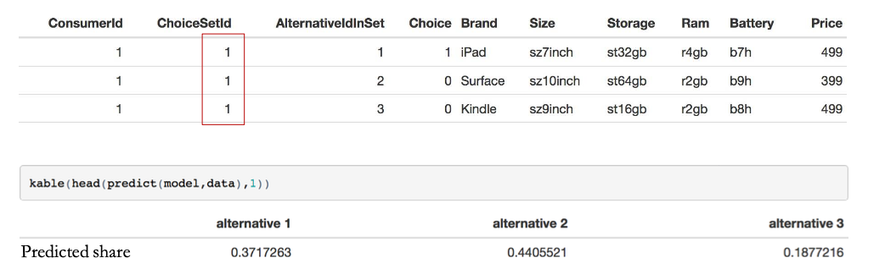

> R: 4.3.2 (2023-10-31)
> R studio: 2023.12.1+402 (2023.12.1+402)

- 了解通过提供创新产品来管理可持续竞争优势（SCA）的重要性
- 能够进行共同分析以评估新产品/服务的开发

## Innovation Offering

- 创新的新产品有助于企业建立和维持可持续竞争优势，并阻碍因竞争对手不断对企业的成功做出反应而产生的竞争攻击（MP#3）。
- 提供是一个有意广泛的术语，涵盖了企业提供的既有形产品又有无形服务。
- 创新是“通过创造性地改变业务的一个或多个维度，为客户创造实质性的新价值”。
- 创新的关键方面
  - 比产品或技术创新更广泛
  - 必须为客户创造新价值
  - 涉及导致差异化和可持续竞争优势的变化
  - 星巴克、戴尔和iPod创造了可持续竞争优势。

### Benefits of Innovation and Offering’s Equity   
创新和产品价值的权益

- 提供的权益指的是产品或服务性能为客户提供的核心价值。
- 通过建立提供的权益，一个创新的公司可以使竞争对手更难侵入其业务。
- 新的产品往往会激励客户从竞争对手转向创新公司，以获得新产品的使用权限。
- 新的产品还可以帮助公司获得新客户或进入新市场，尤其是当它们提供类似性能但价格更低时。
- 提供新的创新产品往往会增强公司的品牌形象，即使客户没有购买新产品。

### Stage-Gate Design Review Process for Effective Product Development 
阶段门设计审查流程用于有效的产品开发  

1. Concept and Definition   
概念与定义阶段包括对所有潜在想法进行初步筛选、概念评估、项目定义和可行性评估。
2. Design and Development   
设计与开发阶段包括产品和流程的设计与开发。还包括财务可行性考虑，包括价格点和客户接受度的测试。
3. Validation and Production   
验证与生产阶段包括持续的市场推出规划、产品制造和流程验证。也可能包括测试营销和启动计划的评估。
4. Final Audit  
审计阶段包括最终产品和产品评估。通常还包括对一些反思

### Research Approaches for Designing and Launching New Offerings 
设计和推出新产品的研究方法  

- 在开发早期，定性技术如观察、焦点小组和客户访谈非常有效；它们能揭示一些重要的新需求，或者是公司不知道的需求。
- 为了避免新产品高失败率带来的风险，公司可以采用不同的技术来提升决策水平，避免不成功的推出，如共同分析

## Choice-Based Conjoint Analysis

### Product design task
- 产品可以被看作是属性水平或特征的捆绑。
- 产品特征为消费者提供价值

 

- 最佳设计涉及选择产品的属性水平，以最大化目标
- 典型目标
  - 市场份额
  - 盈利能力
- 最佳设计是基于对消费者偏好的分析
### conjoint analysis
1. 共同分析有助于使新产品“更”成功
  - 产品优势推动财务成功
  - 产品设计需要做出权衡决策（价格、性能、尺寸、位置、功能等）
2. 共同分析是一种方法，用于
  - 理解消费者在产品属性和特征之间做出权衡
  - 测量产品属性对消费者的重要性

使用共同分析，营销人员可以将产品视为属性捆绑包，然后确定哪种属性组合最适合满足客户的偏好，从而设计和开发新产品。
- 何时使用？
  - 识别客户为新产品愿意做出的产品属性权衡
  - 预测提议的新产品（即属性捆绑）的市场份额和影响
  - 确定客户愿意为新产品支付的金额

### Conceptual Underpinnings of Conjoint Analysis 
共同分析的概念基础  
- 消费者在属性水平上的效用不同
- 产品的效用 = 其属性水平的效用之和
$$
U = u(\text{ProcessorLevel}) + u(\text{RamLevel}) + u(\text{HardDiskLevel}) + u(\text{PriceLevel}) + \ldots
$$
- 可以通过消费者对产品配置的评估来测量效用
- 可以利用效用估计来预测新产品的市场份额

### Conjoint Analysis Process
1. 设计研究
  - 选择属性和水平（范围和数量）
  - 制定产品配置（最多不超过16个）
2. 收集受访者数据
  - 设计数据收集工具
  - 获取受访者对配置的偏好或评级
3. 分析数据
  - 计算部分效用值
4. 评估产品设计选项
  - 评估市场模拟
  - 评估不同的选择规则

## Multinomial Logistic Regression (MNL) Model
多项逻辑回归（MNL）模型  
- 每个备选方案对消费者都有一个效用
- 效用是产品属性的函数
  - 它是对平板电脑吸引力的衡量
- 在面对选择集时，消费者选择具有最大效用的平板电脑

### Every Attribute Level has a Sub-Utility (Part-Worth) 
每个属性水平都有一个子效用（部分效用）  
- 例如，每个品牌的价值为：
  - Galaxy：$β_{Gal}$
  - iPad：$β_{iPad}$
  - Kindle：$β_{Kind}$
  - Surface：$β_{Surf}$
  - Nexus：0（参考值）
- β值是从数据中估计的参数

$$
V_j = β_{iPad} \times iPad_j + β_{Gal} \times Gal_j + β_{Kind} \times Kind_j + β_{Surf} \times Surf_j
+ β_{10} \times 10inch_j + β_{9} \times 9inch_j + β_{8} \times 8inch_j
+ β_{128gbhd} \times 128gbhd_j + β_{64gbhd} \times 64gbhd_j + β_{32gbhd} \times 32gbhd_j
+ β_{ram4} \times ram4gb_j + β_{ram2} \times ram2gb_j
+ β_{batt9} \times batt9hrs_j + β_{batt8} \times batt8hrs_j
+ β_{price} \times Price_j
$$

在使用 MNL（Multinomial Logit）模型进行参数估计时，通常会获得一些统计量来评估模型参数的显著性。在统计软件中，例如 R 或 Python 中，这些统计量通常包括以下几个：

- **Estimate**：表示模型参数的估计值。它是在模型拟合过程中计算出来的参数值，代表了每个自变量对因变量的影响程度。

- **Std.Error**：表示模型参数估计值的标准误差。标准误差是对模型参数估计值的不确定性进行的一个度量，它越小表示模型参数估计值越可靠。

- **t-value**：表示模型参数估计值与零的偏差除以标准误差的结果，称为 $t$ 值。$t$ 值用于检验模型参数的显著性，如果 $t$ 值的绝对值越大，表明模型参数越显著。

- **Pr(>|t|)**：表示 $t$ 值对应的 $p$ 值，即检验模型参数的显著性水平。$p$ 值是在原假设成立的情况下观察到的 $t$ 值或更极端情况的概率。如果 $p$ 值小于预先设定的显著性水平（例如 $0.05$），则可以拒绝原假设，认为模型参数是显著的。

### Tablet Conjoint (sub) Utilities (β Parameters Estimates)

平板电脑共同分析效用（β参数估计）  
- 参考水平用灰色标记

在选择任务示例中，平板电脑1和2的效用

- Choice Probabilities

$p_1 = \frac{exp(V_1)}{exp(V_1) + exp(V_2) + exp(V_3)}$
$p_2 = \frac{exp(V_2)}{exp(V_1) + exp(V_2) + exp(V_3)}$
$p_3 = \frac{exp(V_3)}{exp(V_1) + exp(V_2) + exp(V_3)}$

$0 \leq p_i \leq 1, \forall i$

$\sigma_i p_i = 1$ or $p_1 + p_2 + p_3 = 1$

- Predicted Market Share
假设市场上有这三款平板电脑：

- Hit Rate: Choice Prediction Accuracy

- Conjoint Simulator

2GB RAM 升级对 Galaxy 市场份额的影响: 

- What is the Brand Value of iPad Relative to Galaxy?
相对于 Galaxy，iPad 的品牌价值是多少？

$$
β_iPad - β_Galaxy ≈ 0.6401
$$

$$
iPad 的价值 = (β_iPad - β_Galaxy) / |β_Price| = 0.6401 * $196.54 = $125.80
$$

一个普通消费者在选择购买 Galaxy 平板电脑再支付额外 $125.80 和购买 iPad 之间会感到无所谓。  
类似的技术经常在诉讼中使用，例如，三星对苹果：[https://www.greenbook.org/mr/market-research-methodology/how-apple-samsung-and-conjoint-came-together/](https://www.greenbook.org/mr/market-research-methodology/how-apple-samsung-and-conjoint-came-together/)

- Willingness to Pay for an Attribute Upgrade

对属性升级的支付意愿:

$$
β_{4gbRAM} ≈ 0.6357
$$
$$
β_{1gbRAM} = 0
$$

4GB Ram Value = 0.6357*$196.54= $124.94  

一个普通消费者愿意支付高达 $124.94 从 1gb 升级到 4gb RAM，保持所有其他属性不变。

## Takeaways
1. 共同分析可以通过帮助管理者根据消费者对各种产品属性的价值来定义最佳产品，从而促进新产品的设计和推出。
2. 共同分析是行业中最流行的营销分析工具
3. 共同分析有不同类型
  - 选择型共同分析 ‒ 在行业中使用最广泛，可以纳入无选择替代方案以更好地捕捉需求

