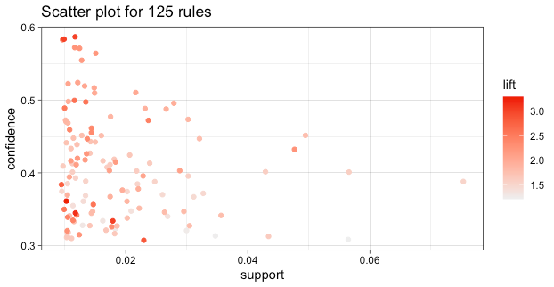
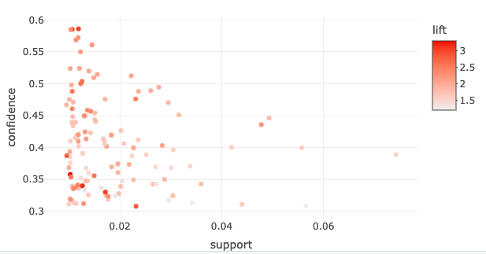
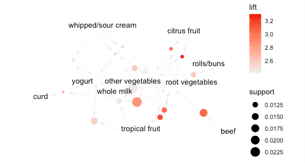

> R: 4.3.2 (2023-10-31)
> R studio: 2023.12.1+402 (2023.12.1+402)

市场营销人员通常希望从交易中提取见解。关联规则分析试图从庞大、稀疏的数据集中找到一组有信息量的模式。我们使用一个包含超过 80,000 笔市场购物篮交易和 16,000 个独特项目的真实数据集来展示关联规则。然后，我们将探讨规则挖掘在交易数据中的潜在用途，并使用关联规则来探索这些交易数据中的模式。

# 1 The Basics of Association Rules

关联规则挖掘的基本思想是，当事件一起发生的频率超过了它们各自发生率的预期时，这种共同发生就是一个有趣的模式。  
理解关联规则需要一些术语。


• 关联，简单来说就是两个或更多事物的共同发生。例如，热狗可能与腌菜、热狗面包、苏打水、薯片和番茄酱呈正相关。但是关联不一定强烈。在像 Costco 这样销售从热狗到电视等各种商品的商店中，所有商品都与其他商品相关联，但其中大多数关联并不强烈。一组项目是一个包含一个或多个项目的组合，可以写成 {项目1，项目2，...}。例如，一个集合可能是 {腌菜} 或 {热狗，苏打水，薯片}。  

• 一次交易包含在一个观察中共同出现的一组项目。在市场营销中，一个交易单位是市场购物篮，即一次购买或考虑购买的一组物品。  
任何共同出现的数据点都被视为一次交易，即使在此情境中使用术语“交易”似乎有些不寻常。例如，用户在会话期间访问的网页集合在这个意义上是一次交易。   

• 规则表示了一组项目在另一组项目的条件下在交易中的发生情况。在规则 {腌菜} ⇒ {热狗} 中，表示如果顾客购买腌菜，他们也很可能购买热狗。


规则可以表达多个项目之间的关系；例如，{腌菜，番茄酱，芥末，薯片} ⇒ {热狗，汉堡肉饼，热狗面包，苏打水，啤酒}。在这种意义上，条件并不意味着因果关系，只是一种关联，无论是强还是弱。  
关联规则通常使用三种常见的度量来表示，这些度量反映了条件概率的规则。    


• 一组项目的支持度是包含该组项目的所有交易的比例。如果 {热狗，苏打水} 出现在 200 笔交易中的 10 笔中，那么支持度({热狗，苏打水}) = 0.05。这并不影响这 10 笔交易是否还包含其他项目；支持度是针对每个唯一的项目组合单独定义的。   

• 置信度是规则中所有项目共同出现的支持度，条件是左侧集合单独的支持度。因此，置信度(X ⇒ Y) = 支持度(X ∩ Y)/支持度(X)（其中“∩”表示“和”）。考虑规则 {腌菜} ⇒ {热狗}。如果{腌菜}出现在 1% 的交易中（即支持度({腌菜}) = 0.01），并且{腌菜，热狗}出现在 0.5% 的交易中，那么置信度({腌菜} ⇒ {热狗}) = 0.005/0.01 = 0.5。换句话说，热狗在腌菜出现的情况下有50%的可能性也会出现。   

• 提升度衡量了一个集合的支持度在每个元素的联合支持度的条件下的情况，即提升度(X ⇒ Y) = 支持度(X ∩ Y)/(支持度(X) * 支持度(Y))。继续热狗的例子，如果支持度({腌菜}) = 0.01，支持度({热狗}) = 0.01，支持度({腌菜，热狗}) = 0.005，那么提升度({腌菜 ⇒ 热狗}) = 0.005/(0.01 * 0.01) = 50。换句话说，组合 {腌菜，热狗} 出现的频率是两个项目独立出现时的 50 倍。   


这三种度量告诉我们不同的信息。当我们搜索规则时，我们希望在每个度量上都超过一个最小阈值：找到在交易中相对频繁发生的项目集（支持），显示强有力的条件关系（置信度），并且比随机发生更常见（提升度）。    

在实践中，分析人员会将所需支持度的水平设置为诸如 0.01、0.10、0.20 等具有意义和对业务有用的值，考虑到数据特征（如项目集的大小）。同样，所需的置信度水平可能是高的（如 0.8）或低的（如 0.2），取决于数据和业务。对于提升度，较高的值通常更好，肯定应该高于 1.0，尽管我们必须注意具有巨大提升度的异常值。   

# 2 Retail Transaction Data: Groceries

我们要检查的数据集包含超市交易数据。我们首先检查的是 arules 软件包中包含的一个小型数据集。尽管规模较小，但这个数据集很有用，因为项目标记有类别名称，使其更易于阅读。然后，我们转向一个来自超市连锁店的较大数据集，该数据集的数据被伪装，但更典型于大型数据集。

## 2.1 Data: Groceries

我们将使用 arules 软件包中的 Groceries 数据集来说明关联规则的一般概念。这个数据集包含一起购买的商品列表（即市场购物篮），其中的单个项目被记录为类别标签，而不是产品名称。在继续之前，您应该安装 arules 和 arulesViz 软件包。  

```
> data("Groceries")

> summary(Groceries)
transactions as itemMatrix in sparse format with
 9835 rows (elements/itemsets/transactions) and
 169 columns (items) and a density of 0.02609146 

most frequent items:
      whole milk other vegetables       rolls/buns             soda           yogurt          (Other) 
            2513             1903             1809             1715             1372            34055 

element (itemset/transaction) length distribution:
sizes
   1    2    3    4    5    6    7    8    9   10   11   12   13   14   15   16   17   18   19   20   21   22   23   24   26   27   28   29   32 
2159 1643 1299 1005  855  645  545  438  350  246  182  117   78   77   55   46   29   14   14    9   11    4    6    1    1    1    1    3    1 

   Min. 1st Qu.  Median    Mean 3rd Qu.    Max. 
  1.000   2.000   3.000   4.409   6.000  32.000 

includes extended item information - examples:
       labels  level2           level1
1 frankfurter sausage meat and sausage
2     sausage sausage meat and sausage
3  liver loaf sausage meat and sausage

> inspect(head(Groceries,3))
    items                                                      
[1] {citrus fruit, semi-finished bread, margarine, ready soups}
[2] {tropical fruit, yogurt, coffee}                           
[3] {whole milk} 
```

## 2.2 Finding rules

现在我们使用 apriori(data, parameters = ...) 函数来使用 Apriori 算法查找关联规则。在概念层面上，Apriori 算法搜索在一系列交易中频繁出现的项目集。对于每个项目集，它评估在特定支持度水平或以上表达项目之间关联的各种可能规则，然后保留显示置信度超过某个阈值的规则。  
为了控制 apriori() 的搜索范围，我们使用参数 list() 来指示算法搜索具有最小支持度 0.01（1% 的交易）的规则，并提取那些进一步表现出最小置信度 0.3 的规则。生成的规则集被赋值给 groc.rules 对象：  

```
> groc.rules <- apriori(Groceries, parameter = list(supp=0.01, conf=0.3, target="rules"))
Apriori

Parameter specification:
 confidence minval smax arem  aval originalSupport maxtime support minlen maxlen target  ext
        0.3    0.1    1 none FALSE            TRUE       5    0.01      1     10  rules TRUE

Algorithmic control:
 filter tree heap memopt load sort verbose
    0.1 TRUE TRUE  FALSE TRUE    2    TRUE

Absolute minimum support count: 98 

set item appearances ...[0 item(s)] done [0.00s].
set transactions ...[169 item(s), 9835 transaction(s)] done [0.00s].
sorting and recoding items ... [88 item(s)] done [0.00s].
creating transaction tree ... done [0.00s].
checking subsets of size 1 2 3 4 done [0.00s].
writing ... [125 rule(s)] done [0.00s].
creating S4 object  ... done [0.00s].
```

## 2.3 Inspecting rules
要解释上面 apriori() 的结果，有两个关键的事情需要检查。  

• 首先，检查进入规则的项目数量，这在输出行“sorting and recoding items ...”中显示，在这种情况下告诉我们找到的规则使用了总共 88 个项目中的数量。如果这个数字太小（只有你的项目的一个小集合）或太大（几乎全部），那么你可能希望调整支持度和置信度水平。    
• 接下来，检查找到的规则数量，如“writing ...”行所示。在这种情况下，算法找到了 125 条规则。如果这个数字太低，那么说明需要降低支持度或置信度水平；如果太高（例如比项目数多很多的规则），你可能需要增加支持度或置信度水平。  

一旦我们从 apriori() 获得了一组规则集，我们使用 inspect(rules) 来检查关联规则。上面的完整列表有 125 条规则，太长了，这里无法全部检查，因此我们选择具有高提升度（lift > 3）的部分规则子集。我们发现我们的规则集中有五条规则的提升度大于 3.0：

```
> inspect(subset(groc.rules, lift > 3))
    lhs                                   rhs                support    confidence coverage   lift     count
[1] {beef}                             => {root vegetables}  0.01738688 0.3313953  0.05246568 3.040367 171  
[2] {citrus fruit, root vegetables}    => {other vegetables} 0.01037112 0.5862069  0.01769192 3.029608 102  
[3] {citrus fruit, other vegetables}   => {root vegetables}  0.01037112 0.3591549  0.02887646 3.295045 102  
[4] {tropical fruit, root vegetables}  => {other vegetables} 0.01230300 0.5845411  0.02104728 3.020999 121  
[5] {tropical fruit, other vegetables} => {root vegetables}  0.01230300 0.3427762  0.03589222 3.144780 121  
```

第一条规则告诉我们，如果一次交易包含 {牛肉}，那么它也更有可能包含 {根菜类蔬菜}——我们假设这个类别包括土豆和洋葱等项目。支持度显示该组合出现在 1.7% 的购物篮中，提升度显示该组合共同出现的可能性是单独出现的发生率的 3 倍。   

根据这样的信息，商店可能会得出几个见解。例如，商店可以在牛肉柜台附近设置一个土豆和洋葱的陈列，以鼓励正在查看牛肉的购物者购买这些蔬菜，或者考虑使用它们的食谱。它还可以建议将牛肉的优惠券放在根菜类蔬菜区，或者在商店的某个地方展示食谱卡。

## 2.4 Plot rules

为了了解规则的分布情况，我们加载 arulesViz 软件包，然后使用 plot() 函数绘制规则集，根据置信度（Y 轴）和支持度（X 轴）绘制规则，并根据提升度调整点的深浅以表示规则的重要性。

```
> plot(groc.rules)
```




在该图表中，我们可以看到大多数规则涉及很少发生的项目组合（即支持度低），而置信度相对平稳分布。  

简单地显示点并不是非常有用，arulesViz 的一个关键特性是交互式绘图。在上述图中，有一些规则位于左上角，具有很高的提升度。我们可以使用交互式绘图来检查这些规则。要做到这一点，将 interactive=TRUE 添加到 plot() 命令中：

```
> plot(groc.rules, engine = "plotly")
```



在交互模式下，您可以检查规则的区域。为此，请在感兴趣的区域的一个角落单击一次，然后在相反的角落再次单击。您可以使用放大功能放大该区域或使用检查功能列出该区域的规则。完成后，请单击结束。   

我们选择了左上角的区域，并放大了该区域。然后，我们从放大的区域中选择了几条规则，并单击检查以将它们显示在控制台中。在该子区域中有七条规则。这显示了两条高提升度的规则。   

其中一条规则告诉我们，组合 {柑橘类水果，根菜类蔬菜} 在大约 1.0% 的购物篮中出现（支持度=0.0104），当它出现时，高度可能包含 {其他蔬菜}（置信度=0.586）。该组合的出现频率比我们从单独考虑 {柑橘类水果，根菜类蔬菜} 和 {其他蔬菜} 的个体发生率预期的要多 3 倍（提升度=3.03）。   

这样的信息可以用于多种方式。如果我们将交易与客户信息配对，我们可以用于定向邮寄或电子邮件建议。对于经常一起销售的商品，我们可以一起调整价格和利润率；例如，将一个商品打折销售，同时提高另一个商品的价格。或者收银员可能会问客户：“您是否需要配一些其他蔬菜？”

## 2.5 Finding and Plotting Subsets of Rules


在市场购物篮分析中，一个常见的目标是找到提升度高的规则。我们可以通过对提升度排序来轻松找到这样的规则。我们使用 sort() 函数对规则按提升度排序，并从头部取出前 15 条规则，以提取提升度最高的 15 条规则：

```
> groc.hi <- head(sort(groc.rules, by="lift"), 15) 

> inspect(groc.hi)
     lhs                                       rhs                support    confidence coverage   lift     count
[1]  {citrus fruit, other vegetables}       => {root vegetables}  0.01037112 0.3591549  0.02887646 3.295045 102  
[2]  {tropical fruit, other vegetables}     => {root vegetables}  0.01230300 0.3427762  0.03589222 3.144780 121  
[3]  {beef}                                 => {root vegetables}  0.01738688 0.3313953  0.05246568 3.040367 171  
[4]  {citrus fruit, root vegetables}        => {other vegetables} 0.01037112 0.5862069  0.01769192 3.029608 102  
[5]  {tropical fruit, root vegetables}      => {other vegetables} 0.01230300 0.5845411  0.02104728 3.020999 121  
[6]  {other vegetables, whole milk}         => {root vegetables}  0.02318251 0.3097826  0.07483477 2.842082 228  
[7]  {whole milk, curd}                     => {yogurt}           0.01006609 0.3852140  0.02613116 2.761356  99  
[8]  {root vegetables, rolls/buns}          => {other vegetables} 0.01220132 0.5020921  0.02430097 2.594890 120  
[9]  {root vegetables, yogurt}              => {other vegetables} 0.01291307 0.5000000  0.02582613 2.584078 127  
[10] {tropical fruit, whole milk}           => {yogurt}           0.01514997 0.3581731  0.04229792 2.567516 149  
[11] {yogurt, whipped/sour cream}           => {other vegetables} 0.01016777 0.4901961  0.02074225 2.533410 100  
[12] {other vegetables, whipped/sour cream} => {yogurt}           0.01016777 0.3521127  0.02887646 2.524073 100  
[13] {tropical fruit, other vegetables}     => {yogurt}           0.01230300 0.3427762  0.03589222 2.457146 121  
[14] {root vegetables, whole milk}          => {other vegetables} 0.02318251 0.4740125  0.04890696 2.449770 228  
[15] {whole milk, whipped/sour cream}       => {yogurt}           0.01087951 0.3375394  0.03223183 2.419607 107
```

支持度和提升度对于一个项目集来说是相同的，无论在规则的左侧还是右侧（右手或左手）内的项目的顺序如何。然而，置信度反映了方向，因为它计算了右手集合在左手集合条件下的出现情况。  

规则的图形显示可能对寻找更高层次的主题和模式很有用。我们使用 plot(..., method="graph") 来绘制按提升度排名的前 15 条规则的图形显示：




结果图中项目的位置可能因您的系统而异，但项目集群应该是相似的。每个圆圈代表一条规则，其中来自规则左侧项的入站箭头，指向右侧项的出站箭头。圆圈的大小（面积）表示规则的支持度，而颜色的深浅表示提升度（颜色越深表示提升度越高）。

# 3 Supermarket Data

现在我们将调查来自比利时一家超市连锁店的更大规模的零售交易数据中的关联情况。这个数据集包括一起购买的商品的购物篮，其中每条记录都包括任意编号的商品编号，没有商品描述（为了保护该连锁店的专有数据）。这个数据集是由Brijs等人公开提供的。

## 3.1 Data Preparation

First we use readLines() to get the data from where it is hosted:

```
> retail.raw <- readLines("retail.dat")

> head(retail.raw)
[1] "0 1 2 3 4 5 6 7 8 9 10 11 12 13 14 15 16 17 18 19 20 21 22 23 24 25 26 27 28 29 "
[2] "30 31 32 "                                                                       
[3] "33 34 35 "                                                                       
[4] "36 37 38 39 40 41 42 43 44 45 46 "                                               
[5] "38 39 47 48 "                                                                    
[6] "38 39 48 49 50 51 52 53 54 55 56 57 58 "                                         

> tail(retail.raw)
[1] "48 201 255 278 407 479 767 824 986 1395 1598 2022 2283 2375 6725 13334 14006 14099 "                          
[2] "39 875 2665 2962 12959 14070 14406 15518 16379 "                                                              
[3] "39 41 101 346 393 413 479 522 586 635 695 799 1466 1786 1994 2449 2830 3035 3591 3722 6217 11493 12129 13033 "
[4] "2310 4267 "                                                                                                   
[5] "39 48 2528 "                                                                                                  
[6] "32 39 205 242 1393 "                                                                                          

> summary(retail.raw)
   Length     Class      Mode 
    88162 character character
```


该对象中的每一行表示一篮子购物中一起购买的商品。在每一行内，商品被分配了任意的数字，这些数字从0开始，随着后续交易的需要逐渐增加新的商品编号。  
数据包括 88,162 个交易，第一个购物篮有 30 个商品（编号为 0-29），第二个有 3 个商品，依此类推。在 tail() 中，我们看到最后一个购物篮有 5 个商品，其中大部分商品，如 32、39、205 和 242 号，编号较低，反映了这些特定商品最初出现在数据集的早期交易中。  
在这种文本格式中，数据还不能直接使用；我们必须首先将每个交易文本行拆分成单独的商品。为此，我们使用 strsplit(lines, " ")。这个命令在每个空格字符（" "）处将每一行拆分，并将结果保存到一个列表中：  

```
> retail.list <- strsplit(retail.raw, " ")

> names(retail.list) <- paste("Trans", 1:length(retail.list))

> str(retail.list)
List of 88162
 $ Trans 1    : chr [1:30] "0" "1" "2" "3" ...
 $ Trans 2    : chr [1:3] "30" "31" "32"
 $ Trans 3    : chr [1:3] "33" "34" "35"
 $ Trans 4    : chr [1:11] "36" "37" "38" "39" ...
 $ Trans 5    : chr [1:4] "38" "39" "47" "48"
 $ Trans 6    : chr [1:13] "38" "39" "48" "49" ...
 $ Trans 7    : chr [1:6] "32" "41" "59" "60" ...
```

```
> some(retail.list) #note: random sample; your results may vary
$`Trans 1458`
[1] "32"  "38"  "39"  "48"  "370" "371" "373" "931"

$`Trans 5763`
 [1] "41"   "79"   "186"  "251"  "374"  "389"  "751"  "3532" "4993" "5344"

$`Trans 13502`
 [1] "39"   "41"   "279"  "475"  "1516" "1739" "1960" "3281" "5354" "6128"

$`Trans 27697`
[1] "7797"  "11864"

$`Trans 27864`
[1] "39"   "956"  "1783" "1907" "3185" "4208"

$`Trans 29944`
[1] "32"    "39"    "48"    "12136"

$`Trans 50578`
[1] "597"   "727"   "1907"  "14031"

$`Trans 62789`
[1] "1163"  "3497"  "3941"  "5685"  "12968" "15148"

$`Trans 67790`
[1] "4165"  "4398"  "14098"

$`Trans 77780`
 [1] "18"    "32"    "39"    "41"    "262"   "418"   "438"   "864"   "913"   "1342"  "1696"  "1872"  "2077"  "2856"  "5740"  "10423"
[17] "10939" "15832"
```


使用 str()，我们确认列表有 88,162 个条目，并且单个条目看起来合适。使用 some() 从整个较大的集合中对一些交易进行抽样，以进行额外确认。  

然后，我们将其转换为 transactions 对象，这样可以增强我们处理数据的方式并加速 arules 操作。要从列表转换为 transactions，我们使用 as(. . . , "transactions") 来转换对象：

```
> retail.trans <- as(retail.list, "transactions") #takes a few seconds 

> summary(retail.trans)
transactions as itemMatrix in sparse format with
 88162 rows (elements/itemsets/transactions) and
 16470 columns (items) and a density of 0.0006257289 

most frequent items:
     39      48      38      32      41 (Other) 
  50675   42135   15596   15167   14945  770058 

element (itemset/transaction) length distribution:
sizes
   1    2    3    4    5    6    7    8    9   10   11   12   13   14   15   16   17   18   19   20   21   22   23   24   25   26 
3016 5516 6919 7210 6814 6163 5746 5143 4660 4086 3751 3285 2866 2620 2310 2115 1874 1645 1469 1290 1205  981  887  819  684  586 
  27   28   29   30   31   32   33   34   35   36   37   38   39   40   41   42   43   44   45   46   47   48   49   50   51   52 
 582  472  480  355  310  303  272  234  194  136  153  123  115  112   76   66   71   60   50   44   37   37   33   22   24   21 
  53   54   55   56   57   58   59   60   61   62   63   64   65   66   67   68   71   73   74   76 
  21   10   11   10    9   11    4    9    7    4    5    2    2    5    3    3    1    1    1    1 

   Min. 1st Qu.  Median    Mean 3rd Qu.    Max. 
   1.00    4.00    8.00   10.31   14.00   76.00 

includes extended item information - examples:
  labels
1      0
2      1
3     10

includes extended transaction information - examples:
  transactionID
1       Trans 1
2       Trans 2
3       Trans 3
```

查看结果对象的 summary()，我们可以看到交易-商品矩阵是 88,162 行乘以 16,470 列。在这 14 亿个交叉点中，只有 0.06% 有正数据（密度），因为大多数商品在大多数交易中都没有被购买。商品 39 出现最频繁，在 50,675 个篮子中出现，超过了所有交易的一半。3,016 个交易只包含一个商品（“sizes” = 1），中位篮子大小为 8 个商品。

## 3.2 Exercise:

Please now use the prepared supermarket data to do the market basket analysis, finding and visualizing the association rules.  

# 4 Key Point

关联规则是探索数据集中关系的强大方法。

• 关联规则通常与稀疏数据集一起使用，这些数据集具有许多观察结果，但每个观察结果的信息很少。在市场营销中，这是市场篮子和类似的交易数据的典型特征。  
• arules 软件包是 R 中用于关联规则的标准软件包。arules 提供了处理稀疏数据和查找规则的支持，而 arulesViz 软件包则提供了可视化方法。  
• 评估关联规则的核心指标是支持度（频率）、置信度（共同发生）和提升度（纯粹偶然情况下的共同发生）。除了提升度应该略高于 1.0 外，它们没有绝对值的要求。解释取决于对类似数据的经验以及特定业务问题的实用性。  
• 关联规则的典型工作流程包括：    

  1. 导入原始数据，并使用 as(data, "transactions") 将其转换为 transactions 对象，以获得更好的性能。  
  2. 使用 apriori(transactions, support= , confidence= , target="rules") 查找一组关联规则。  
  3. 使用 plot(. . . , interactive=TRUE) 绘制结果规则并检查规则。  
  4. 通过选择规则的子集来寻找模式，例如具有最高提升度的规则，并使用 plot(. . . , method="graph") 进行可视化。   

# 5 CODE

```
library("arules") # processing of regression output 
library("arulesViz") # used for report compilation and table display 
library("grid") # very popular plotting library ggplot2 
library("car") # multinomial logit
library("plotly") # ConfusionMatrix

# 获取当前已加载文件的目录
file_dir <- dirname(parent.frame(2)$ofile)
print(file_dir)
# 将工作目录设置为当前已加载文件的目录
setwd(file_dir)

data("Groceries")
summary(Groceries)


inspect(head(Groceries,3))

groc.rules <- apriori(Groceries, parameter = list(supp=0.01, conf=0.3, target="rules"))

inspect(subset(groc.rules, lift > 3))

plot(groc.rules)

plot(groc.rules, engine = "plotly")

groc.hi <- head(sort(groc.rules, by="lift"), 15) 
inspect(groc.hi)

plot(groc.hi, method="graph")

retail.raw <- readLines("retail.dat")
head(retail.raw)
tail(retail.raw)

summary(retail.raw)

retail.list <- strsplit(retail.raw, " ")

names(retail.list) <- paste("Trans", 1:length(retail.list))

str(retail.list)

some(retail.list) #note: random sample; your results may vary

rm(retail.raw)

retail.trans <- as(retail.list, "transactions") #takes a few seconds 
summary(retail.trans)

rm(retail.list) #remove retail.list as it is not needed anymore.
```
