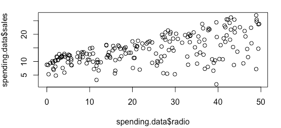
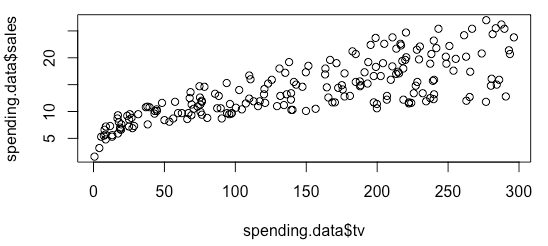
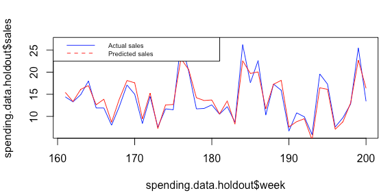

> R: 4.3.2 (2023-10-31)  
> R studio: 2023.12.1+402 (2023.12.1+402)

# 1 Marketing Effectiveness and Resource Allocation

Leverage historical data to quantify the effectiveness of marketing actions.

```
> spending.data <- read_xls("advertising spending 1.xls")
                                                                                     
> str(spending.data)
tibble [200 × 5] (S3: tbl_df/tbl/data.frame)
 $ week     : num [1:200] 1 2 3 4 5 6 7 8 9 10 ...
 $ tv       : num [1:200] 230.1 44.5 17.2 151.5 180.8 ...
 $ radio    : num [1:200] 37.8 39.3 45.9 41.3 10.8 48.9 32.8 19.6 2.1 2.6 ...
 $ newspaper: num [1:200] 69.2 45.1 69.3 58.5 58.4 75 23.5 11.6 1 21.2 ...
 $ sales    : num [1:200] 22.1 10.4 9.3 18.5 12.9 7.2 11.8 13.2 4.8 10.6 ...
```

数据包含每周的销售额以及电视、广播和报纸广告费用（以千英镑计）。

## 1.1 Does radio advertising affect sales for an electronics brand?

Visualizing the data

```
# scatter plot
plot(spending.data$radio, spending.data$sales)
```


```
> # Correlation between radio advertising and sales
> cor(spending.data$radio, spending.data$sales)
[1] 0.5762226

> regression <- lm(sales ~ radio, data = spending.data) 

> summary(regression)

Call:
lm(formula = sales ~ radio, data = spending.data)

Residuals:
     Min       1Q   Median       3Q      Max 
-15.7305  -2.1324   0.7707   2.7775   8.1810 

Coefficients:
            Estimate Std. Error t value Pr(>|t|)    
(Intercept)  9.31164    0.56290  16.542   <2e-16 ***
radio        0.20250    0.02041   9.921   <2e-16 ***
---
Signif. codes:  0 ‘***’ 0.001 ‘**’ 0.01 ‘*’ 0.05 ‘.’ 0.1 ‘ ’ 1

Residual standard error: 4.275 on 198 degrees of freedom
Multiple R-squared:  0.332,	Adjusted R-squared:  0.3287 
F-statistic: 98.42 on 1 and 198 DF,  p-value: < 2.2e-16
```

问题：如果我在广播广告上花费 40,000 英镑，我将卖出多少？答案：17.31 = 9.31 +0.20 * 40

## 1.2 Accounting for multiple predictors: multiple linear regression

```
> regression <- lm(sales ~ radio + tv, data=spending.data) 

> summary(regression)

Call:
lm(formula = sales ~ radio + tv, data = spending.data)

Residuals:
    Min      1Q  Median      3Q     Max 
-8.7977 -0.8752  0.2422  1.1708  2.8328 

Coefficients:
            Estimate Std. Error t value Pr(>|t|)    
(Intercept)  2.92110    0.29449   9.919   <2e-16 ***
radio        0.18799    0.00804  23.382   <2e-16 ***
tv           0.04575    0.00139  32.909   <2e-16 ***
---
Signif. codes:  0 ‘***’ 0.001 ‘**’ 0.01 ‘*’ 0.05 ‘.’ 0.1 ‘ ’ 1

Residual standard error: 1.681 on 197 degrees of freedom
Multiple R-squared:  0.8972,	Adjusted R-squared:  0.8962 
F-statistic: 859.6 on 2 and 197 DF,  p-value: < 2.2e-16
```

## 1.3 Allocating marketing budgets

### 1.3.1 Ratio of elasticities method

- What is elasticity?
  1. % change in the response variable for a 1% change in the predictor variable 
  2. Example: the % change in sales for a 1% change in advertising spending

**Let us start with an example:**

  1. Image that you have a £100,000 budget to spend on advertising 
  2. A 1% increase in online advertising increases sales by 0.12%
  3. A 1% increase in offline advertising increases sales by 0.08%


如何使用弹性系数法？

  1. 总弹性系数：0.12 + 0.08 = 0.20。
  2. 弹性系数比率：
     - 在线广告：0.12/0.20 = 60%  
     - 线下广告：0.08/0.20 = 40%  
     建议：将60%（£60,000）的预算分配给在线广告，40%（£40,000）的预算分配给线下广告。  

### 1.3.2 How to obtain elasticities from a linear regression model?

1. 广告弹性 = 广告估算值 * (基线广告/基线销售)
2. 基线广告 = 平均广播广告支出（=23.26）
3. Baseline Sales = average sales (=14.02)
4. What is the elasticity of radio advertising? (0.32)
5. A 1% increase in radio advertising results in a 0.32% increase in sales.

```
> mean(spending.data$radio)
[1] 23.264

> mean(spending.data$sales)
[1] 14.0225

> 0.19 * (23.26/14.02)
[1] 0.3152211
```

# 2 Marketing Mix Modelling

## 2.1 Modelling non-linear returns on investment

假设广告在初始预算为50万英镑的情况下在1周内播出，旨在提高英国消费者对Airbnb作为一个包容性品牌的认知，同时增加访问Airbnb网站和预订的流量。   
由于该广告活动的结果，Airbnb的预订量增加了1%。   
一年后，Airbnb决定再次进行一场相似的广告活动，同样持续1周，但将预算翻倍至100万英镑，希望预订量会增加2%。    
你认为会发生这种情况吗？为什么（为什么不）？   

**"电视和广告之间的关系是否线性？"**

```
plot(spending.data$tv, spending.data$sales)
```



```
> summary(spending.data$sales)
   Min. 1st Qu.  Median    Mean 3rd Qu.    Max. 
   1.60   10.38   12.90   14.02   17.40   27.00 

> summary(spending.data$tv)
   Min. 1st Qu.  Median    Mean 3rd Qu.    Max. 
   0.70   74.38  149.75  147.04  218.82  296.40 

> summary(spending.data$radio)
   Min. 1st Qu.  Median    Mean 3rd Qu.    Max. 
  0.000   9.975  22.900  23.264  36.525  49.600 

> summary(spending.data$newspaper)
   Min. 1st Qu.  Median    Mean 3rd Qu.    Max. 
   0.30   12.75   25.75   30.55   45.10  114.00 

> regression <- lm(log(sales) ~ log(radio+0.01) + log(tv) + log(newspaper), data=spending.data)

> summary(regression)

Call:
lm(formula = log(sales) ~ log(radio + 0.01) + log(tv) + log(newspaper), 
    data = spending.data)

Residuals:
     Min       1Q   Median       3Q      Max 
-0.45346 -0.08881 -0.01746  0.06781  0.78863 

Coefficients:
                  Estimate Std. Error t value Pr(>|t|)    
(Intercept)       0.479773   0.052031   9.221   <2e-16 ***
log(radio + 0.01) 0.144177   0.007865  18.333   <2e-16 ***
log(tv)           0.349297   0.008857  39.437   <2e-16 ***
log(newspaper)    0.017488   0.009306   1.879   0.0617 .  
---
Signif. codes:  0 ‘***’ 0.001 ‘**’ 0.01 ‘*’ 0.05 ‘.’ 0.1 ‘ ’ 1

Residual standard error: 0.1254 on 196 degrees of freedom
Multiple R-squared:  0.9098,	Adjusted R-squared:  0.9084 
F-statistic: 658.7 on 3 and 196 DF,  p-value: < 2.2e-16
```
我们已经将0.01添加到广播的值上，因为广播的最小值是0，这样做会导致对log（广播）的无效结果。    

- **哪个模型更好，线性模型还是对数-对数模型？**    
  1. 绘制变量之间的关系图
  2. 比较线性模型和对数-对数模型的拟合情况

- **如何解释系数？**
  1. 广播广告的增加1%导致销售额增加0.14%。
  2. 电视广告的增加1%导致销售额增加0.35%。

- **Coefficients are elasticities!**
- **Summary**

```
Linear
  • Equation: Y = β0 + β1X
  • Interpretation: One unit change in X leads to beta1 unit change in Y
  • When to use? Linear relation between X and Y
Log-Log
  • Equation: log(Y) = β0 + β1log(X)
  • Interpretation: One percent change in X leads to β1 percent change in Y • When to use? A non-linear relation between X and Y
Which one to use?
  • Plot the data to learn about the relation between X and Y. • Estimate both models and identify the best fitting model
```

## 2.2 Modelling media synergy

- 营销组合工具的综合使用可以产生协同效应。
- 当多种媒体的联合影响超过它们各自部分的总和时，就会产生协同效应。

Is TV advertising more effective in the presence of radio advertising?  

```
> regression <- lm(log(sales) ~ log(radio+0.01) + log(tv) + log(newspaper) + log(radio+0.01)*log(tv), data=spending.data)

> summary(regression)

Call:
lm(formula = log(sales) ~ log(radio + 0.01) + log(tv) + log(newspaper) + 
    log(radio + 0.01) * log(tv), data = spending.data)

Residuals:
     Min       1Q   Median       3Q      Max 
-0.29117 -0.06889 -0.02084  0.05787  0.74453 

Coefficients:
                           Estimate Std. Error t value Pr(>|t|)    
(Intercept)                1.347498   0.101811  13.235  < 2e-16 ***
log(radio + 0.01)         -0.152661   0.032200  -4.741 4.10e-06 ***
log(tv)                    0.153799   0.022032   6.981 4.49e-11 ***
log(newspaper)             0.019947   0.007741   2.577   0.0107 *  
log(radio + 0.01):log(tv)  0.066311   0.007043   9.415  < 2e-16 ***
---
Signif. codes:  0 ‘***’ 0.001 ‘**’ 0.01 ‘*’ 0.05 ‘.’ 0.1 ‘ ’ 1

Residual standard error: 0.1043 on 195 degrees of freedom
Multiple R-squared:  0.938,	Adjusted R-squared:  0.9367 
F-statistic:   737 on 4 and 195 DF,  p-value: < 2.2e-16
```
使用中心化变量
```
> center <- function(x) { scale(x, scale = F)} # scale = F, means only center not standardize

> spending.data <- spending.data %>% mutate(radio_log_centered = center(log(radio+0.01)),
+                                           tv_log_centered  .... [TRUNCATED] 

> regression <- lm(log(sales) ~ radio_log_centered + tv_log_centered + newspaper_log_centered +
+                    radio_log_centered*tv_log_centere .... [TRUNCATED] 

> summary(regression)

Call:
lm(formula = log(sales) ~ radio_log_centered + tv_log_centered + 
    newspaper_log_centered + radio_log_centered * tv_log_centered, 
    data = spending.data)

Residuals:
     Min       1Q   Median       3Q      Max 
-0.29117 -0.06889 -0.02084  0.05787  0.74453 

Coefficients:
                                   Estimate Std. Error t value Pr(>|t|)    
(Intercept)                        2.561748   0.007376 347.306   <2e-16 ***
radio_log_centered                 0.157146   0.006681  23.521   <2e-16 ***
tv_log_centered                    0.337076   0.007476  45.086   <2e-16 ***
newspaper_log_centered             0.019947   0.007741   2.577   0.0107 *  
radio_log_centered:tv_log_centered 0.066311   0.007043   9.415   <2e-16 ***
---
Signif. codes:  0 ‘***’ 0.001 ‘**’ 0.01 ‘*’ 0.05 ‘.’ 0.1 ‘ ’ 1

Residual standard error: 0.1043 on 195 degrees of freedom
Multiple R-squared:  0.938,	Adjusted R-squared:  0.9367 
F-statistic:   737 on 4 and 195 DF,  p-value: < 2.2e-16
```

## 2.3 Modelling carryover effects


到目前为止，我们假设在给定时间段内的广告只会影响该时间段内的销售。实际上，消费者对广告的反应可能会有延迟。不考虑延迟效应可能会导致广告弹性系数被低估。  
广告存量度量了广告在当前时间段之外的影响。  
广告存量背后的理论是，营销曝光在消费者心中建立了意识。这种意识不会在消费者看到广告后立即消失，而是留存在他们的记忆中。记忆会随着时间的推移而减弱，因此广告存量中存在衰减部分。    
```
Adstockt = Advertisingt + λAdstockt−1   
```

在每个时间段中，你被认为会保留前一个广告存量的一部分（λ）。   
例如，如果λ等于0.3，则来自一个时间段之前的广告存量在当前时间段仍然具有30%的影响。  

**How to do this in R?**

- “rate = 0.1” sets λ to 0.1 (i.e. 10%)  
- You can empirically test multiple values of λ.

```
> adstock <- function(x, rate){
+   return(as.numeric(stats::filter(x=x, filter=rate, method="recursive")))
+ }

> # filter() function from stats package applies linear filtering to a univariate time series
> 
> spending.data <- spending.data %>% mutate(tv_adstoc .... [TRUNCATED] 

> regression <- lm(log(sales) ~ log(radio+0.01) + log(tv_adstock) + log(newspaper), data=spending.data)

> summary(regression)

Call:
lm(formula = log(sales) ~ log(radio + 0.01) + log(tv_adstock) + 
    log(newspaper), data = spending.data)

Residuals:
     Min       1Q   Median       3Q      Max 
-0.96605 -0.08394 -0.00081  0.07966  0.81860 

Coefficients:
                  Estimate Std. Error t value Pr(>|t|)    
(Intercept)       -0.09547    0.08418  -1.134   0.2581    
log(radio + 0.01)  0.13177    0.01008  13.074   <2e-16 ***
log(tv_adstock)    0.45582    0.01542  29.567   <2e-16 ***
log(newspaper)     0.02219    0.01190   1.865   0.0637 .  
---
Signif. codes:  0 ‘***’ 0.001 ‘**’ 0.01 ‘*’ 0.05 ‘.’ 0.1 ‘ ’ 1

Residual standard error: 0.1604 on 196 degrees of freedom
Multiple R-squared:  0.8523,	Adjusted R-squared:  0.8501 
F-statistic: 377.1 on 3 and 196 DF,  p-value: < 2.2e-16
```

## 2.4 Predictive accuracy *

```
> # Total number of rows in the data frame
> n <- nrow(spending.data)

> # Number of rows for the training set (80% of the dataset)
> n_train <- round(0.80 * n) # Training data

> spending.data.train <- subset(spending.data, week <= n_train) # Holdout data

> spending.data.holdout <- subset(spending.data, week > n_train)

> # Estimation on training data
> regression <- lm(log(sales) ~ log(radio_adstock) + log(tv_adstock) + log(newspaper_adstock), data=spending.data.trai .... [TRUNCATED] 

> summary(regression)

Call:
lm(formula = log(sales) ~ log(radio_adstock) + log(tv_adstock) + 
    log(newspaper_adstock), data = spending.data.train)

Residuals:
     Min       1Q   Median       3Q      Max 
-0.95544 -0.06206 -0.00140  0.07359  0.60782 

Coefficients:
                       Estimate Std. Error t value Pr(>|t|)    
(Intercept)            -0.37264    0.09377  -3.974 0.000108 ***
log(radio_adstock)      0.19215    0.01473  13.048  < 2e-16 ***
log(tv_adstock)         0.47022    0.01566  30.031  < 2e-16 ***
log(newspaper_adstock)  0.02057    0.01545   1.332 0.184852    
---
Signif. codes:  0 ‘***’ 0.001 ‘**’ 0.01 ‘*’ 0.05 ‘.’ 0.1 ‘ ’ 1

Residual standard error: 0.1483 on 156 degrees of freedom
Multiple R-squared:  0.8812,	Adjusted R-squared:  0.8789 
F-statistic: 385.6 on 3 and 156 DF,  p-value: < 2.2e-16
``` 

```
> # Predict sales on holdout data
> spending.data.holdout$predicted_sales_log <-
+   predict(object =regression, newdata = spending.data.holdout)

> # Convert predicted log sales to actual sales
> spending.data.holdout$predicted_sales <- exp(spending.data.holdout$predicted_sales_log)

> # Quantify predictive accuracy: Mean Average Percentage Error (MAPE)
> mape <- mean(abs((spending.data.holdout$sales -spending.data.holdout$predicte .... [TRUNCATED] 

> mape # Reflects the average percentage error in a given week
[1] 0.1010304
```

```
> # Plot actual versus predicted sales
> plot(spending.data.holdout$week, spending.data.holdout$sales, type="l", col="blue") # Plot actual sales

> lines(spending.data.holdout$week,spending.data.holdout$predicted_sales, type = "l", col = "red") # Add predicted sales

> legend("topleft", legend=c("Actual sales", "Predicted sales"), col=c("blue", "red"), lty = 1:2, cex=0.6)
```


