> R: 4.3.2 (2023-10-31)
> R studio: 2023.12.1+402 (2023.12.1+402)

# 0. Learning Objectives

- 市场营销问题
  - 管理资源权衡
- 分析工具
  - 市场实验
  - 市场反应模型

## 0.1 Framework for Managing Resource Trade-Offs

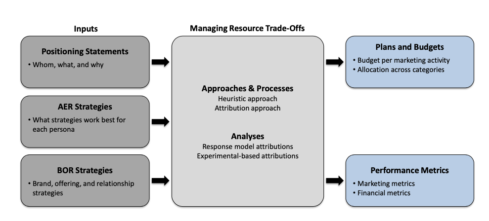

## 0.2 Attribution Approach

- 指定归因模型，使公司能够了解资源增加的确切美元影响，还可以回答以下问题：  

  - 营销投资的相对美元价值影响是多少？
  - 什么是利润最大化的投资水平？
- 通过使用归因模型，管理者可以将资源分配到优化他们期望的结果，避免浪费或依赖于任意启发式方法。
- 这些归因模型主要分为两大类：
  - 市场反应模型（营销组合模型）
  - 实验

# 1. Market Response Model

- 第一部分：营销效果和资源分配

  - 为什么/如何衡量营销投资回报？
  - 分配营销预算
- 第二部分：营销组合建模
  - 线性回归建模
  - 营销组合工具之间的协同建模
  - 携带效应建模
  - 评估模型

## 1.1 Why Measure Returns on Marketing Investment?

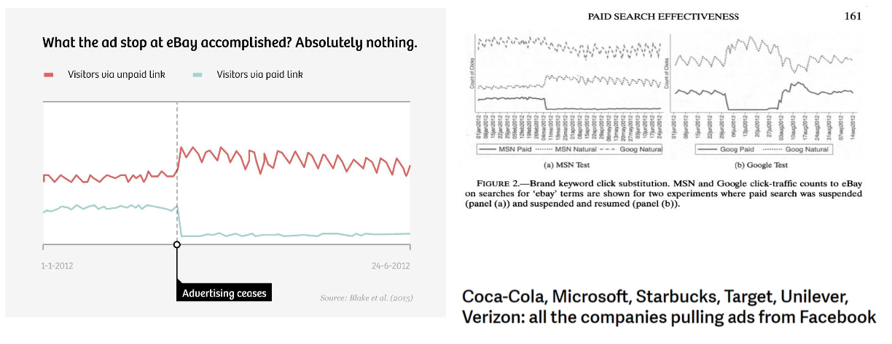

## 1.2 What are market response models? How it Works?


1. 利用过去的数据揭示营销资源和业绩之间的关系，响应模型提供了两个主要的见解。  
2. 营销资源和结果之间关系的形状（凹形或凸形）。  
3. 如果营销投入增加1%，财务业绩会发生多大变化，也称为营销弹性。  

## 1.3 How to Measure Return on Marketing Investment

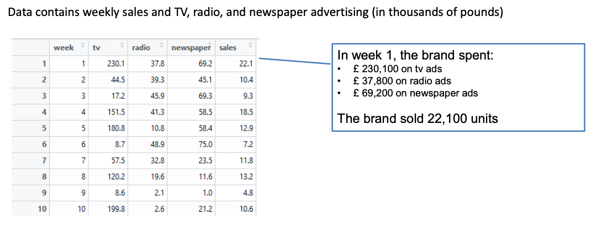

## 1.4 The Basics: Simple linear regression

### 1.4.1 Example1: Radio Ads for Sales

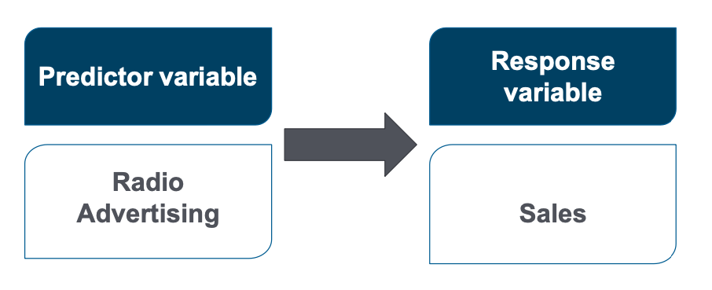

Sales = a+ b1 Radio advertising 

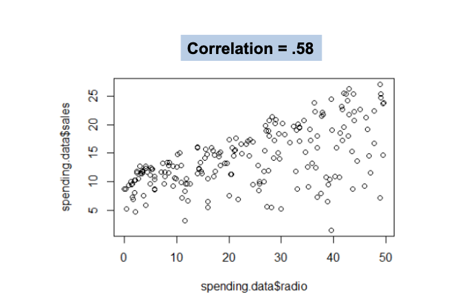

Does radio advertising affects sales for an electronics brand?

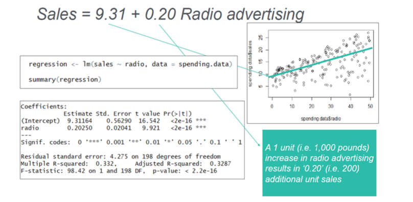

Predict sales

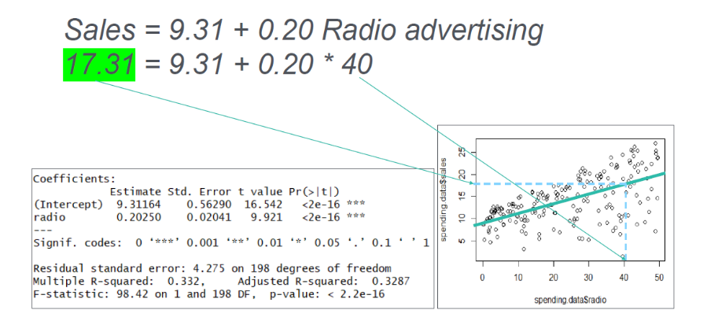

### 1.4.2 Radio and TV ads for sales

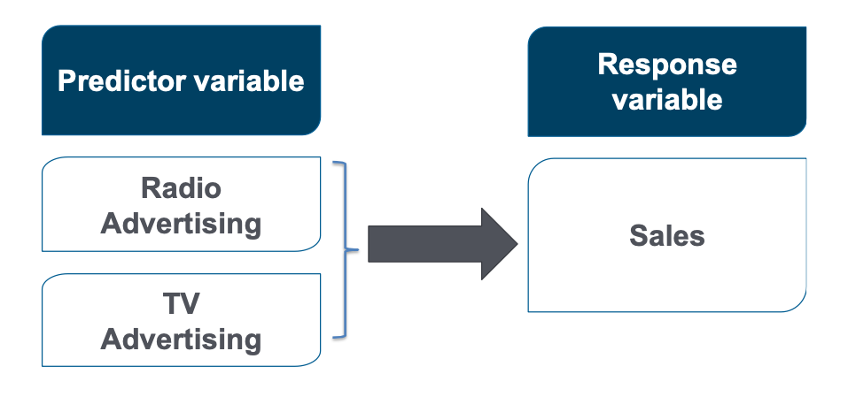

Sales =a+ b1 Radio advertising + b2 TV advertising

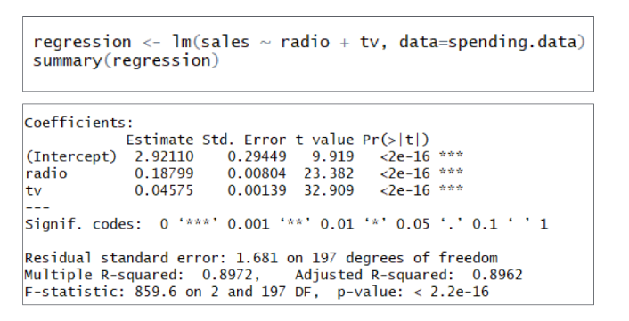

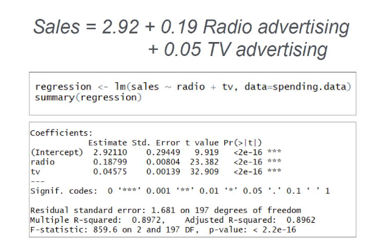

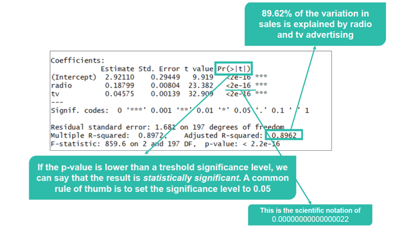

## 1.5 Allocating Marketing Budgets

- 弹性系数是什么？  
  - 预测变量变化1%，响应变量变化的百分比  
  - 例如：广告支出变化1%，销售变化的百分比  

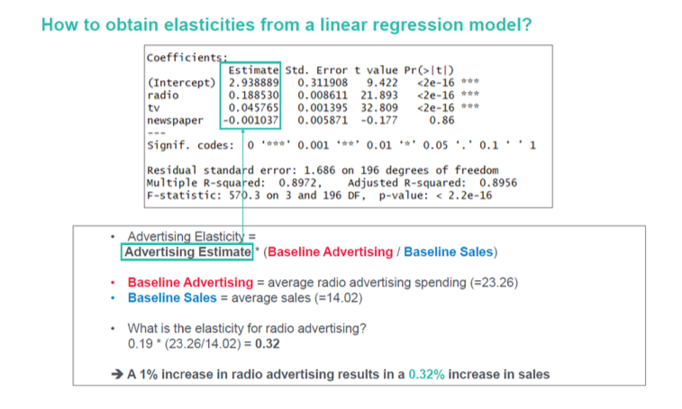

## 1.6 Modelling log-log Returns on Investment

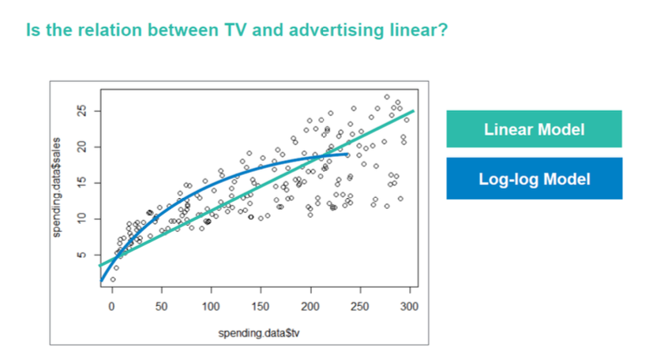

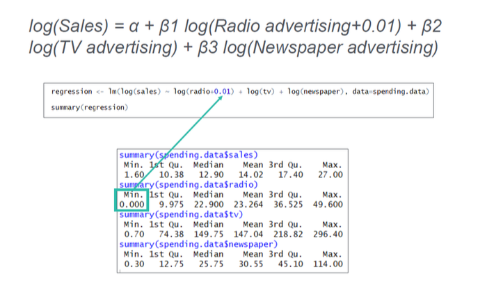

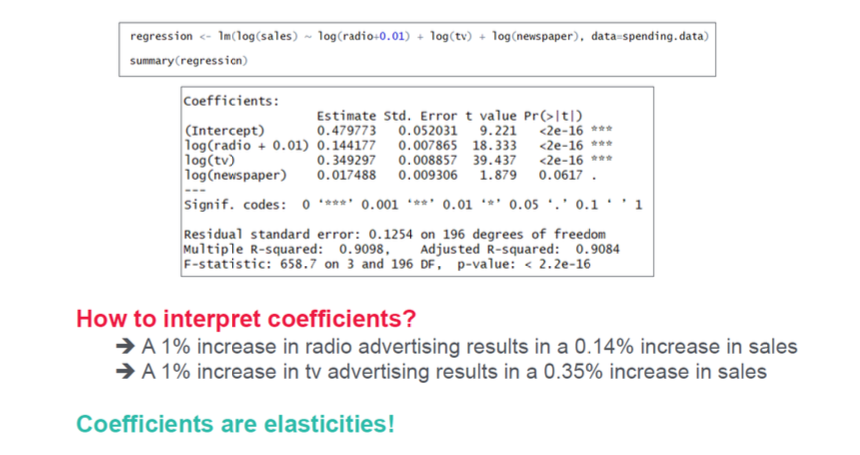

## 1.7 Modelling Media Synergy

- 组合使用营销组合工具可以产生协同效应。   
- 当多种媒体的联合影响超过它们各自部分的总和时，就会产生协同效应。  

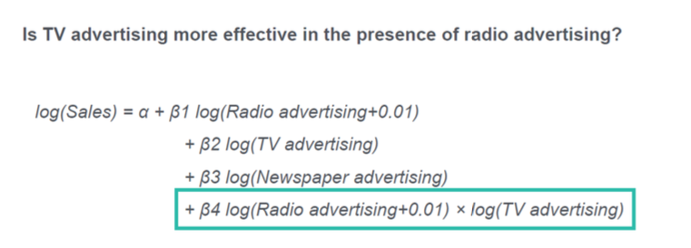

## 1.8 Modelling carryover effects

- 到目前为止，我们假设在给定时间段内的广告只会影响该时间段内的销售。  
- 实际上，消费者对广告的反应可能会有延迟。  
- 不考虑传递效应可能会导致低估广告弹性。  


- 广告储存指标衡量了当前时间段之后的广告效应
- 广告储存t = 当期广告t + λ * 广告储存t-1
- 在每个时间段中，你假设保留你之前广告储存的一部分（λ）
- 例如，如果λ等于0.3，则来自一个时间段之前的广告储存在当前时间段仍然有30%的影响

> How to calculate Adstock levels?   
Adstockt= Advertisingt+ λAdstockt-1

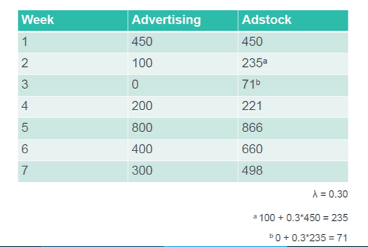

> Do it in R

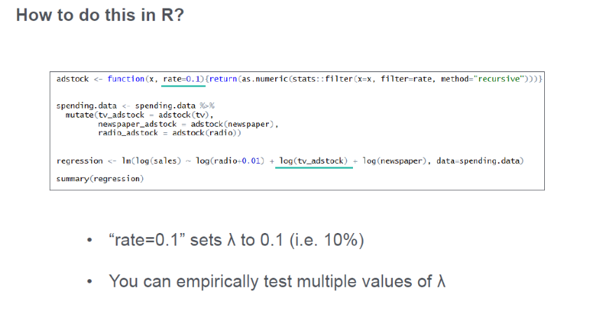

## 1.9 Building and Evaluating Market Response Model

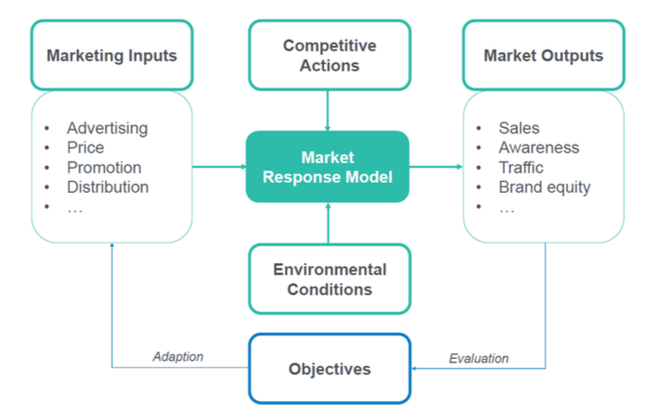

## 1.10 Takeaways

- 所有资源都是有限的。管理者必须在资源之间进行权衡，以制定有效的营销策略。
- 管理资源权衡的方法已经从纯启发式的时代发展到数据化时代，管理者依靠统计模型和详细信息。
- 基于响应模型的归因方法捕捉了过去营销资源和过去结果之间的关系。然后利用过去的数据可以揭示营销资源和绩效之间的关系。

# 2. Marketing Experiment

- Marketing experiment  
- AB testing  
- Multivariate testing  
- Natural experiment  
- Research examples  


营销实验测试客户对营销决策的反应，同时排除其他可能存在的混杂因素，这些因素在比较处理组和对照组时可能存在。  

- 何时使用？

1. 确定特定营销投资与客户或公司结果之间是否存在直接关系。
2. 根据它们的财务影响（例如，销售额增长）在一组投资策略和策略中进行选择。

## 2.1 Marketing Experiment: Components

- 实验归因方法涉及干预、结果、处理条件的设计以及对照条件。
- 决定测试哪些因素至关重要，实验很快就会变得非常复杂。

|Component|Definition|
|---------|----------|
|Intervention|A key marketing action whose effectiveness the firm seeks to document|
|Outcome|The key marketing gain for the firm implementing the experiment|
|Treatment|When, where, and to whom the firm administers the intervention|
|Control|A region, customer, or situation similar to the experimental intervention that remains unchanged during the experimental process|

## 2.2 Marketing Experiment: How it works


- 实验旨在建立自变量（营销投资）和结果之间的关系。

  - 必须建立一个良好的处理组和比较（对照）组。处理组是接受该处理的受试者群体（例如，消费者、销售人员）。对照组保持因果因素不变（例如，向另一组销售人员支付的佣金保持不变）。
  - 处理组和对照组在所有其他方面必须相似（例如，样本大小、人口构成、销售动机、经验）。在试验条件和对照条件之间，所有其他因素（至少是公司可控制的因素）都被有意地保持不变，这些因素可能会影响结果（例如，销售）。
  - 为了达到这个标准，通常使用随机分配。通过随机分配，从概率意义上来说，受试者接受处理的机会在不同组之间是相等的。

```
𝑌 𝑖 = 𝛽0 + 𝛽1𝑇𝑖 + 𝜀𝑖

- 𝑌 𝑖 是感兴趣的因变量；
- 𝑇𝑖 如果主体i被分配到处理组，则编码为1，否则为0，
- 系数 𝛽1 是处理效应。
- 𝜀𝑖 捕捉随机统计误差。
- 𝛽0 是截距。
```
在进行实验后，如果 𝛽1 在统计上显著，则处理效应是合法的。

- 根据分析的目标，实验可以采用两种不同的设计：

  1. “后验”设计：在客户接受营销活动后，测量营销行为对客户行为的影响。
  2. “前后对照”设计：在客户接受营销活动之前和之后，测量营销行为的影响。

## 2.3 Marketing Experiment: Example

鲜花送货公司DFG正在进行季度营销预算会议。一位经理指出公司每年在广告上花费了25万美元，质疑是否合理，或者DFG是否花费过多。在随后的内部讨论中，一些经理坚持认为地方电视广告对于建立品牌资产和产生收入至关重要；而另一些则认为公司花费过多。

### 2.3.1 Marketing Experiment: “after-only”

DFG决定进行一项受控的营销实验。将处理组和对照组匹配在已知属性上（例如人口统计学特征）。

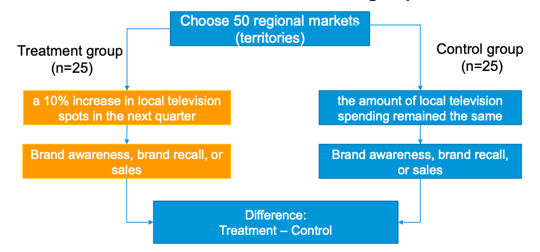

### 2.3.2 Marketing Experiment: “before-and-after”

DFG决定采用控制的营销实验，采用前后对照的设计。

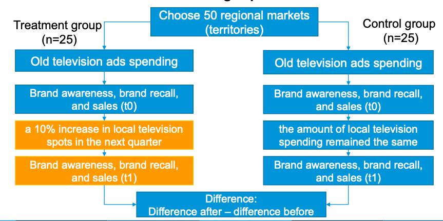

### 2.3.3 Case

- 随机分配顾客
- 分析
  - 比较各组以确定均值差异是否显著
  - T检验/方差分析/回归

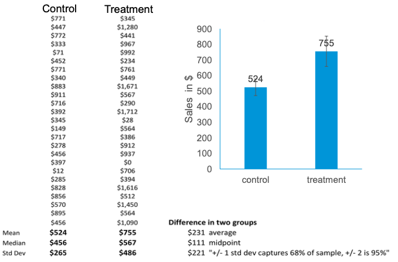

### 2.3.4 68-95-99.7 rule

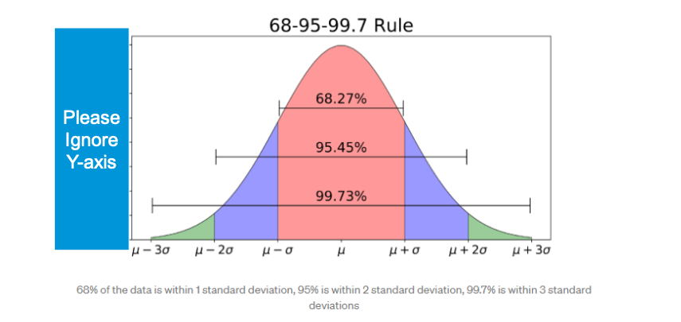

### 2.3.5 GOGOGO


- 公司估计了三个回归方程，从三个不同的模型中获得了系数 𝛽1，分别捕捉了由于地方电视广告增加而导致的品牌知名度、品牌回忆率和销售的统计变化。
- 在每个回归中，处理效应都是显著的：
  - 当DFG增加其地方电视广告时，处理区域的品牌知名度、品牌回忆率和销售分别增长了1.5％、3.2％和3％（与对照组相比）。
- DFG每年销售额为2500万美元，因此该实验使公司的决策者对地方电视广告带来的销售增长更有信心。因此，一项实验帮助解决了DFG内部的冲突。

## 2.4 A/B testing


- 使用实验设计比较一个设计的两个或更多变体
  1. 新想法
  2. 运行实验
  3. 分析结果
  4. 选择获胜的想法

- 强大且广泛使用的指标
  1. 转化率（例如点击率）
  2. 参与率（例如点赞、分享）
  3. 停留时间（例如在首页停留的秒数）

## 2.5 Multivariate testing

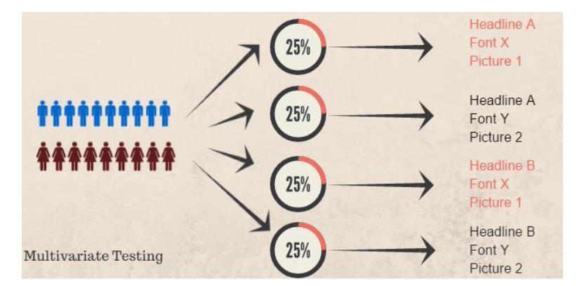

## 2.6 Natural Experiments: when to use

- 我们并不总是能够进行随机化
- 政策上的意外变化可以被视为“自然实验”。例如，对一些市场引入了新的退货政策。
- 即使在自然实验中，我们也需要确定哪个是处理组，哪个是对照组
  1. 处理组：受政策变化影响的组；例如，退货政策发生变化的市场。
  2. 对照组：不受政策变化影响的组；例如，退货政策保持不变的市场。

### 2.6.1 Natural Experiments: Difference-in-Difference

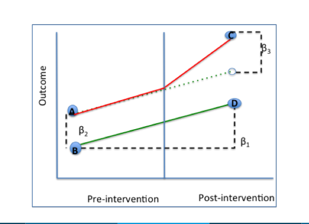


- 差异中的差异（DiD）试图通过研究自然实验中处理组与对照组之间的处理对结果变量的差异效应，来模拟实验研究设计。
- DiD利用面板数据来测量随时间发生的处理组和对照组之间结果变量的变化差异。
```
𝑌 𝑖 = 𝛽0 + 𝛽1t𝑖 + 𝛽2T𝑖 + 𝛽3 𝑇𝑖 × 𝑡𝑖 + 𝜀𝑖

- 𝑌 𝑖是依赖变量;
- 𝑡𝑖如果是介入后，则编码为1，如果是介入前，则编码为0；
- 𝛽1是控制组和处理组共同的时间趋势;
- 𝑇𝑖如果主体i分配到处理组，则编码为1，否则为0，
- 𝛽2是处理效应。
- 交互项𝑇𝑖 × 𝑡𝑖是DiD项
- 𝛽3是真实效应。
- 𝜀𝑖捕获了随机统计误差
- 𝛽0是截距
```

# 3 Takeaways

- 实验评估因果关系
- 通常使用T检验、方差分析或线性回归来比较组，以测试差异是否显著
- 网络实验（A/B测试）成本较低且速度较快
  ‒ 实验成本可以是可变的，而不是固定的
- 差异中的差异用于检验准实验，如自然实验。它测量了处理组和对照组在一段时间内结果变量的变化差异
