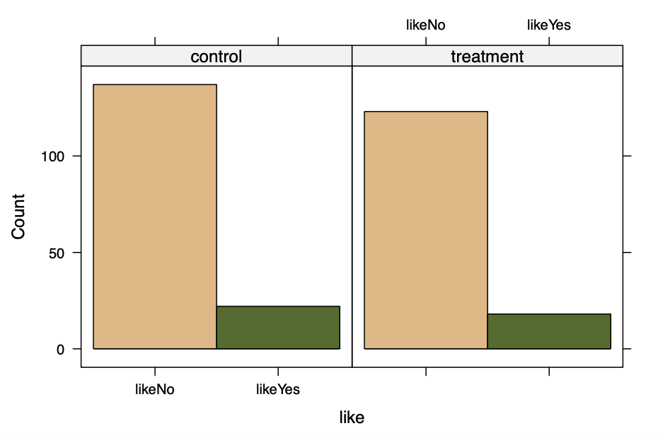
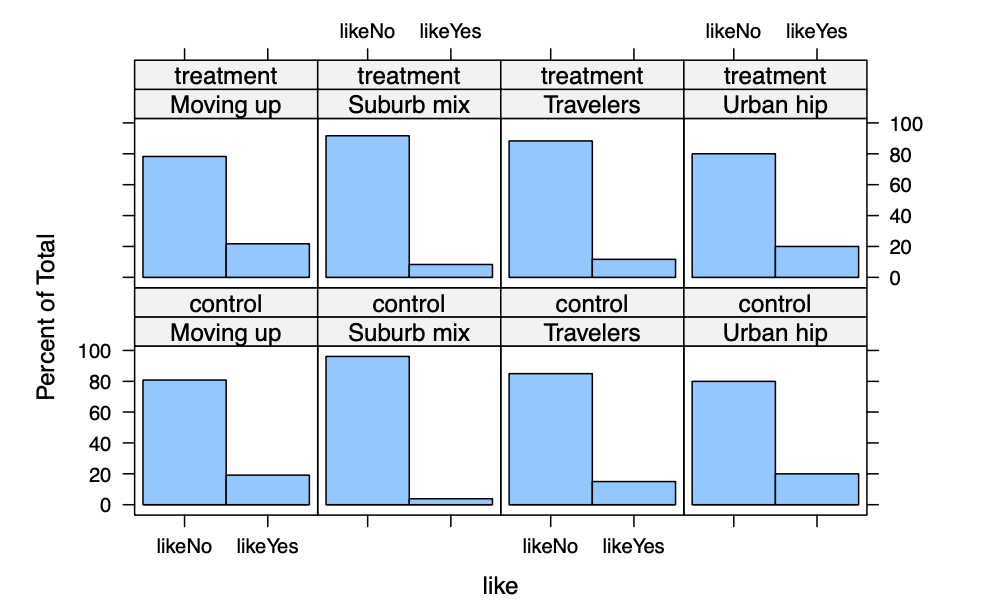
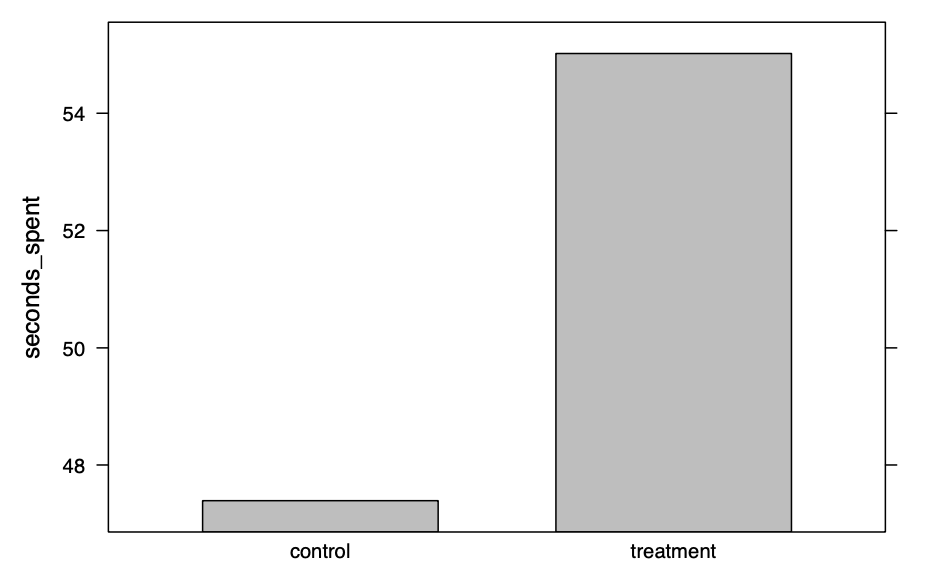
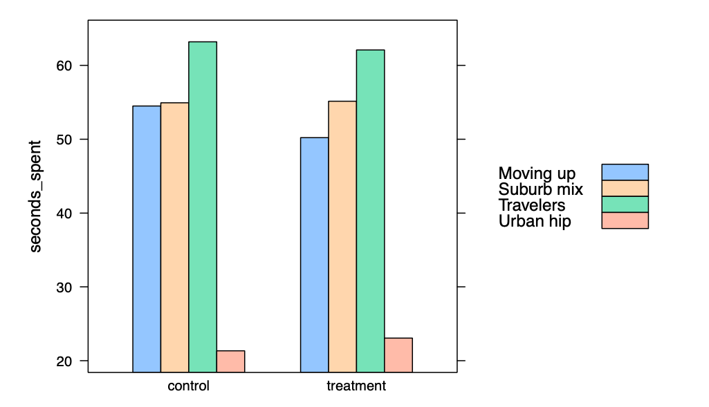
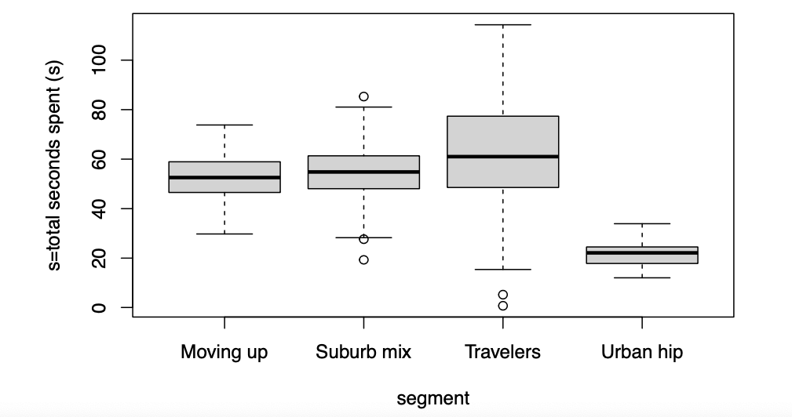
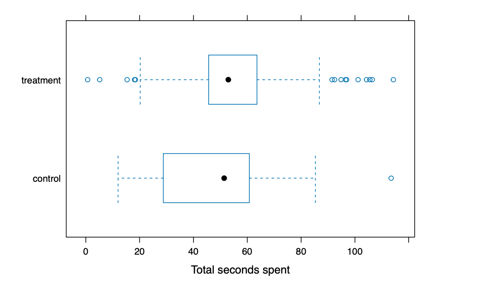
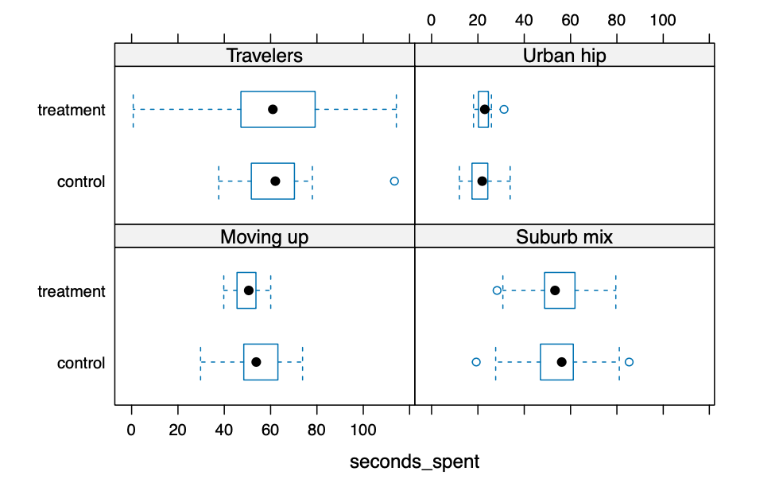

> R: 4.3.2 (2023-10-31)  
> R studio: 2023.12.1+402 (2023.12.1+402)

市场分析师经常研究不同群体之间的差异:
1. 按人群对数据进行分组：男性或女性更倾向于订阅我们的服务？哪个人口统计分段最有能力购买我们的产品？该产品更受房主还是租户的青睐？  
2. 按地理位置对数据进行分组：A地区的表现是否优于B地区？  
3. 按实验操作对数据进行分组：广告版本A的转化率是否高于广告版本B？  
4. 按时间对数据进行分组：类似邮件或促销活动后，同店销售是否增加了？  
在所有这些情况下，我们将一个数据组与另一个数据组进行比较，以识别效应。本教程探讨了市场营销中经常出现的这些比较类型。  

# 1 Descriptives by group

我们使用消费者细分数据。我们对两个新开发的广告（叙事型 vs. 信息型）的效果感兴趣，并收集了来自300名受访者的数据，包括他们的年龄、性别、子女数量、是否喜欢广告以及他们在页面上花费的时间。在这些数据中，每个受访者来自我们的四个消费者细分之一：郊区混合、都市潮流、旅行者或晋升中。

```
> ad.df <- read.csv("Data_Compare_Groups.csv", stringsAsFactors = TRUE) 

> summary(ad.df)
     condition        like     seconds_spent         age           gender         kids            segment   
 control  :159   likeNo :260   Min.   :  0.69   Min.   :19.00   Female:157   Min.   :0.00   Moving up : 70  
 treatment:141   likeYes: 40   1st Qu.: 39.66   1st Qu.:33.00   Male  :143   1st Qu.:0.00   Suburb mix:100  
                               Median : 52.02   Median :39.50                Median :1.00   Travelers : 80  
                               Mean   : 50.98   Mean   :41.17                Mean   :1.27   Urban hip : 50  
                               3rd Qu.: 61.41   3rd Qu.:48.00                3rd Qu.:2.00                   
                               Max.   :114.28   Max.   :80.00                Max.   :7.00   
> str(ad.df)
'data.frame':	300 obs. of  7 variables:
 $ condition    : Factor w/ 2 levels "control","treatment": 1 2 2 1 2 2 1 1 1 2 ...
 $ like         : Factor w/ 2 levels "likeNo","likeYes": 1 1 1 1 1 1 1 1 1 1 ...
 $ seconds_spent: num  49.5 35.5 44.2 81 79.3 ...
 $ age          : int  47 31 43 37 41 43 38 28 44 35 ...
 $ gender       : Factor w/ 2 levels "Female","Male": 2 2 2 1 1 2 2 2 1 1 ...
 $ kids         : int  2 1 0 1 3 4 3 0 1 0 ...
 $ segment      : Factor w/ 4 levels "Moving up","Suburb mix",..: 2 2 2 2 2 2 2 2 2 2 ...
```

我们对广告的两个版本在诸如浏览时长和喜欢程度等指标上的变化感兴趣。   

一种临时的方法是使用数据框索引：找到符合某些条件的行，然后取另一个统计量的平均值。例如，要找出叙事型广告（处理组）的平均总浏览时长。   

```
> mean(ad.df$seconds_spent[ad.df$condition == "treatment"])
[1] 55.01809

> # We could further narrow the cases to Moving up respondents who are in the treatment condition:
> mean(ad.df$seconds_spent[ad.df$condition == "trea ..." ... [TRUNCATED] 
[1] 50.21652
```

## 1.1 aggregate()

当你想要找到多个组的值时，一个更通用的方法是使用aggregate()函数。

```
> aggregate(ad.df$seconds_spent, list(ad.df$condition), mean)
    Group.1        x
1   control 47.39132
2 treatment 55.01809
```

## 1.2 Basic formula syntax

R通过公式规范提供了描述变量之间关系的标准方法。一个公式使用波浪线（~）运算符将左侧的响应变量与右侧的解释变量分开。基本形式是：   
```
y ~ x（简单公式）  
``` 
这在R的许多情境中使用，其中响应和解释的含义取决于情况。例如，在线性回归中，上述简单公式将y建模为x的线性函数。在aggregate()命令的情况下，效果是根据x的水平对y进行聚合。    
让我们实践一下。不使用aggregate(ad.dfsecondsspent,list(ad.dfcondition), mean)的方式，而是使用通用形式aggregate(formula, data, FUN)。在我们的例子中，我们告诉R“在数据集ad.df中按照条件取seconds_spent，并对每个组应用平均函数”。    
```
> aggregate(seconds_spent ~ condition, data = ad.df, mean)
  condition seconds_spent
1   control      47.39132
2 treatment      55.01809
```

## 1.3 Descriptives for two-way groups

在市场营销中的一个常见任务是交叉制表，根据两个（或更多）因素将客户分成组。公式语法使得通过指定多个解释变量来计算交叉制表变得容易：

y ~ x1 + x2 + . . . (Multiple variable formula)

### 1.3.1 Means

利用这种格式与aggregate()，我们可以这样写：
```
> aggregate(seconds_spent ~ segment + condition, data = ad.df, mean)
     segment condition seconds_spent
1  Moving up   control      54.49787
2 Suburb mix   control      54.93308
3  Travelers   control      63.18900
4  Urban hip   control      21.33800
5  Moving up treatment      50.21652
6 Suburb mix treatment      55.14312
7  Travelers treatment      62.08533
8  Urban hip treatment      23.05800
```

现在，我们为每个段和条件的组合都有一个单独的组，并且可以开始看到seconds_spent与段和条件变量之间的关系。  

我们可以将结果分配给一个数据框对象并进行索引：

```
agg.data <- aggregate(seconds_spent ~ segment + condition, data = ad.df, mean)
```

aggregate()命令允许我们计算连续变量的函数，例如seconds_spent或like的平均值，适用于任何因素的组合（如段、条件等）。这是市场研究中的一个常见任务，许多公司专门生产交叉制表。

### 1.3.2 Frequencies

```
> table(ad.df$condition, ad.df$like)
           
            likeNo likeYes
  control      137      22
  treatment    123      18

> table(ad.df$segment, ad.df$like)
            
             likeNo likeYes
  Moving up      56      14
  Suburb mix     94       6
  Travelers      70      10
  Urban hip      40      10
```

我们可以将计数相加以找到它们的总数。例如，kids是一个计数变量；如果一个受访者报告有3个孩子，那么这就是一个计数为3，我们可以将计数相加以得到每个段中报告的孩子总数。我们可以使用aggregate(. . . , sum)：

```
> aggregate(kids ~ segment, data = ad.df, sum)
     segment kids
1  Moving up  134
2 Suburb mix  192
3  Travelers    0
4  Urban hip   55
```

结果显示，“都市上升”受访者报告了总共55个孩子，而“旅行者”没有报告。

# 2 Visualization by group

## 2.1 Visualizing frequencies and proportions

Lattice包提供了一个有用的解决方案：histogram (formula, data, type)。它理解公式的概念，包括对因子进行条件划分（" | "），这意味着根据因子将绘图分成多个面板。

```
histogram(~ like | condition, data = ad.df)
```

结果显示，两个广告版本生成的喜欢程度相似。   
你会注意到在这个公式中，波浪线（~）前面没有响应变量，只有它后面的解释变量（condition）。histogram()默认情况下，假设我们想要绘制每个喜欢程度水平上的人群比例。我们在条件上进行了绘图，告诉histogram为每个段生成一个单独的直方图。    
histogram()的默认方式是在每个组内绘制比例，使得值相对于组的大小。如果我们想要实际计数，可以包含参数type = "count"。   



我们可以通过使用“+”在多个因素上添加条件。例如，每个段内的订阅者比例如何根据住房所有权来计算？



结果告诉我们，根据广告条件在段内的喜欢程度差异很小。这意味着两个广告版本在喜欢程度上产生的差异很小。

## 2.2 Visualizing continuous data

在前面的部分中，我们看到了如何绘制计数和比例。那么连续数据呢？我们如何绘制我们数据中按条件分组的总浏览时间？一个简单的方法是使用aggregate()来找到平均总时间，然后使用lattice包中的barchart()来绘制计算出的值：

```
> ad.mean <- aggregate(seconds_spent ~ condition, data = ad.df, mean)

> barchart(seconds_spent ~ condition, data = ad.mean, col = "grey")
```



我们如何进一步按段拆分数据？首先，我们必须对数据进行聚合，以在公式中包括两个因素。然后，我们通过添加参数groups=factor，告诉barchart()使用段作为分组变量。

```
> ad.seconds.agg <- aggregate (seconds_spent ~ condition + segment, data = ad.df, mean) 

> barchart(seconds_spent ~ condition, data = ad.seconds.agg ,groups = segment, auto.key=TRUE)
```



用于比较不同组的连续数据值（如不同组的seconds_spent）的更具信息性的图表是箱线图。箱线图比柱状图更好，因为它显示了更多关于值分布的信息。



### 2.2.1 bwplot() *


对于箱线图的更好选择是lattice包中的bwplot()命令，它提供了更漂亮的图表，并且允许多因素条件化。需要注意的一点是，bwplot()使用的模型公式方向与你可能期望的相反；你写的是condition ~ seconds_spent。我们按段绘制水平箱线图如下：

```
bwplot(condition ~ seconds_spent, data = ad.df, horizontal = TRUE, xlab = "Total seconds spent")
```



我们可以将处理条件作为一个条件变量：
```
bwplot(condition ~ seconds_spent | segment, data = ad.df, horizontal = TRUE, xlab = "seconds_spent")
```




对于按段和广告条件分组的总浏览时长的条件化图表显示，旅行者细分中处于处理组的人的总浏览时长分布比处于对照组的人的分布要宽得多。

# 3 Statistical tests

除了使用上面描述的组平均值和交叉制表总结组间的差异外，一个优秀的分析师能够使用统计检验来确定差异是否真实，或者可能是由于数据中的微小变化（“噪音”）造成的。我们应该专注于帮助识别真实差异的统计检验。

## 3.1 Testing group frequencies: chisq.test()


卡方检验用于频率计数，例如由table产生的计数。卡方检验确定单元格中的频率是否与基于它们的总计数的预期值显着不同。在R中，我们使用chisq.test()命令。一般来说，chisq.test()操作在一个表上。   
喜欢行为是否独立于条件？也就是说，在我们的数据中，受访者无论看到哪个版本的广告，他们都同样可能喜欢吗？我们构建一个二维表并对其进行测试：

```
> table(ad.df$like, ad.df$condition)
         
          control treatment
  likeNo      137       123
  likeYes      22        18

> chisq.test(table(ad.df$like, ad.df$condition))

	Pearson's Chi-squared test with Yates' continuity correction

data:  table(ad.df$like, ad.df$condition)
X-squared = 0.010422, df = 1, p-value = 0.9187
```


在这种情况下，零假设是因素之间没有关联。也就是说，单元格中的计数与边际比例一样符合预期。基于较高的p值，我们无法拒绝零假设，并得出结论：因素之间没有关联，喜欢与条件在我们的数据中是独立的。喜欢和条件之间没有关系。

## 3.2 Testing group means: t.test()

t检验比较一个样本的平均值与另一个样本的平均值（或与一个特定值，如0）之间的差异。重要的是，它比较了完全两组数据的平均值。例如，在数据中，我们可能会询问两种广告条件之间的总浏览时间是否有所不同。   
我们使用t.test(formula, data)测试两组之间的浏览时间（处理组 vs. 控制组）的差异：  

```
> t.test(seconds_spent ~ condition, data = ad.df)

	Welch Two Sample t-test

data:  seconds_spent by condition
t = -3.3297, df = 286.45, p-value = 0.0009832
alternative hypothesis: true difference in means between group control and group treatment is not equal to 0
95 percent confidence interval:
 -12.135137  -3.118392
sample estimates:
  mean in group control mean in group treatment 
               47.39132                55.01809 
```

在t.test()输出中有几个重要的信息：
1. t统计量为-3.12，p值为0.0010。这意味着拒绝了没有广告条件下浏览时间差异的零假设。这表明在处理组看到广告版本的人花费了更长的时间。   
2. 差异的95%置信区间为-12.14到-3.12。我们可以有95%的信心认为组之间的差异在这些值之间。    
3. 我们数据的样本均值：控制条件下的平均总浏览时间为47.39132，处理条件下为55.01809。    

在旅行者细分中的差异如何？我们可以使用过滤数据=子集数据, 条件选择只有旅行者，并重复测试：

```
> t.test(seconds_spent ~ condition, data = subset(ad.df, segment == "Travelers"))

	Welch Two Sample t-test

data:  seconds_spent by condition
t = 0.22758, df = 52.758, p-value = 0.8209
alternative hypothesis: true difference in means between group control and group treatment is not equal to 0
95 percent confidence interval:
 -8.624575 10.831909
sample estimates:
  mean in group control mean in group treatment 
               63.18900                62.08533 
```

置信区间从-8.62到10.83包含了0，并且p值为0.82。因此，我们得出结论，在我们的数据中，旅行者中两个条件之间的平均浏览时间没有显著差异。

## 3.3 Testing multiple-group means: ANOVA

方差分析（ANOVA）比较多个组的平均值。零假设是多个平均值之间没有差异。   
ANOVA可以处理单个因素（称为单因素ANOVA）、两个因素（双因素）、以及更高阶的因素，包括因素之间的交互作用。   
ANOVA的基本R命令是aov(formula, data)来设置模型，然后是anova(model)来显示标准的ANOVA汇总。    
例如，我们想要回答这个问题：浏览时间与条件、段成员资格或两者之间是否相关？我们可以将seconds_spent建模为对条件的响应：   
```
> ad.aov.con <- aov(seconds_spent ~ condition, data = ad.df) 

> anova(ad.aov.con)
Analysis of Variance Table

Response: seconds_spent
           Df Sum Sq Mean Sq F value    Pr(>F)    
condition   1   4347  4346.9  11.195 0.0009251 ***
Residuals 298 115706   388.3                      
---
Signif. codes:  0 ‘***’ 0.001 ‘**’ 0.01 ‘*’ 0.05 ‘.’ 0.1 ‘ ’ 1
```

在两个条件之间的浏览时间存在显著差异（与我们从t检验中得出的结论相同）。   

为了测试浏览时间是否同时受到条件和段的影响，我们可以将两个因素都添加到ANOVA模型中进行测试：    

```
> anova(aov(seconds_spent ~ segment + condition, data = ad.df)) # combine two commands
Analysis of Variance Table

Response: seconds_spent
           Df Sum Sq Mean Sq F value Pr(>F)    
segment     3  55237 18412.2 83.8824 <2e-16 ***
condition   1     64    63.9  0.2913 0.5898    
Residuals 295  64753   219.5                   
---
Signif. codes:  0 ‘***’ 0.001 ‘**’ 0.01 ‘*’ 0.05 ‘.’ 0.1 ‘ ’ 1
```

结果表明，当我们尝试用段和条件来解释总浏览时间的差异时，段是一个显著的预测因子，但条件不是一个显著的预测因子。然而，先前的结果表明条件是显著的。这种差异是什么？这意味着段和条件不是独立的，而且段成员资格单独就足以捕捉到效应。条件仅仅比段解释了稍微多一点。

### 3.3.1 Visualize ANOVA result


可视化ANOVA结果的一个好方法是绘制组均值的置信区间。我们使用multcomp（多重比较）包和它的glht(model)（一般线性假设）命令。  
默认的aov()模型具有一个截距项（对应于一个段），而所有其他段相对于该截距项。这可能会让决策者或客户难以理解，因此我们发现最好通过在模型公式中添加“0”来移除截距项：  

```
> ad.aov <- aov (seconds_spent ~ 0 + segment, data = ad.df) 

> glht(ad.aov)

	 General Linear Hypotheses

Linear Hypotheses:
                       Estimate
segmentMoving up == 0     53.09
segmentSuburb mix == 0    55.03
segmentTravelers == 0     62.36
segmentUrban hip == 0     21.68
```

在移除截距项后，glht()为我们提供了每个段的均值。我们使用plot()函数绘制它，使用par(mar =. . . )命令为长轴标签添加一些额外的边距：

```
# cex.axis = 0.8 makes the axis labels smaller to 80%.
> plot(glht(ad.aov),
+      xlab = "Total seconds spent", main = "Average seconds spent by Segment (95% CI)", cex.axis = 0.8)
```

点表示每个段的均值，条形图反映了置信区间。我们可以看到每个段中平均浏览时间的置信区间。很明显，都市潮流段成员的平均浏览时间明显低于其他三组。

## 3.4 Testing group means: lm()

你也可以使用lm()回归来比较组，当响应变量是连续变量时，比如总浏览时间。                
分组变量（因子）必须被重新编码为虚拟变量（即取0和1为值的变量）。例如，因子“条件”（包括“对照”和“处理”）应该被重新编码为“dummy_condition: 0 = 对照，1 = 处理”。   
具有多于两个水平的因子（n）应该使用多个虚拟变量（n-1）进行重新编码。例如，段有四个水平，可以使用三个虚拟变量进行重新编码：dummy_s，dummy_u，dummy_t：   
```
郊区混合：dummy_s = 1，dummy_u = 0，dummy_t = 0
都市潮流：dummy_s = 0，dummy_u = 1，dummy_t = 0
旅行者：dummy_s = 0，dummy_u = 0，dummy_t = 1
晋升中：dummy_s = 0，dummy_u = 0，dummy_t = 0（参考水平）
```

虚拟变量应该作为预测变量输入模型。
```
> ad.df.reg <- ad.df %>%
+   mutate(dummy_condition = ifelse(condition == "treatment",1,0),
+          dummy_s = ifelse(segment == "Suburb mix",1,0),  .... [TRUNCATED] 

> regression <- lm(seconds_spent ~ dummy_condition, data = ad.df.reg) 

> summary(regression)

Call:
lm(formula = seconds_spent ~ dummy_condition, data = ad.df.reg)

Residuals:
   Min     1Q Median     3Q    Max 
-54.33 -11.02   0.97  12.10  66.07 

Coefficients:
                Estimate Std. Error t value Pr(>|t|)    
(Intercept)       47.391      1.563  30.327  < 2e-16 ***
dummy_condition    7.627      2.279   3.346 0.000925 ***
---
Signif. codes:  0 ‘***’ 0.001 ‘**’ 0.01 ‘*’ 0.05 ‘.’ 0.1 ‘ ’ 1

Residual standard error: 19.7 on 298 degrees of freedom
Multiple R-squared:  0.03621,	Adjusted R-squared:  0.03297 
F-statistic:  11.2 on 1 and 298 DF,  p-value: 0.0009251
```

```
> regression <- lm(seconds_spent ~ dummy_s + dummy_u + dummy_t, data = ad.df.reg) 

> summary(regression)

Call:
lm(formula = seconds_spent ~ dummy_s + dummy_u + dummy_t, data = ad.df.reg)

Residuals:
    Min      1Q  Median      3Q     Max 
-61.671  -7.059  -0.442   6.281  51.919 

Coefficients:
            Estimate Std. Error t value Pr(>|t|)    
(Intercept)   53.091      1.769  30.017  < 2e-16 ***
dummy_s        1.943      2.306   0.842 0.400214    
dummy_u      -31.409      2.740 -11.463  < 2e-16 ***
dummy_t        9.270      2.422   3.828 0.000158 ***
---
Signif. codes:  0 ‘***’ 0.001 ‘**’ 0.01 ‘*’ 0.05 ‘.’ 0.1 ‘ ’ 1

Residual standard error: 14.8 on 296 degrees of freedom
Multiple R-squared:  0.4601,	Adjusted R-squared:  0.4546 
F-statistic: 84.08 on 3 and 296 DF,  p-value: < 2.2e-16
```

## 3.5 Difference-in-Difference

```
> panel.df.raw <- read.csv("Data_Panel.csv", stringsAsFactors = TRUE) 

> str(panel.df.raw)
'data.frame':	70 obs. of  3 variables:
 $ market: Factor w/ 7 levels "A","B","C","D",..: 1 1 1 1 1 1 1 1 1 1 ...
 $ year  : int  2010 2011 2012 2013 2014 2015 2016 2017 2018 2019 ...
 $ profit: num  13428 -18997 -112 26458 30083 ...
```

创建一个虚拟变量来指示治疗开始的时间。假设治疗始于2014年。在这种情况下，2014年之前的年份将取值为0，2014年之后的年份将取值为1。

```
> panel.df<-panel.df.raw %>%
+   mutate(time = ifelse(panel.df.raw$year >= 2014, 1, 0))
```

然后，我们创建一个虚拟变量来识别接受治疗的群体。在这个例子中，市场5、6和7是治疗组（=1）。市场1-4没有受到影响（=0）。

```
panel.df<-panel.df %>%
  mutate(treatment = ifelse(panel.df$market == "E" |
                              panel.df$market== "F" |
                              panel.df$market == "G", 1, 0))
```

创建一个时间和受治疗之间的交互项。我们将这个交互项称为“did”。

```
> panel.df<-panel.df %>% mutate(did = time * treatment)

> str(panel.df)
'data.frame':	70 obs. of  6 variables:
 $ market   : Factor w/ 7 levels "A","B","C","D",..: 1 1 1 1 1 1 1 1 1 1 ...
 $ year     : int  2010 2011 2012 2013 2014 2015 2016 2017 2018 2019 ...
 $ profit   : num  13428 -18997 -112 26458 30083 ...
 $ time     : num  0 0 0 0 1 1 1 1 1 1 ...
 $ treatment: num  0 0 0 0 0 0 0 0 0 0 ...
 $ did      : num  0 0 0 0 0 0 0 0 0 0 ...
```

### 3.5.1 Estimating the DID estimator

```
> didreg <- lm(profit ~ treatment + time + did, data = panel.df) 

> summary(didreg)

Call:
lm(formula = profit ~ treatment + time + did, data = panel.df)

Residuals:
   Min     1Q Median     3Q    Max 
-97675 -16228   1167  13928  68071 

Coefficients:
            Estimate Std. Error t value Pr(>|t|)  
(Intercept)     3581       7382   0.485   0.6292  
treatment      17760      11276   1.575   0.1200  
time           22894       9530   2.402   0.0191 *
did           -25195      14557  -1.731   0.0882 .
---
Signif. codes:  0 ‘***’ 0.001 ‘**’ 0.01 ‘*’ 0.05 ‘.’ 0.1 ‘ ’ 1

Residual standard error: 29530 on 66 degrees of freedom
Multiple R-squared:  0.08273,	Adjusted R-squared:  0.04104 
F-statistic: 1.984 on 3 and 66 DF,  p-value: 0.1249
```

“did”的系数是差异中的差异估计量。治疗效应在10%的显著性水平下具有边际意义，治疗效应为负。

# 4 Takeaways

- 在描述和可视化组数据时：

  - aggregate()更强大；它理解公式模型，并生成一个可重用的、可索引的对象来存储结果。
  - 频率可以使用table()函数找到。
  - 对于某个因子的比例和出现频率的图表，lattice包中的histogram()命令非常合适。
  - 对于因子的连续数据绘图，可以使用barchart()，或者更好的是使用box-and-whiskers plots（箱线图）和boxplot()。lattice包通过公式规范和bwplot()命令扩展了这样的绘图到多个因子。
- 在进行组间差异的统计测试时：
  - chisq.test()函数用于在表格数据上找到置信区间，并进行假设检验。
  - t.test()是检验两组（或一组和一个固定值）均值差异的常见方法。
  - 方差分析（ANOVA）是一种更一般的方法，用于测试由一个或多个因素识别的多个组之间的均值差异。基本模型使用aov()拟合，常见的汇总统计量使用anova()报告。
  - anova()命令还可以用于比较两个或更多ANOVA模型或其他线性模型，前提是它们是嵌套模型。
  - 从multicomp包中绘制glht()对象是可视化ANOVA模型置信区间的好方法。
  - 线性回归lm()是检查组间差异的更一般的方法。对于分组变量，虚拟编码很重要。
  - 差异-差异是通过检查治疗和时间之间的交互项系数来测试的。
