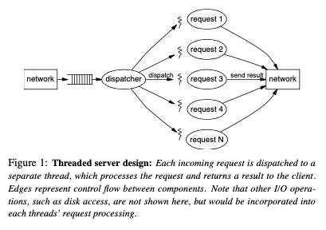
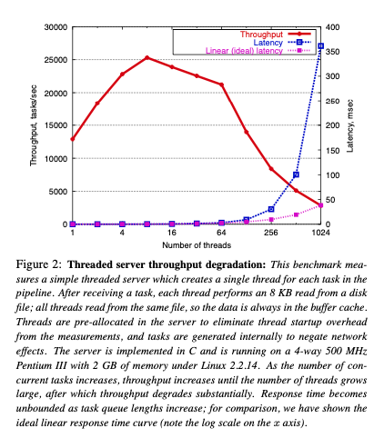
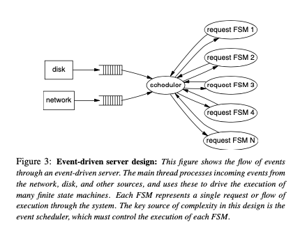
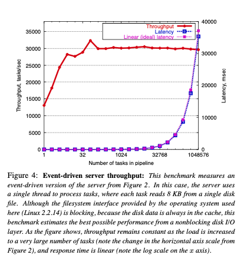
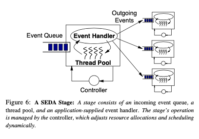
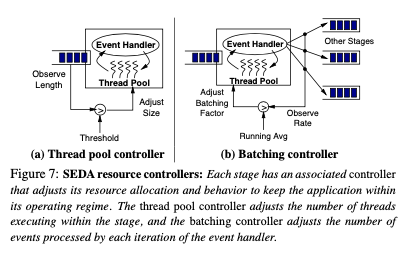
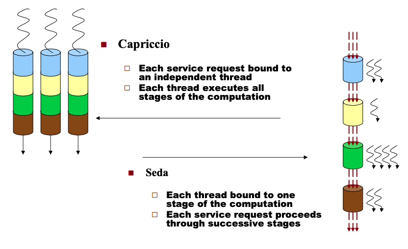

*兼二者之长*

# Seda 

## 背景
SEDA主要汇聚了两类模型：使用基于线程的并发模型来简化编程，使用基于事件的模型来实现广泛的并发。  
直观地说，如果一个服务的行为像一个简单的管道，那么它就是good的。管道的承载量是由网络的路径和服务自身的处理阶段决定的。随着提供负载的增加，交付的吞吐量按比例增加，直到管道满，吞吐量饱和;附加负载不应该降低吞吐量。同样，在轻负荷下，服务的响应时间大致是恒定的，因为它受管道深度的影响。当负载接近饱和时，排队延迟占主导地位。在许多服务的典型的闭环场景中，每个客户端在交付下一个请求之前等待一个响应，响应时间应该随客户端数量线性增加。  
一个good的服务的关键特性是平稳的降级:当提供的负载超过容量时，服务保持高吞吐量，并以线性的响应时间惩罚影响所有的客户端，或者至少根据某些特定策略进行预测。请注意，典型的Web体验却是相反的，随着负载的增加，吞吐量下降，响应时间急剧增加，造成服务崩溃的印象。  

### Thread-based

特点是编程容易，每个请求一个线程彼此独立处理。但是和线程相关的开销在线程数量很大的时候可能会造成性能的严重下降，例如缓存或者TLB的未命中、调度开销或者锁的竞争。而且，现在的操作系统（或者这里可以指代为编程语言）在努力以一种对应用程序透明的方式，虚拟化硬件资源。在这种背景下，应用程序很少有机会能够参与系统范围内的资源管理、决策，或者了解到当前系统的资源可用情况，来适应、调整自己的调度分配。操作系统资源的虚拟化，实际上是隐藏了资源有限和资源共享的事实。

### Bounded thread pools(Without a Queue)

在这种情况下，有一种解决方案 - 有限的线程池大小。在超出固定限制的时候，新链接不会被接受。通过限制最大并发量的方式，来保证系统维持在高性能的状态下。但是这种情况会造成客户端等待时间*任意*长（不可控。理想情况下是等待时间成线性增长）。  
同时，这种情况下很难识别一个流中的瓶颈在哪里，因为从宏观层面上只能看到“池”被用完了。因此，需要对于资源的纵向切分。

### Event-driven

线程驱动的情况下，服务器仅由少量线程构成，线程们循环处理队列中的事件。事件驱动将长链路的任务处理，转换成FSM，状态转换通过事件触发，不再依赖于线程上下文。  
事件驱动在负载方面健壮，当负载逐渐逼近并超过最大负载量的时候，吞吐量几乎不会下降，并且后续请求会堆积在队列中，延迟线性增加。  
但需要注意的是，应尽量避免事件处理过程的阻塞发生（其实在单线程情况下亦如此）

## Structured event queues(common now)

针对事件驱动，人们提出改进方案（感觉可以理解为去中心化）。使用一组事件队列以完成模块化，简化设计。
例如：解耦两个组件的执行，从而提高了模块化和鲁棒性。聚合多个类似事件的执行，增强局部性，从而提高性能。

# The Staged Event-Driven Architecture: 高并发 & 负载调节

## 目标
1. 防止过载造成的性能下降
2. 事件驱动，灵活扩展
3. 模块化
4. 资源调度控制器
5. 队列分析（根据优先级、负载排序）

## Stages as robust building blocks

Stage: self-contained    
> Event Handler: 事件处理程序/逻辑  
> Event Queue: 事件队列  
> Thread pool: 线程池  
> Controller: 控制调度和资源分配  

取出一批事件 -> 处理 -> 放入下一阶段的队列。其中，取出的批量大小和处理的线程池大小通过controller进行控制。  

> 阶段线程的操作方式是将一批事件从传入的事件队列中取出，并调用应用程序提供的事件处理程序。事件处理程序处理每一批事件，并通过将它们排队到其他阶段的事件队列中来调度零个或多个事件。  
> 线程是SEDA中的基本并发机制，但是它们的使用被限制在每个阶段的少量线程，而不是系统中的每个任务一个线程。此外，使用动态控制可以根据需要自动调整分配给每个阶段的线程数量。根据线程系统和调度器的特点，这种设计允许阶段按顺序或并行运行，或两者的结合。在本文中，我们假设SMP环境中有优先的、os支持的线程，尽管这种选择不是SEDA设计的基础。例如，可以设计一个线程系统，它可以识别应用程序的阶段结构，并相应地调度线程。   
> 每个阶段的核心逻辑都由事件处理程序提供，事件处理程序的输入是一批多个事件。事件处理程序不能直接控制队列操作或线程。通过将核心应用程序逻辑与线程管理和调度分离，阶段能够控制事件处理程序的执行，以实现各种资源管理策略。例如，传递给事件处理程序的事件的数量和顺序可以由运行时环境在外部控制。但是，应用程序也可以通过过滤或重新排序传递给它的事件批处理来实现自己的调度策略。  

## Details
1. 队列满了怎么办
> 背压  
> 报错  
> 降级  
2. 两个stage之间应该通过队列通信，还是直接使用子程序调用
> 通过队列的好处是，可以提供两个stage之间的隔离，模块化和负载管理。代价是增加延迟。  

##  Dynamic resource controllers
1. 目的：控制器根据观察到的，每个Stage的性能和需求自动调整Stage的资源使用情况。控制器观察阶段的运行他正，调整分配和调度参数以满足性能目标。控制器既可以了解某个特定阶段的局部情况，也可以基于全局状态协同工作。

2. 文章提供了几种控制器的实现形式
1) 线程池数量控制器。保证有*足够*的线程处理Stage，防止过多或者过少分配。周期性采样输入队列，当队列长度超过某个阈值的时候添加线程；当线程空闲时间超过阈值的时候，去掉线程。  
2) 批处理控制器，它调整每个阶段(批处理因子)中事件处理程序的每次调用所处理的事件数量。比如，如果某些任务可以进行组合、聚合的情况下，大批量的事件读入可以提高处理效率。不过这个就需要根据实际情况看了，见仁见智。控制器尝试寻找高吞吐的批量因子。它可以观察stage的输出速率，逐步减少批量因子，直到速率出现下降（然后稍微增多）。在输出速度突然下降时，可以将batch size提升到最大值。

除此之外，控制器还可以根据优先级调整线程池大小，或者给一个全局阈值。还可以根据Stage的进度调整。

# Compare with Procedure-oriented

## Procedure-oriented

优点：  
1. 架构简单明了，易于实现  
2. 各环节在在同一线程/进程内完成，易于追踪  
3. 实时性强，任务从一而终  

缺点：  
1. 组件结耦不好，边界不清晰
2. 由于资源竞争、锁等待等原因，会发生性能下降

## Seda

优点(其实也是事件驱动的优点)：  
1. 解耦：Stage之间通过事件通信  
2. 异步：各个环节通过事件关联，所以服务间不会block。带来执行的可调度性，资源分配的动态性  
3. 灵活：对Stage施加自定义操作（如监控、日志、限流、降级、熔断等）相当容易  
4. 独立：服务间的吞吐也被拆解了，各个服务可以专注于自己的实现，按照自己的处理速度处理  
5. 缓冲：保持吞吐

缺点：  
1. 对于一个任务，可能会增加延时（出入队列）
2. 开发不便