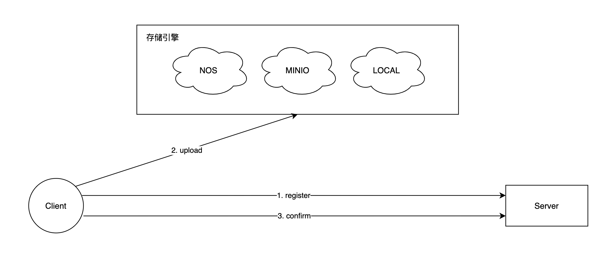
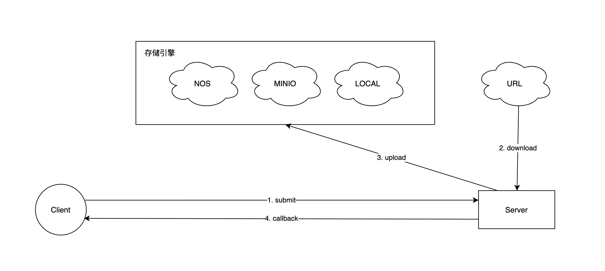

# 表

## file
|字段|类型|说明|
|----|----|----|
|id|long, primary key|自增主键|
|file_id|varchar, business key|业务主键，文件Id|
|fs_key|varchar|文件存储key|
|file_md5|varchar|文件md5|
|create_time|datetime|创建时间|
|update_time|datetime|更新时间|

## file_owner
|字段|类型|说明|
|----|----|----|
|id|long, primary key|自增主键|
|file_id|varchar, business key|业务主键，文件Id|
|file_name|varchar|文件名|
|file_type|varchar|文件类型|
|status|integer|状态；0失效，1有效，2排队中，3上传中，4下载中，-3上传失败，-4下载失败|
|owner_id|varchar|拥有者Id|
|create_time|datetime|创建时间|
|update_time|datetime|更新时间|

## file_download
|字段|类型|说明|
|----|----|----|
|id|long, primary key|自增主键|
|file_download_id|varchar, business key|业务主键，文件下载Id|
|file_id|varchar, business key|业务主键，文件Id|
|file_origin_path|varchar|原始文件路径|
|download_retry_times|integer|重试次数|
|callback_required|integer|是否需要回调|
|callback_url|varchar|回调URL|
|callback_retry_time|integer|回调重试次数|
|callback_status|integer|回调状态；0等待回调，1回调成功，-1回调失败|
|callback_result|varchar|回调结果|
|create_time|datetime|创建时间|
|update_time|datetime|更新时间|

# 注意的点

1. 封装SDK    
2. 客户端登记文件，直传存储引擎，再次确认状态

# 流程图

1. 客户端上传   



2. 客户端提交



# 新建项目

## 1. init
```
    spring init --groupId=com.weasley --artifactId=file-center --name=file-center --description="file-center" file-center
```

## 2. module
根目录 setting.gradle
```
    include 'file-center-common'
    include 'file-center-domain'
    include 'file-center-application'
    include 'file-center-interface'
```

根目录 build.gradle
```
// 定义项目构建所需的仓库和依赖项
// 定义项目构建所需的仓库和依赖项
buildscript {

	repositories {
		mavenCentral()
	}

	dependencies {
		classpath('org.springframework.boot:spring-boot-gradle-plugin:3.0.4')
	}
}

plugins {
	id 'java'
	id 'groovy'
	id 'java-library'
	id 'org.springframework.boot' version '3.0.4'
	id 'io.spring.dependency-management' version '1.1.0'
}


allprojects{
	group = 'com.weasley'
	version = '0.0.1-SNAPSHOT'
	sourceCompatibility = '17'

	repositories {
		mavenCentral()
	}

	dependencyManagement {
		imports {
			mavenBom 'org.springframework.boot:spring-boot-dependencies:3.0.4'
		}
	}
}

subprojects {

	apply plugin: 'java'
	apply plugin: 'java-library'
	apply plugin: 'groovy'
	apply plugin: 'org.springframework.boot'
	apply plugin: 'io.spring.dependency-management'

	dependencies {

		implementation group: 'org.springframework.boot', name: 'spring-boot-starter-web'

		implementation 'org.springframework.boot:spring-boot-starter'
		testImplementation 'org.springframework.boot:spring-boot-starter-test'

		// devtools
		compileOnly 'org.springframework.boot:spring-boot-devtools'

		// lombok
		compileOnly 'org.projectlombok:lombok:1.18.26'
		annotationProcessor 'org.projectlombok:lombok:1.18.26'

		// spring-boot-configuration-processor
		annotationProcessor "org.springframework.boot:spring-boot-configuration-processor"
		// spring-boot-starter-validation
		implementation group: 'org.springframework.boot', name: 'spring-boot-starter-validation', version: '3.0.4'
		// https://mvnrepository.com/artifact/org.springframework.boot/spring-boot-starter-actuator
		implementation group: 'org.springframework.boot', name: 'spring-boot-starter-actuator', version: '3.0.5'


		// mapstruct
		implementation 'org.mapstruct:mapstruct:1.5.3.Final'
		annotationProcessor 'org.mapstruct:mapstruct-processor:1.5.3.Final'

		// knife4j
		implementation group: 'com.github.xiaoymin', name: 'knife4j-openapi3-jakarta-spring-boot-starter', version: '4.1.0'

		// mybatis plus
		implementation group: 'com.baomidou', name: 'mybatis-plus-boot-starter', version: '3.5.3.1'
		implementation group: 'com.baomidou', name: 'mybatis-plus-generator', version: '3.5.3.1'
		implementation group: 'org.freemarker', name: 'freemarker', version: '2.3.31'
		implementation group: 'mysql', name: 'mysql-connector-java', version: '8.0.32'

		// spock
		testImplementation group: 'org.spockframework', name: 'spock-core', version: '2.3-groovy-4.0'
		testImplementation group: 'org.spockframework', name: 'spock-spring', version: '2.3-groovy-4.0'

		// h2
		testImplementation group: 'com.h2database', name: 'h2', version: '2.1.214'

		// embedded-redis
		testImplementation (group: 'it.ozimov', name: 'embedded-redis', version: '0.7.3' ) {
			exclude group: 'org.slf4j', module: 'slf4j-simple'
		}

		// redission
		implementation group: 'org.redisson', name: 'redisson-spring-boot-starter', version: '3.20.0'

		// https://mvnrepository.com/artifact/com.github.ben-manes.caffeine/caffeine
		implementation group: 'com.github.ben-manes.caffeine', name: 'caffeine', version: '3.1.5'

		// hutool-core
		implementation group: 'cn.hutool', name: 'hutool-core', version: '5.8.15'
		implementation group: 'cn.hutool', name: 'hutool-extra', version: '5.8.16'


		// minio
		implementation group: 'io.minio', name:'minio', version: '8.4.3'

		// vavr
		implementation group: 'io.vavr', name: 'vavr', version: '0.10.4'

		implementation group: 'org.apache.skywalking', name: 'apm-toolkit-logback-1.x', version: '8.15.0'

		// https://mvnrepository.com/artifact/com.jayway.jsonpath/json-path
		implementation group: 'com.jayway.jsonpath', name: 'json-path', version: '2.8.0'
	}

	tasks.named('test') {
		useJUnitPlatform()
	}
}
```

### 1) file-center-common
```
    1) mkdir file-center-common
    2) mkdir -p src/main/java/com/weasley/common
    3) mkdir -p src/main/resources 
```


### 2) file-center-domain
```
    1) mkdir file-center-domain
    2) mkdir -p src/main/java/com/weasley/domain
    3) mkdir -p src/main/resources 
```

### 3) file-center-application
```
    1) mkdir file-center-application
    2) mkdir -p src/main/java/com/weasley/application
    3) mkdir -p src/main/resources 
```

### 4) file-center-interface
```
    1) mkdir file-center-interface
    2) mkdir -p src/main/java/com/weasley/interface
    3) mkdir -p src/main/resources 
```

### 5) file-center-infrastructure
```
    1) mkdir file-center-infrastructure
    2) mkdir -p src/main/java/com/weasley/infrastructure
    3) mkdir -p src/main/resources 
```

## 3. boot scripts

## 4. logback
```
<?xml version="1.0" encoding="UTF-8"?>
<configuration>
    <include resource="org/springframework/boot/logging/logback/defaults.xml"/>

    <springProperty scope="context" name="spring.application.name" source="spring.application.name"/>


    <!--定义日志文件的存储地址 勿在 LogBack 的配置中使用相对路径-->
    <property name="logging.path" value="log"/>

    <property name="CONSOLE_LOG_PATTERN"
              value="%clr(%d{yyyy-MM-dd HH:mm:ss.SSS}){faint} %clr(${LOG_LEVEL_PATTERN:-%5p}) %clr([${PID:- }]){magenta} %clr([%X{tid}]){magenta} %clr([%X{requestId}]){magenta} %clr([%X{requestPath}]){magenta} %clr([%X{requestIp}]){magenta} %clr(---){faint} %clr([%15.15t]){faint}%clr([%X{chainId}]){faint}%clr([%X{stageId}]){faint} %clr(%-50.50logger{49}){cyan} %clr(:){faint} %m%n${LOG_EXCEPTION_CONVERSION_WORD:-%wEx}"/>

    <property name="ROLL_FILE_LOG_PATTERN"
              value="%d{yyyy-MM-dd HH:mm:ss.SSS} ${LOG_LEVEL_PATTERN:-%5p} [${PID:- }] [%X{tid}] [%X{requestId}] [%X{requestPath}] [%X{requestIp}] --- [%t][%X{chainId}][%X{stageId}] %-50.50logger{49} : %m%n${LOG_EXCEPTION_CONVERSION_WORD:-%wEx}}"/>


    <!-- 控制台输出 -->
    <appender name="STDOUT" class="ch.qos.logback.core.ConsoleAppender">
        <!-- 日志输出编码 -->
        <encoder class="ch.qos.logback.core.encoder.LayoutWrappingEncoder">
            <layout class="org.apache.skywalking.apm.toolkit.log.logback.v1.x.mdc.TraceIdMDCPatternLogbackLayout">
                <pattern>${CONSOLE_LOG_PATTERN}</pattern>
            </layout>
        </encoder>
    </appender>

    <!-- 控制台异步输出 -->
    <appender name="STDOUTASYNC" class="ch.qos.logback.classic.AsyncAppender">
        <!-- 不丢失日志.默认的,如果队列的80%已满,则会丢弃TRACT、DEBUG、INFO级别的日志 -->
        <discardingThreshold>0</discardingThreshold>
        <!-- 更改默认的队列的深度,该值会影响性能.默认值为256 -->
        <queueSize>512</queueSize>
        <!-- 添加附加的appender,最多只能添加一个 -->
        <appender-ref ref="STDOUT"/>
    </appender>

    <!-- 按照每天生成日志文件 -->
    <appender name="FILE" class="ch.qos.logback.core.rolling.RollingFileAppender">
        <file>${logging.path}/${spring.application.name}.log</file>
        <rollingPolicy class="ch.qos.logback.core.rolling.SizeAndTimeBasedRollingPolicy">
            <!--日志文件输出的文件名-->
            <FileNamePattern>${logging.path}/${spring.application.name}.log.%d{yyyy-MM-dd}.%i.log</FileNamePattern>
            <maxFileSize>100MB</maxFileSize>
            <MaxHistory>7</MaxHistory>
            <totalSizeCap>1GB</totalSizeCap>
        </rollingPolicy>
        <encoder class="ch.qos.logback.core.encoder.LayoutWrappingEncoder">
            <layout class="org.apache.skywalking.apm.toolkit.log.logback.v1.x.mdc.TraceIdMDCPatternLogbackLayout">
                <!--格式化输出：%d表示日期，%thread表示线程名，%msg：日志消息，%n是换行符-->
                <pattern>${ROLL_FILE_LOG_PATTERN}</pattern>
            </layout>
        </encoder>
    </appender>

    <!-- 日志文件异步输出 -->
    <appender name="FILEASYNC" class="ch.qos.logback.classic.AsyncAppender">
        <!-- 不丢失日志.默认的,如果队列的80%已满,则会丢弃TRACT、DEBUG、INFO级别的日志 -->
        <discardingThreshold>0</discardingThreshold>
        <!-- 更改默认的队列的深度,该值会影响性能.默认值为256 -->
        <queueSize>512</queueSize>
        <!-- 添加附加的appender,最多只能添加一个 -->
        <appender-ref ref="FILE"/>
    </appender>

    <root level="INFO">
        <appender-ref ref="STDOUTASYNC"/>
        <appender-ref ref="FILEASYNC"/>
    </root>

</configuration>
```

## 5. docs

## 6. SQL generate
```
import com.baomidou.mybatisplus.generator.FastAutoGenerator;
import com.baomidou.mybatisplus.generator.config.OutputFile;
import com.baomidou.mybatisplus.generator.engine.FreemarkerTemplateEngine;
import org.junit.jupiter.api.Test;

import java.util.Collections;

public class CodeGenerator {

    @Test
    public void generator() {
        FastAutoGenerator.create("jdbc:mysql://localhost:3306/file_center?serverTimezone=Asia/Shanghai", "", "")
                .globalConfig(builder -> {
                    builder.author("baomidou") // 设置作者
                            .enableSwagger() // 开启 swagger 模式
                            .fileOverride() // 覆盖已生成文件
                            .outputDir("/Users/disco/Downloads/outputFileCenter"); // 指定输出目录
                })
                .packageConfig(builder -> {
                    builder.parent("com.baomidou.mybatisplus.samples.generator") // 设置父包名
                            .moduleName("system") // 设置父包模块名
                            .pathInfo(Collections.singletonMap(OutputFile.xml, "/Users/disco/Downloads/outputFileCenter")); // 设置mapperXml生成路径
                })
                .strategyConfig(builder -> {
                    builder.addInclude(Collections.emptyList()); // 设置需要生成的表名
//                            .addTablePrefix("t_", "c_"); // 设置过滤表前缀
                })
                .templateEngine(new FreemarkerTemplateEngine()) // 使用Freemarker引擎模板，默认的是Velocity引擎模板
                .execute();
    }
}

```

## 7.application.yml
```
spring:
  application:
    name: file_center
  profiles:
    active: test
  mvc:
    pathmatch:
      matching-strategy: ant_path_matcher
  datasource:
    url: jdbc:mysql://localhost:3306/file_center?serverTimezone=Asia/Shanghai
    username: root
    password: platform123456
    driver-class-name: com.mysql.cj.jdbc.Driver
  servlet:
    multipart:
      enabled: true
      max-file-size: 100MB
      max-request-size: 200MB
  data:
    redis:
      timeout: 1000
      host: 127.0.0.1
      port: 6379
      password: YpWcTLkW
      lettuce:
        pool:
          max-active: 100
          max-wait: 500
          max-idle: 10
          min-idle: 10
          time-between-eviction-runs: 10s
lock:
  engine: lock-caffeine
  timeout-seconds: 1
  expire-seconds: 120
  caffeine:
    capacity: 10000
    maximum-size: 20000
storage:
  engine: storage-minio
  local:
    enabled: true
    region: asia
    bucket: file-center
  minio:
    enabled: true
    region: zh-cn-beijing
    bucket: file-center
    endpoint: http://127.0.0.1:9000
    sslEnable: false
    accessKey: 4MrQwqp2WyeAh33S
    secretKey: DCA3sYbWHZlAcwcEHD1foRRVcbiSqqrX
custom:
  executor:
    configs:
      stage-download:
        executor-name: stage-download
        queue-capacity: 100
        core-pool-size: 40
        max-pool-size: 100
        allow-core-Thread-time-out: false
        keep-alive-seconds: 20
        await-termination: false
        await-termination-seconds: 5000
        abort-policy: block
      stage-upload:
        executor-name: stage-upload
        queue-capacity: 200
        core-pool-size: 40
        max-pool-size: 100
        allow-core-Thread-time-out: false
        keep-alive-seconds: 20
        await-termination: false
        await-termination-seconds: 5000
        abort-policy: block
      stage-callback:
        executor-name: stage-callback
        queue-capacity: 300
        core-pool-size: 40
        max-pool-size: 100
        allow-core-Thread-time-out: false
        keep-alive-seconds: 20
        await-termination: false
        await-termination-seconds: 5000
        abort-policy: block
      http-callback:
        executor-name: dispatcher-http-callback
        queue-capacity: 400
        core-pool-size: 40
        max-pool-size: 100
        allow-core-Thread-time-out: false
        keep-alive-seconds: 20
        await-termination: false
        await-termination-seconds: 5000
        abort-policy: block
  http:
    configs:
      http-callback:
        client-name: http-callback
        dispatcher-executor-name: dispatcher-http-callback
        call-timeout-milliseconds: 1000
        connect-timeout-milliseconds: 1000
        readTimeoutMilliseconds: 1000
        writeTimeoutMilliseconds: 1000
        connectionMaxPoolSize: 100
        keepAliveSeconds: 20
        maxRequests: 300
        maxRequestsPerHost: 50
mybatis-plus:
  mapper-locations: classpath:mappers/*.xml
  type-aliases-package: com.weasley.infrastructure.db.model
  configuration:
    log-impl: org.apache.ibatis.logging.stdout.StdOutImpl
swagger:
  enable: true
knife4j:
  enable: true
management:
  endpoints:
    web:
      exposure:
        include: health,info,metrics,threadpool
        exclude: shutdown
monitor:
  log:
    enable: true
  report:
    enable: true
```

## 8. file-center-common

### 1) ErrorCode

### 2) Response

### 3) Global Exception

### 4) Response advice

### 5) Submodule build.gradle
```
# unittest
tasks.named('test') {
	useJUnitPlatform()
}
```
