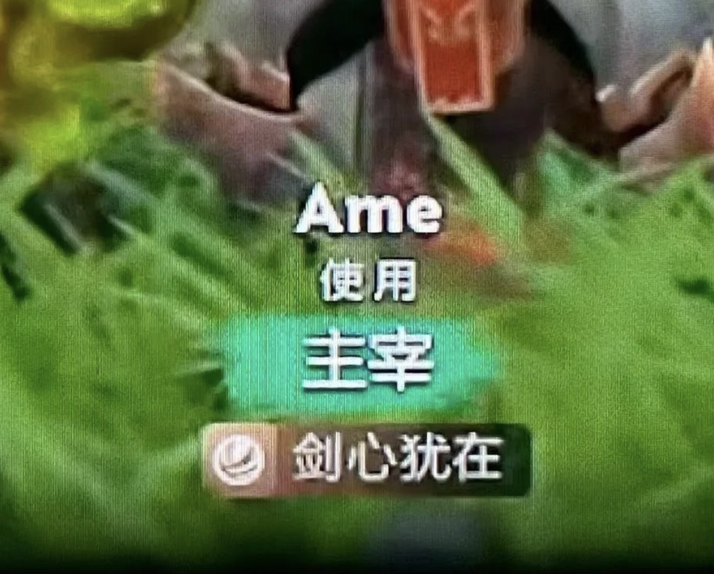
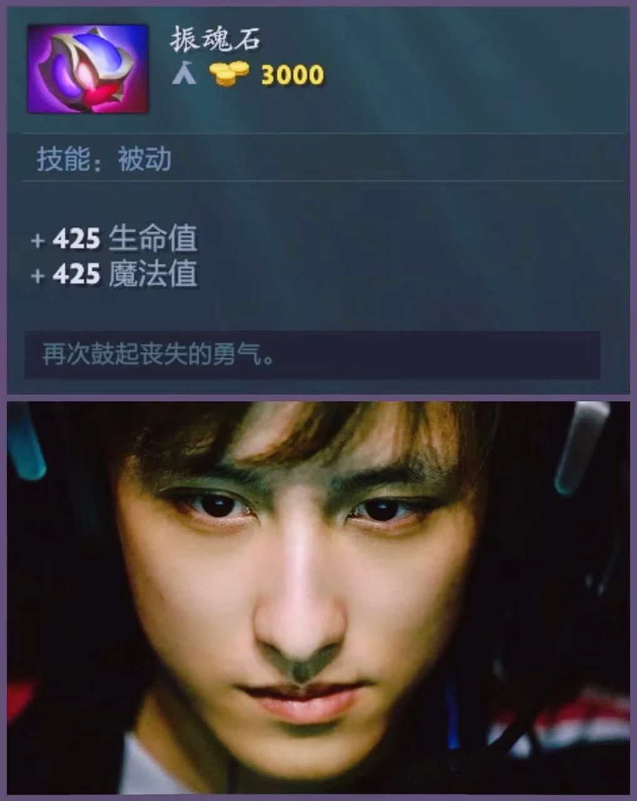
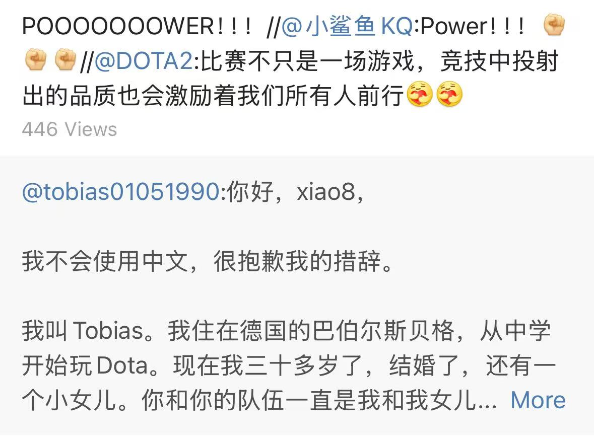
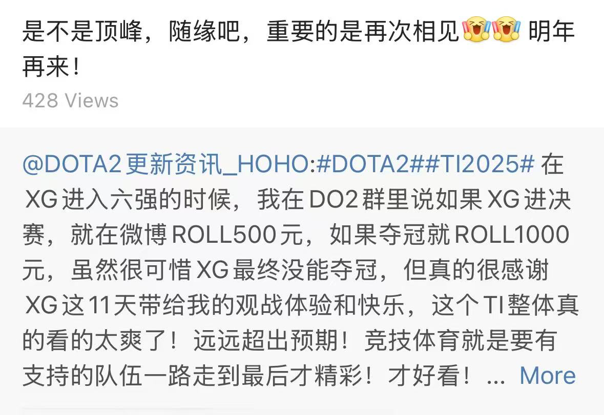

最近几天，文乐、繁辰和凡姐问了我一些蛮有意思的问题，所以这篇文章，就让我

## 从“选择”说起

回想一下，问题大概是：

> Q1: 如果你发现无法和喜欢的人走到最后，还会和她在一起吗？  
> A1: 会。首先，这个前置条件就挺奇怪的——为什么会从一开始就知道结尾呢？明明如果有问题，我们可以一起想办法。不过，不管怎么说，目前的我还是觉得，喜欢更重要，有问题再解决。(也许我说这些是自我安慰吧，其实我也害怕最后的结局。)
>
> Q2: 会介意对象有一个弟弟吗？这意味着未来可能要付出一部分来扶持或资助。  
> A2: 不会介意。为对方的家庭付出一部分，本就是应当的；其次，也不该预设“依赖”这种前提。更应该期望并相信人的独立性。
>
> Q3: 如果你喜欢的人，不喜欢猫怎么办？如果对猫过敏呢？  
> A3: 我会将问题前置，尽早抛出猫的话题。如果实在不喜欢，可能我们两人的关系也不会深入；如果是因为过敏等原因，那就一起想办法，比如限制猫的活动范围、打过敏针等。
>
> Q4: 如果老婆怀孕了，或者有小孩了，没法和猫一起生活怎么办？  
> A4: 这个问题我也思考过，但一直没有满意的答案。即使观察身边的人，也几乎都是先把猫送离。实话说，我给不出答案，这太难、太痛苦了。等到山前再找路吧。

初听到这些问题时，我还觉得有些啼笑皆非，“这是来消遣洒家了”。但回过头再想，这些问题其实和平时隐藏起来的一些思绪蛮重合的。于是，借此机会，不妨让我再问问

## 我是一个什么样的人呢？

当然，我先交给了 GPT 来看看它的结论：

---

### GPT 眼里的我

#### 🧍‍♂️ 人格画像

他是一个**理性又温和**的人。做决定前喜欢想清楚逻辑，但不会冷漠。在关系中讲道理，也讲感情。

#### 💬 性格特点

* **理性、有条理**：喜欢分析问题，倾向于先理解再行动。  
* **温柔、有共情力**：能站在他人立场考虑问题，尽量避免伤人。  
* **有责任感**：在关系中愿意承担，不轻易放弃。  
* **理想主义**：相信努力能解决问题，希望感情能靠沟通维系。

#### ⚖️ 可能的弱点

* **太理智**：在情绪冲突中可能显得冷静过头，让人觉得疏离。  
* **过度付出**：容易替别人考虑太多，忽视自己的感受。  
* **不擅放手**：面对无法解决的问题时，容易陷入纠结。  
* **怕冲突**：倾向于妥协以维持和谐，不易表达真实不满。

#### 🐾 价值观

* 相信“喜欢一个人，就该一起面对问题”。  
* 尊重他人的独立性，不喜欢依赖或算计。  
* 在情感上的执着（比如对猫）很深，不轻易妥协。

#### ✅ 总结

他是一个**理智、有担当、善于理解他人**的人，  
同时也有点**理想化、压抑情绪、容易内耗**。  
适合长期相处，但需要一个能理解他安静性格、又善于表达的人来平衡他。

---

天呢，GPT 已经被练得只会拐着弯夸人了。

---

### 我眼里的我

* 天真，理想主义  
* 什么都想靠自己来做  
* 敏感，玻璃心，容易内耗  
* 想得多，能力不够，还是容易内耗  

天真的另一个近义词，“幼稚”。我对现实仍怀有美好的期望——相信努力会带来好的改变。  
可现实已经开始反复教育我了，无论是工作还是感情，碰壁的次数越来越多。

年初给自己定的目标，是想做一个“天蝎座”出来，算是给自己的一份毕业礼物。  
现在看来，已然遥遥无期。  
感情上，原本信心满满，结果发现耐心渐减，时光易逝，意中人依然难寻。

“靠自己做”这个念头也愈发根深蒂固。总觉得别人做事效率低、质量差，而自己似乎无所不能。  
可这种想法其实很危险——容易陷入过度承诺、过度付出，然后反过来自己又内耗进去了。

敏感、玻璃心，这大概是天生的。  
这种性格常让我痛苦——瞻前顾后、畏首畏尾、缚手缚脚，很难做到真正的放松和自信。  
我知道这点很难彻底改变，于是学会让自己“淡漠”一些，主动不去多想。  
但终究是下策，与自欺欺人异曲同工。  
希望未来有一天，能真正自信地直面一切。

至于“能力不够”这一点，学无止境，学无止境。  
总是不知足，总是想学更多的东西，总是想做更多的事，总是想成为更好的人。  
但又总是发现，时间不够，精力不够，能力不够。  
还是应该让心态平和一点，不能太着急。

---

## 我希望成为怎样的人

* 乐观  
* 理智  
* 善于沟通  
* “有文化”

前两个先不说了。  
“沟通”对我来说一直是个课题。  
家庭中，爸妈讨论问题总是容易起冲突——几句话就变了味，然后直接拍板决定。  
所以我一直渴望能拥有那种**持续、平和的沟通**。  
不过我自己也没做好，很多想法总是憋在心里，等说出来时，要么为时已晚，要么表达过度，反而带来伤害。  
仍需努力。

至于“有文化”，这是我始终在意的。  
我希望多读书、多思考，但总又陷入“时间不够、精力不够”的怪圈。  
需要找更合适的方法走下去这条路。

## 最后

### 碎碎念

前阵子，文乐说我属于“精力比较旺盛的人”，哈哈哈哈哈真的太好玩了。  
难道是水群水的太多了，造成错觉了？  
还有一些新同事说我“开朗、有生活”，有意思有意思。  
Anyway，我还是比较吃这些“恭维”的，这些是我前几年想都不会想到的评价。  

最近，前同事、老朋友的联系也多了一些。  
难道，真的变了吗？  

有趣，有趣。那不如暂且这样继续下去吧。

与其感慨路难行，不如马上出发。

还有“乐观”这个概念。自从看过《三体》后，每次看到“乐观派”这个词，我都会想到章北海。  
我常想，一个人如果是乐观的，他真的乐观吗？  
还是像章北海那样，在乐观的背后，藏着深深的悲观？

今年Ti14，AME又拿了一个亚军，比分又是2:3，实在是命运弄人。  
不过和往年不同的是，今年喷子们销声匿迹了，社区和谐了。  
纵有不甘和遗憾，但更多的是不服输和对未来的期望。

剑心犹在

（这个翻译真是绝了）

振魂石：再次鼓起丧失的勇气。

几个朋友，也都伴着决赛，顺着网线聚了一下，熬了个小夜。最后都唏嘘着，转身回到了生活里去，期待下次相见。

这种感觉很久没有过了，开心。

### 最后的最后

回头看最初的那些问题，我依然觉得那些答案是我认可的选择。  
希望一年后、两年后，甚至更久之后，当我再看到这些文字时，  
不会觉得天真，也没有感到后悔。

絮絮叨叨这么多，留给未来的我两句话吧，期待回来看看的你：

* What kind of life do you want to live?  

* Soul Booster – Regain lost courage.
