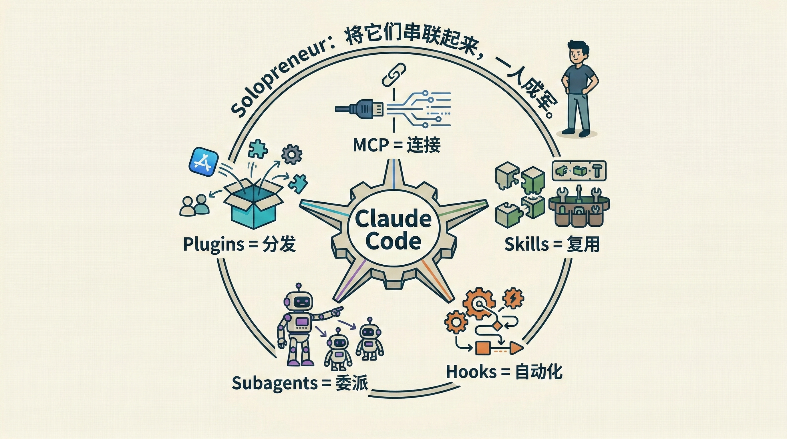
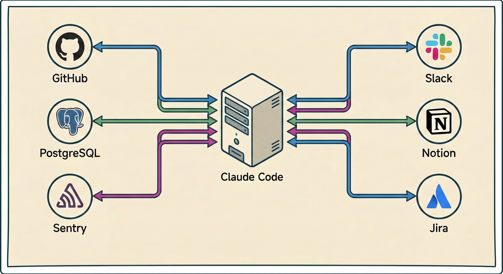
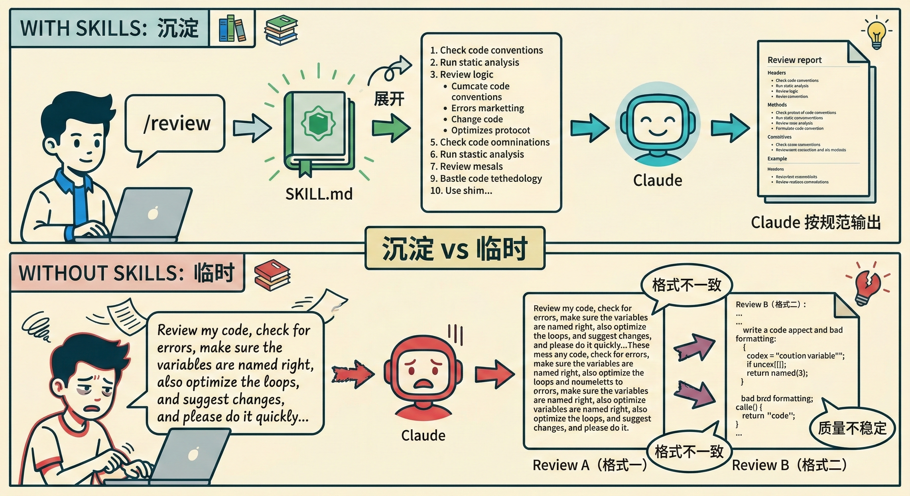
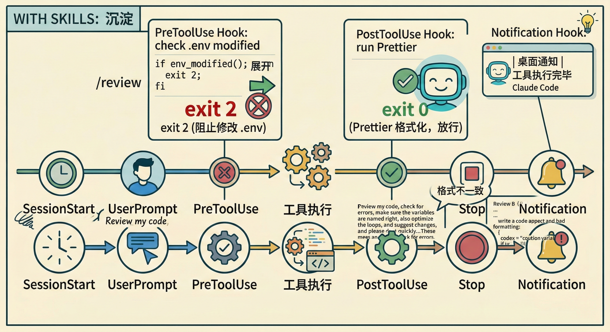
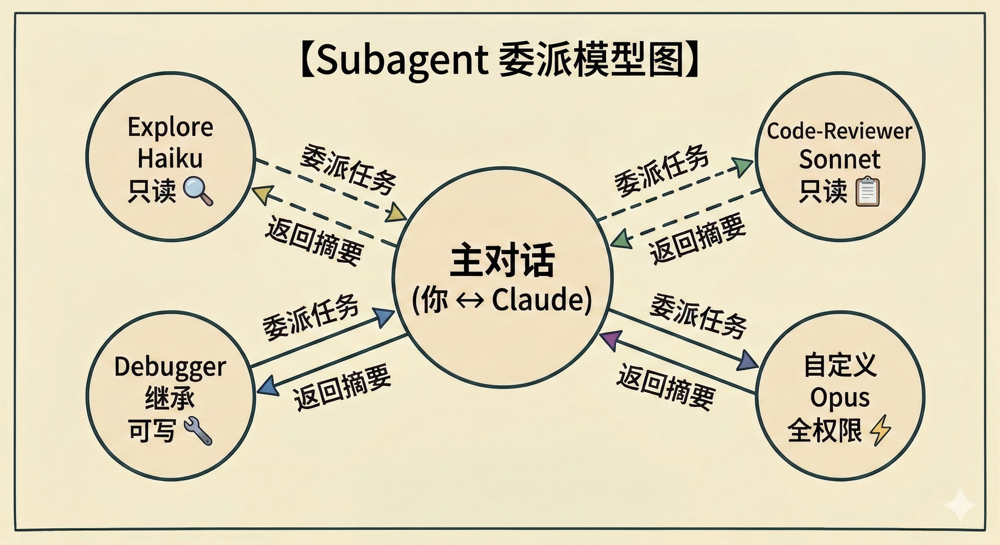
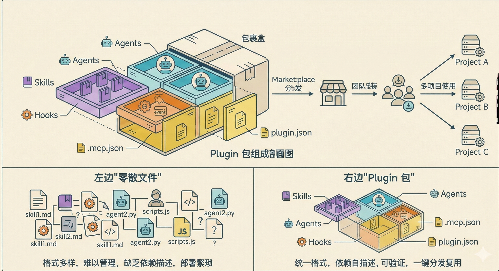
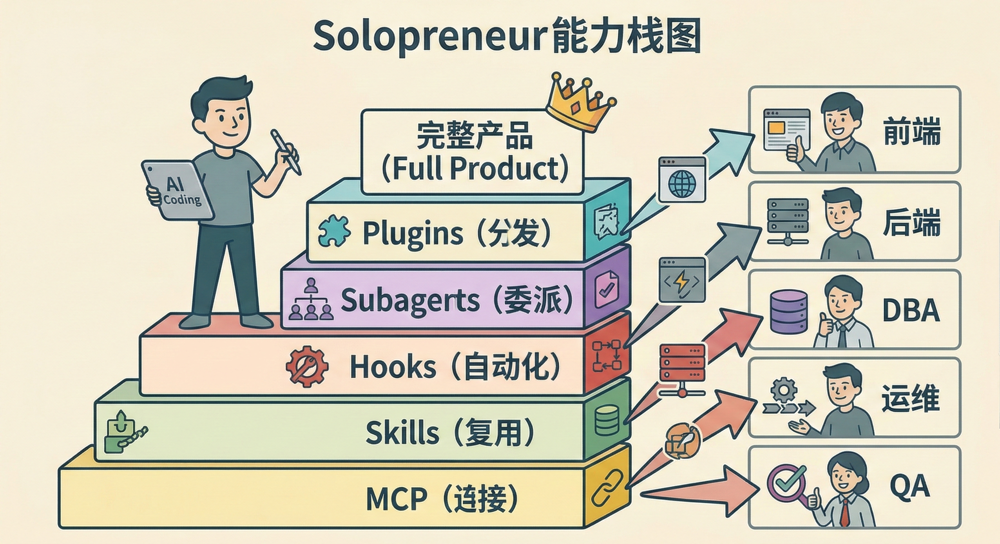
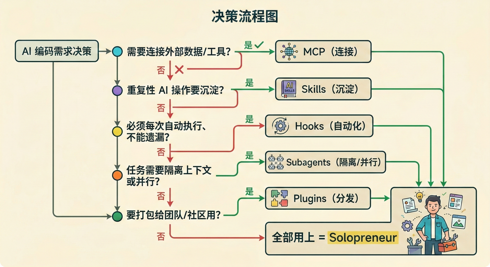

Claude Code 不只是一个代码补全工具，它是一个**Agent Runtime**。本文基于日常使用 Claude Code 的实践，介绍它的五个扩展维度——从连接外部工具到一人构建完整产品。

每个维度解决一个核心问题：

| 维度 | 核心问题 | 一句话 |
|------|---------|--------|
| **MCP** | AI 无法访问外部数据和工具 | 统一的"USB-C 接口"，连接万物 |
| **Skills** | 重复的 AI 交互模式需要沉淀 | 可复用的提示词工作流 |
| **Hooks** | 某些操作必须每次都发生 | 确定性的自动化规则 |
| **Subagents** | 复杂任务需要隔离和并行 | 专业化的任务委派 |
| **Plugins** | 扩展需要打包和分发 | Skills + Agents + Hooks 的容器 |



---

## 1. MCP — 连接外部世界

### 1.1 解决什么问题

AI 是一个"封闭大脑"——它能写代码、做推理，但无法直接访问你的数据库、API、项目管理工具。

每个工具各自对接 AI 太碎片化。**MCP（Model Context Protocol）** 就是统一的"USB-C 接口"：一个开源标准协议，让 AI 一次接入、处处可用。

### 1.2 在 Claude Code 中怎么用

```bash
# 接入远程服务（推荐 HTTP 方式）
claude mcp add --transport http notion https://mcp.notion.com/mcp
```

### 1.3 实际场景，你可以用自然语言驱动外部系统：

- **GitHub**："在 GitHub 上创建 PR"
- **数据库**："根据 PostgreSQL 数据库，找到最近 90 天没有购买的客户"



### 优劣速览

| 维度      | 说明                                          |
| ------- | ------------------------------------------- |
| **优势**  | 标准化接口、生态丰富、配置可共享                            |
| **劣势**  | 工具调用会消耗大量 token、第三方 Server 质量参差不齐、安全边界需自行把控 |
| **适合**  | 需要 AI 访问外部系统的场景：查数据库、操作 GitHub、读 Jira、发消息   |
| **不适合** | 纯文本对话、不涉及外部数据的场景                            |

---

## 2. Skills — 可复用的工作流

### 2.1 解决什么问题

你发现自己每次让 Claude 审查代码时，都要写一大段提示词："检查错误处理、关注安全问题、按优先级输出……"

**Skills** 就是把这些重复的 AI 交互模式**沉淀下来**，变成一个可复用的模板。像团队的"SOP"一样，让 AI 每次都按规范执行。

### 2.2 在 Claude Code 中怎么用

**创建 Skill** —— 一个 Markdown 文件，放到指定目录：

```
~/.claude/skills/review/SKILL.md      # 个人 Skill，所有项目可用
.claude/skills/review/SKILL.md        # 项目 Skill，可提交到 Git 共享
```

**SKILL.md 结构**：

```yaml
---
name: review
description: 审查代码质量和安全问题。当审查代码、检查 PR 时使用。
---

审查代码时，检查以下方面：
1. 代码组织和结构
2. 错误处理是否完善
3. 安全隐患
4. 测试覆盖率

按优先级输出：
- 🔴 必须修复
- 🟡 建议修复
- 🟢 可以改进
```

**两种调用方式**：

| 方式 | 触发 | 说明 |
|------|------|------|
| 用户手动调用 | `/review` | 像命令一样直接触发 |
| Claude 自动调用 | 根据 `description` 匹配上下文 | Claude 判断当前任务相关时自动加载 |

**支持参数传递**：

```bash
/review src/auth/login.ts   # $ARGUMENTS = "src/auth/login.ts"
/fix-issue 123               # $ARGUMENTS = "123"
```

### 2.3 两类 Skill

| 类型 | 特点 | 示例 |
|------|------|------|
| **参考类** | 注入知识/规范，Claude 自动感知 | API 约定、编码风格、领域知识 |
| **任务类** | 分步操作，通常手动触发 | 部署、提交、代码生成、代码审查 |

任务类 Skill 通常设置 `disable-model-invocation: true`，防止 Claude 自动运行（比如你不希望 Claude 觉得代码看起来准备好了就自己部署）。



### 优劣速览

| 维度      | 说明                                      |
| ------- | --------------------------------------- |
| **优势**  | 沉淀最佳实践、可共享、支持参数化、可组合                    |
| **劣势**  | 本质是提示词，Claude 有时可能跳过或变通；技能过多过复杂时有字符预算限制 |
| **适合**  | 团队编码规范、代码审查流程、固定工作流（提交、部署、文档生成）         |
| **不适合** | 必须每次 100% 执行的强制规则                       |

---

## 3. Hooks — 确定性的自动化

### 3.1 解决什么问题

有些操作**必须每次都发生**，不能依赖 AI "记得"去做：

- 编辑完文件 → 必须运行 Prettier 格式化
- 修改了 `.env` → 必须阻止
- Claude 完成任务 → 必须发桌面通知

这些是**确定性规则**，不是 AI 判断。Hooks 就是在 Claude Code 生命周期的特定节点上，**系统级强制执行**的 shell 命令。

### 3.2 与 Skills 的关键区别

容易混淆的两个概念：

| 维度 | Skills | Hooks |
|------|--------|-------|
| **本质** | 提示词模板，AI 解读执行 | Shell 命令 / HTTP 请求，系统确定性执行 |
| **触发方式** | `/命令` 或 AI 自动匹配 | 生命周期事件自动触发 |
| **可靠性** | AI 可能跳过/变通 | 100% 执行，不依赖 AI |
| **适合** | 编码规范、代码审查、工作流 | 格式化、校验、通知、阻止危险操作 |
| **不适合** | 必须每次执行的强制规则 | 需要 AI 判断的复杂决策 |

### 3.3 在 Claude Code 中怎么用

**通过 `/hooks` 菜单交互式配置**，或直接编辑 `settings.json`。

**生命周期事件**（Hook 的触发点）：

| 事件 | 触发时机 | 典型用途 |
|------|---------|---------|
| `SessionStart` | 会话开始 / 压缩后恢复 | 注入上下文、环境检查 |
| `PreToolUse` | 工具调用前 | **阻止**危险操作 |
| `PostToolUse` | 工具调用后 | 自动格式化、校验 |
| `Stop` | Claude 完成响应 | 检查任务是否真正完成 |
| `Notification` | Claude 需要你关注 | 桌面通知 |

**退出码决定行为**：

| 退出码 | 效果 |
|--------|------|
| `exit 0` | 放行，stdout 内容注入 Claude 上下文 |
| `exit 2` | **阻止操作**，stderr 反馈给 Claude |
| 其他 | 放行，stderr 记录到日志 |

### 3.4 实际场景（PostToolUse）：

```json
{
  "hooks": {
    "PostToolUse": [{
      "matcher": "Edit|Write",
      "hooks": [{
        "type": "command",
        "command": "jq -r '.tool_input.file_path' | xargs npx prettier --write"
      }]
    }]
  }
}
```

**阻止修改敏感文件**（PreToolUse）：

```bash
#!/bin/bash
FILE_PATH=$(cat | jq -r '.tool_input.file_path // empty')
for pattern in ".env" "package-lock.json" ".git/"; do
  if [[ "$FILE_PATH" == *"$pattern"* ]]; then
    echo "Blocked: $FILE_PATH matches protected pattern '$pattern'" >&2
    exit 2  # 阻止操作
  fi
done
exit 0
```

**Claude 完成后桌面通知**（Notification）：

```json
{
  "hooks": {
    "Notification": [{
      "matcher": "",
      "hooks": [{
        "type": "command",
        "command": "osascript -e 'display notification \"Claude Code needs your attention\" with title \"Claude Code\"'"
      }]
    }]
  }
}
```

### 3.5 四种 Hook 类型

| 类型 | 说明 | 适用场景 |
|------|------|---------|
| `command` | 运行 shell 命令 | 格式化、校验、通知（最常用） |
| `http` | POST 到 HTTP 端点 | 远程审计、日志服务 |
| `prompt` | 单轮 LLM 判断（默认 Haiku） | 需要判断但不需要工具的决策 |
| `agent` | 多轮 Subagent 验证 | 需要读文件/跑命令才能验证的条件 |



### 3.6 优劣速览

| 维度 | 说明 |
|------|------|
| **优势** | 100% 确定性执行、不依赖 AI 记忆、支持阻止危险操作、四种类型覆盖多种场景 |
| **劣势** | 需要编写 shell 脚本、调试不如 Skills 直观、PostToolUse 无法撤销已执行的操作 |
| **适合** | 格式化、校验、通知、阻止、审计等必须每次执行的规则 |
| **不适合** | 需要 AI 理解和判断的复杂任务 |

---

## 4. Subagents — 任务委派与隔离

### 4.1 解决什么问题

当你让 Claude 做一个复杂任务时：
- 跑测试的输出占满了上下文窗口，Claude "忘记"了之前的讨论
- 你想让 AI 只能读代码、不能改代码，但主对话没法这样限制
- 多个独立的调查任务只能串行执行，效率低

**Subagents** 就是**专业化的子代理**——每个在自己的上下文窗口中运行，有独立的工具权限、模型选择和系统提示。完成后只把摘要返回主对话。

### 4.2 在 Claude Code 中怎么用

| Agent               | 工具权限 | 用途                |
| ------------------- | ---- | ----------------- |
| **Explore**         | 只读   | 搜索代码、探索代码库        |
| **Plan**            | 只读   | Plan Mode 下的代码库研究 |
| **General-purpose** | 全部工具 | 复杂多步骤任务           |

**自定义 Subagent**——一个 Markdown 文件：

```markdown
<!-- 文件：.claude/agents/code-reviewer.md -->
---
name: code-reviewer
description: 代码审查专家。代码修改后主动审查。
tools: Read, Grep, Glob, Bash
model: sonnet
memory: user
---

你是一个高级代码审查专家。被调用时：
1. 运行 git diff 查看最近修改
2. 聚焦修改的文件
3. 按优先级输出反馈：🔴 必须修复 / 🟡 建议修复 / 🟢 可改进
```

**存储位置决定作用域**：

| 位置 | 作用域 |
|------|--------|
| `.claude/agents/` | 当前项目（可提交到 Git 团队共享） |
| `~/.claude/agents/` | 个人所有项目 |
| `--agents` CLI 参数 | 仅当前会话 |
| Plugin 的 `agents/` 目录 | 安装 Plugin 的地方 |

### 4.3 核心能力

**独立上下文**：Subagent 在自己的上下文窗口中运行，不污染主对话。跑测试输出 10000 行？Subagent 消化后只返回"3 个测试失败，原因是……"

**工具限制**：

```yaml
tools: Read, Grep, Glob      # 只允许只读工具
disallowedTools: Write, Edit  # 明确禁止写入
```

**前台 vs 后台**：

| 模式 | 行为 | 适用 |
|------|------|------|
| 前台 | 阻塞主对话，可交互 | 需要权限确认或追问的任务 |
| 后台 | 并发运行，完成后通知 | 独立的研究/测试任务 |

> 按 **Ctrl+B** 可以把正在运行的前台任务放到后台。

**持久记忆**：设置 `memory: user` 后，Subagent 会在 `~/.claude/agent-memory/` 中积累知识，跨会话保留。

### 4.4 使用模式

| 模式 | 示例 |
|------|------|
| **隔离高输出操作** | "用 subagent 跑测试，只报告失败的" |
| **并行研究** | "用 3 个 subagent 分别研究 auth、database、API 模块" |
| **链式调用** | "先用 code-reviewer 找性能问题，再用 optimizer 修复" |
| **恢复上下文** | "继续刚才那个 code review，再看看授权逻辑" |



### 4.5 优劣速览

| 维度      | 说明                                         |
| ------- | ------------------------------------------ |
| **优势**  | 独立上下文不污染主对话、工具权限隔离、模型可选（控制成本）、支持并行和持久记忆    |
| **劣势**  | 无法嵌套（Subagent 不能再生成 Subagent）、后台任务需要预先授权权限 |
| **适合**  | 高输出操作隔离、并行研究、需要不同权限/模型的专项任务                |
| **不适合** | 需要频繁来回确认的迭代任务、多阶段共享上下文的工作                  |

---

## 5. Plugins — 打包与分发

### 5.1 解决什么问题

你精心打造了一套 Skills、配置了 Hooks、定义了 Subagents——但它们都是零散的文件，团队共享靠手动拷贝目录。

**Plugin 不是新能力，是已有能力的容器**。它把 Skills + Agents + Hooks + MCP Servers 打包成一个可安装、可版本化、可分发的扩展包。

类比：**Plugin 之于 Skills/Hooks/Agents，就像 npm package 之于 .js 文件。**

### 5.2 在 Claude Code 中怎么用

**Plugin 目录结构**

```
my-plugin/
├── .claude-plugin/
│   └── plugin.json          # 清单文件（名称、版本、描述）
├── skills/                  # Skills
│   └── review/
│       └── SKILL.md
├── agents/                  # Subagents
│   └── code-reviewer.md
├── hooks/                   # Hooks
│   └── hooks.json
├── .mcp.json                # MCP Server 配置
└── settings.json            # 默认设置
```

**plugin.json 清单**：

```json
{
  "name": "my-team-toolkit",
  "description": "团队开发工具包：代码审查、提交规范、自动格式化",
  "version": "1.0.0",
  "author": { "name": "Your Team" }
}
```

**开发测试**：

```bash
claude --plugin-dir ./my-plugin           # 本地加载测试
claude --plugin-dir ./p1 --plugin-dir ./p2  # 同时加载多个
```

**命名空间隔离**：Plugin 内的 Skill 自动加前缀，避免冲突：

```bash
/review                    # 独立 Skill
/my-team-toolkit:review    # Plugin 内的 Skill
```

### 5.3 独立配置 vs Plugin

| 维度           | 独立配置（`.claude/`） | Plugin                |
| ------------ | ---------------- | --------------------- |
| **Skill 名称** | `/review`        | `/plugin-name:review` |
| **适用场景**     | 个人、单项目、快速实验      | 团队共享、跨项目复用、社区分发       |
| **版本管理**     | 无                | 语义化版本（1.0.0）          |
| **分发方式**     | 手动拷贝             | Plugin Marketplace 安装 |
| **迁移路径**     | —                | 从独立配置一键转换为 Plugin     |

**建议**：从 `.claude/` 中的独立配置开始快速迭代，准备好共享时再转换为 Plugin。



### 5.4 优劣速览

| 维度      | 说明                                 |
| ------- | ---------------------------------- |
| **优势**  | 统一打包、版本管理、命名空间隔离、团队/社区分发           |
| **劣势**  | 需要额外的目录结构和清单文件、Skill 名称更长（带命名空间前缀） |
| **适合**  | 团队共享工具包、社区分发扩展、跨项目复用配置             |
| **不适合** | 个人实验、单次使用的快速 Skill                 |

---

## 6. Solopreneur — 一人军团

### 6.1 为什么成为可能

上述五层能力叠加，让一个人拥有了完整的研发工作流：

| 传统角色 | Claude Code 替代方案 |
|----------|---------------------|
| DBA / 运维 | **MCP** 连接数据库、监控、基础设施 |
| 团队规范文档 | **Skills** 固化最佳实践 |
| CI 工程师 | **Hooks** 自动化质量关卡 |
| 多人协作 | **Subagents** 并行执行任务 |
| 内部工具团队 | **Plugins** 沉淀为可复用资产 |

一个人 + Claude Code = 前端 + 后端 + 测试 + 运维 + 产品。



### 6.2 适用边界

| 适合 | 不适合 |
|------|--------|
| MVP / 原型验证 | 强监管领域（金融、医疗核心系统） |
| 工具型产品 | 需要多人实时协作的大型系统 |
| 内部效率工具 | 对延迟/可靠性要求极高的基础设施 |
| 个人 SaaS | 需要 7×24 人工客服支持的产品 |

Solopreneur 不是取代团队，而是**放大个体能力**。适合从 0 到 1，规模化后仍需要团队。

---

## 7. 总结：如何选择



| 我想…… | 用这个 |
|--------|--------|
| 让 AI 查数据库、操作 GitHub | **MCP** |
| 沉淀"每次代码审查都按这个标准" | **Skills** |
| 确保"每次编辑后都自动格式化" | **Hooks** |
| 并行跑测试、隔离代码探索 | **Subagents** |
| 把上述全打包给团队安装 | **Plugins** |
| 一个人搞定整个产品 | **Solopreneur**（全部叠加） |

核心原则：**Skills 管"应该怎么做"，Hooks 管"必须怎么做"，Subagents 管"谁来做"，MCP 管"用什么做"，Plugins 管"怎么分享"。**

---

## 8. 最后，两个问题

### 8.1 Are you **Ready** for the **AlphaGo** ?

2016 年，AlphaGo 击败李世石。  
围棋没有消亡，但围棋的训练方式、竞技格局、甚至对弈的意义，都被永久改变了。  

今天的 Agent，仿佛也正处在类似的拐点。你准备好了吗？


### 8.2 **Passion**, or just a **Job**?

当 AI 写代码比你快、比你不知疲倦、甚至在某些场景下比你准确 —— 一个问题浮出水面：

**编程，是热爱，还是只是一份工作？**


---

## 参考

- [Claude Code 官方文档](https://code.claude.com/docs)
