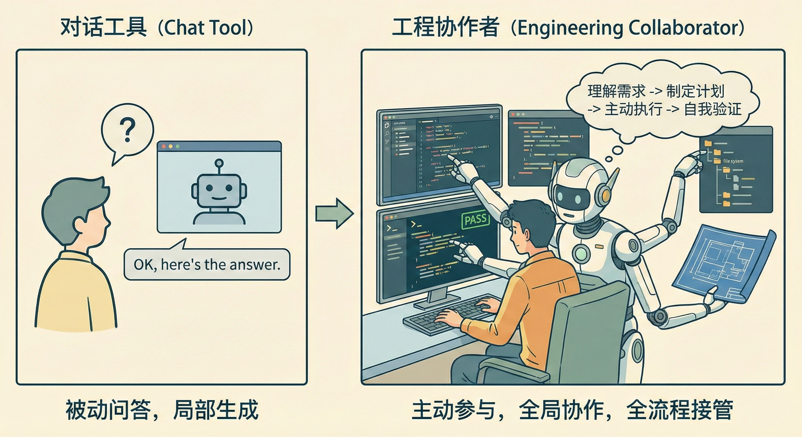
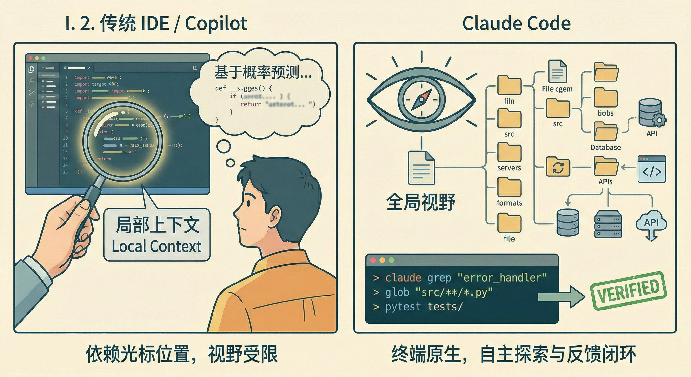
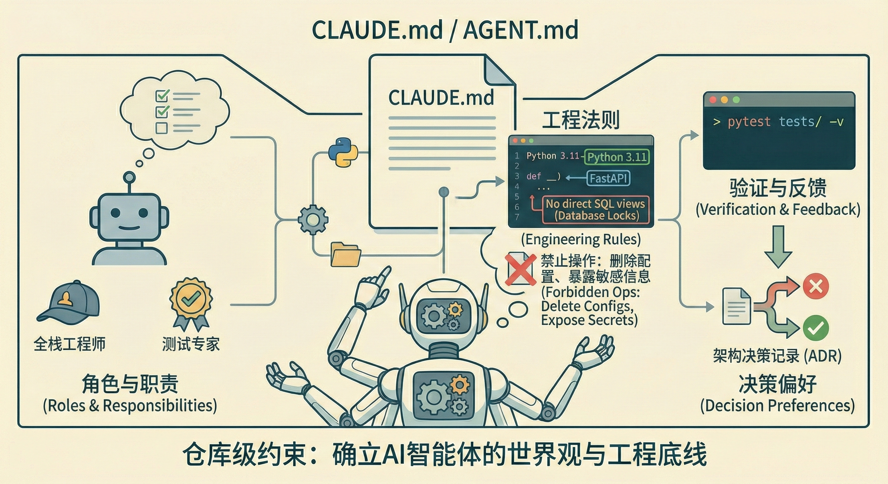
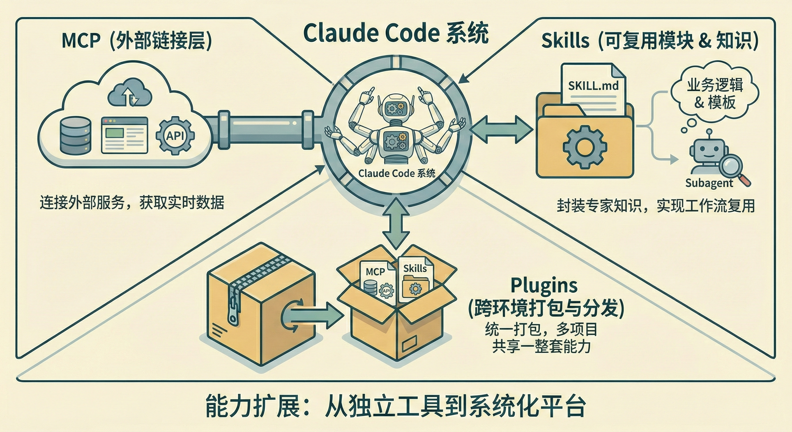
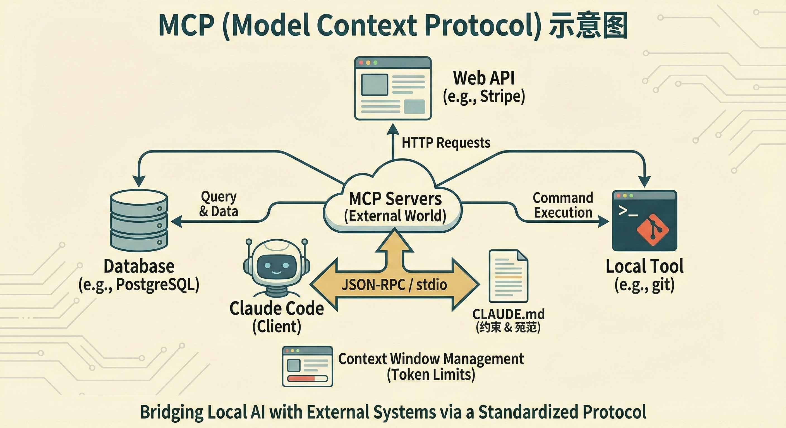
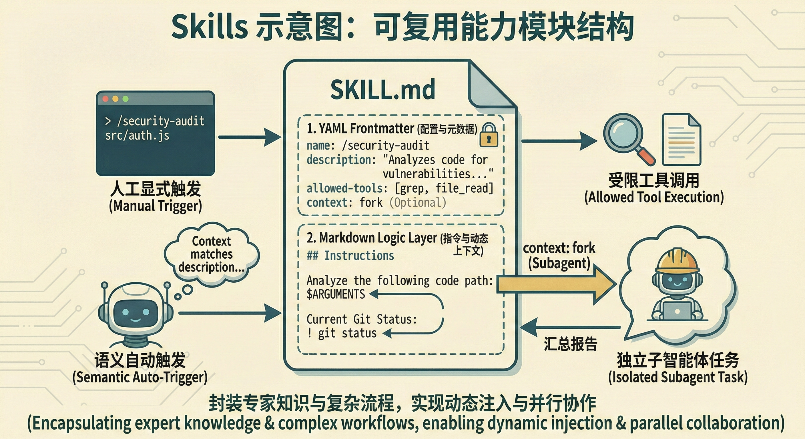
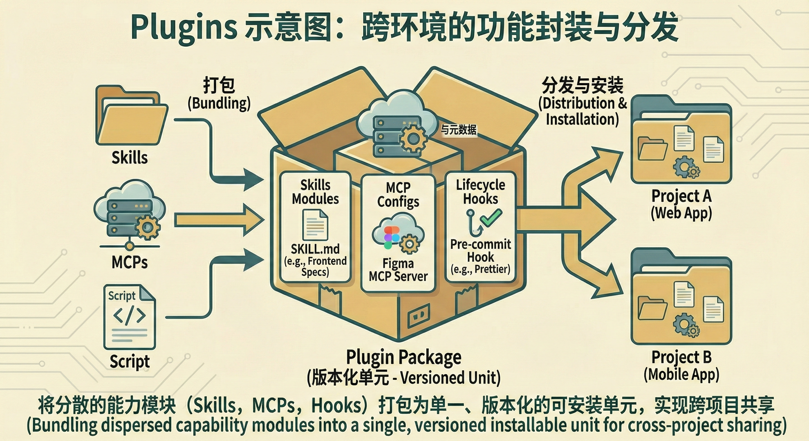
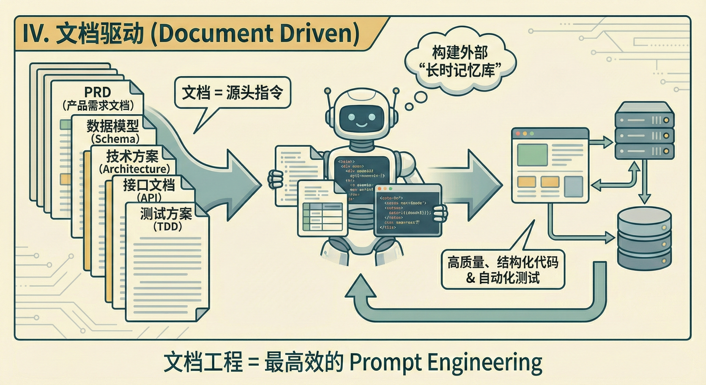
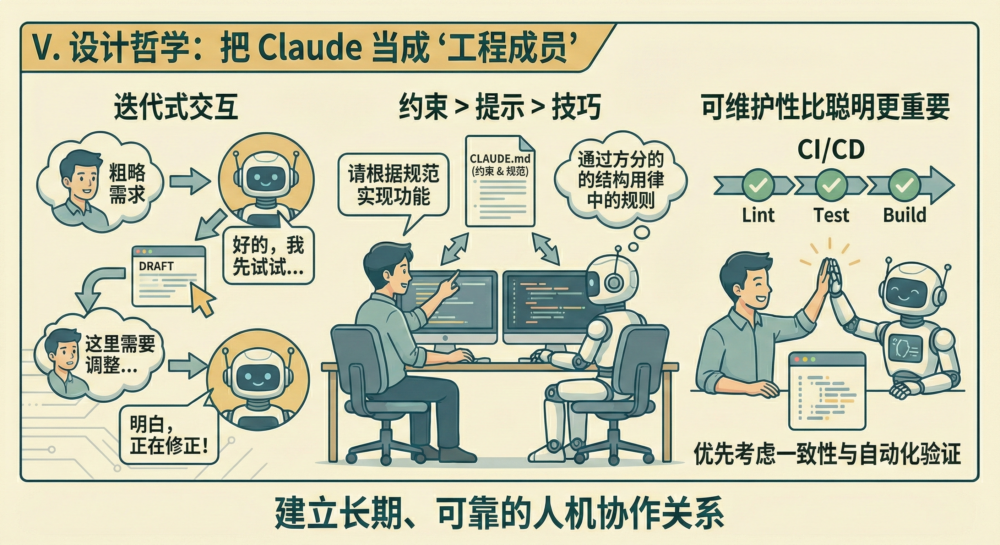

> 本文以 Claude Code 为例（同类工具理念相通），讲清 4 件事：仓库级上下文、可复用工作流（Skills）、外部能力接入（MCP）、以及文档驱动的协作方式。

你会得到：
- 让智能体按项目规矩产出，减少返工
- 把高频流程固化成可复用模块，降低沟通成本
- 用测试/构建/CI + hooks（如 `pre-commit`）建立“可验证”的交付闭环

## I. 不止是问答：重新认识 Claude Code

### 1) 从“回答问题”到“完成任务”



Claude Code 这类 agentic coding CLI 的关键区别在于：它不只“给建议”，而是**在你授权的范围内**直接执行工程动作：
- 读：检索整个仓库，理解依赖与约定
- 写：跨文件修改、补测试、更新文档
- 跑：执行构建/测试/lint，根据输出迭代修正

它更像一位能动手的协作者，但仍需要你提供目标、边界与验收标准，并对高风险操作把关。

### 2) 与 IDE / Copilot 的差异：任务粒度不同



- IDE / Copilot：以光标附近上下文为主，擅长“怎么写”
- Claude Code：以任务为中心，擅长“怎么交付”（跨文件改动 + 运行命令拿反馈）

### 3) 为什么“默认用法”不够用

默认把它当成一次性问答，很容易出现三类问题：
- **目标模糊**：一句话讲不清验收标准，模型只能猜
- **缺少约束**：技术栈/目录结构/命名规范/安全红线不明确，产出容易漂移
- **缺少验证闭环**：不跑测试、不看 `diff`，就无法稳定控制质量

接下来三节分别用仓库级上下文、Skills 与 MCP，把“可控、可复用、可验证”补齐。

## II. 工程上下文：仓库级约束



### A. 为什么需要仓库级约束

大模型对你的项目**没有长期记忆**：新会话不知道团队约定，对话变长还可能被压缩/遗忘。  
把关键约束写进仓库级说明文档，可以让它每次进场都先读一遍“项目规则”，显著减少跑偏与返工。

### B. `CLAUDE.md` / `AGENTS.md` 建议写什么

不同工具支持的文件名不同，但内容建议覆盖这些要点（越可执行越好）：
1. **项目目标与范围**：做什么、不做什么（Non-goals）
2. **技术栈与版本**：语言/框架/包管理器/运行时版本
3. **常用命令**：`dev` / `test` / `lint` / `build` 的一行命令
4. **代码库地图**：核心目录职责、关键模块入口
5. **硬性约束与红线**：哪些文件/目录不能动；高危操作必须人工确认
6. **交付要求**：先给计划；改动要小步；必须跑哪些验证；输出格式（diff/命令/报告）

> 建议把长内容拆到 `docs/`，在主文件里只放入口链接，避免“规范本身占满上下文”。

### C. 约束的设计原则（少而稳 / 可演进）

- 用“可执行规则”替代抽象形容词：把“写优雅代码”改成“新增模块必须有单测 + 覆盖关键边界”
- 把确定性工作交还给工具：格式化、lint、类型检查交给 formatter/linter/CI
- 约束当代码维护：架构变更时同步更新，避免“文档过期导致智能体按旧规则行事”

### D. 常见反模式（以及怎么改）

| 反模式 | 现象 | 更好的写法 |
| --- | --- | --- |
| 模糊指令 | “写得优雅/高质量”不可执行 | 写清验收与检查项，例如“新增接口必须有错误码与单测” |
| 过度细节 | 在说明里堆满缩进/换行细则 | 只写“必须通过 lint/格式化器”，让工具决定细节 |
| 规范过期 | 真实约定变了，说明没更新 | 把说明纳入评审；架构调整必须改文档 |
| 盲信自动生成 | 一键生成后不 review | 生成只能当起点，必须按项目实际修订 |

## III. 能力扩展：MCP、Skills 与 Plugins



这一节回答一个问题：当“读/改/跑”还不够时，怎么把能力做成体系，并且可控地扩展？

### A. MCP：与外部系统交互的通用协议



MCP（Model Context Protocol）是一套基于 JSON-RPC 的协议，用于把外部工具/数据源以统一接口提供给模型调用。常见用途包括：
- 拉取工单、PR、代码评审上下文（GitHub/Jira 等）
- 查询监控与日志（Sentry/Datadog 等）
- 读知识库与规范（Confluence/Notion 等）
- 运行无头浏览器做 UI 校验（Playwright 等）

最佳实践（重点是**安全**与**成本控制**）：
- **最小权限**：默认只读；写操作尽量拆成显式、可审计的细粒度工具
- **按需启用**：只连接当前任务需要的 MCP Server，避免工具定义占满上下文
- **限流与裁剪**：分页返回、只取需要字段，避免一次把整段日志/整张表灌进上下文
- **结构化输出**：优先返回 JSON/表格，而不是长段自然语言
- **密钥隔离**：凭证放在服务端安全存储，模型侧不直接接触明文密钥

### B. Skills：把高频工作流沉淀成“可复用命令”



Skill 的本质不是“更长的提示词”，而是一套可执行的工作流模板（输入 → 步骤 → 验证 → 输出）。一个好用的 Skill 通常包含：
- **触发条件**：什么时候用它、需要哪些参数
- **步骤拆解**：先收敛范围，再改动，再验证（必要时分阶段提交）
- **验证清单**：要跑哪些命令、要检查哪些文件
- **权限边界**：允许用哪些工具；哪些操作必须人工确认

如果你的工具支持在 Skill 元数据中声明“是否允许自动触发 / 可用工具”，建议把高危操作默认关掉自动触发，只留给人手动调用。

### C. Plugins：打包分发（可选）



当你需要在多个仓库/团队共享同一套能力时，可以把 **Skills + MCP 配置 + hooks/脚本** 打包成可安装单元（不同生态叫法不同：插件/扩展/模板仓库）。核心目标是两点：
- **可安装**：一条命令装好（或最少步骤）
- **可升级**：版本化发布，升级可追踪、可回滚

### D. 三者的边界与协作关系

| 维度 | MCP | Skills | Plugins |
| --- | --- | --- | --- |
| 解决的问题 | 连接外部数据与工具 | 固化工作流与规范 | 跨项目分发组合能力 |
| 典型产物 | MCP Server | `SKILL.md`/命令模板 | 可安装的能力包 |
| 常见风险 | 权限过大、数据泄露 | 流程过长、维护成本 | 版本漂移、兼容性 |

### ❓什么时候该用哪个？

- **要接外部系统/实时数据**：先考虑 MCP
- **要把重复流程做成标准动作**：写 Skill
- **要跨项目一键复用一整套配置**：做 Plugin（或模板仓库）

## IV. 文档驱动：把“说清楚”变成工程资产



文档不是事后补全，而是把需求、约束与验收标准变成可复用的上下文输入。对智能体来说：**文档质量≈交付质量**。

### A. 最小必备文档清单

1. **需求与验收（PRD / Issue）**：目标、非目标、验收标准、边界情况
2. **数据与接口契约**：Schema、关键字段、错误码、示例请求/响应
3. **技术方案 / ADR**：关键决策与取舍、替代方案为什么不选
4. **测试方案**：核心场景 + 预期结果（最好能直接转成自动化测试）
5. **工程计划**：把大需求拆成可交付的 Task List（方便分段执行/回滚）

### B. 写给智能体看的文档要点

- **把验收写成清单**：避免“完成了吗？”只能凭感觉
- **多给例子**：边界输入、失败路径、真实字段样例
- **明确约束**：性能、兼容性、迁移窗口、灰度策略
- **把“怎么验证”写进去**：一条命令跑通是最好的约束

## V. 设计哲学：把 Claude 当成工程成员



### A. 推荐的协作闭环（5 步）

1. **说明目标 + 验收**（先对齐“交付是什么”）
2. **让它先给计划**（拆步骤、标风险点与依赖）
3. **小步改动**（每步可回滚、可验证）
4. **运行验证**（测试/构建/lint/CI + hooks）
5. **沉淀资产**（更新文档、补 Skill、补回归用例）

### B. 提示顺序：约束 → 上下文 → 任务 → 验证

与其堆“技巧”，不如先把约束讲清楚：  
先给规则（不能做什么、必须做什么）→ 再给上下文（文档与入口）→ 再给任务（拆分目标）→ 最后要求验证（命令与输出格式）。

### C. 可维护性优先

- 让改动可读：小 `diff`、清晰提交信息、必要时先重构再加功能
- 让结果可验证：新增功能必须补测试/回归用例
- 让规则可执行：用工具保证一致性，而不是靠“记得格式化”

## Appendix

### A. `CLAUDE.md` / `AGENTS.md` 模板示例

```md
# AI Agent 协作指南（CLAUDE.md / AGENTS.md）

## TL;DR
- 目标：一句话描述项目
- 技术栈：语言/框架/版本/包管理
- 常用命令：`dev` / `test` / `lint` / `build`

## 硬性规则（必须遵守）
- 禁止修改：哪些目录/文件不能动
- 需要人工确认：删除文件、迁移数据、发布、改配置、批量重命名等
- 安全：禁止输出密钥；避免在日志中写入敏感信息

## 代码库地图
- `src/...`：核心业务
- `docs/...`：设计与规范

## 工作流
1. 先阅读相关文档（按需加载）
2. 先给计划，再开始改动
3. 小步提交、保持 `diff` 可读
4. 必须跑验证命令

## 验证命令
- `...`
- `...`

## 输出格式
- 总结
- 执行过的命令
- 变更文件
- 下一步 / 风险
```

### B. 常用 Skills 设计模式

- **/bugfix**：复现 → 定位根因 → 最小修复 → 补回归测试 → 解释原因
- **/refactor**：列出约束与不变量 → 分阶段小步重构 → 每步跑测试
- **/write-tests**：列场景表格（输入/期望/边界）→ 生成用例 → 验证覆盖关键路径
- **/security-review**：审 `diff` 与依赖 → 列风险清单 → 给可落地修复建议与验证方法

最小 `SKILL.md` 结构（字段以你的工具实现为准）：

```md
---
name: bugfix
description: 复现并修复一个 bug，补齐回归测试
disable_model_invocation: true # 或 disable-model-invocation: true
allowed_tools: # 或 allowed-tools:
  - read
  - rg
  - git
---

## 输入
- 现象：$ARGUMENTS
- 期望行为：

## 步骤
1. 复现与最小化用例
2. 定位根因（指向具体文件/函数）
3. 最小修复（保持 `diff` 可读）
4. 补回归测试

## 验证
- 运行：`...`

## 输出
- 根因、修复点、测试点、潜在风险
```

### C. MCP 能力清单（选型与接入原则）

常见可接入方向：
- 代码托管与协作：GitHub/GitLab
- 需求与知识库：Jira/Confluence/Notion
- 可观测性：Sentry/Datadog/Grafana
- 浏览器与 UI：Playwright
- 数据源：数据库（优先只读）、内部 API（尽量做网关封装）

接入原则：
- 最小权限、强审计、默认只读
- 输出结构化、分页返回、避免大段文本灌入上下文
- 写操作要可回滚，并强制人工确认

接入前检查清单（建议写进团队规范）：
- 是否可分离读/写工具？写工具是否细粒度、可审计？
- 是否有输出上限/分页/字段裁剪，避免一次性返回海量数据？
- 是否避免把密钥与敏感数据暴露给模型（服务端托管凭证）？
- 是否有调用日志与告警（异常调用、越权尝试、频率突增）？

### D. 我踩过的坑（速查）

- 一句话大需求：先拆成 2～5 个可验证子任务
- 不写验收标准：把“完成”的定义写进清单
- 不跑测试就合并：把 `test/lint/build` 写成必须步骤
- 让模型做格式化：交给 formatter/linter/hooks，模型只负责修反馈
- MCP 工具过多/权限过大：只启用需要的 server，写操作细粒度并强审计
