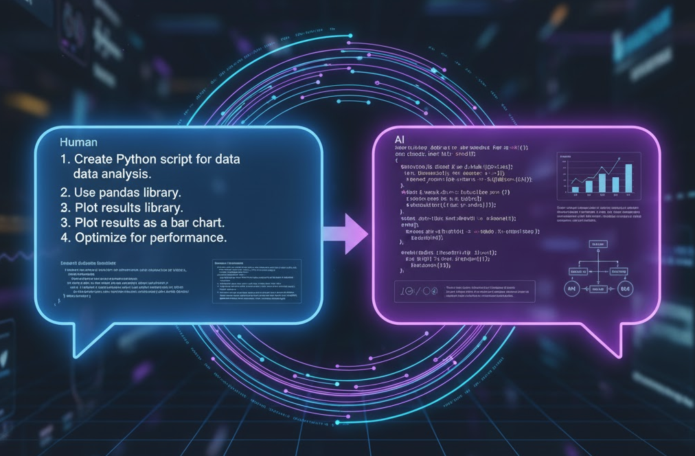

## I. Design：在编码前赢得胜利

在 Vibe Coding 的世界里，最昂贵的操作不是编写代码，而是“返工”。当 AI 基于一个模糊或错误的需求，为你生成了成百上千行代码后，你会发现，修改它们的成本远高于从一开始就想清楚。因此，高效的 Vibe Coding 始于高质量的思考和规划。


### A. 做好定义：明确背景、目标与范围

与 AI 协作时，不能说“做一个类似抖音的 App”。这种模糊的指令只会得到模糊或无用的结果。需要像产品经理一样，将想法具象化、结构化。

1. **交代背景**：有助于AI根据场景选择不同的实现方案，注意不同的细节。
	- 我想做一个面向**留学生用户**的短视频 App，核心目标是帮助他们**分享海外生活**。
	- 用户群体主要是**18~25岁**的年轻人，使用场景是在**课余时间浏览或上传视频**。 
	- 需要支持**中英双语界面**和**视频自动字幕生成**。
2. **定义核心功能**: 
	- 用户可以录制 15~60 秒视频并上传；
	- 支持视频浏览（上下滑动切换）；
	- 每个视频可以点赞、评论、收藏；
	- 视频自动生成字幕（用 Whisper 或第三方 API）；
	- 推荐算法基于用户兴趣和互动历史；
	- 用户资料页展示个人视频列表。
3. **划定任务边界**: 本次开发(Session)要完成的具体任务。
	- 只专注于实现基于邮箱和密码的用户注册与登录功能；
	- 包括后端的 API 和数据库表结构。

### B. 设计与选型：文档约束

架构设计、技术选型，可以通过文档描述呈现给AI，更具体，并且可重复回溯，防止失忆。
```
# Repository Guidelines

## Project Overview

Leopard is a comprehensive, Spring Boot 3.x-based microservices project built with Java 21. It follows a hexagonal (ports and adapters) architecture, promoting a clean separation of concerns and modular design. The project is organized into several layers:

-   `ability`: Core business logic implementations.
-   `ability-interface`: API interfaces and controllers.
-   `ability-infrastructure`: Implementations for external services.
-   `ability-infrastructure-interface`: Interfaces for the infrastructure layer.
-   `common`: Shared utilities and components.

## Development Conventions
### Tech Stack

-   **Java:** 21
-   **Framework:** Spring Boot 3.x
-   **Build Tool:** Gradle 8.x with Kotlin DSL
-   **Testing:** JUnit 5, Spock Framework
-   **API Documentation:** Knife4j (OpenAPI 3)
-   **Monitoring:** Micrometer with Prometheus
-   **Code Coverage:** JaCoCo
  
### Architecture

The project adheres to clean architecture principles, specifically the hexagonal (ports and adapters) pattern. This means that the core business logic is independent of external concerns like UI, databases, and third-party APIs.

### Coding Style

The project follows SOLID principles and general clean code practices.

### Dependencies

Dependencies are managed in the root `build.gradle.kts` file and are organized by module. The project uses a variety of open-source libraries, including Spring Boot, Spring Cloud, and several others for specific functionalities.

......
```
### C. 沟通：让 AI 成为顾问

面对眼花缭乱的架构方案和技术栈，选择困难症是常态。让AI 作为“技术顾问”，提供决策支持。

> **你**: “我正在设计一个微服务项目，请为我规划一下用户中心的架构。我希望它遵循领域驱动设计（DDD）的原则，采用六边形架构。请为我划分出应用层、领域层和基础设施层，并建议每个层中应该包含哪些核心模块或目录。最终，提供模块间交互序列图，使用mermaid呈现。”

> **你**: “我需要开发一个高并发的实时消息推送服务。对 JVM 技术栈比较熟悉，但对性能有极致要求。请对比一下使用 Netty (Java)、Vert.x (Java) 和 Go + WebSocket 三种方案的优劣势，从开发效率、社区生态、性能表现和运维成本四个维度进行分析，并给出一个综合的选型建议。”

始终掌控着架构的决策权，同时又将繁重的绘图和文档工作交给了 AI，极大地提升了设计效率。

## II. PLAN：设计 -> 行动路线

清晰的设计后，需要将这份蓝图转化为切实可行的行动计划。在 Vibe Coding 中，“计划”不仅是给开发者看的，更是用来指挥 AI 工作、衡量进度的“剧本”。一个好的计划能将一个宏大的目标，分解为一系列 AI 可以理解和执行的小任务。这个过程本身也可以让 AI 协助完成。


### A. 整体方案规划与任务拆解

AI 不擅长处理“一步到位”的复杂指令。需要将大需求，拆解成一个任务清单。

**后端 (Backend):**
1.  **设计并创建 `users` 表**: 包含 `id`, `email`, `password_hash`, `created_at` 字段。
    *   步骤: 编写 SQL DDL 语句或数据库迁移（Migration）文件。
2.  **开发 `POST /api/register` 接口**:
    *   步骤: 创建路由、控制器；接收 `email` 和 `password`；验证输入；对密码进行哈希处理；将新用户存入数据库。
3.  **开发 `POST /api/login` 接口**:
    *   步骤: 创建路由、控制器；接收 `email` 和 `password`；从数据库查询用户；验证密码；生成 JWT Token 并返回。

**前端 (Frontend):**
1.  **创建登录页面 UI**:
    *   步骤: 编写 HTML、JS 和 CSS，包含邮箱和密码输入框、登录按钮。
2.  **实现登录逻辑**:
    *   步骤: 监听按钮点击事件；调用 `POST /api/login` 接口；成功后保存 JWT Token 并跳转到主页。

可以逐项地将这些任务交给 AI 去完成，每次Session只专注于一个最小可执行单元。
### B. 阶段性交付目标 (Milestones)

在任务清单的基础上，我们需要设定清晰的、可验证的交付目标（Milestones）。既是有效保证AI交付的质量，也是对成果的验证。

```
一个好的 Milestone 应该是：

*   可演示的 (Demonstrable): 能够通过运行、测试或某种方式直观地看到结果。例如，“后端所有接口能通过 Postman 调试通过”就是一个比“后端代码写完了”更好的 Milestone。
*   小步快跑 (Incremental): 将大的目标切分为多个小的里程碑，可以让你更早地发现问题并进行调整。例如，先完成“用户注册接口”，再完成“用户登录接口”，而不是等所有后端接口都写完再一起测试。
*   与 Review 结合: 每个 Milestone 完成后，都应该伴随着一次人工的 Review。这是你作为“指挥家”的责任——检查 AI 生成的代码是否符合规范、是否存在逻辑漏洞、是否有安全隐患。
```

### C. 上下文不够用了😱

借助本地文件，存储计划路径，时时回顾执行。

## III. Interaction & Implement：共舞

下面就进入了执行的主战场：交互与执行。



### A. 提问：精确指令

向 AI 提问，本质上是一门“编程语言”，只不过它的语法是自然语言。一个高质量的 Prompt，应该像一段高内聚、低耦合的代码一样清晰、明确。这里有几个核心原则：

1.  **赋予角色 (Assign a Role)**: 在对话开始时，告诉 AI 它应该扮演什么角色。这会极大地影响它的思维模式和回答风格。
    *   **Bad**: “写一个 Dockerfile。”
    *   **Good**: “你是一位资深的 DevOps 专家，请为我的 Go 项目编写一个生产环境可用的、多阶段构建的 Dockerfile。注意优化镜像大小和构建速度。”

2.  **提供上下文 (Provide Context)**: 使用 Cursor 的 `@` `#` 文件引用、CLI 的文件重定向，或者直接粘贴关键代码，都是提供上下文的好方法。上下文越精准，AI 的回答越贴切。
    *   **Bad**: “修复这个 bug。”
    *   **Good**: “我的 Go 函数 `calculatePrice`（代码如下...）在处理折扣商品时会 panic，报错信息是 `nil pointer dereference`。请帮我分析原因并修复它。”

3.  **明确指令与约束 (Define Instructions & Constraints)**: 遵循规范。
    *   **Bad**: “优化这段代码。”
    *   **Good**: “请重构以下 Java 代码，目标是提高其可读性。请遵循 Java p3c 编码规范，并为每个类和方法添加标准的 JavaDoc 注释。不要改变原有的业务逻辑。

### B. 迭代式优化：互动打磨

极少有一次交互就能获得完美的结果。通过连续的追问和反馈，引导 AI 逐步逼近最终目标（有如结对编程。）

*   **提供正向/反向示例**: 当 AI 的产出偏离你的预期时，最好的纠正方法是给它一个具体的例子。
    > **你**: “你生成的日志格式不对。我期望的格式是 `[时间] [级别] - 消息`，例如 `[2025-10-28 10:00:00] [INFO] - User logged in.` 请按照这个格式重新生成 logback 配置。”

*   **AI 自我批判**: 当代码出现问题时，可以把问题和代码一起丢回给 AI，让它自己寻找解决方案。
    > **你**: “你刚才提供的这段代码产生了内存溢出。请审查一下代码，排查可能的原因。”

### C. 批判性接受：代码的最终责任人

这是 Vibe Coding 中最重要，也最容易被忽视的一点：
**AI 是你的副驾驶，但方向盘必须牢牢掌握在你手中。**

*   **不要盲目信任**: AI 生成的代码可能存在难以察觉的 bug、安全漏洞或性能瓶颈。你必须像对待新人同事提交的代码一样，进行严格的 Code Review。
*   **理解 ✅ 复制 ❌**: 在接受 AI 的代码之前，确保你完全理解了它的工作原理。如果你看不懂，就让 AI 给你解释，直到你明白为止。无脑引用尚未理解的代码 = 埋定时炸弹。

## IV. 监督执行：让 AI 安全地为你工作

保持十二分的警惕！！


### A. 版本控制：Git 安全网

在 Vibe Coding 时代，Git 更加重要。它不再仅仅是团队协作的工具，更是你个人对抗 AI “失控”的保险。

*   **原子化提交 (Atomic Commits)**: “一次提交只做一件事”。每当完成一个独立的、最小化的任务，不要忘记 `commit`。当出现问题，或者一段迭代修改不满意了，可以随时回滚，重新来过。
*   **清晰的提交信息 (Clear Commit Messages)**: 简明扼要说明其工作内容，帮助未来回溯。

### B. 权限管理：不要动我的根目录！

授予权限时，必须采取“最小权限原则”。

*   **限制工作目录**: 将 AI 工具的工作范围限制在当前的项目目录内，避免它意外地修改你系统中的其他重要文件。一些 CLI 工具允许你配置其工作根目录。
*   **小心“rm -rf”**: 涉及到删除相关的命令，认真review。小心 `~` 这样的字符。

## V. 验证与测试：确保最终交付质量

在 Vibe Coding 的工作流中，测试环节同样可以由 AI 深度参与


### A. 让 AI 编写单元测试

单元测试是 Vibe Coding 中性价比最高的质量保证活动。它不仅能验证代码的正确性，还能反向“强迫”AI 生成更易于测试、高内聚低耦合的代码。好消息是，编写单元测试正是 AI 最擅长的工作之一。

你可以这样指挥 AI：

> **你**: “你是一位专业的软件质量保证工程师。这是我刚刚完成的 Go 函数 `func IsAdult(age int) bool`（代码如下...）。请为它编写全面的单元测试用例，使用 `testify/assert` 测试框架。请确保覆盖以下场景：
> 1.  成年人 (例如 18, 30)
> 2.  未成年人 (例如 10, 17)
> 3.  边界条件 (例如 0, -1)”

### B. 进行端到端的整体功能验证

功能完成后，需要从用户的视角进行一次完整的流程验证。

这个过程同样可以有 AI 的参与：

*   **生成测试计划**: 你可以要求 AI 为你生成 E2E 测试的计划。
    > **你**: “针对我们已经实现的用户注册和登录API，请设计一个端到端的测试计划，描述需要验证的关键流程和检查点。”
*   **编写自动化测试脚本**: 对于更成熟的团队，可以使用 Playwright、Cypress 或 Selenium 等工具进行自动化 E2E 测试。AI 在编写这些测试脚本方面也表现出色。
    > **你**: “请使用 Playwright 为我的网站编写一个测试脚本，自动化执行以下流程：1. 打开登录页面；2. 输入用户名和密码；3. 点击登录按钮；4. 验证页面是否成功跳转到用户仪表盘，并显示欢迎信息。”
