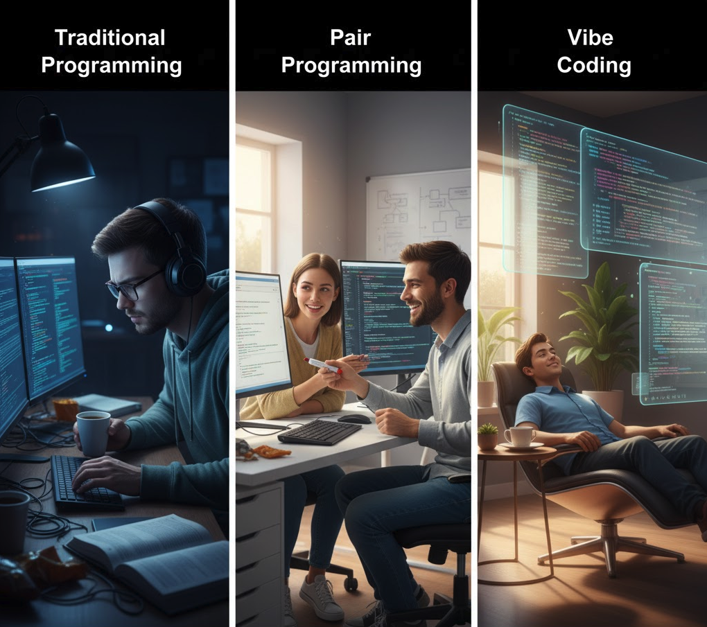
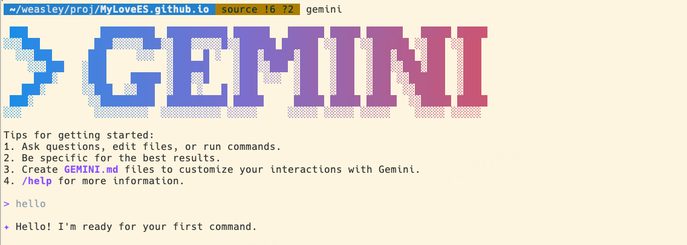
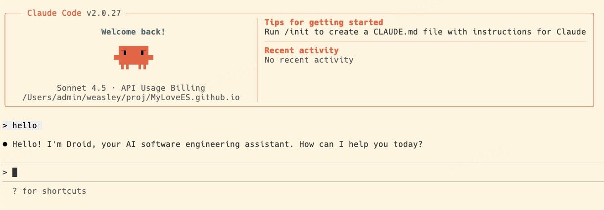
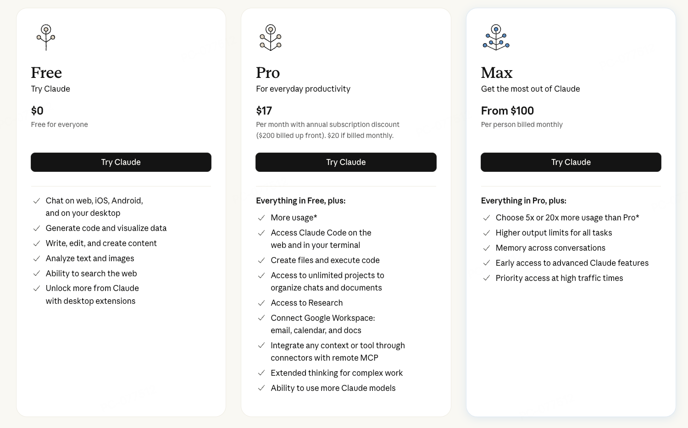
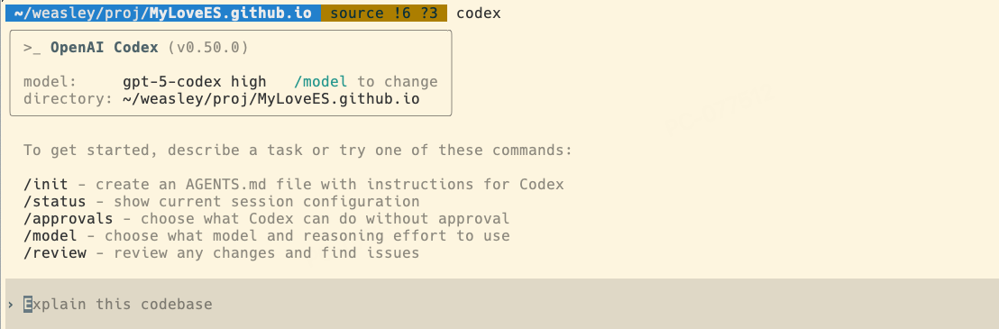

## I. 重新定义编程：什么是 Vibe Coding

Vibe Coding 不是指某一个具体的工具或框架，而是一种全新的编程“心流”或“氛围”（Vibe）。在这种模式下，我们不再是一个单纯的“执行者”，而是需要充当一个“指挥者”。
### A. 共舞：从“执行者”到“指挥者”

传统的编程模式中，开发者扮演的是“执行者”的角色。需要手动编写出精确到每一个细节的代码：如何循环，如何判断，如何赋值。大量的时间被消耗在细节的实现、文字的输入上。

而在 Vibe Coding 的世界里，我们的角色将变得更加复杂, 从“执行者”转变为“指挥者”。你不再单纯去关心“如何实现”，而是聚焦于“需要什么”，例如：

> “创建一个 RESTful API 端点，路径是 `/api/users/{id}`。它需要验证 JWT token，从数据库中根据 ID 查询用户信息，并以 JSON 格式返回用户的姓名、邮箱和头像，同时处理好用户不存在的 404 异常情况。”

### B. 对比传统编程与结对编程

为了更好地理解 Vibe Coding，我们可以将它与我们熟悉的工作模式进行对比。

*   **传统编程 (Solo Programming)**: 开发者是孤独的探险家，需要独自绘制地图、寻找路径、搭建营地。这锻炼了全面的个人能力，但过程缓慢且认知负荷极高。Vibe Coding 就像是给这位探险家配备了一个全能的后勤机器人，能瞬间完成路径搭建和营地建设，让探险家可以专注于探索未知的世界。

*   **结对编程 (Pair Programming)**: 两名开发者，一个“驾驶员”（Driver）负责编码，一个“领航员”（Navigator）负责思考和检视。这是一种高效的知识共享和实时复审机制。Vibe Coding 可以看作是一种 **“非对称结对编程”**。开发者永远是“领航员”，负责战略规划和方向把控；而 AI 则是那个拥有无穷知识、编码速度惊人、7x24小时在线的“超级驾驶员”。它不对称，因为 AI 伙伴的能力模型与人类完全不同——它知识渊博但缺乏真正的理解力，速度飞快但需要精确的引导。

理解了 Vibe Coding 的核心理念后，下一章，我们将探索如何启动引擎，全面了解当今主流的 Vibe Coding 工具。

## II. 启动引擎：Vibe Coding 工具全景

工欲善其事，必先利其器。Vibe Coding 的生态系统正在以前所未有的速度发展，从深度集成的 IDE 到灵活的命令行工具，总有一款适合你。让我们一起检阅这些强大的“乐队成员”，看看如何将它们组合成“交响乐团”。

### A. 无缝集成：IDE 内置工具

这类工具直接嵌入在你最熟悉的开发环境中，提供“润物细无声”的编码体验。它们是 Vibe Coding 的入门首选。

#### 1. Github Copilot
作为巨硬出品的 AI 编码助手，Copilot 已经深度容器vscode等ide中。

*   **质量**: ★★★☆☆ 还不错
*   **成本**: ★★★★★ 免费额度够用

#### 2. Cursor
Cursor 是一款“AI First”的编辑器，它将 IDE 与 LLM 的能力深度融合，重新思考了开发工作流。它不仅仅是“插件”，而是将 AI 作为其核心功能。

*   **质量**: ★★★★☆ 很不错
*   **成本**: ★★☆☆☆ 计费策略变迁，从按次，到按量，成本已经变得比较高了。（国内已被ban）
*   **特色**: `Tab`补全尤其好用。

### B. 功能扩展：强大的编辑器插件

如果说内置工具是“官方标配”，那编辑器插件就是“民间高手”。它们通常专注于某一特定功能，为你的 IDE 提供更丰富、更多样化的 AI 能力。

#### 1. Augment

*   **质量**: ★★★★☆ 很不错
*   **成本**: ★★☆☆☆ 国内已被ban。
*   **特色**: 上下文非常长，能带来更好的编码质量，更精准的问题定位与排查。

#### 2. Roo Code

*   **质量**: ★★★☆☆ 还不错
*   **成本**: ★★★★☆ 依赖接入各家大模型
*   **特色**: 提供的服务比较稳定，至少不会因为政治原因ban国内

### C. Command Cli：新一代开发主力

对于许多热爱键盘和终端的开发者来说，命令行界面（CLI）是效率最高的交互方式。新一代的 AI 命令行工具正将 Vibe Coding 的能力带入这个经典场域。
#### 1. Gemini
Google 出品的 Gemini，凭借过硬的底层模型质量与强大的多模态能力，正在非常稳定并极具性价比的 CLI 工具。

*   **质量**: ★★★★★ 很强👍
*   **成本**: ★★★★★ 学生免费Pro一年（限定美国IP）；野生key资源比较多；

#### 2. Claude
Anthropic 的 Claude Cli，算是这种形态的工具的开山鼻祖。借助于 Claude 模型编码的超高质量，目前是解决问题、完成编码的强力助手。

*   **质量**: ★★★★★ 很强👍
*   **成本**: ★☆☆☆☆ Claude Pro Max 100$/month；
*   **特色**: 代码质量高，问题定位精准，日常强力助手；Claude模型的UI设计更美观，Plan做的更好

#### 3. Codex
OpenAI 的 Codex，凭借 gpt 模型超高的代码质量，如专业的手术刀一般，精准解决问题。

* **质量**: ★★★★★ 很强👍
*   **成本**: ★☆☆☆☆ 需要走 GPT API，成本高
*   **特色**: 代码质量更高（社区评价，代码比Claude更好一些），问题定位更精准；

### D. 终极形态：构建个性化AI工具流

“成年人的世界，我全都要”。

在 Vibe Coding 的实践中，你很快会发现没有“银弹”。最专业的工作流，是将上述工具组合起来，形成互补的战斗矩阵：

*   **日常编码**: 使用 **Github Copilot** / **Cursor** TAB 进行行级代码补全，保持流畅的编码节奏。
*   **复杂实现**: 当需要跨多个文件进行重构或添加新功能时，利用Command Cli 使用更大的上下文，进行深度对话和代码生成。

最终，Vibe Coding 的艺术不仅在于如何与单个 AI 工具对话，更在于如何智慧地编排多个工具，让它们在你的指挥下，协同完成复杂的软件工程任务。

## III. 降本：成本控制与资源优化策略

拥抱 Vibe Coding 的强大能力，也意味着我们需要关注其背后潜在的成本。无论是直接的订阅费用，还是按量计费的 API 调用，成本都非常非常非常高。

### A. 免费的午餐

*   **善用免费额度与试用期**: 
*   > 新账号试用：每个产品推广时期，都伴随着新账号14天试用期等优惠策略。但是随着注册门槛的提高，这种途径已几乎不可用
*   > 2API：将一些第三方的AI工具，逆向出调用API的接口，使用这些第三方的额度。

*   **高性价比的“平替”方案**: 
*   > 模型平替：智谱 GLM 4.6。质量够用，成本大幅降低。
*   > 中转代理：Veloera、new-api。有一些国内代理，转发到海外模型API，成本约为官方1/10。

### B. 精准的沟通者

核心原则是：**用最少的 Token，传递最精确的信息。**

*   **提供上下文，而非全部代码**：不要动辄将整个文件或类发给 AI。使用 `grep`、代码片段或 `#` `@` 引用，精确地提供解决问题所需的最相关代码。这不仅节省了输入 Token，也帮助模型更好地聚焦于核心问题。

*   **选择合适的模型**：不用“杀鸡用牛刀”。对于简单的任务，如代码格式化、编写简单脚本，使用更轻量、更便宜的模型（Flash）就足够了。只有在进行复杂的架构设计或高难度的 bug 修复时，才有必要动用最强大的旗舰模型（如 GPT-5, Gemini 2.5 Pro，Claude 4）。

*   **压缩上下文**：对于  Command Cli，可以使用 /compact 压缩历史上下文（会伴随信息丢失）

通过各种策略，在享受 Vibe Coding 带来的效率革命！

在写这篇分享的时候，竟然发现了一篇讲这个的论文（这也能出论文？）：
[A Survey of Vibe Coding with Large Language Models](https://arxiv.org/pdf/2510.12399)