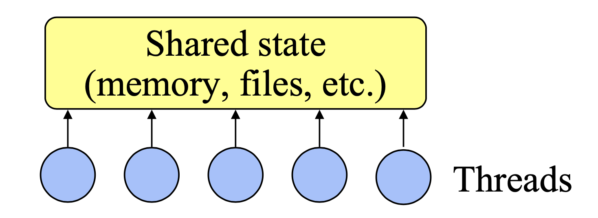

// 发现本文很多概念在现在已经不适用了，不做参考
# Threads
1. 诞生于操作系统的发展
2. 演变为用户级别的工具
3. 作为各种问题的解决方案
4. 每个程序员都应该是线程程序员？

## 什么是线程

- 用于管理并发的通用解决方案
- 执行流彼此独立
- 共享状态
- 抢占式调度
- 同步（例如锁、条件）

## 问题
线程编程很难用

## 为啥这么难用
- 必须对共享资源加锁来控制访问
- 由锁产生的死锁问题
- 难以 debug. 依赖数据和时间
- 难以抽象 modules
- 回调在加锁的场景下很难用
- 很难取得好的性能：  
  1. 简单的锁(例如监视器)产生低并发性
  2. 细粒度锁增加了复杂度，降低了性能
  3. 操作系统限制性能(调度、上下文切换)
- 对线程支持的不好
  1. 线程代码难以移植
  2. 标准库非线程安全的
  3. 内核调用，窗口系统不是多线程
  4. 调试工具匮乏
- 通常不需要并发
## 替代品
Events

## 主张
- 大多数情况下，事件更好
- 只有在真正需要CPU并发的时候，线程才需要

# Event-Driven Programming

- 1个执行流:无CPU并发。
- 注册事件回调
- 事件循环等待事件，调用处理程序
- 不抢占事件处理程序
- handler通常生命周期很短

## 难用的地方
- 长时间运行的环节使应用程序无响应
  1. fork 子进程，用事件在完成时唤醒
  2. 拆分handlers
  3. 在处理程序中定期调用事件循环（重入性增加了复杂性）。
- 不能跨事件维持本地状态（处理程序必须return）
- 没有CPU并发（不适合科学应用）
- 事件驱动的I/O并不总是得到很好的支持（例如差劲的写缓冲）

# Events vs. Threads

- 事件尽可能避免并发，线程相反：
  1. 事件易于上手：无并发、无抢占、无同步、无死锁。
  2. 仅在不寻常的情况下使用复杂的技术。
  3. 使用线程，即使是最简单的应用程序也面临着很大的复杂性。
- 使用事件更容易调试
  1. 时序依赖只与事件相关，与事件内部调度无关
  2. 更容易追踪的问题：按钮响应缓慢 vs 损坏的内存
- 单CPU上事件驱动更快
  1. 没有锁的开销
  2. 没有上下文切换
- 事件的可以执行更强
- 线程提供真正的并发
  1. 可以使用长时间运行的有状态处理程序而不会冻结
  2. 可扩展的多cpu性能

# 应该用线程吗：NO！  

尽可能避免线程:
- 对于gui、分布式系统、低端服务器，应该使用事件，而不是线程
- 只使用真正需要CPU并发的线程
- 在需要线程的地方，在线程应用程序内核中隔离使用:保持大多数代码是单线程的

# Conclusions
- 并发从根本上来说很难;尽可能的避免。
- 线程比事件更强大，但很少需要这种能力
- 线程比事件更难编程;仅供专家
- 使用事件作为主要的开发工具(gui和分布式系统)
- 只对性能关键的内核使用线程

# Ref 
> ref: [Why Threads Are a Bad Idea](https://www.cc.gatech.edu/classes/AY2010/cs4210_fall/papers/ousterhout-threads.pdf)