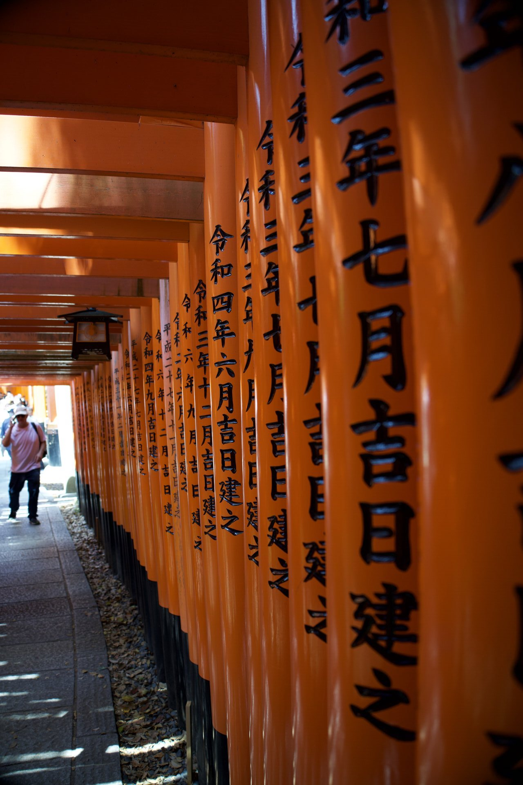
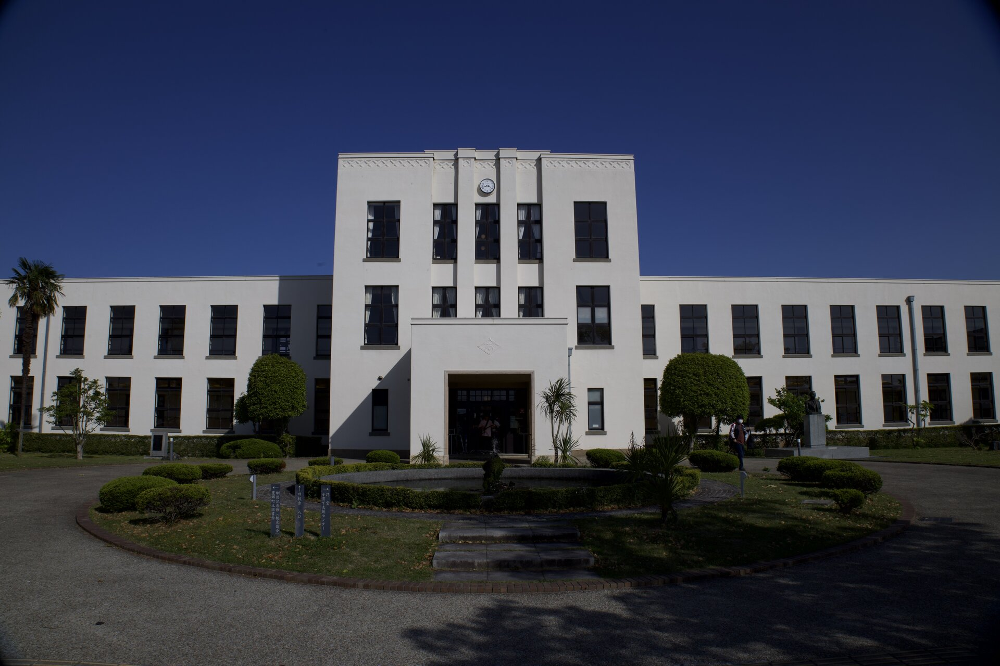

# 日本关西：京都与大阪

大家好，今天想跟大家聊聊我之前去日本京都和大阪玩的一些体验。整体感觉挺舒服的，两个城市风格很不同，一个安静有古韵，一个热闹充满活力，而且交通、吃喝都特别方便。我就按我们走的顺序，跟大家分享一下旅程。

# 🚉 京都：走走停停的慢时光

## 清水寺

- 清水寺作为日本最具代表性的佛教古寺之一，历史可追溯至公元778年。寺庙供奉的是**千手观音**，而龙在佛教中常被视为守护神兽，镇守山门，驱邪避灾。

### 清水舞台

京都的标志之一。悬空的大木台（叫“清水舞台”）真的很特别，是古人用木头巧妙搭建起来的，没用钉子，站在上面看下面的景色，视野非常开阔，能看到大半个京都。我们去的时候虽然不是樱花或红叶季，但满眼的绿色也很养眼。感觉它受欢迎，一是因为历史悠久、建筑独特，二是因为景色确实好，拍照也好看。

另外，这也是情侣照名打卡地，因为《名侦探柯南》里新兰出现过这里。

### 凌云之龙

造型气势磅礴、极富动感，权力的象征。

### 「音羽瀑布」

接水祈福。

## 二、三年坂

二年坂与三年坂是京都清水寺通往街道的两条传统坡道，以古色古香的石板路、和风茶屋与手工店铺闻名，是体验京都古都风情的热门步行街。传说中在三年坂跌倒会有三年厄运，也为其增添一丝神秘色彩。

## 伏见稻荷大社

- 伏见稻荷大社是位于京都的著名神社，以数千座朱红色鸟居构成的“千本鸟居”闻名，供奉掌管五谷丰登与商业繁荣的稻荷神，是日本最受欢迎的参拜胜地之一。

### 千本鸟居

这个神社最特别的就是那条长长的“千本鸟居”了。一座接一座的红色鸟居沿着山路往上排，形成了一条望不到头的红色通道。走进去感觉挺神奇的，越往山上走人越少，也越安静。爬到一半回头看，还能看到京都的城市风景。每个鸟居后面都写着捐赠者的名字和心愿，挺有意思的。

<!--  -->

这里拍照确实好看，电影《艺伎回忆录》也在这里取过景。

<!--  -->

登顶，非常简陋的打卡点

### 使者 狐狸

狐狸因其常出没于田间地头，被认为是稻荷神的“神使”。相传狐狸拥有神秘力量，能穿梭阴阳界，帮助传达神谕、驱邪保平安。因此神社内常见手持钥匙、宝珠、卷轴、稻穗的狐狸像。

## 鸭川 & 八坂神社

傍晚在鸭川边散步是我们在京都最放松的时刻之一。河水很干净，两边修了很宽的步行道。当地人三三两两地坐在河边的石阶上，聊天、看风景、等日落，感觉特别生活化，节奏很慢。

沿着鸭川走不远就是八坂神社。这个神社好像大门一直开着，白天挺热闹，晚上去就安静多了，灯笼点起来，氛围很宁静，跟白天很不一样。

- 八坂神社是京都最重要的神社之一，位于祇园地区，以祈求厄除、健康与良缘闻名，也是每年祇园祭的主办神社，深受当地人和游客喜爱。

## 金阁寺

- 金阁寺（正式名称为鹿苑寺）是京都著名的世界文化遗产，以其外墙贴满金箔的华丽三重楼阁倒映在镜湖池中的绝美景色而闻名，象征着日本室町时代的极致审美与权力荣耀。

同样，柯南中也有它的身影

### 御守

虽门票附赠

### 白蛇冢

我称之为 雷峰塔京都分塔=MINI版

## 贵船神社

如果觉得市区人多，可以抽半天去北边的贵船神社，躲个清净。它藏在山里，一路绿树成荫，夏天去特别凉快。最吸引人的是入口那条石阶路，两边排满了红灯笼，傍晚亮灯时或者雨天，氛围感特别好，很适合拍照。

这里据说求姻缘挺灵的，还可以玩一种“水占卜”，签纸放水里会显出字来。

## 京都车站

京都车站本身也挺有看头的，是个很现代的大建筑。里面什么都有：商店、餐厅、还有个大阶梯广场让人休息。

同样，这里也是《迷宫的十字路口》的取景地。

## 动漫

## 环境

非常干净。你可以说意林，读者在美化国外，但是，京都真的非常非常非常非常干净。为什么呢？街道上不允许设置垃圾桶，这能不干净吗？

---

# 🌆 大阪：热闹与美食的聚集地

从京都坐车很快到大阪，感觉一下子热闹起来了，特别是晚上，灯火通明，很有活力。

## 环球影城 (USJ)：

大阪环球影城确实好玩，尤其是马里奥园区，做得太用心了。戴上AR手环，那些游戏里的场景和道具真的能互动，感觉自己就在游戏世界里。库巴城堡里的赛车游戏尤其刺激。哈利波特园区也还原得很好。不过热门项目排队时间确实长，建议提前研究下快速票（Express Pass）。为什么大家愿意排长队？我觉得主要是沉浸感做得特别好，让你不只是看，而是能“参与”进去，像真的进入了电影或游戏的世界，大人小孩都能玩得很开心。

## 神户 须磨山

如果时间充裕，可以从大阪坐车去神户的须磨山（大约1小时）。坐缆车上山，站在山顶能同时看到濑户内海和壮观的明石海峡大桥，视野非常开阔。山上人不多，还有个动物园和植物园，山下有海滩，是个可以远离城市喧嚣、轻松逛逛的好地方。

## 心斋桥 & 道顿堀

这里就是大阪夜生活的中心了，特别热闹。满街都是小吃摊和商店。章鱼烧外皮焦脆里面软糯，各种串烧香气扑鼻，可丽饼甜度刚好不腻，边走边吃很满足。除了吃的，药妆店也特别多，像眼药水、常用药、面膜、日用品什么的，种类全，价格也比国内便宜不少，看到很多人都是一袋子一袋子地买。晚上这里人虽然多，但秩序挺好，是一种热闹但不混乱的感觉。这里受欢迎很简单：东西好吃不贵，拍照有特色（比如那个著名的格力高跑步人招牌），买东西也实惠方便。

---

# 🚇 交通与便利：旅行中的小确幸

## 公共交通

日本的电车（包括地铁和火车）系统很发达，但也确实有点复杂。同一个站台可能有不同速度的车（普通、快速、急行、特急），上车前一定要看清电子屏上的目的地和车种。换乘有时需要走点路，甚至上下楼。用Suica或ICOCA这种交通卡最方便，刷卡进出，自动扣费，省去买票的麻烦。强烈推荐用Google Maps查路线，会告诉你坐哪趟车、在几号站台、几点发车，非常准。

## 新干线

城市间移动坐新干线很快很舒服。车厢干净，座位宽敞，时间也极准。我们坐了几次，体验都很好。车上很安静，不太有人大声说话或打电话。车站便利店卖的便当选择多，味道也不错，可以带上车吃。

## 便利店

日本的便利店（7-11、Lawson、FamilyMart）真是旅行中的救星。早上买个热咖啡加饭团，中午饿了来个便当或面包，晚上回去前买点零食或饮料，一日三餐都能解决。它们还能打印、取票、寄快递、取钱（ATM支持银联卡），甚至能买景点门票，营业时间长，到处都有，干净又方便。

---

# 🍱 吃吃喝喝：简单但满足

## 一人食友好

在日本吃饭，一个人特别自在。很多餐厅都有吧台位，菜单上定食套餐（一份主菜+米饭+汤+小菜）就是为一个人设计的，分量合适，点餐也方便，不少店门口还有自助点餐机，社恐友好。吃饭时没人催你，可以慢慢吃。

## 印象深刻的美食

**豆腐套餐**

**和牛饭：**

**居酒屋烧鸟：**

**和牛自助：**

---

# 🎌 一点点感受

这次关西之行，从京都的古寺鸟居，到大阪的环球影城和夜市，感觉挺充实的。印象最深的是，在这里旅行很方便也很舒适。便利店解决了基本需求，电车和新干线准时高效，美食选择多而且对独自旅行的人很友好。

京都适合慢慢走，感受历史和宁静；大阪则是放开了玩和吃的地方。如果你也打算去，不妨试试：

- 早上在便利店解决早餐，方便快捷。
- 坐一次非特急的普通或快速电车，感受下当地人的通勤。
- 在清水寺这样的地方，回想下看过的动漫场景（如果你是动漫迷的话）。
- 找个地方，一个人安静地吃一份定食，慢慢感受。

总的来说，这是一次节奏比较舒缓但体验很丰富的旅行。希望以后有机会还能再去。也欢迎大家分享你们的日本旅行经验！

